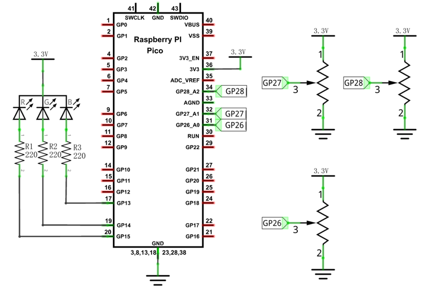
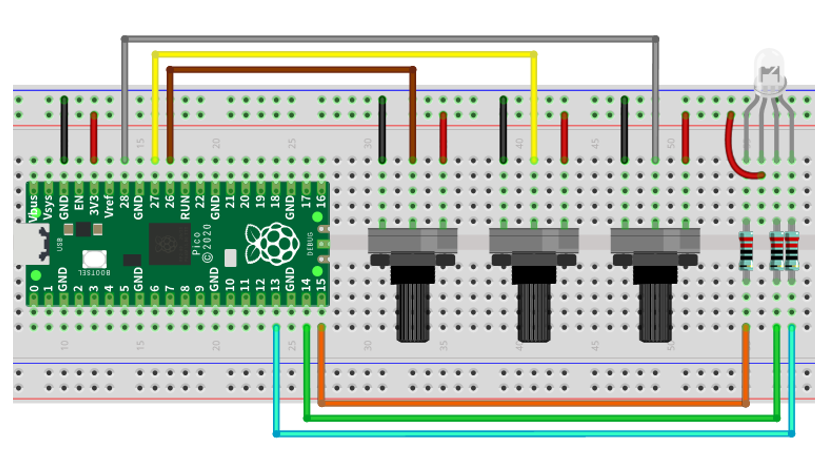
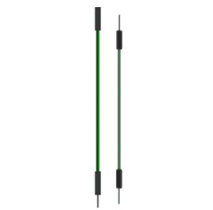
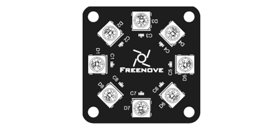
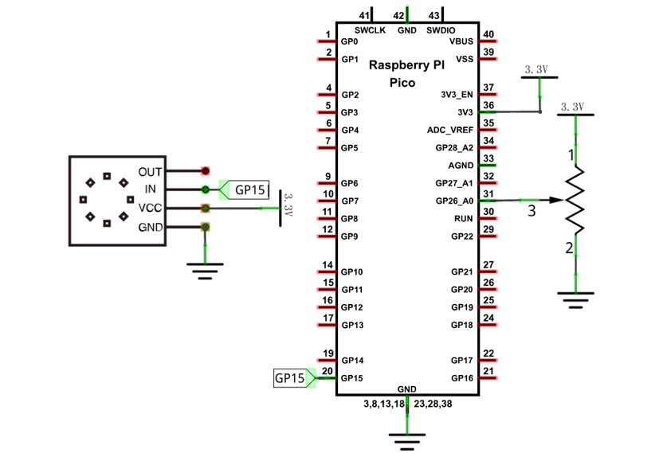
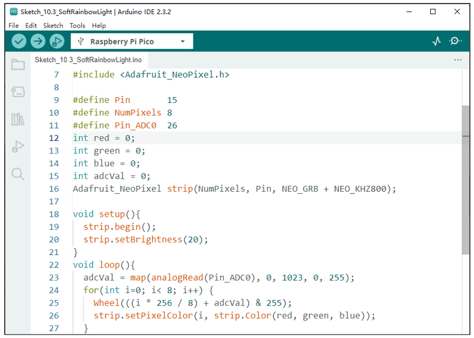

##############################################################################
Chapter Potentiometer & LED
##############################################################################

We have learnt to use ADC in the previous chapter. In this chapter, we will combine PWM and ADC to use potentiometer to control LED, RGBLED and Neopixel.

Project Soft Light
**************************************

In this project, we will make a soft light. We will use an ADC Module to read ADC values of a potentiometer and map it to duty cycle of the PWM used to control the brightness of an LED. Then you can change the brightness of an LED by adjusting the potentiometer.

Component List
=================================

+-------------------------------------------------------------------+------------------+
| Raspberry Pi Pico x1                                              |   USB Cable x1   |
|                                                                   |                  |
| |Chapter01_08|                                                    |   |Chapter01_09| |
+-------------------------------------------------------------------+------------------+
| Breadboard x1                                                                        |
|                                                                                      |
| |Chapter01_10|                                                                       |
+-------------------------+---------------------+-------------------+------------------+
| Rotary                  | Resistor            | LED x1            |   Jumper         |
|                         |                     |                   |                  |
| potentiometer x1        | 220Ω x1             |                   |                  |
|                         |                     |                   |                  |
|  |Chapter09_00|         | |Chapter01_12|      | |Chapter01_11|    |   |Chapter01_13| |
+-------------------------+---------------------+-------------------+------------------+

.. |Chapter01_08| image:: ../_static/imgs/1_LED/Chapter01_08.png
.. |Chapter01_09| image:: ../_static/imgs/1_LED/Chapter01_09.png
.. |Chapter01_10| image:: ../_static/imgs/1_LED/Chapter01_10.png
.. |Chapter01_11| image:: ../_static/imgs/1_LED/Chapter01_11.png
.. |Chapter01_12| image:: ../_static/imgs/1_LED/Chapter01_12.png
.. |Chapter01_13| image:: ../_static/imgs/1_LED/Chapter01_13.png
.. |Chapter09_00| image:: ../_static/imgs/9_AD_Converter/Chapter09_00.png

Circuit
===============================

.. list-table::
   :width: 100%
   :align: center
   
   * -  Schematic diagram
   * -  |Chapter10_00|
   * -  Hardware connection. 
       
        :red:`If you need any support, please contact us via:` support@freenove.com
   * -  |Chapter10_01|
    
.. |Chapter10_00| image:: ../_static/imgs/10_Potentiometer_&_LED/Chapter10_00.png

Sketch
=============================

Sketch_Softlight
------------------------------

Download the code to Pico, by turning the adjustable resistor to change the input voltage of GP26, Pico changes the output voltage of GP15 according to this voltage value, thus changing the brightness of the LED.

The following is the code:

.. literalinclude:: ../../../freenove_Kit/C/Sketches/Sketch_10.1_SoftLight/Sketch_10.1_SoftLight.ino
    :linenos: 
    :language: c
    :dedent:

In the code, read the ADC value of potentiometer and map it to the duty cycle of PWM to control LED brightness.

:red:`If you have any concerns, please contact us via:` support@freenove.com

Project Soft Colorful Light 
********************************************

In this project, three potentiometers are used to control the RGB LED and in principle, it is the same as the Soft Light project. Namely, read the voltage value of the potentiometer and then convert it to PWM used to control LED brightness. Difference is that the original project only controlled one LED, but this project required (3) RGB LEDs.

Component List
=======================================

+-------------------------------------------------------------------+------------------+
| Raspberry Pi Pico x1                                              |   USB Cable x1   |
|                                                                   |                  |
| |Chapter01_08|                                                    |   |Chapter01_09| |
+-------------------------------------------------------------------+------------------+
| Breadboard x1                                                                        |
|                                                                                      |
| |Chapter01_10|                                                                       |
+-------------------------+---------------------+-------------------+------------------+
| Rotary                  | Resistor            | RGBLED x1         |   Jumper         |
|                         |                     |                   |                  |
| potentiometer x3        | 220Ω x3             |                   |                  |
|                         |                     |                   |                  |
|  |Chapter09_00|         | |Chapter01_12|      | |Chapter05_00|    |   |Chapter01_13| |
+-------------------------+---------------------+-------------------+------------------+

.. |Chapter05_00| image:: ../_static/imgs/5_RGBLED/Chapter05_00.png

Circuit
======================================

.. list-table::
   :width: 100%
   :align: center
   
   * -  Schematic diagram
   * -  |Chapter10_04|
   * -  Hardware connection. 
       
        :red:`If you need any support, please contact us via:` support@freenove.com
   * -  |Chapter10_05|
    

Sketch
====================================

Sketch_SoftColorfulLight
------------------------------------

.. image:: ../_static/imgs/10_Potentiometer_&_LED/Chapter10_06.png
    :align: center

Download the code to Pico, rotate one of the potentiometers, then the color of RGB LED will change. 

:red:`If you have any concerns, please contact us via:` support@freenove.com

The following is the program code:

.. literalinclude:: ../../../freenove_Kit/C/Sketches/Sketch_10.2_SoftColorfulLight/Sketch_10.2_SoftColorfulLight.ino
    :linenos: 
    :language: c
    :dedent:

In the code, you can read the ADC values of the three potentiometers and map it into a PWM duty cycle to control the three LED elements to vary the color of their respective RGB LED.

Project Soft Rainbow Light
*****************************************

In this project, we use a potentiometer to control Freenove 8 RGBLED Module.

Component List
=================================

+-----------------------------------------+----------------+
| Raspberry Pi Pico x1                    | USB Cable x1   |
|                                         |                |
| |Chapter01_08|                          | |Chapter01_09| |
+-----------------------------------------+----------------+
| Breadboard x1                                            |
|                                                          |
| |Chapter01_10|                                           |
+-------------------------+---------------+----------------+
| Rotary potentiometer x1 | Freenove 8 RGB| Jumper         |
|                         |               |                |
|                         | LED Module x1 |                |
|                         |               |                |
|  |Chapter09_00|         | |Chapter06_00|| |Chapter10_07| |
+-------------------------+---------------+----------------+
 

Circuit
======================================

.. list-table::
   :width: 100%
   :align: center
   
   * -  Schematic diagram
   * -  |Chapter10_08|
   * -  Hardware connection. 
       
        :red:`If you need any support, please contact us via:` support@freenove.com
   * -  |Chapter10_09|
    

.. |Chapter10_09| image:: ../_static/imgs/10_Potentiometer_&_LED/Chapter10_09.png

Sketch
====================================

Sketch_Soft_Rainbow_Light
--------------------------------------

Download the code to Pico, rotate the handle of the potentiometer and the color of the lamp ring will change. 

.. image:: ../_static/imgs/10_Potentiometer_&_LED/Chapter10_11.png
    :align: center

The following is the program code:

.. literalinclude:: ../../../freenove_Kit/C/Sketches/Sketch_10.3_SoftRainbowLight/Sketch_10.3_SoftRainbowLight.ino
    :linenos: 
    :language: c
    :dedent:

The overall logical structure of the code is the same as the previous project rainbow light, except that the starting point of the color in this code is controlled by potentiometer.          