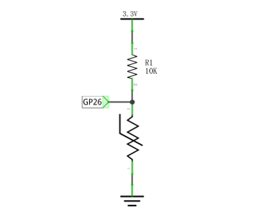
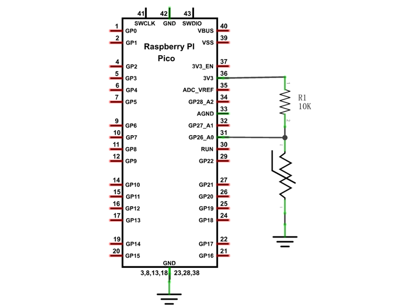
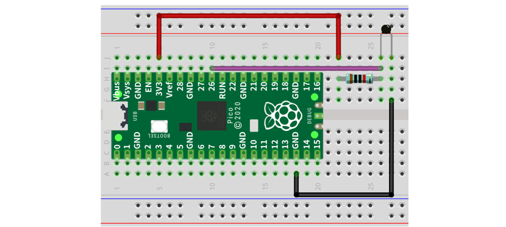
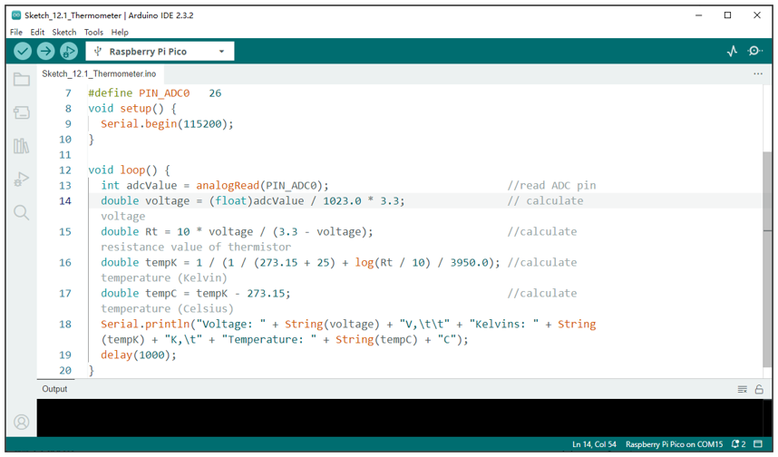
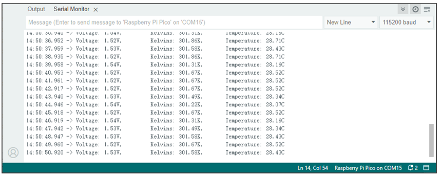

##############################################################################
Chapter Thermistor
##############################################################################

In this chapter, we will learn about Thermistors that are another kind of Resistor.

Project Thermometer
***********************************

A Thermistor is a type of Resistor whose resistance value is dependent on temperature and changes in temperature. Therefore, we can take advantage of this characteristic to make a thermometer.

Component List
================================

+-----------------------------------------+----------------+
| Raspberry Pi Pico x1                    | USB Cable x1   |
|                                         |                |
| |Chapter01_08|                          | |Chapter01_09| |
+-----------------------------------------+----------------+
| Breadboard x1                                            |
|                                                          |
| |Chapter01_10|                                           |
+----------------------+------------------+----------------+
| Thermistor x1        | Resistor 10kΩ x1 | Jumper         |
|                      |                  |                |
| |Chapter12_00|       | |Chapter02_01|   | |Chapter01_13| |
+----------------------+------------------+----------------+

.. |Chapter01_08| image:: ../_static/imgs/1_LED/Chapter01_08.png
.. |Chapter01_09| image:: ../_static/imgs/1_LED/Chapter01_09.png
.. |Chapter01_10| image:: ../_static/imgs/1_LED/Chapter01_10.png
.. |Chapter01_13| image:: ../_static/imgs/1_LED/Chapter01_13.png

.. |Chapter02_01| image:: ../_static/imgs/2_Button_&_LED/Chapter02_01.png

Component Knowledge
==============================

Thermistor
----------------------------

A Thermistor is a temperature sensitive resistor. When it senses a change in temperature, the resistance of the Thermistor will change. We can take advantage of this characteristic by using a Thermistor to detect temperature intensity. A Thermistor and its electronic symbol are shown below.

The relationship between resistance value and temperature of a thermistor is:

**Where:**
    
        Rt is the thermistor resistance under T2 temperature;
        
        **R** is the nominal resistance of thermistor under T1 temperature;
        
        **EXP[n]** is nth power of e;
        
        **B** is for thermal index;
        
        T1, T2 is Kelvin temperature (absolute temperature). Kelvin temperature=273.15 + Celsius temperature. 
    
    For the parameters of the Thermistor, we use: B=3950, R=10kΩ, T1=25℃.
    
    The circuit connection method of the Thermistor is similar to photoresistor, as the following:

We can use the value measured by the ADC converter to obtain the resistance value of Thermistor, and then we can use the formula to obtain the temperature value.

Therefore, the temperature formula can be derived as:

Circuit
=============================

The circuit of this project is similar to the one in the previous chapter. The only difference is that the Photoresistor is replaced by a Thermistor.

.. list-table::
   :width: 100%
   :align: center
   
   * -  Schematic diagram
   * -  |Chapter12_05|
   * -  Hardware connection. 
       
        :red:`If you need any support, please contact us via:` support@freenove.com
   * -  |Chapter12_06|
    

Sketch
===========================

Sketch_Thermometer
-----------------------------

Upload the code to Pico and serial monitor will display the current ADC, voltage and temperature values. Try to "pinch" the thermistor (without touching the leads) with your index finger and thumb for a brief time, you should see that the temperature value increases.

:red:`If you have any concerns, please contact us via:` support@freenove.com 

The following is the code:

.. literalinclude:: ../../../freenove_Kit/C/Sketches/Sketch_12.1_Thermometer/Sketch_12.1_Thermometer.ino
    :linenos: 
    :language: c
    :dedent:

In the code, the ADC value of ADC module A0 port is read, and then calculates the voltage and the resistance of thermistor according to Ohms Law. Finally, it calculates the temperature sensed by the thermistor, according to the formula. 

