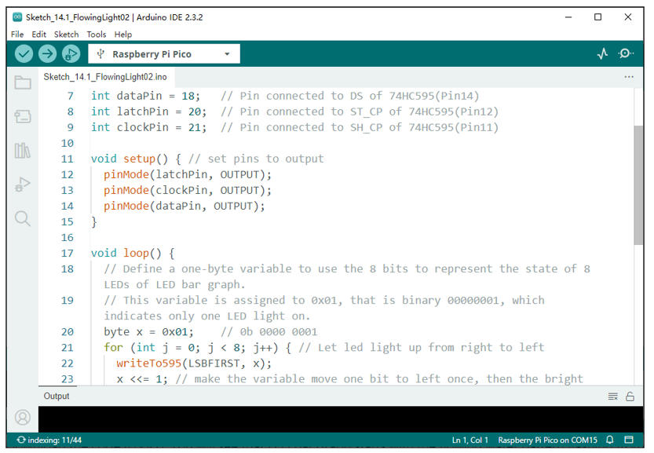

##############################################################################
Chapter 74HC595 & LED Bar Graph
##############################################################################

We have used LED Bar Graph to make a flowing water light, in which 10 GPIO ports of Raspberry Pi Pico is occupied. More GPIO ports mean that more peripherals can be connected to Raspberry Pi Pico, so GPIO resource is very precious. Can we make flowing water light with less GPIO? In this chapter, we will learn a component, 74HC595, which can achieve the target.

Project Flowing Water Light
******************************************

Now let us learn how to use the 74HC595 IC Chip to make a flowing water light using less GPIO.

Component List
==============================

+-----------------------------------------+---------------------------------+
| Raspberry Pi Pico x1                    | USB Cable x1                    |
|                                         |                                 |
| |Chapter01_08|                          | |Chapter01_09|                  |
+-----------------------------------------+---------------------------------+
| Breadboard x1                                                             |
|                                                                           |
| |Chapter01_10|                                                            |
+----------------------+------------------+----------------+----------------+
| 74HC595 x1           | Resistor         | Jumper         |LED Bar         |
|                      |                  |                |                |
|                      | 220Ω x8          |                |Graph x1        |
|                      |                  |                |                |
| |Chapter14_00|       | |Chapter01_12|   | |Chapter01_13| | |Chapter03_00| |
+----------------------+------------------+----------------+----------------+

.. |Chapter01_08| image:: ../_static/imgs/1_LED/Chapter01_08.png
.. |Chapter01_09| image:: ../_static/imgs/1_LED/Chapter01_09.png
.. |Chapter01_10| image:: ../_static/imgs/1_LED/Chapter01_10.png
.. |Chapter01_12| image:: ../_static/imgs/1_LED/Chapter01_12.png
.. |Chapter01_13| image:: ../_static/imgs/1_LED/Chapter01_13.png
.. |Chapter14_00| image:: ../_static/imgs/14_74HC595_&_LED_Bar_Graph/Chapter14_00.png
.. |Chapter03_00| image:: ../_static/imgs/3_LED_Bar/Chapter03_00.png

Related Knowledge
======================================

74HC595
---------------------------------

A 74HC595 chip is used to convert serial data into parallel data. A 74HC595 chip can convert the serial data of one byte into 8 bits, and send its corresponding level to each of the eight ports correspondingly. With this characteristic, the 74HC595 chip can be used to expand the IO ports of Raspberry Pi Pico. At least three ports are required to control the eight ports of the 74HC595 chip.

.. image:: ../_static/imgs/14_74HC595_&_LED_Bar_Graph/Chapter14_01.png
    :align: center

The ports of the 74HC595 chip are described as follows:

+----------+-------------+-----------------------------------------------------------------------------+
| Pin name | GPIO number | Description                                                                 |
+----------+-------------+-----------------------------------------------------------------------------+
| Q0-Q7    | 15,         | 1-7	Parallel data output                                                   |
+----------+-------------+-----------------------------------------------------------------------------+
| VCC      | 16          | The positive electrode of power supply, the voltage is 2~6V                 |
+----------+-------------+-----------------------------------------------------------------------------+
| GND      | 8           | The negative electrode of power supply                                      |
+----------+-------------+-----------------------------------------------------------------------------+
| DS       | 14          | Serial data Input                                                           |
+----------+-------------+-----------------------------------------------------------------------------+
| OE       | 13          | Enable output,                                                              |
|          |             |                                                                             |
|          |             | When this pin is in high level, Q0-Q7 is in high resistance state           |
|          |             |                                                                             |
|          |             | When this pin is in low level, Q0-Q7 is in output mode                      |
+----------+-------------+-----------------------------------------------------------------------------+
| ST_CP    | 12          | Parallel Update Output: when its electrical level is rising, it will update |
|          |             |                                                                             |
|          |             | the parallel data output.                                                   |
+----------+-------------+-----------------------------------------------------------------------------+
| SH_CP    | 11          | Serial shift clock: When its electrical level is rising, serial data input, |
|          |             |                                                                             |
|          |             | register would do a shift.                                                  |
+----------+-------------+-----------------------------------------------------------------------------+
| MR       | 10          | Remove shift register: When this pin is in low level, the content in shift  |
|          |             |                                                                             |
|          |             | register will be cleared.                                                   |
+----------+-------------+-----------------------------------------------------------------------------+
| Q7'      | 9           | Serial data output: it can be connected to more 74HC595 in series.          |
+----------+-------------+-----------------------------------------------------------------------------+

For more detail, please refer to the datasheet on the 74HC595 chip.

Circuit
=======================

.. list-table::
   :width: 100%
   :align: center
   
   * -  Schematic diagram
   * -  |Chapter14_02|
   * -  Hardware connection. 
       
        :red:`If you need any support, please contact us via:` support@freenove.com
   * -  |Chapter14_03|
    
.. |Chapter14_02| image:: ../_static/imgs/14_74HC595_&_LED_Bar_Graph/Chapter14_02.png
.. |Chapter14_03| image:: ../_static/imgs/14_74HC595_&_LED_Bar_Graph/Chapter14_03.png

Sketch
========================

In this project, we will make a flowing water light with a 74HC595 chip to learn about its functions.

Sketch_FlowingLight2
--------------------------------

Download the code to Pico. You will see that LED bar graph starts with the flowing water pattern flashing from left to right and then back from right to left.

:red:`If you have any concerns, please contact us via:` support@freenove.com

The following is the program code:

.. literalinclude:: ../../../freenove_Kit/C/Sketches/Sketch_14.1_FlowingLight02/Sketch_14.1_FlowingLight02.ino
    :linenos: 
    :language: c
    :dedent:

In the code, we configure three pins to control the 74HC595 chip and define a one-byte variable to control the state of the 8 LEDs (in the LED bar graph Module) through the 8 bits of the variable. The LEDs light ON when the corresponding bit is 1. If the variable is assigned to 0x01, that is 00000001 in binary, there will be only one LED ON. 

.. literalinclude:: ../../../freenove_Kit/C/Sketches/Sketch_14.1_FlowingLight02/Sketch_14.1_FlowingLight02.ino
    :linenos: 
    :language: c
    :lines: 20-20
    :dedent:

In the loop(), use "for" loop to send x to 74HC595 output pin to control the LED. In "for" loop, x will shift one bit to the LEFT in one cycle, then when data of x is sent to 74HC595, the LED that is turned ON will move one bit to the LEFT once.

.. literalinclude:: ../../../freenove_Kit/C/Sketches/Sketch_14.1_FlowingLight02/Sketch_14.1_FlowingLight02.ino
    :linenos: 
    :language: c
    :lines: 21-25
    :dedent:

In second "for" loop, the situation is the same. The difference is that x is shift from 0x80 to the RIGHT in order.

The subfunction writeTo595() is used to write data to 74HC595 and immediately output on the port of 74HC595.

Reference
---------------------------------

.. py:function:: << operator
   
    "<<" is the left shift operator, which can make all bits of 1 byte shift by several bits to the left (high) direction and add 0 on the right (low). For example, shift binary 00000001 by 1 bit to left:
   
    byte x = 1 << 1;
   
    .. image:: ../_static/imgs/14_74HC595_&_LED_Bar_Graph/Chapter14_05.png
        :align: center
   
    The result of x is 2(binary 00000010).
   
    .. image:: ../_static/imgs/14_74HC595_&_LED_Bar_Graph/Chapter14_06.png
        :align: center
        :width: 70%
   
    There is another similar operator" >>". For example, shift binary 00000001 by 1 bit to right:
   
    byte x = 1 >> 1;
   
    .. image:: ../_static/imgs/14_74HC595_&_LED_Bar_Graph/Chapter14_07.png
        :align: center
   
    The result of x is 0(00000000).
   
    .. image:: ../_static/imgs/14_74HC595_&_LED_Bar_Graph/Chapter14_08.png
        :align: center
        :width: 70%

    X <<= 1 is equivalent to x = x << 1 and x >>= 1 is equivalent to x = x >> 1

.. py:function:: void shiftOut(uint8_t dataPin, uint8_t clockPin, uint8_t bitOrder, uint8_t val);	
    
    This is used to shift an 8-bit data value in with the data appearing on the dataPin and the clock being sent out on the clockPin. Order is as above. The data is sampled after the cPin goes high. (So clockPin high, sample data, clockPin low, repeat for 8 bits) The 8-bit value is returned by the function.
    
    **Parameters**
    
    dataPin: the pin on which to output each bit. Allowed data types: int.
    
    clockPin: the pin to toggle once the dataPin has been set to the correct value. Allowed data types: int.
    
    bitOrder: which order to shift out the bits; either MSBFIRST or LSBFIRST. (Most Significant Bit First, or, Least Significant Bit First).
    
    value: the data to shift out. Allowed data types: byte.
    
For more details about shift function, please refer to: https://www.arduino.cc/reference/en/language/functions/advanced-io/shiftout/ 