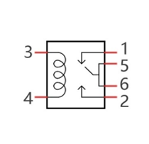

##############################################################################
Chapter Relay & Motor
##############################################################################

In this chapter, we will learn a kind of special switch module, Relay Module.

Project Relay & Motor
************************************

In this project, we will use a Push Button Switch indirectly to control the motor via a Relay.

Component List
=================================

+-----------------------------------------+------------------------------------------+
| Raspberry Pi Pico x1                    | USB Cable x1                             |
|                                         |                                          |
| |Chapter01_08|                          | |Chapter01_09|                           |
+-----------------------------------------+------------------------------------------+
| Breadboard x1                                                                      |
|                                                                                    |
| |Chapter01_10|                                                                     |
+-----------------------------------------+------------------------------------------+
| Breadboard Power x1                     | 9V battery                               |
|                                         |                                          |
|                                         | (prepared by yourself)                   |
|                                         |                                          |
|                                         | & battery line x1                        |
|                                         |                                          |
|  |Chapter17_00|                         | |Chapter17_01|                           |
+-------------------------+---------------+---------------+--------------------------+
| Resistor 10kΩ x2        |  Resistor 1kΩ x1              |  Resistor 220Ω x1        |
|                         |                               |                          |
| |Chapter17_09|          |  |Chapter17_10|               |  |Chapter17_11|          |
+-------------------------+-------------------------------+--------------------------+
| NPN                     |  Relay x1                     |  Motor x1                |
|                         |                               |                          |
| transistor x1           |                               |                          |
|                         |                               |                          |
| |Chapter17_02|          | |Chapter17_03|                |  |Chapter17_04|          |
+-------------------------+-------------------------------+--------------------------+
| Push button x1          | LED x1                        | Diode x1                 |
|                         |                               |                          |
| |Chapter17_05|          | |Chapter17_06|                |  |Chapter17_07|          |
+-------------------------+-------------------------------+--------------------------+
| Breadboard x1                                                                      |
|                                                                                    |
| |Chapter17_08|                                                                     |
+------------------------------------------------------------------------------------+

.. |Chapter01_08| image:: ../_static/imgs/1_LED/Chapter01_08.png
.. |Chapter01_09| image:: ../_static/imgs/1_LED/Chapter01_09.png
.. |Chapter01_10| image:: ../_static/imgs/1_LED/Chapter01_10.png

.. |Chapter17_05| image:: ../_static/imgs/17_Relay_&_Motor/Chapter17_05.png

Component Knowledge
=========================

Relay
--------------------------

A relay is a safe switch, which can use low power circuit to control high power circuit. It consists of electromagnet and contacts. The electromagnet is controlled by low power circuit and contacts are used in high power circuit. When the electromagnet is energized, it will attract contacts.

The following is a schematic diagram of a common relay and the feature and circuit symbol of a 5V relay used in this project:

.. list-table::
   :width: 100%
   :align: center
   
   * -  Diagram
     -  Feature
     -  Symbol

   * -  |Chapter17_12|
     -  |Chapter17_13|
     -  |Chapter17_14|
    

Pin 5 and pin 6 are connected to each other inside. When the coil pins 3 and 4 are connected to 5V power supply, pin 1 will be disconnected to pin 5&6 and pin 2 will be connected to pin 5&6. So pin 1 is called close end, pin 2 is called open end.

Inductor
--------------------------

The symbol of Inductance is "L" and the unit of inductance is the "Henry" (H). Here is an example of how this can be encountered: 1H=1000mH, 1mH=1000μH.

An inductor is an energy storage device that converts electrical energy into magnetic energy. Generally, it consists of winding coil, with a certain amount of inductance. Inductors hinder the change of current passing through it.  When the current passing through it increases, it will attempt to hinder the increasing trend of current; and when the current passing through it decreases, it will attempt to hinder the decreasing trend of current. Therefore, the current passing through inductor is not transient.

The reference circuit for relay is as follows. The coil of relays can be equivalent to that of inductors, when the transistor disconnects power supply of the relay, the current in the coil of the relay cannot stop immediately, causing an impact on power supply. Therefore, a parallel diode will be connected to both ends of relay coil pin in reversing direction, and then the current will pass through diode, avoiding the impact on power supply. 

Motor
----------------------------

A motor is a device that converts electrical energy into mechanical energy. Motor consists of two parts: stator and rotor. When motor works, the stationary part is stator, and the rotating part is rotor. Stator is usually the outer case of motor, and it has terminals to connect to the power. Rotor is usually the shaft of motor, and can drive other mechanical devices to run. Diagram below is a small DC motor with two pins.

When a motor is connected to the power supply, it will rotate in one direction. Reverse the polarity of power supply, then the motor rotates in opposite direction.

Breadboard Power
---------------------------

When the Raspberry Pi Pico outputs insufficient power or the power supply voltage and power consumption required by the device or module exceeds that provided by the Raspberry Pi Pico, you can choose Breadboard Power to either output 3.3V voltage source or 5V voltage source. Input power: DC 6~10V power supply or USB power supply.

Usage:

First connect Breadboard Power to the power supply, and then selectively choose the connection between OFF and 5V, 3V to generate different voltage source outputs, as the picture shows.

You can either select only one side of the output power supply, or choose to output 5V or 3.3V power supply at the same time on both sides, because the output circuits on both sides are separated and controlled independently and will not cause interference. Note that the GND should be connected to any GND of the Raspberry Pi Pico to form a Common ground connection.

Circuit
=============================

.. list-table::
   :width: 100%
   :align: center
   
   * -  Schematic diagram
   * -  |Chapter17_21|
   * -  Hardware connection. 
       
        :red:`If you need any support, please contact us via:` support@freenove.com
   * -  |Chapter17_22|
    
.. |Chapter17_21| image:: ../_static/imgs/17_Relay_&_Motor/Chapter17_21.png

Sketch 
============================

.. raw:: html

    <iframe style="display: block; margin: 0 auto;" height="421.875" width="750" src="https://www.youtube.com/embed/oxMu0wMefSU" frameborder="0" allowfullscreen></iframe>

Use buttons to control the relays and motors.

Sketch_Control_Motor_by_Relay
-----------------------------------------

Download the code to Pico. When the DC motor is connected to a power supply, it will rotate in one direction. If you reverse the polarity of the power supply, the DC motor will rotate in opposite direction. 

The following is the program code:

.. literalinclude:: ../../../freenove_Kit/C/Sketches/Sketch_17.1_Control_Motor_by_Relay/Sketch_17.1_Control_Motor_by_Relay.ino
    :linenos: 
    :language: c
    :lines: 1-38
    :dedent:

In Chapter 2, the pressing and releasing of the button will result in mechanical vibrating. If we do not solve this problem, some unexpected consequences may happen to the procedure. 

Click :ref:`here <button>` to return to Chapter 2 Button & LED.

To eliminate the vibrating, we record the electrical level of the button with nowButtonState, and the time point for the last change of pin level with lastChangeTime If the state of the button changes, it will record the time point of the change.

.. literalinclude:: ../../../freenove_Kit/C/Sketches/Sketch_17.1_Control_Motor_by_Relay/Sketch_17.1_Control_Motor_by_Relay.ino
    :linenos: 
    :language: c
    :lines: 22-26
    :dedent:

If the state of the pin changes and keeps stable for a period of time, it can be considered as a valid key state change, update the key state variable buttonState, and determine whether the key is pressed or released according to the current state.

.. literalinclude:: ../../../freenove_Kit/C/Sketches/Sketch_17.1_Control_Motor_by_Relay/Sketch_17.1_Control_Motor_by_Relay.ino
    :linenos: 
    :language: c
    :lines: 28-36
    :dedent: