##############################################################################
Chapter Servo
##############################################################################

Previously, we learned how to control the speed and rotational direction of a Motor. In this chapter, we will learn about Servos, which are a rotary actuator type motor that can be controlled to rotate to specific angles.

Project Servo Sweep
********************************************

First, we need to learn how to make a Servo rotate.

Component List
==========================

+-----------------------------------------+------------------------------------------+
| Raspberry Pi Pico x1                    | USB Cable x1                             |
|                                         |                                          |
| |Chapter01_08|                          | |Chapter01_09|                           |
+-----------------------------------------+------------------------------------------+
| Breadboard x1                                                                      |
|                                                                                    |
| |Chapter01_10|                                                                     |
+-----------------------------------------+------------------------------------------+
| Jumper                                  | Servo x1                                 |
|                                         |                                          |
|  |Chapter19_00|                         | |Chapter19_01|                           |
+-----------------------------------------+------------------------------------------+

.. |Chapter01_08| image:: ../_static/imgs/1_LED/Chapter01_08.png
.. |Chapter01_09| image:: ../_static/imgs/1_LED/Chapter01_09.png
.. |Chapter01_10| image:: ../_static/imgs/1_LED/Chapter01_10.png
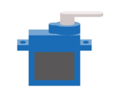
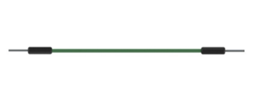

Component Knowledge
=========================

Servo
--------------------------

Servo is a compact package, which consists of a DC Motor, a set of reduction gears to provide torque, a sensor and control circuit board. Most Servos only have a 180-degree range of motion via their "horn". Servos can output higher torque than a simple DC Motor alone and they are widely used to control motion in model cars, model airplanes, robots, etc. Servos have three wire leads, which usually terminate to a male or female 3-pin plug. Two leads are for electric power: Positive (2-VCC, Red wire), Negative (3-GND, Brown wire), and the signal line (1-Signal, Orange wire) as represented in the Servo provided in your Kit.

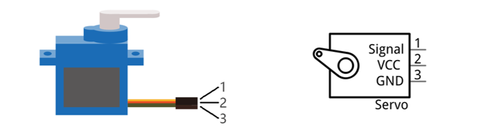

We will use a 50Hz PWM signal with a duty cycle in a certain range to drive the Servo. The time interval of 0.5ms-2.5ms of PWM single cycle high level corresponds to the Servo angle 0 degrees - 180 degrees linearly. Part of the corresponding values are as follows:

+-----------------+-------------+
| High level time | Servo angle |
+=================+=============+
| 0.5ms           | 0 degree    |
+-----------------+-------------+
| 1ms             | 45 degree   |
+-----------------+-------------+
| 1.5ms           | 0 degree    |
+-----------------+-------------+
| 2ms             | 45 degree   |
+-----------------+-------------+
| 2.5ms           | 180 degree  |
+-----------------+-------------+

When you change the Servo signal value, the Servo will rotate to the designated angle.

Circuit
=============================

.. list-table::
   :width: 100%
   :align: center
   
   * -  Schematic diagram
   * -  |Chapter19_03|
   * -  Hardware connection. 
       
        :red:`If you need any support, please contact us via:` support@freenove.com
   * -  |Chapter19_04|
    
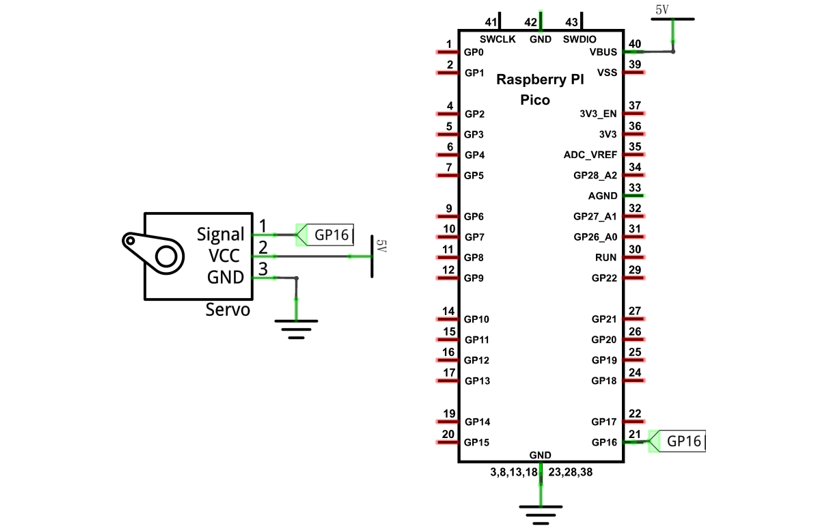
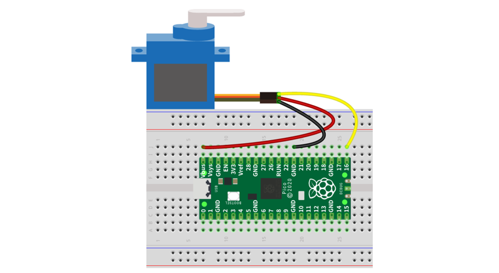

Sketch
=============================

.. raw:: html

    <iframe style="display: block; margin: 0 auto;" height="421.875" width="750" src="https://www.youtube.com/embed/bmR9y_7_lIg" frameborder="0" allowfullscreen></iframe>

How to install the library
------------------------------

If you have not installed the Servo library, please do so first.

The first one: Open Arduino IDE, click Library Manage on the left, input "Servo" in the search bar, select it to install.

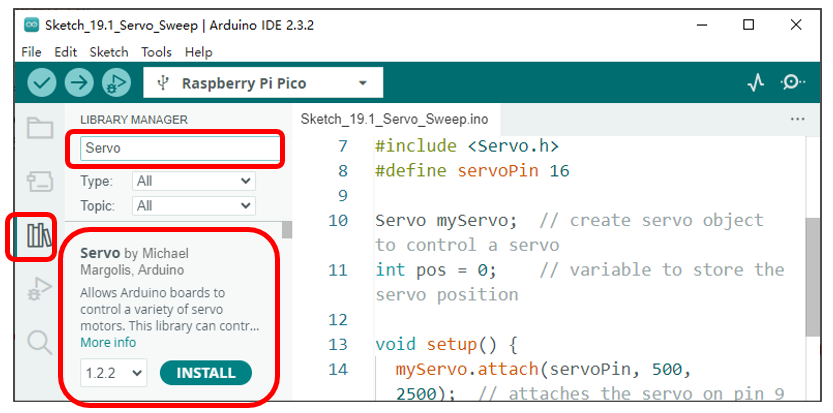

Use the Servo library to control the servomotor and let the servomotor rotate back and forth.

Sketch_Servo_Sweep
------------------------------

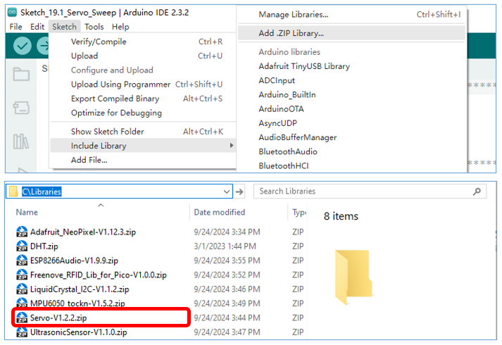

Compile and upload the code to Pico, the servo will rotate from 0 degrees to 180 degrees and then reverse the direction to make it rotate from 180 degrees to 0 degrees and repeat these actions in an endless loop.

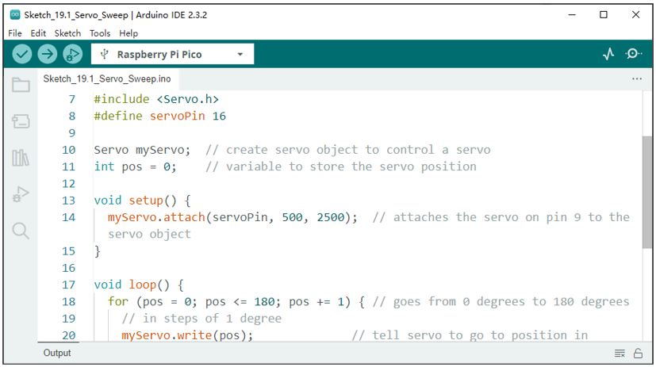

The following is the program code:

.. literalinclude:: ../../../freenove_Kit/C/Sketches/Sketch_19.1_Servo_Sweep/Sketch_19.1_Servo_Sweep.ino
    :linenos: 
    :language: c
    :lines: 1-27
    :dedent:

Servo uses the Servo library, like the following reference to Servo library:

.. literalinclude:: ../../../freenove_Kit/C/Sketches/Sketch_19.1_Servo_Sweep/Sketch_19.1_Servo_Sweep.ino
    :linenos: 
    :language: c
    :lines: 7-7
    :dedent:

Servo library provides the Servo class that controls it. Servo class must be instantiated before using:

.. literalinclude:: ../../../freenove_Kit/C/Sketches/Sketch_19.1_Servo_Sweep/Sketch_19.1_Servo_Sweep.ino
    :linenos: 
    :language: c
    :lines: 10-10
    :dedent:

Set the control servo motor pin.

.. literalinclude:: ../../../freenove_Kit/C/Sketches/Sketch_19.1_Servo_Sweep/Sketch_19.1_Servo_Sweep.ino
    :linenos: 
    :language: c
    :lines: 14-14
    :dedent:

After initializing the servo, you can control the servo to rotate to a specific angle:

.. literalinclude:: ../../../freenove_Kit/C/Sketches/Sketch_19.1_Servo_Sweep/Sketch_19.1_Servo_Sweep.ino
    :linenos: 
    :language: c
    :lines: 20-20
    :dedent:

Reference
-------------------------------

.. py:function:: Servo Class

    Servo class must be instantiated when used, that is, define an object of Servo type, for example:

        **Servo myservo;**

    Most other boards can define 12 objects of Servo type, namely, they can control up to 12 servos.

    The function commonly used in the servo class is as follows: 

        **myservo.attach(pin):** Initialize the servo, the parameter is the port connected to servo signal line;

        **myservo.write(angle):** Control servo to rotate to the specified angle; parameter here is to specify the angle.

Project Servo Knob
******************************

Use a potentiometer to control the servomotor to rotate at any angle.

Component List
==============================

+-----------------------------------------+------------------------------------------+
| Raspberry Pi Pico x1                    | USB Cable x1                             |
|                                         |                                          |
| |Chapter01_08|                          | |Chapter01_09|                           |
+-----------------------------------------+------------------------------------------+
| Breadboard x1                                                                      |
|                                                                                    |
| |Chapter01_10|                                                                     |
+-----------------------------------------+----------------+-------------------------+
| Jumper                                  | Servo x1       |  Rotary                 |
|                                         |                |                         |
|                                         |                |  potentiometer x1       |
|                                         |                |                         |
|  |Chapter19_01|                         | |Chapter19_00| |  |Chapter19_09|         |
+-----------------------------------------+----------------+-------------------------+

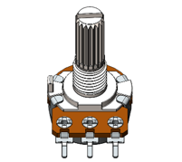

Circuit
==============================

Use caution when supplying power to the Servo, it should be 5V. Make sure you do not make any errors when connecting the Servo to the power supply.

.. list-table::
   :width: 100%
   :align: center
   
   * -  Schematic diagram
   * -  |Chapter19_10|
   * -  Hardware connection. 
       
        :red:`If you need any support, please contact us via:` support@freenove.com
   * -  |Chapter19_11|
    
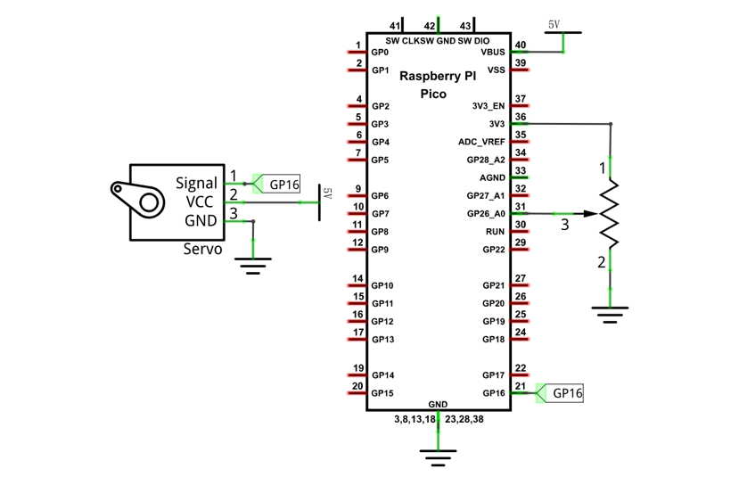
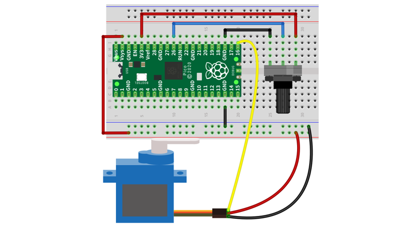

Sketch
=============================

.. raw:: html

    <iframe style="display: block; margin: 0 auto;" height="421.875" width="750" src="https://www.youtube.com/embed/bmR9y_7_lIg" frameborder="0" allowfullscreen></iframe>

Sketch_19.2_Control_Servo_by_Potentiometer
----------------------------------------------

Now, write the code to detect the voltage of rotary potentiometer, and control servo to rotate to a different angle according to that. 

.. literalinclude:: ../../../freenove_Kit/C/Sketches/Sketch_19.2_Control_Servo_by_Potentiometer/Sketch_19.2_Control_Servo_by_Potentiometer.ino
    :linenos: 
    :language: c
    :lines: 1-24
    :dedent:

In the code, we obtain the ADC value of GP26, and map it to the servo angle.

Verify and upload the code, turn the potentiometer shaft, and then the servo will rotate to a corresponding angle.

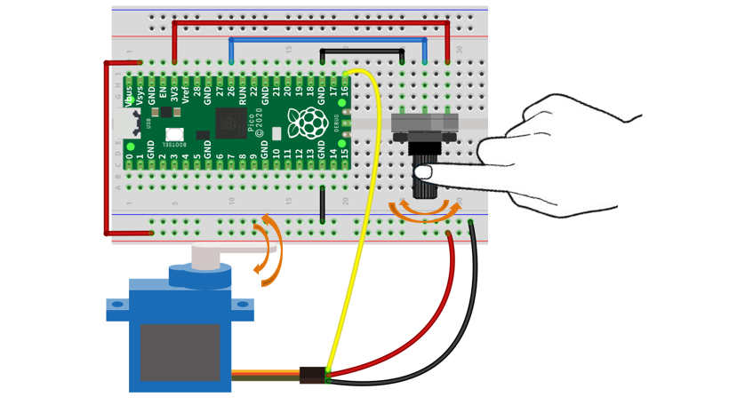