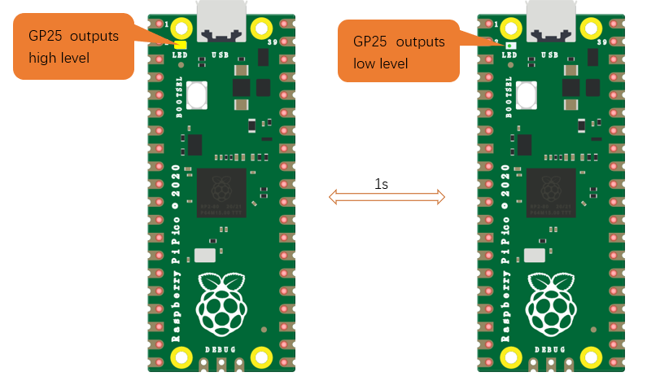
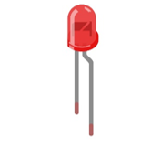

##############################################################################
Chapter 1 LED (Important)
##############################################################################

.. note::

    :red:`Raspberry Pi Pico, Raspberry Pi Pico W and Raspberry Pi Pico 2 only differ by one wireless function, and are almost identical in other aspects. In this tutorial, except for the wireless function, other parts use Raspberry Pi Pico's map for tutorial demonstration.`

This chapter is the Start Point in the journey to build and explore Pico electronic projects. We will start with simple "Blink" project.

Project Blink
**************************************

In this project, we will use Raspberry Pi Pico to control blinking a common LED.

If you have not installed Arduino IDE, you can click :ref:`Here <Programming>`.

If you have not uploaded firmware for Pico, you can click :ref:`Here <Firmware>` to upload. 

Component List
=======================================

.. list-table:: 
   :width: 100%
   :align: center

   * -  Raspberry Pi Pico(or Pico W or Pico 2)x1
   * -  |Chapter01_00|
   * -  USB cable x1
   * -  |Chapter01_01|

.. |Chapter01_01| image:: ../_static/imgs/1_LED/Chapter01_01.png

Power
----------------------------

Raspberry Pi Pico requires 5V power supply. You can either connect external 5V power supply to Vsys pin of Pico or connect a USB cable to the onboard USB base to power Pico.

In this tutorial, we use USB cable to power Pico and upload sketches.

.. image:: ../_static/imgs/1_LED/Chapter01_02.png
    :align: center

Sketch
============================

The onboard LED of Raspberry Pi Pico is controlled by GP25. When GP25 outputs high level, LED lights up; when it outputs low, LED lights off. You can open the provided code:

Freenove_Ultimate_Starter_Kit_for_Raspberry_Pi_Pico\\C\\Sketches\\Sketch_01.1_Blink.

Before uploading code to Pico, please check the configuration of Arduino IDE. 

Click Tools, make sure Board and Port are as follows:

Click "Upload" to upload the sketch to Pico.

:red:`If you have any concerns, please contact us at support@freenove.com`

Pico's on-board LED lights on and off every 1s, flashing cyclically. 

.. note::
    
    Pico's on-board LED is driven by GPIO25. Pico W's on-board LED uses WL\_ GPIO0, which is defined as GPIO32 on Arduino.

If you use Pico W, please change "# define LED_BUILTIN 25" to "# define LED_BUILTIN 32" in the code.

The following is the program code:

.. literalinclude:: ../../../freenove_Kit/C/Sketches/Sketch_01.1_Blink/Sketch_01.1_Blink.ino
    :linenos: 
    :language: c
    :dedent:

The Arduino IDE code usually contains two basic functions: void setup() and void loop(). 

After the board is reset, the setup() function will be executed firstly, and then the loop() function.

setup() function is generally used to write code to initialize the hardware. And loop() function is used to write code to achieve certain functions. loop() function is executed repeatedly. When the execution reaches the end of loop(), it will back to the beginning of loop() to run again.

In the setup() function, first, we set the LED_BUILTIN as output mode, which can make the port output high or low level.

.. literalinclude:: ../../../freenove_Kit/C/Sketches/Sketch_01.1_Blink/Sketch_01.1_Blink.ino
    :linenos: 
    :language: c
    :lines: 10-11
    :dedent:

Then, in the loop() function, set the LED_BUILTIN to output high level to make LED light up.

.. literalinclude:: ../../../freenove_Kit/C/Sketches/Sketch_01.1_Blink/Sketch_01.1_Blink.ino
    :linenos: 
    :language: c
    :lines: 16-16
    :dedent:

Wait for 1000ms, that is 1s. Delay() function is used to make control board wait for a moment before executing the next statement. The parameter indicates the number of milliseconds to wait for.

.. literalinclude:: ../../../freenove_Kit/C/Sketches/Sketch_01.1_Blink/Sketch_01.1_Blink.ino
    :linenos: 
    :language: c
    :lines: 17-17
    :dedent:

Then set the LED_BUILTIN to output low level, and LED lights off. One second later, the execution of loop() function will be completed. 

.. literalinclude:: ../../../freenove_Kit/C/Sketches/Sketch_01.1_Blink/Sketch_01.1_Blink.ino
    :linenos: 
    :language: c
    :lines: 18-19
    :dedent:

The loop() function is constantly being executed, so LED will keep blinking.

Reference
-----------------------------

.. py:function:: void pinMode(int pin, int mode);	
    
    Configures the specified pin to behave as either an input or an output. 
    
    **Parameters**
    
    pin: the pin number to set the mode of LED.
    
    mode: INPUT, OUTPUT, INPUT_PULLDOWM, or INPUT_PULLUP.

.. py:function:: void digitalWrite (int pin, int value);	
    
    Writes the value HIGH or LOW (1 or 0) to the given pin that must have been previously set as an output.
    
For more related functions, please refer to https://www.arduino.cc/reference/en/

Project Blink
*****************************

In this project, we will use Raspberry Pi Pico to control blinking a common LED.

Component List
===============================

+-----------------------------------------+----------------+
| Raspberry Pi Pico x1                    | USB Cable x1   |
|                                         |                |
| |Chapter01_08|                          | |Chapter01_09| |
+-----------------------------------------+----------------+
| Breadboard x1                                            |
|                                                          |
| |Chapter01_10|                                           |
+----------------------+------------------+----------------+
| LED x1               | Resistor 220Ω x1 | Jumper         |
|                      |                  |                |
| |Chapter01_11|       | |Chapter01_12|   | |Chapter01_13| |
+----------------------+------------------+----------------+

.. |Chapter01_08| image:: ../_static/imgs/1_LED/Chapter01_08.png
.. |Chapter01_09| image:: ../_static/imgs/1_LED/Chapter01_09.png
.. |Chapter01_10| image:: ../_static/imgs/1_LED/Chapter01_10.png

.. |Chapter01_12| image:: ../_static/imgs/1_LED/Chapter01_12.png
.. |Chapter01_13| image:: ../_static/imgs/1_LED/Chapter01_13.png

Component Knowledge
==============================

LED
-------------------------------

An LED is a type of diode. All diodes only work if current is flowing in the correct direction and have two Poles.  An LED will only work (light up) if the longer pin (+) of LED is connected to the positive output from a power source and the shorter pin is connected to the negative (-). Negative output is also referred to as Ground (GND). This type of component is known as "Polar" (think One-Way Street).

All common two-lead diodes are the same in this respect. Diodes work only if the voltage of its positive electrode is higher than its negative electrode and there is a narrow range of operating voltage for most all common diodes of 1.9 and 3.4V. If you use much more than 3.3V the LED will be damaged and burn out.

.. note::
    
    LEDs cannot be directly connected to a power supply, which usually ends in a damaged component. A resistor with a specified resistance value must be connected in series to the LED you plan to use.

Resistor
-------------------------------

Resistors use Ohms (Ω) as the unit of measurement of their resistance (R). 1MΩ=1000kΩ, 1kΩ=1000Ω. 

A resistor is a passive electrical component that limits or regulates the flow of current in an electronic circuit. 

On the left, we see a physical representation of a resistor, and the right is the symbol used to represent the presence of a resistor in a circuit diagram or schematic.

The bands of color on a resistor is a shorthand code used to identify its resistance value. For more details of resistor color codes, please refer to the appendix of this tutorial.

With a fixed voltage, there will be less current output with greater resistance added to the circuit. The relationship between Current, Voltage and Resistance can be expressed by this formula: I=V/R known as Ohm's Law where I = Current, V = Voltage and R = Resistance. Knowing the values of any two of these allows you to solve the value of the third.

In the following diagram, the current through R1 is: I=U/R=5V/10kΩ=0.0005A=0.5mA. 

WARNING: Never connect the two poles of a power supply with anything of low resistance value (i.e. a metal object or bare wire) this is a Short and results in high current that may damage the power supply and electronic components.

.. note::
    
    Unlike LEDs and Diodes, Resistors have no poles and re non-polar (it does not matter which direction you insert them into a circuit, it will work the same)

Breadboard
--------------------------

Here we have a small breadboard as an example of how the rows of holes (sockets) are electrically attached. 

The left picture shows the way to connect pins. The right picture shows the practical internal structure.

Power
--------------------------

In this tutorial, we connect Raspberry Pi Pico and computer with a USB cable.

Circuit
==========================

First, disconnect all power from the Raspberry Pi Pico. Then build the circuit according to the circuit and hardware diagrams. After the circuit is built and verified correct, connect the PC to Raspberry Pi Pico. 

CAUTION: Avoid any possible short circuits (especially connecting 3.3V and GND)! 

WARNING: A short circuit can cause high current in your circuit, create excessive component heat and cause permanent damage to your hardware!

.. list-table::
   :width: 100%
   :align: center
   
   * -  Schematic diagram
   * -  |Chapter01_19|
   * -  Hardware connection. 
       
        :red:`If you need any support, please contact us via:` support@freenove.com
   * -  |Chapter01_20|
    

.. note::
    
    :red:`To help users have a better experience when doing the projects, we have made some modifications to Pico's simulation diagram. Please note that there are certain differences between the simulation diagram and the actual board to avoid misunderstanding.`

Sketch
==============================

According to the circuit diagram, when GP15 of Pico outputs high level, LED lights up; when it outputs low, LED lights off. Therefore, we can make LED flash repeatedly by controlling GP15 to output high and low repeatedly.

You can open the provided code:

**Freenove_Ultimate_Starter_Kit_for_Raspberry_Pi_Pico\\C\\Sketches\\Sketch_01.2_Blink.**

Before uploading code to Pico, please check the configuration of Arduino IDE. 

Click Tools, make sure Board and Port are as follows:

Click "Upload" to upload the sketch to Pico.

Click "Upload". Download the code to Pico and your LED in the circuit starts Blink.

:red:`If you have any concerns, please contact us via:` support@freenove.com