##############################################################################
Chapter Stepper Motor
##############################################################################

In this project, we will learn how to drive a Stepper Motor, and understand its working principle.

Project Stepper Motor
********************************

Component List
=============================

+-----------------------------------------+------------------------------------------+
| Raspberry Pi Pico x1                    | USB Cable x1                             |
|                                         |                                          |
| |Chapter01_08|                          | |Chapter01_09|                           |
+-----------------------------------------+------------------------------------------+
| Breadboard x1                                                                      |
|                                                                                    |
| |Chapter01_10|                                                                     |
+-------------------------+-------------------------------+--------------------------+
| Stepper Motor x1        | ULN2003 Stepper               |  Jumper                  |
|                         |                               |                          |
|                         | motor Driver x1               |                          |
|                         |                               |                          |
| |Chapter20_00|          |  |Chapter20_01|               |  |Chapter20_02|          |
+-------------------------+---------------+---------------+--------------------------+
| Breadboard Power x1                     | 9V battery (prepared by yourself)        |
|                                         |                                          |
|                                         | & battery line x1                        |
|                                         |                                          |
|  |Chapter20_03|                         | |Chapter20_04|                           |
+-----------------------------------------+------------------------------------------+

.. |Chapter01_08| image:: ../_static/imgs/1_LED/Chapter01_08.png
.. |Chapter01_09| image:: ../_static/imgs/1_LED/Chapter01_09.png
.. |Chapter01_10| image:: ../_static/imgs/1_LED/Chapter01_10.png
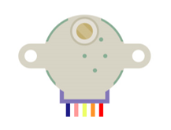
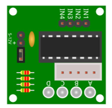
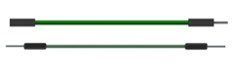
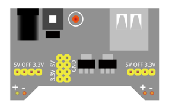
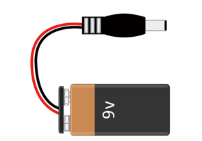

Component Knowledge
====================================

Stepper Motor
------------------------

Stepper Motors are an open-loop control device, which converts an electronic pulse signal into angular displacement or linear displacement. In a non-overload condition, the speed of the motor and the location of the stops depend only on the pulse signal frequency as well as the number of pulses and are not affected by changes in load as with a DC Motor. A small Four-Phase Deceleration Stepper Motor is shown here:

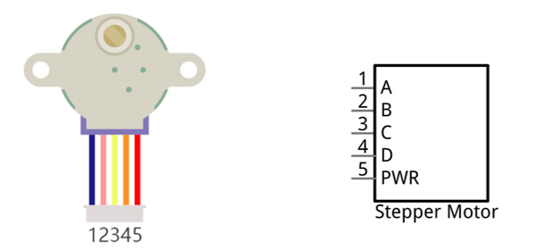

The electronic schematic diagram of a Four-Phase Stepper Motor is shown below:

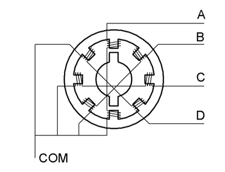

The outside case or housing of the Stepper Motor is the Stator and inside the Stator is the Rotor. There are a specific number of individual coils, usually an integer multiple of the number of phases the motor has, when the Stator is powered ON, an electromagnetic field will be formed to attract a corresponding convex diagonal groove or indentation in the Rotor's surface. The Rotor is usually made of iron or a permanent magnet. Therefore, the Stepper Motor can be driven by powering the coils on the Stator in an ordered sequence (producing a series of "steps" or stepped movements).

A common driving process is as follows:

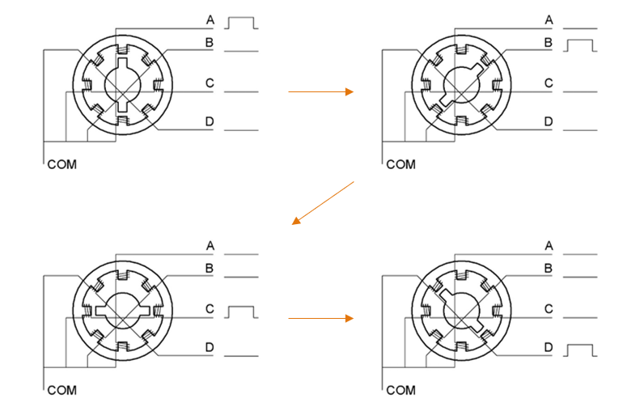

In the course above, the stepping motor rotates a certain angle once, which is called a step. By controlling the number of rotation steps, you can control the stepping motor rotation angle. By controlling the time between two steps, you can control the stepping motor rotation speed. When rotating clockwise, the order of coil powered on is: A -> B -> C -> D -> A -> ... And the rotor will rotate in accordance with the order, step by step down, called four steps four pats. If the coils is powered on in the reverse order, D -> C -> B -> A -> D -> …, the rotor will rotate in anti-clockwise direction.

There are other methods to control Stepper Motors, such as: connect A phase, then connect A B phase, the stator will be located in the center of A B, which is called a half step. This method can improve the stability of the Stepper Motor and reduces noise. The sequence of powering the coils looks like this: A -> AB -> B  -> BC -> C  -> CD -> D -> DA -> A -> ......, the rotor will rotate in accordance to this sequence at a half-step at a time, called four-steps, eight-part. Conversely, if the coils are powered ON in the reverse order the Stepper Motor will rotate in the opposite direction.

The stator in the Stepper Motor we have supplied has 32 magnetic poles. Therefore, to complete one full revolution requires 32 full steps. The rotor (or output shaft) of the Stepper Motor is connected to a speed reduction set of gears and the reduction ratio is 1:64. Therefore, the final output shaft (exiting the Stepper Motor's housing) requires 32 X 64 = 2048 steps to make one full revolution.

The time required for each step of the stepper motor must be greater than 2ms to operate normally.

ULN2003 Stepper motor driver
----------------------------------

A ULN2003 Stepper Motor Driver is used to convert weak signals into more powerful control signals in order to drive the Stepper Motor. In the illustration below, the input signal IN1-IN4 corresponds to the output signal A-D, and four LEDs are integrated into the board to indicate the state of these signals. The PWR interface can be used as a power supply for the Stepper Motor. By default, PWR and VCC are connected.

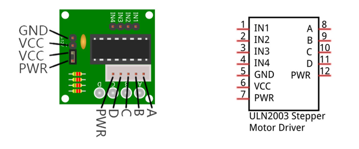

Circuit
================================

.. list-table::
   :width: 100%
   :align: center
   
   * -  Schematic diagram
   * -  |Chapter20_09|
   * -  Hardware connection. 
       
        :red:`If you need any support, please contact us via:` support@freenove.com
   * -  |Chapter20_10|
    
.. |Chapter20_09| image:: ../_static/imgs/20_Stepper_Motor/Chapter20_09.png
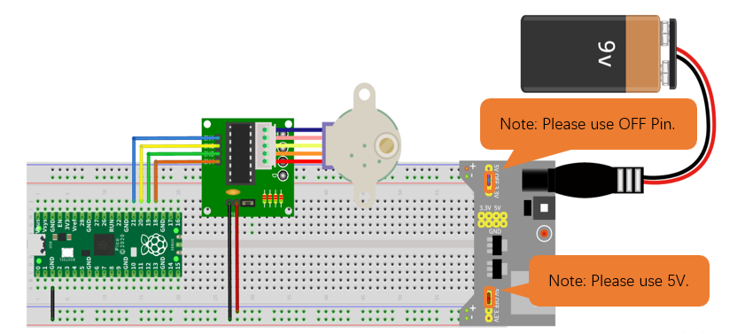

Sketch
==============================

This code uses the four-step, four-part mode to drive the stepper motor in the clockwise and anticlockwise directions.

Sketch_Drive_Stepper_Motor
--------------------------------------

.. image:: ../_static/imgs/20_Stepper_Motor/Chapter20_11.png
    :align: center

Compile and upload the code to the Pico, the stepper motor will rotate 360° clockwise and stop for 1s, and then rotate 360° anticlockwise and stop for 1s. This action is repeated in an endless loop.

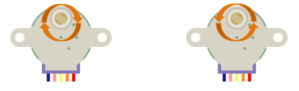

The following is the program code:

.. literalinclude:: ../../../freenove_Kit/C/Sketches/Sketch_20.1_Drive_Stepper_Motor/Sketch_20.1_Drive_Stepper_Motor.ino
    :linenos: 
    :language: c
    :lines: 1-57
    :dedent:

In this project, we define four pins to drive stepper motor.

.. literalinclude:: ../../../freenove_Kit/C/Sketches/Sketch_20.1_Drive_Stepper_Motor/Sketch_20.1_Drive_Stepper_Motor.ino
    :linenos: 
    :language: c
    :lines: 7-8
    :dedent:

moveOneStep Function is used to drive the stepper motor to rotate clockwise or counterclockwise. The parameter "dir" indicates the direction of rotation. If "dir" returns true, the stepper motor rotates clockwise, otherwise the stepper motor rotates counterclockwise.  

.. literalinclude:: ../../../freenove_Kit/C/Sketches/Sketch_20.1_Drive_Stepper_Motor/Sketch_20.1_Drive_Stepper_Motor.ino
    :linenos: 
    :language: c
    :lines: 30-30
    :dedent:

Define a static byte variable, calculate the value of the variable according to the rotation direction of the motor, and use the keyword static to save the position status of the previous step of the stepper motor. Use the four low bits of the variable to control the output state of the four pins.

.. literalinclude:: ../../../freenove_Kit/C/Sketches/Sketch_20.1_Drive_Stepper_Motor/Sketch_20.1_Drive_Stepper_Motor.ino
    :linenos: 
    :language: c
    :lines: 37-44
    :dedent:

Make the pin output corresponding level based on the value of the variable.

.. literalinclude:: ../../../freenove_Kit/C/Sketches/Sketch_20.1_Drive_Stepper_Motor/Sketch_20.1_Drive_Stepper_Motor.ino
    :linenos: 
    :language: c
    :lines: 45-48
    :dedent:

The moveSteps function can control the direction of the stepper motor, the number of rotation steps, and the speed of rotation. According to the previous knowledge, the stepper motor needs 32*64 steps for one revolution. The speed of rotation is determined by the parameter ms. The larger the ms is, the slower the rotation speed is. There is a range for the speed of the motor, which is determined by the motor itself and according to our test, the value of ms is limited to 3-20.

.. literalinclude:: ../../../freenove_Kit/C/Sketches/Sketch_20.1_Drive_Stepper_Motor/Sketch_20.1_Drive_Stepper_Motor.ino
    :linenos: 
    :language: c
    :lines: 27-33
    :dedent:

The function moveTurns() is a further package of moveSteps(), which is used to control the stepper motor to rotate a specified number of turns. The parameter "turns" represents the number of turns that need to be rotated.

.. literalinclude:: ../../../freenove_Kit/C/Sketches/Sketch_20.1_Drive_Stepper_Motor/Sketch_20.1_Drive_Stepper_Motor.ino
    :linenos: 
    :language: c
    :lines: 51-54
    :dedent:

The function moveAround () is a further package of moveSteps (), which is used to control the stepper motor to rotate by a specified angle, and the parameter "angle" represents the angle to be rotated.

.. literalinclude:: ../../../freenove_Kit/C/Sketches/Sketch_20.1_Drive_Stepper_Motor/Sketch_20.1_Drive_Stepper_Motor.ino
    :linenos: 
    :language: c
    :lines: 55-57
    :dedent:

In the loop function, call the moveSteps function to loop the stepper motor: rotate clockwise one turn and stop for 1s, then rotate counterclockwise one turn and stop for 1s.

.. literalinclude:: ../../../freenove_Kit/C/Sketches/Sketch_20.1_Drive_Stepper_Motor/Sketch_20.1_Drive_Stepper_Motor.ino
    :linenos: 
    :language: c
    :lines: 17-25
    :dedent: