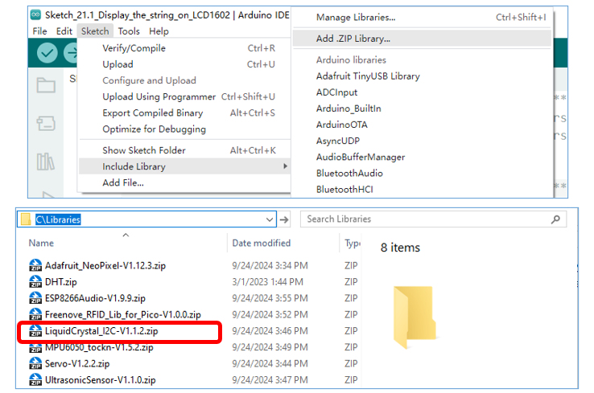

##############################################################################
Chapter LCD1602
##############################################################################

In this chapter, we will learn about the LCD1602 Display Screen.

Project LCD1602
******************************

In this section, we learn how to use LCD1602 to display something.

Component List
==========================

+-----------------------------------------+------------------------------------------+
| Raspberry Pi Pico x1                    | USB Cable x1                             |
|                                         |                                          |
| |Chapter01_08|                          | |Chapter01_09|                           |
+-----------------------------------------+------------------------------------------+
| Breadboard x1                                                                      |
|                                                                                    |
| |Chapter01_10|                                                                     |
+-----------------------------------------+------------------------------------------+
| LCD1602 Module x1                       | Jumper                                   |
|                                         |                                          |
|  |Chapter21_00|                         | |Chapter21_01|                           |
+-----------------------------------------+------------------------------------------+

.. |Chapter01_08| image:: ../_static/imgs/1_LED/Chapter01_08.png
.. |Chapter01_09| image:: ../_static/imgs/1_LED/Chapter01_09.png
.. |Chapter01_10| image:: ../_static/imgs/1_LED/Chapter01_10.png
.. |Chapter21_00| image:: ../_static/imgs/21_LCD1602/Chapter21_00.png
.. |Chapter21_01| image:: ../_static/imgs/21_LCD1602/Chapter21_01.png

Component Knowledge
========================

I2C communication
-------------------------

I2C (Inter-Integrated Circuit) is a two-wire serial communication mode, which can be used for the connection of micro controllers and their peripheral equipment. Devices using I2C communication must be connected to the serial data (SDA) line, and serial clock (SCL) line (called I2C bus). Each device has a unique address and can be used as a transmitter or receiver to communicate with devices connected to the bus.

LCD1602 communication
----------------------------

The LCD1602 Display Screen can display two lines of characters in 16 columns. It is capable of displaying numbers, letters, symbols, ASCII code and so on. As shown below is a monochrome LCD1602 Display Screen along with its circuit pin diagram.

.. image:: ../_static/imgs/21_LCD1602/Chapter21_02.png
    :align: center

I2C LCD1602 Display Screen integrates an I2C interface, which connects the serial-input & parallel-output module to the LCD1602 Display Screen. This allows us to use only four lines to operate the LCD1602.

.. image:: ../_static/imgs/21_LCD1602/Chapter21_03.png
    :align: center

The serial-to-parallel IC chip used in this module is PCF8574T (PCF8574AT), and its default I2C address is 0x27(0x3F).

Below is the PCF8574 pin schematic diagram and the block pin diagram:

.. list-table::
   :width: 100%
   :align: center
   
   * -  PCF8574 chip pin diagram
     -  PCF8574 module pin diagram 
   
   * -  |Chapter21_04|
     -  |Chapter21_05| 

.. image:: ../_static/imgs/21_LCD1602/Chapter21_06.png
    :align: center

Therefore, we only need four pins to control the 16 pins of the LCD1602 Display Screen through the I2C interface.

In this project, we will use the I2C LCD1602 to display some static characters and dynamic variables.

Circuit
==========================

.. list-table::
   :width: 100%
   :align: center
   
   * -  Schematic diagram
   * -  |Chapter21_07|
   * -  Hardware connection. 
       
        :red:`If you need any support, please contact us via:` support@freenove.com
   * -  |Chapter21_08| 

.. |Chapter21_07| image:: ../_static/imgs/21_LCD1602/Chapter21_07.png

Sketch
=========================

How to install the library
-------------------------------

In this project, we use a third-party library named LiquidCrystal I2C. Here are two ways to install the library for your reference.

The first one: Open Arduino IDE; click Library Manage on the left, search "LiquidCrystal I2C" to install.

The second way, open Arduino IDE, click Sketch -> Include Library -> Add .ZIP Library. In the pop-up window, find the file named "./Libraries/ LiquidCrystal_I2C-V1.1.2.Zip" which locates in this directory, and click OPEN.

Use I2C LCD 1602 to display characters and variables.

Sketch_Display_the_string_on_LCD1602
------------------------------------------------

Compile and upload the code to Pico and the LCD1602 displays characters.

If the LCD1602 you received is the following one, and you cannot see anything on the display or the display is not clear, try rotating the white knob on back of LCD1602 slowly, which adjusts the contrast, until the screen can display clearly.

The following is the program code:

.. literalinclude:: ../../../freenove_Kit/C/Sketches/Sketch_21.1_Display_the_string_on_LCD1602/Sketch_21.1_Display_the_string_on_LCD1602.ino
    :linenos: 
    :language: c
    :lines: 1-57
    :dedent:

Include header file of Liquid Crystal Display (LCD)1602.

.. literalinclude:: ../../../freenove_Kit/C/Sketches/Sketch_21.1_Display_the_string_on_LCD1602/Sketch_21.1_Display_the_string_on_LCD1602.ino
    :linenos: 
    :language: c
    :lines: 7-7
    :dedent:

Instantiate the I2C LCD1602 screen. It should be noted here that if your LCD driver chip uses PCF8574T, set the I2C address to 0x27, and if uses PCF8574AT, set the I2C address to 0x3F.

.. literalinclude:: ../../../freenove_Kit/C/Sketches/Sketch_21.1_Display_the_string_on_LCD1602/Sketch_21.1_Display_the_string_on_LCD1602.ino
    :linenos: 
    :language: c
    :lines: 9-9
    :dedent:

Initialize LCD1602 and turn on the backlight of LCD.

.. literalinclude:: ../../../freenove_Kit/C/Sketches/Sketch_21.1_Display_the_string_on_LCD1602/Sketch_21.1_Display_the_string_on_LCD1602.ino
    :linenos: 
    :language: c
    :lines: 12-16
    :dedent:

Check whether the I2C address is responded by a device.

.. literalinclude:: ../../../freenove_Kit/C/Sketches/Sketch_21.1_Display_the_string_on_LCD1602/Sketch_21.1_Display_the_string_on_LCD1602.ino
    :linenos: 
    :language: c
    :lines: 28-35
    :dedent:

Move the cursor to the first row, first column, and then display the character.

.. literalinclude:: ../../../freenove_Kit/C/Sketches/Sketch_21.1_Display_the_string_on_LCD1602/Sketch_21.1_Display_the_string_on_LCD1602.ino
    :linenos: 
    :language: c
    :lines: 17-18
    :dedent:

Print the number on the second line of LCD1602.

.. literalinclude:: ../../../freenove_Kit/C/Sketches/Sketch_21.1_Display_the_string_on_LCD1602/Sketch_21.1_Display_the_string_on_LCD1602.ino
    :linenos: 
    :language: c
    :lines: 21-26
    :dedent:

Reference
----------------------------

.. PY:function:: class LiquidCrystal 

The LiquidCrystal class can manipulate common LCD screens. The first step is defining an object of

LiquidCrystal, for example:

:blue:`LquidCrystal_I2C` lcd(0x27,16,2);

    Instantiate the Lcd1602 and set the I2C address to 0x27, with 16 columns per row and 2 rows per column.

**init();**

    Initializes the Lcd1602's device

**backlight();**

    Turn on Lcd1602's backlight.

**setCursor(column,row);**

Sets the screen's column and row.

    **Column:** The range is 0 to 15.

    **Row:** The range is 0 to 1.

print( :red:`String` );

    Print the character string on Lcd1602