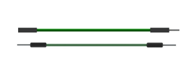

##############################################################################
Chapter Ultrasonic Ranging
##############################################################################

In this chapter, we learn a module, which use ultrasonic to measure distance, HC SR04.

Project Ultrasonic Ranging
*********************************
In this project, we use ultrasonic ranging module to measure distance, and print out the data in the terminal.

Component List
==========================

+-----------------------------------------+------------------------------------------+
| Raspberry Pi Pico x1                    | USB Cable x1                             |
|                                         |                                          |
| |Chapter01_08|                          | |Chapter01_09|                           |
+-----------------------------------------+------------------------------------------+
| Breadboard x1                                                                      |
|                                                                                    |
| |Chapter01_10|                                                                     |
+-----------------------------------------+------------------------------------------+
| HC SR04 x1                              | Jumper                                   |
|                                         |                                          |
|  |Chapter22_00|                         | |Chapter21_01|                           |
+-----------------------------------------+------------------------------------------+

.. |Chapter01_08| image:: ../_static/imgs/1_LED/Chapter01_08.png
.. |Chapter01_09| image:: ../_static/imgs/1_LED/Chapter01_09.png
.. |Chapter01_10| image:: ../_static/imgs/1_LED/Chapter01_10.png
.. |Chapter22_00| image:: ../_static/imgs/22_Ultrasonic_Ranging/Chapter22_00.png

Component Knowledge
============================

The Ultrasonic Ranging Module uses the principle that ultrasonic waves will reflect when they encounter any obstacles. This is possible by counting the time interval between when the ultrasonic wave is transmitted to when the ultrasonic wave reflects back after encountering an obstacle. Time interval counting will end after an ultrasonic wave is received, and the time difference (delta) is the total time of the ultrasonic wave's journey from being transmitted to being received. Because the speed of sound in air is a constant, and is about v=340m/s, we can calculate the distance between the Ultrasonic Ranging Module and the obstacle: s=vt/2.

.. image:: ../_static/imgs/22_Ultrasonic_Ranging/Chapter22_01.png
    :align: center

The HC-SR04 Ultrasonic Ranging Module integrates both an ultrasonic transmitter and a receiver. The transmitter is used to convert electrical signals (electrical energy) into high frequency (beyond human hearing) sound waves (mechanical energy) and the function of the receiver is opposite of this. The picture and the diagram of the HC SR04 Ultrasonic Ranging Module are shown below:

.. list-table::
   :width: 100%
   :align: center
   
   * -  |Chapter22_02|
     -  |Chapter22_03| 

.. |Chapter22_02| image:: ../_static/imgs/22_Ultrasonic_Ranging/Chapter22_02.png

Pin description:

+------+------------------+
| Pin  | Description      |
+------+------------------+
| VCC  | power supply pin |
+------+------------------+
| Trig | trigger pin      |
+------+------------------+
| Echo | Echo pin         |
+------+------------------+
| GND  | GND              |
+------+------------------+

**Technical specs:**

Working voltage: 5V                      

Working current: 12mA

Minimum measured distance: 2cm          

Maximum measured distance: 200cm

Instructions for Use: output a high-level pulse in Trig pin lasting for least 10us, the module begins to transmit ultrasonic waves. At the same time, the Echo pin is pulled up. When the module receives the returned ultrasonic waves from encountering an obstacle, the Echo pin will be pulled down. The duration of high level in the Echo pin is the total time of the ultrasonic wave from transmitting to receiving, s=vt/2. 

.. image:: ../_static/imgs/22_Ultrasonic_Ranging/Chapter22_04.png
    :align: center

Circuit
=================================

Note that the voltage of ultrasonic module is 5V in the circuit.

.. list-table::
   :width: 100%
   :align: center
   
   * -  Schematic diagram
   * -  |Chapter22_05|
   * -  Hardware connection. 
       
        :red:`If you need any support, please contact us via:` support@freenove.com
   * -  |Chapter22_06| 

.. |Chapter22_05| image:: ../_static/imgs/22_Ultrasonic_Ranging/Chapter22_05.png
.. |Chapter22_06| image:: ../_static/imgs/22_Ultrasonic_Ranging/Chapter22_06.png

Sketch
=====================

.. raw:: html

    <iframe style="display: block; margin: 0 auto;" height="421.875" width="750" src="https://www.youtube.com/embed/5c4x0U6Qp0Y" frameborder="0" allowfullscreen></iframe>

Sketch_Ultrasonic_Ranging
-----------------------------------

Download the code to Pico, open the serial monitor, set the baud rate to 115200, and you can use it to measure the distance between the ultrasonic module and the object, as shown in the following picture: 

The following is the program code:

.. literalinclude:: ../../../freenove_Kit/C/Sketches/Sketch_22.1_Ultrasonic_Ranging/Sketch_22.1_Ultrasonic_Ranging.ino
    :linenos: 
    :language: c
    :lines: 1-39
    :dedent:

First, define the pins and the maximum measurement distance.

.. literalinclude:: ../../../freenove_Kit/C/Sketches/Sketch_22.1_Ultrasonic_Ranging/Sketch_22.1_Ultrasonic_Ranging.ino
    :linenos: 
    :language: c
    :lines: 7-9
    :dedent:

If the module does not return high level, we cannot wait for this forever, so we need to calculate the time period for the maximum distance, that is, time Out. timeOut= 2*MAX_DISTANCE/100/340*1000000. The result of the constant part in this formula is approximately 58.8.

.. literalinclude:: ../../../freenove_Kit/C/Sketches/Sketch_22.1_Ultrasonic_Ranging/Sketch_22.1_Ultrasonic_Ranging.ino
    :linenos: 
    :language: c
    :lines: 11-11
    :dedent:

Subfunction getSonar () function is used to start the ultrasonic module to begin measuring, and return the measured distance in cm units. In this function, first let trigPin send 10us high level to start the ultrasonic module. Then use pulseIn () to read the ultrasonic module and return the duration time of high level. Finally, the measured distance according to the time is calculated.

.. literalinclude:: ../../../freenove_Kit/C/Sketches/Sketch_22.1_Ultrasonic_Ranging/Sketch_22.1_Ultrasonic_Ranging.ino
    :linenos: 
    :language: c
    :lines: 27-39
    :dedent:

Lastly, in loop() function, get the measurement distance and display it continually.

.. literalinclude:: ../../../freenove_Kit/C/Sketches/Sketch_22.1_Ultrasonic_Ranging/Sketch_22.1_Ultrasonic_Ranging.ino
    :linenos: 
    :language: c
    :lines: 20-25
    :dedent:

About function **pulseIn():**

.. py:function:: int pulseIn(int pin, int level, int timeout);	
    
    **pin:** the number of the Arduino pin on which you want to read the pulse. Allowed data types: int.
    
    **value:** type of pulse to read: either HIGH or LOW. Allowed data types: int.
    
    **timeout** (optional): the number of microseconds to wait for the pulse to start; default is one second. 

Project Ultrasonic Ranging
**************************************

Component List and Circuit
=======================================

Component List and Circuit are the same as the previous section.

Sketch
==============================

.. raw:: html

    <iframe style="display: block; margin: 0 auto;" height="421.875" width="750" src="https://www.youtube.com/embed/5c4x0U6Qp0Y" frameborder="0" allowfullscreen></iframe>

How to install the library
---------------------------------

In this project, we use a third-party library named **UltrasonicSensor** . Here are two ways to install the library for your reference.

The first one: Open Arduino IDE, click **Library Manage** on the left, and search " **UltrasonicSensor** " to install.

The second way, open Arduino IDE, click Sketch -> Include Library -> Add .ZIP Library. In the pop-up window, find the file named "./Libraries/ UltrasonicSensor-V1.1.0.Zip" which locates in this directory, and click OPEN.

Sketch_22.2_Ultrasonic_Ranging
------------------------------------

Upload the sketch to Pico, open the serial monitor and set the baud rate to 115200. Use the ultrasonic module to measure distance, as shown in the following picture: 

The following is the program code:

.. literalinclude:: ../../../freenove_Kit/C/Sketches/Sketch_22.2_Ultrasonic_Ranging/Sketch_22.2_Ultrasonic_Ranging.ino
    :linenos: 
    :language: c
    :lines: 1-23
    :dedent:

First, add UltrasonicSensor library.

.. literalinclude:: ../../../freenove_Kit/C/Sketches/Sketch_22.2_Ultrasonic_Ranging/Sketch_22.2_Ultrasonic_Ranging.ino
    :linenos: 
    :language: c
    :lines: 7-7
    :dedent:

Define an ultrasonic object and associate it with the pins.

.. literalinclude:: ../../../freenove_Kit/C/Sketches/Sketch_22.2_Ultrasonic_Ranging/Sketch_22.2_Ultrasonic_Ranging.ino
    :linenos: 
    :language: c
    :lines: 10-10
    :dedent:

Set the ambient temperature to make the module measure more accurately.

.. literalinclude:: ../../../freenove_Kit/C/Sketches/Sketch_22.2_Ultrasonic_Ranging/Sketch_22.2_Ultrasonic_Ranging.ino
    :linenos: 
    :language: c
    :lines: 16-16
    :dedent:

Use the distanceInCentimeters function to get the distance measured by the ultrasound and print it out through the serial port.

.. literalinclude:: ../../../freenove_Kit/C/Sketches/Sketch_22.2_Ultrasonic_Ranging/Sketch_22.2_Ultrasonic_Ranging.ino
    :linenos: 
    :language: c
    :lines: 19-23
    :dedent:

Reference
------------------------------

.. py:function:: class UltrasonicSensor 	
    
    class UltrasonicSensor must be instantiated when used, that is, define an object of Servo type, for example:
    
        **UltrasonicSensor ultrasonic(19, 18);**
    
        **setTemperature(value):** The speed of sound propagation is different at different temperatures. In order to get more accurate data, this function needs to be called. value is the temperature value of the current environment.
    
        **distanceInCentimeters():** The ultrasonic distance acquisition function returns the value in centimeters. 
    
        **distanceInMillimeters():** The ultrasonic distance acquisition function returns the value in millimeter.