##############################################################################
Chapter Matrix Keypad
##############################################################################

Earlier we learned about a single Push Button Switch. In this chapter, we will learn about Matrix Keyboards, which integrates a number of Push Button Switches as Keys for the purposes of Input.

Project Matrix Keypad
**************************************

In this project, we will attempt to get every key code on the Matrix Keypad to work.

Component List
===============================

+-----------------------------------------+------------------------------------------+
| Raspberry Pi Pico x1                    | USB Cable x1                             |
|                                         |                                          |
| |Chapter01_08|                          | |Chapter01_09|                           |
+-----------------------------------------+------------------------------------------+
| Breadboard x1                                                                      |
|                                                                                    |
| |Chapter01_10|                                                                     |
+-----------------------------------------+------------------------------------------+
| 4x4 Matrix Keypad x1                    | Jumper                                   |
|                                         |                                          |
|  |Chapter23_01|                         | |Chapter23_00|                           |
+-----------------------------------------+------------------------------------------+

.. |Chapter01_08| image:: ../_static/imgs/1_LED/Chapter01_08.png
.. |Chapter01_09| image:: ../_static/imgs/1_LED/Chapter01_09.png
.. |Chapter01_10| image:: ../_static/imgs/1_LED/Chapter01_10.png
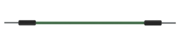
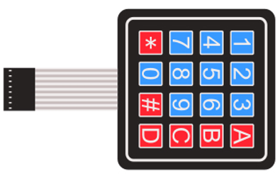

Component Knowledge
==========================

4x4 Matrix Keypad
----------------------------

A Keypad Matrix is a device that integrates a number of keys in one package. As is shown below, a 4x4 Keypad Matrix integrates 16 keys:

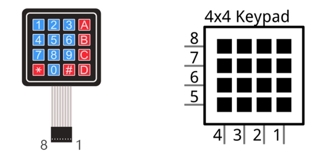

Similar to the integration of an LED Matrix, the 4x4 Keypad Matrix has each row of keys connected with one pin and this is the same for the columns. Such efficient connections reduce the number of processor ports required. The internal circuit of the Keypad Matrix is shown below.

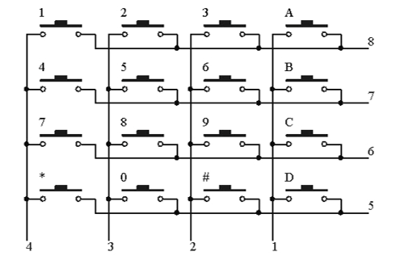

The method of usage is similar to the Matrix LED, by using a row or column scanning method to detect the state of each key's position by column and row. Take column scanning method as an example, send low level to the first 1 column (Pin1), detect level state of row 5, 6, 7, 8 to determine whether the key A, B, C, D are pressed. Then send low level to column 2, 3, 4 in turn to detect whether other keys are pressed. By this means, you can get the state of all of the keys.

Circuit
==============================

.. list-table::
   :width: 100%
   :align: center
   
   * -  Schematic diagram
   * -  |Chapter23_04|
   * -  Hardware connection. 
       
        :red:`If you need any support, please contact us via:` support@freenove.com
   * -  |Chapter23_05| 

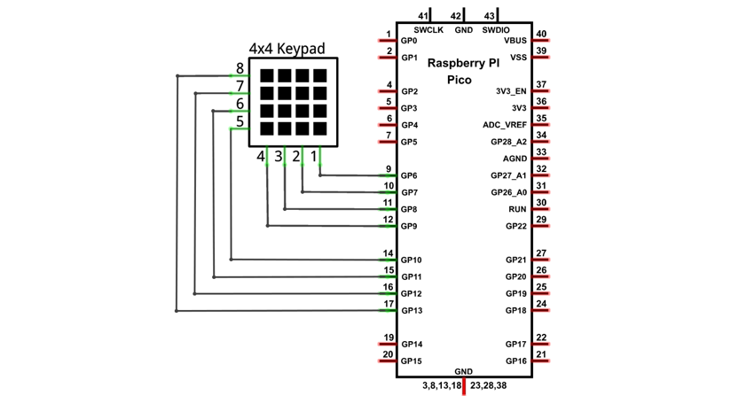
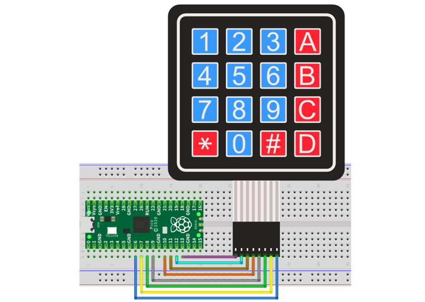

Sketch
===========================

This code is used to obtain all key codes of the 4x4 matrix keypad, when one of the keys is pressed, the key code will be printed out via serial port.

Sketch_Get_Input_Characters
-------------------------------------

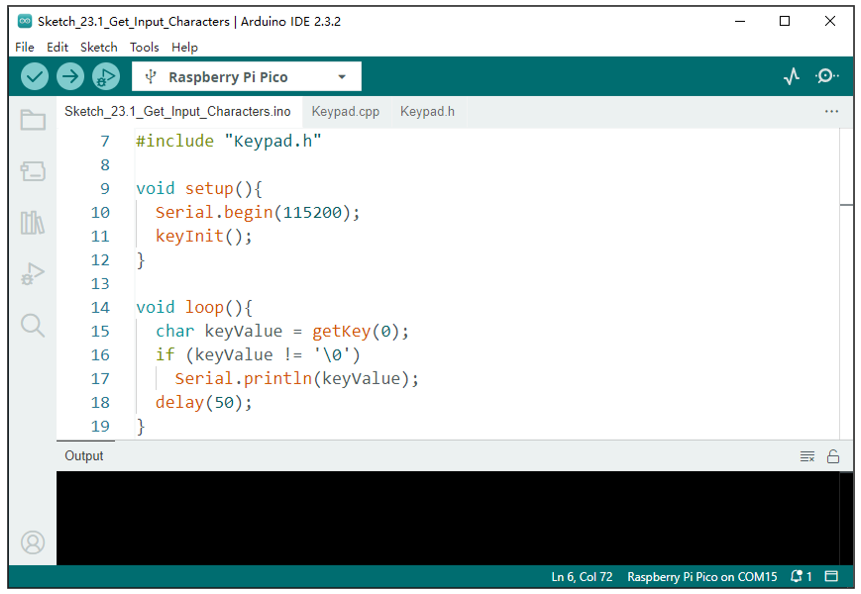

Download the code to Pico, open the serial port monitor, set the baud rate to 115200, press the keyboard, the value of the pressed keys will be printed out via the serial port, as shown in the following picture:

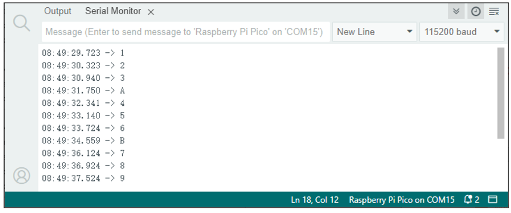

Keypad.cpp
-------------------------

.. literalinclude:: ../../../freenove_Kit/C/Sketches/Sketch_23.1_Get_Input_Characters/Keypad.cpp
    :linenos: 
    :language: c
    :lines: 1-39
    :dedent:

Include the header file, define the pins to control the keypad's rows and columns and define an array to store the key values of the keypad being pressed.

You can modify the following code to change key values and the pins controlling the keypad.

.. literalinclude:: ../../../freenove_Kit/C/Sketches/Sketch_23.1_Get_Input_Characters/Keypad.cpp
    :linenos: 
    :language: c
    :lines: 1-11
    :dedent:

The following is the program code:

.. literalinclude:: ../../../freenove_Kit/C/Sketches/Sketch_23.1_Get_Input_Characters/Sketch_23.1_Get_Input_Characters.ino
    :linenos: 
    :language: c
    :lines: 1-19
    :dedent:

keyInit() function is called to initialize the pins controlling the keypad. 

.. literalinclude:: ../../../freenove_Kit/C/Sketches/Sketch_23.1_Get_Input_Characters/Sketch_23.1_Get_Input_Characters.ino
    :linenos: 
    :language: c
    :lines: 11-11
    :dedent:

getKey() is called to scan the matrix keyboard and return "\0" if no key is detected being pressed; and it returns the key value character of the pressed key when a key is detected to be pressed

When the parameter of the getKey() function is 1, the matrix keyboard scans in an inching mode. In this mode, when the key is pressed and not released, the program will stop execution until the key is released. When the parameter is 0, the matrix keyboard scans in a continuous mode. In this mode, the program will not stop execution because the key is not released.

.. literalinclude:: ../../../freenove_Kit/C/Sketches/Sketch_23.1_Get_Input_Characters/Sketch_23.1_Get_Input_Characters.ino
    :linenos: 
    :language: c
    :lines: 15-15
    :dedent:

Project Keypad Door
**********************************

In this project, we use keypad as a keyboard to control the action of the servo motor.

Component List
=============================

+-----------------------------------------+------------------------------------------+
| Raspberry Pi Pico x1                    | USB Cable x1                             |
|                                         |                                          |
| |Chapter01_08|                          | |Chapter01_09|                           |
+-----------------------------------------+------------------------------------------+
| Breadboard x1                                                                      |
|                                                                                    |
| |Chapter01_10|                                                                     |
+-------------------------+-------------------------------+--------------------------+
| Jumper                  | Servo x1                      |  4x4 Matrix              |
|                         |                               |                          |
|                         |                               |  Keypad x1               |
|                         |                               |                          |
| |Chapter23_08|          |  |Chapter23_09|               |  |Chapter23_10|          |
+-------------------------+-------------------------------+--------------------------+
| NPN transistorx1        | Active buzzer x1              |  Resistor 1kΩ x1         |
|                         |                               |                          |
| (S8050)                 |                               |                          |
|                         |                               |                          |
| |Chapter23_11|          |  |Chapter23_12|               |  |Chapter23_13|          |
+-------------------------+-------------------------------+--------------------------+

.. |Chapter23_08| image:: ../_static/imgs/23_Matrix_Keypad/Chapter23_08.png
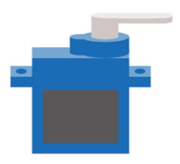
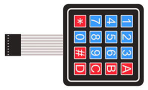

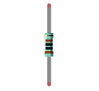

Circuit
===========================

.. list-table::
   :width: 100%
   :align: center
   
   * -  Schematic diagram
   * -  |Chapter23_14|
   * -  Hardware connection. 
       
        :red:`If you need any support, please contact us via:` support@freenove.com
   * -  |Chapter23_15| 

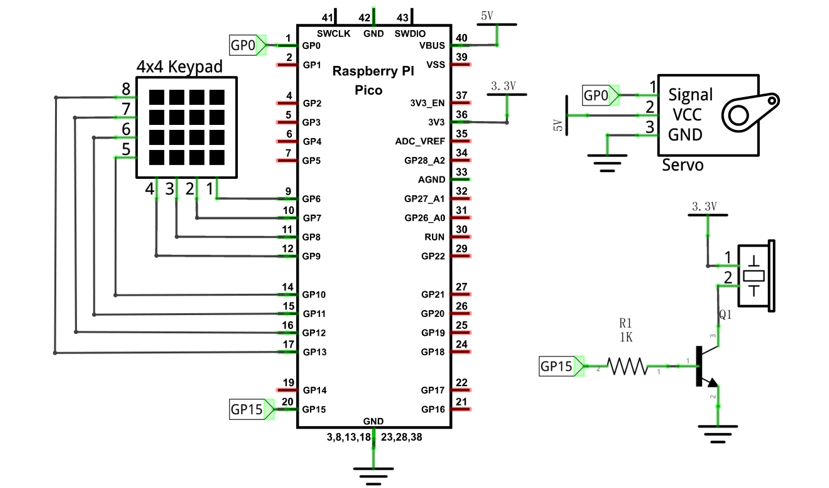
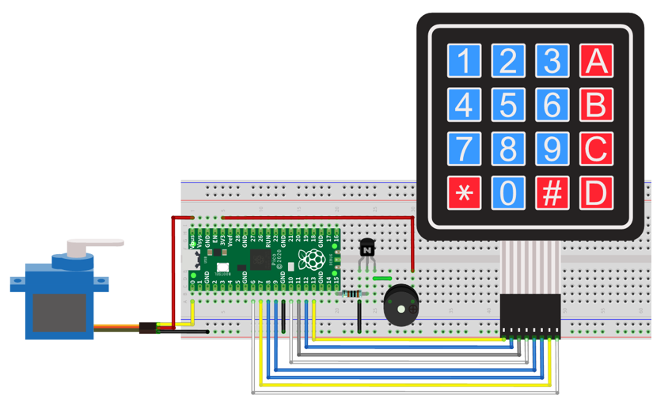

Sketch
==========================

Sketch_23.2_Keypad_Door
-----------------------------

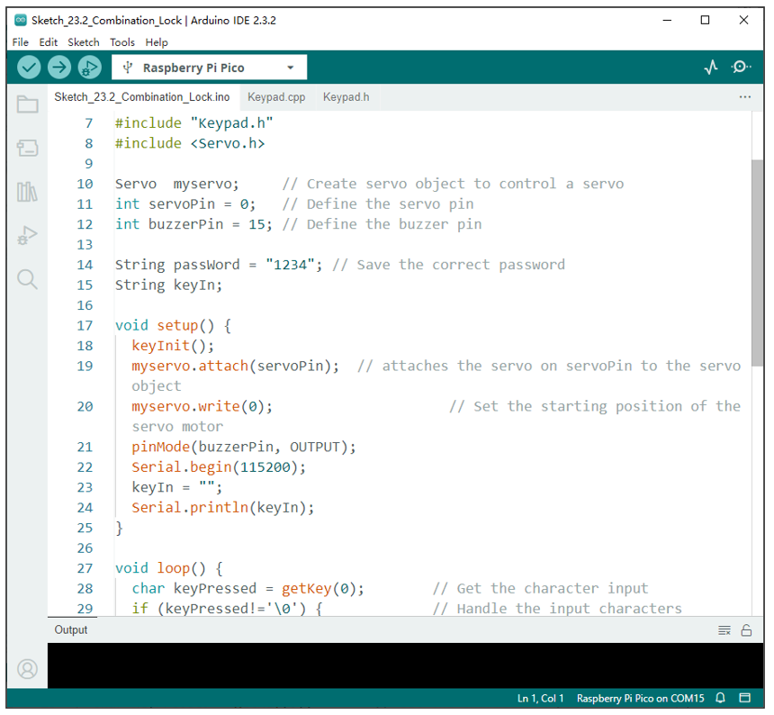

Verify and upload the code to the Pico and press the keypad to input password with four characters. If the input is correct, the servo will move to a certain degree, then return to the original position. If the input is wrong, an input error alarm will be generated.

The following is the program code:

.. literalinclude:: ../../../freenove_Kit/C/Sketches/Sketch_23.2_Combination_Lock/Sketch_23.2_Combination_Lock.ino
    :linenos: 
    :language: c
    :lines: 1-57
    :dedent:

First, we need to set the value of the password.

.. literalinclude:: ../../../freenove_Kit/C/Sketches/Sketch_23.2_Combination_Lock/Sketch_23.2_Combination_Lock.ino
    :linenos: 
    :language: c
    :lines: 14-14
    :dedent:

Second, each time the key is pressed, the buzzer makes a short sound and stores the key value entered.

.. literalinclude:: ../../../freenove_Kit/C/Sketches/Sketch_23.2_Combination_Lock/Sketch_23.2_Combination_Lock.ino
    :linenos: 
    :language: c
    :lines: 28-33
    :dedent:

Third, if the button has been pressed for four times, Pico begins to judge if the password is correct.

.. literalinclude:: ../../../freenove_Kit/C/Sketches/Sketch_23.2_Combination_Lock/Sketch_23.2_Combination_Lock.ino
    :linenos: 
    :language: c
    :lines: 35-39
    :dedent:

If the password is correct, control the servomotor to open the lock and wait for 2 seconds before closing the lock. If it is not correct, the buzzer makes a long sound and prints the error message through the serial port.

.. literalinclude:: ../../../freenove_Kit/C/Sketches/Sketch_23.2_Combination_Lock/Sketch_23.2_Combination_Lock.ino
    :linenos: 
    :language: c
    :lines: 40-52
    :dedent:

Finally, remember to empty the keyInNum every time.

.. literalinclude:: ../../../freenove_Kit/C/Sketches/Sketch_23.2_Combination_Lock/Sketch_23.2_Combination_Lock.ino
    :linenos: 
    :language: c
    :lines: 53-53
    :dedent: