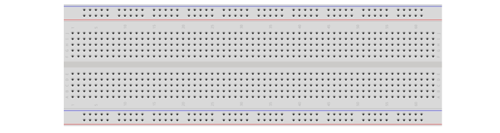
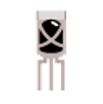
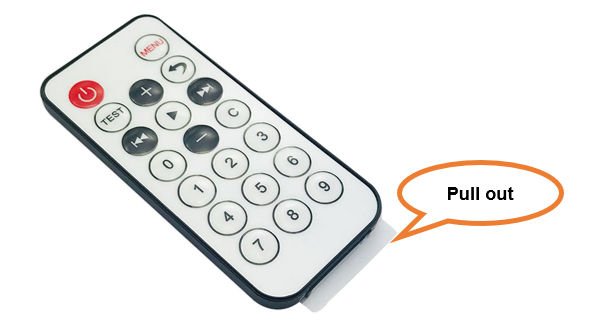
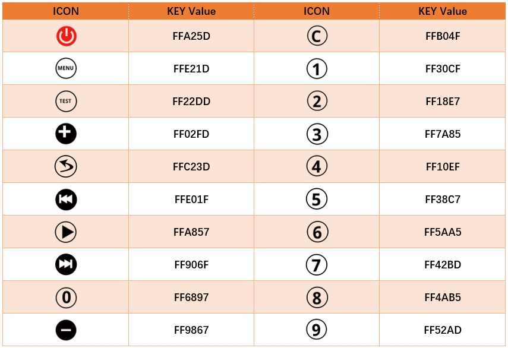
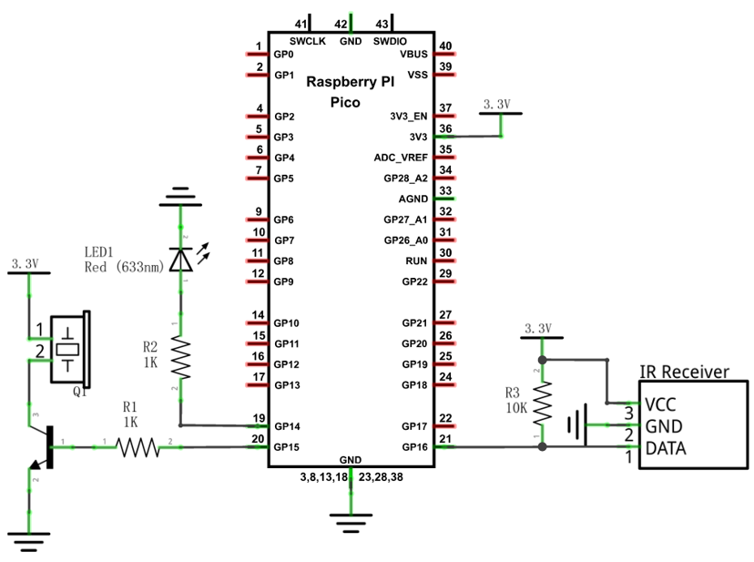
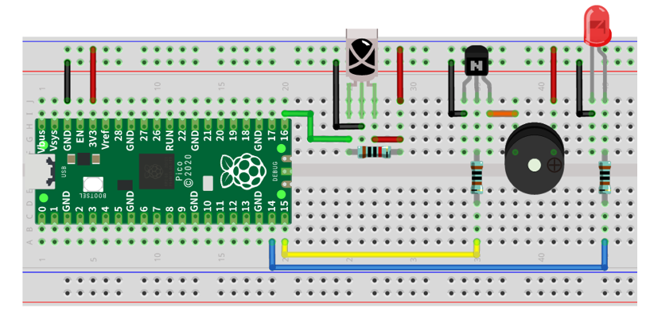

##############################################################################
Chapter Infrared Remote
##############################################################################

In this chapter, we will learn how to use an infrared remote control, and control an LED.

Project Infrared Remote Control
*****************************************

First, we need to understand how infrared remote control works, then get the command sent from infrared remote control.

Component List
===============================

+-----------------------------------------+------------------------------------------+
| Raspberry Pi Pico x1                    | USB Cable x1                             |
|                                         |                                          |
| |Chapter01_08|                          | |Chapter01_09|                           |
+-----------------------------------------+------------------------------------------+
| Breadboard x1                                                                      |
|                                                                                    |
| |Chapter01_10|                                                                     |
+-----------------------------------------+------------------------------------------+
| Infrared Remote x1                      | Jumper                                   |
|                                         |                                          |
|  |Chapter24_00|                         | |Chapter23_00|                           |
+-----------------------------------------+------------------------------------------+
| Resistor 10kΩ x1                        | Infrared Remote x1                       |
|                                         |                                          |
|                                         | (May need CR2025 battery x1,             |
|                                         |                                          |
|                                         | please check the holder)                 |
|                                         |                                          |
|  |Chapter24_01|                         | |Chapter24_02|                           |
+-----------------------------------------+------------------------------------------+

.. |Chapter01_08| image:: ../_static/imgs/1_LED/Chapter01_08.png
.. |Chapter01_09| image:: ../_static/imgs/1_LED/Chapter01_09.png

.. |Chapter23_00| image:: ../_static/imgs/23_Matrix_Keypad/Chapter23_00.png

.. |Chapter24_01| image:: ../_static/imgs/24_Infrared_Remote/Chapter24_01.png
.. |Chapter24_02| image:: ../_static/imgs/24_Infrared_Remote/Chapter24_02.png

Component Knowledge
============================

Infrared Remote
---------------------------

An infrared (IR) remote control is a device with a certain number of buttons. Pressing down different buttons will make the infrared emission tube, which is located in the front of the remote control, send infrared ray with different command. Infrared remote control technology is widely used in electronic products such as TV, air conditioning, etc. Thus making it possible for you to switch TV programs and adjust the temperature of the air conditioning when away from them. The remote control we use is shown below:

Infrared receiver
----------------------------

An infrared(IR) receiver is a component which can receive the infrared light, so we can use it to detect the signal emitted by the infrared remote control. DATA pin here outputs the received infrared signal.

.. image:: ../_static/imgs/24_Infrared_Remote/Chapter24_04.png
    :align: center

When you use the infrared remote control, it sends a key value to the receiving circuit according to the pressed key. We can program the Raspberry Pi Pico to do things like lighting, when a key value is received. 

The following is the key value that the receiving circuit will receive when each key of the infrared remote control is pressed.

Circuit
===========================

.. list-table::
   :width: 100%
   :align: center
   
   * -  Schematic diagram
   * -  |Chapter24_06|
   * -  Hardware connection. 
       
        :red:`If you need any support, please contact us via:` support@freenove.com
   * -  |Chapter24_07| 

.. |Chapter24_06| image:: ../_static/imgs/24_Infrared_Remote/Chapter24_06.png
.. |Chapter24_07| image:: ../_static/imgs/24_Infrared_Remote/Chapter24_07.png

Sketch
=========================

This sketch uses the infrared receiving tube to receive the value sent form the infrared remote control, and print it out via the serial port.

Sketch_Infrared_Remote_Control
------------------------------------------

Download the code to Pico, open the serial port monitor, set the baud rate to 115200, and press the IR remote control, the pressed keys value will be printed out through the serial port.

IR.cpp
----------------------------

.. literalinclude:: ../../../freenove_Kit/C/Sketches/Sketch_24.1_Infrared_Remote_Control/IR.cpp
    :linenos: 
    :language: c
    :lines: 1-79
    :dedent:

When the IR_Init() function is called, Pico initializes the infrared received pin and sets the external interrupt, associating it with the IR_Read() function. Every time the infrared receives data, external interrupt calls IR_Read() function to receive data, and resets the bit flag.

.. code-block:: C

    extern int flagCode;
    void IR_Init(int pin);
    void IR_Read();

You can check whether flagCode has been reset, If it is reset, call IR_Decode() to decode the infrared data.

.. note::
    
    once IR_Decode() is called, infrared receiver will not receive data until IR_Release() is called.

.. code-block:: C

    unsigned long IR_Decode(int &code);
    void IR_Release();

The following is the program code:

.. literalinclude:: ../../../freenove_Kit/C/Sketches/Sketch_24.1_Infrared_Remote_Control/IR.cpp
    :linenos: 
    :language: c
    :lines: 1-21
    :dedent:

IR_Init() is called to initialize infrared receiving pin GP16, enable external interrupt and associate it with GP16.

.. literalinclude:: ../../../freenove_Kit/C/Sketches/Sketch_24.1_Infrared_Remote_Control/Sketch_24.1_Infrared_Remote_Control.ino
    :linenos: 
    :language: c
    :lines: 12-12
    :dedent:

In loop(), determines whether infrared bit flag is reset. If it is, IR_Decode() is called to decode the data and print them out via serial monitor.

After using the infrared decoding function IR_Decode(), you need to call IR_Release() to release the infrared data receiving function. Otherwise, it will not receiver new infrared data again.

.. literalinclude:: ../../../freenove_Kit/C/Sketches/Sketch_24.1_Infrared_Remote_Control/Sketch_24.1_Infrared_Remote_Control.ino
    :linenos: 
    :language: c
    :lines: 16-20
    :dedent:

Project Control LED through Infrared Remote
********************************************************

In this project, we will control the brightness of LED lights through an infrared remote control.

Component List
==========================

+-----------------------------------------+------------------------------------------+
| Raspberry Pi Pico x1                    | USB Cable x1                             |
|                                         |                                          |
| |Chapter01_08|                          | |Chapter01_09|                           |
+-----------------------------------------+------------------------------------------+
| Breadboard x1                                                                      |
|                                                                                    |
| |Chapter01_10|                                                                     |
+-------------------------+-------------------------------+--------------------------+
| LED x1                  | Active buzzer x1              |  Resistor 1kΩ x2         |
|                         |                               |                          |
| |Chapter24_10|          |  |Chapter23_12|               |  |Chapter24_11|          |
+-------------------------+-------------------------------+--------------------------+
| Infrared receiver x1    | NPN transistorx1              |  Resistor 10kΩ x1        |
|                         |                               |                          |
|                         | (S8050)                       |                          |
|                         |                               |                          |
| |Chapter24_00|          |  |Chapter23_11|               |  |Chapter24_12|          |
+-------------------------+-------------------------------+--------------------------+

.. |Chapter24_10| image:: ../_static/imgs/24_Infrared_Remote/Chapter24_10.png
.. |Chapter24_11| image:: ../_static/imgs/24_Infrared_Remote/Chapter24_11.png
.. |Chapter24_12| image:: ../_static/imgs/24_Infrared_Remote/Chapter24_12.png
.. |Chapter23_11| image:: ../_static/imgs/23_Matrix_Keypad/Chapter23_11.png
.. |Chapter23_12| image:: ../_static/imgs/23_Matrix_Keypad/Chapter23_12.png

Circuit
==========================

.. list-table::
   :width: 100%
   :align: center
   
   * -  Schematic diagram
   * -  |Chapter24_13|
   * -  Hardware connection. 
       
        :red:`If you need any support, please contact us via:` support@freenove.com
   * -  |Chapter24_14| 

Sketch
==========================

The sketch controls the brightness of the LED by determining the key value of the infrared received.

Sketch_24.2_Control_LED_through_Infrared_Remote
-----------------------------------------------------

Compile and upload the code to the Pico. When pressing "0", "1", "2", "3" of the infrared remote control, the buzzer will sound once, and the brightness of the LED light will change correspondingly.

Rendering:

The following is the program code:

.. literalinclude:: ../../../freenove_Kit/C/Sketches/Sketch_24.2_Control_LED_through_Infrared_Remote/IR.cpp
    :linenos: 
    :language: c
    :lines: 1-79
    :dedent:

The handleControl() function is used to execute events corresponding to infrared code values. Every time when the function is called, the buzzer sounds once and determine the brightness of the LED based on the infrared key value. If the key value is not "0", "1", "2", "3", the buzzer sounds once, but the brightness of LED will not change.

.. literalinclude:: ../../../freenove_Kit/C/Sketches/Sketch_24.2_Control_LED_through_Infrared_Remote/IR.cpp
    :linenos: 
    :language: c
    :lines: 29-48
    :dedent:

In the loop() function, each time the infrared data is received, it is decoded and printed out through the serial monitor, and the handleControl() function is called to control the LED and buzzer to execute the corresponding code.

.. literalinclude:: ../../../freenove_Kit/C/Sketches/Sketch_24.2_Control_LED_through_Infrared_Remote/IR.cpp
    :linenos: 
    :language: c
    :lines: 20-27
    :dedent: