##############################################################################
Chapter Hygrothermograph DHT11
##############################################################################

In this chapter, we will learn about a commonly used sensor called a Hygrothermograph DHT11.

Project Hygrothermograph
************************************

Hygrothermograph is an important tool in our lives to give us data on the temperature and humidity in our environment. In this project, we will use the Raspberry Pi Pico to read Temperature and Humidity data of the DHT11 Module.

Component List
==================

+-----------------------------------------+------------------------------------------+
| Raspberry Pi Pico x1                    | USB Cable x1                             |
|                                         |                                          |
| |Chapter01_08|                          | |Chapter01_09|                           |
+-----------------------------------------+------------------------------------------+
| Breadboard x1                                                                      |
|                                                                                    |
| |Chapter01_10|                                                                     |
+-------------------------+-------------------------------+--------------------------+
| DHT11 x1                | Jumper                        |  Resistor 10kΩ x1        |
|                         |                               |                          |
| |Chapter25_00|          |  |Chapter23_08|               |  |Chapter02_01|          |
+-------------------------+-------------------------------+--------------------------+

.. |Chapter01_08| image:: ../_static/imgs/1_LED/Chapter01_08.png
.. |Chapter01_09| image:: ../_static/imgs/1_LED/Chapter01_09.png
.. |Chapter01_10| image:: ../_static/imgs/1_LED/Chapter01_10.png
.. |Chapter25_00| image:: ../_static/imgs/25_Hygrothermograph_DHT11/Chapter25_00.png
.. |Chapter02_01| image:: ../_static/imgs/2_Button_&_LED/Chapter02_01.png

Component Knowledge
=====================

The Temperature & Humidity Sensor DHT11 is a compound temperature & humidity sensor, and the output digital signal has been calibrated by its manufacturer.

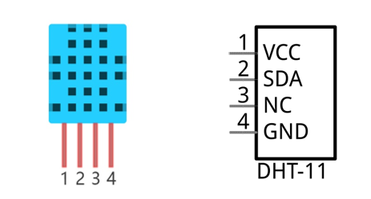

DHT11 uses customized single-line communication protocol, so we can use the library to read data more conveniently.

After being powered up, it will initialize in 1S's time. Its operating voltage is within the range of 3.3V-5.5V.

The SDA pin is a data pin, which is used to communicate with other devices. 

The NC pin (Not Connected Pin) is a type of pin found on various integrated circuit packages. Those pins have no functional purpose to the outside circuit (but may have an unknown functionality during manufacture and test). Those pins should not be connected to any of the circuit connections.

Circuit
=========================

.. list-table::
   :width: 100%
   :align: center
   
   * -  Schematic diagram
   * -  |Chapter25_02|
   * -  Hardware connection. 
       
        :red:`If you need any support, please contact us via:` support@freenove.com
   * -  |Chapter25_03| 

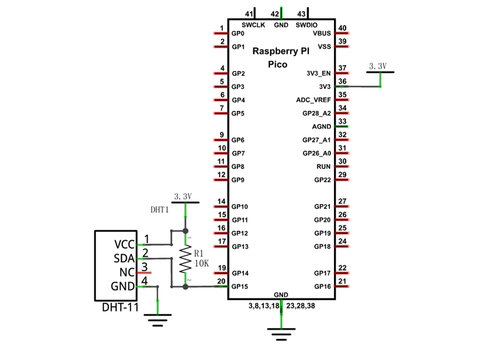
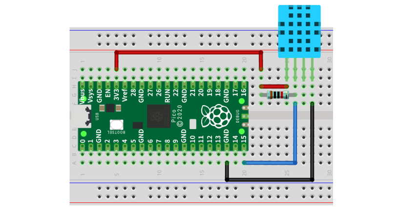

Sketch
==========================

How to install the library
----------------------------------

We use a third-party library DHT for this project. If you have not installed it yet, please do so first.

Steps are as follows: 

Open **Arduino>Sketch>Include Library>Add .ZIP Library...**

Select the provided " **Freenove_Ultimate_Starter_Kit_for_Raspberry_Pi_Pico\C\Libraries\DHT.zip** ".

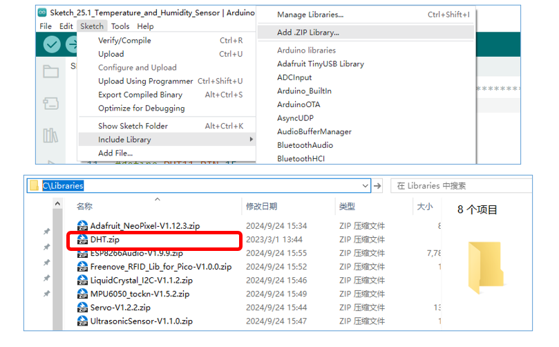

Sketch_Temperature_and_Humidity_Sensor
--------------------------------------------------

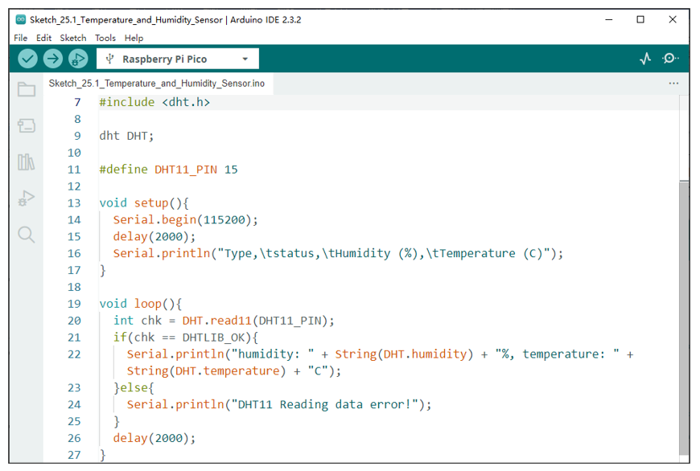

Compile and upload the code to the Pico, open the serial monitor, and set the baud rate to 115200. Print out data of temperature and humidity sensor via the serial port.

The following is the program code:

.. literalinclude:: ../../../freenove_Kit/C/Sketches/Sketch_25.1_Temperature_and_Humidity_Sensor/Sketch_25.1_Temperature_and_Humidity_Sensor.ino    
    :linenos: 
    :language: c
    :lines: 1-79
    :dedent:

Before using dht11, we need to include a header file. Apply for a DHT object and define the pin controlling DHT as GP15.

.. literalinclude:: ../../../freenove_Kit/C/Sketches/Sketch_25.1_Temperature_and_Humidity_Sensor/Sketch_25.1_Temperature_and_Humidity_Sensor.ino    
    :linenos: 
    :language: c
    :lines: 7-11
    :dedent:

Read11() is used to read DHT11 data and assign the return value to variable chk.

.. literalinclude:: ../../../freenove_Kit/C/Sketches/Sketch_25.1_Temperature_and_Humidity_Sensor/Sketch_25.1_Temperature_and_Humidity_Sensor.ino    
    :linenos: 
    :language: c
    :lines: 20-20
    :dedent:

If the return value of the read11() function is not equal to DHTLIB_OK, it means that the data reading failed; If they equals, humidity() and temperature() are called to obtain the temperature and humidity data of the current environment, and print it out through the serial port.

.. literalinclude:: ../../../freenove_Kit/C/Sketches/Sketch_25.1_Temperature_and_Humidity_Sensor/Sketch_25.1_Temperature_and_Humidity_Sensor.ino    
    :linenos: 
    :language: c
    :lines: 21-25
    :dedent:

Project Hygrothermograph
***********************************

In this project, we use I2C-LCD1602 to display data collected by DHT11.

Component List
=============================

+-----------------------------------------+------------------------------------------+
| Raspberry Pi Pico x1                    | USB Cable x1                             |
|                                         |                                          |
| |Chapter01_08|                          | |Chapter01_09|                           |
+-----------------------------------------+------------------------------------------+
| Breadboard x1                                                                      |
|                                                                                    |
| |Chapter01_10|                                                                     |
+-----------------------------------------+------------------------------------------+
| LCD1602 Module x1                       | Resistor 10kΩ x1                         |
|                                         |                                          |
|  |Chapter25_07|                         | |Chapter02_01|                           |
+-----------------------------------------+------------------------------------------+
| Jumper                                  | DHT11 x1                                 |
|                                         |                                          |
|  |Chapter25_08|                         | |Chapter25_00|                           |
+-----------------------------------------+------------------------------------------+

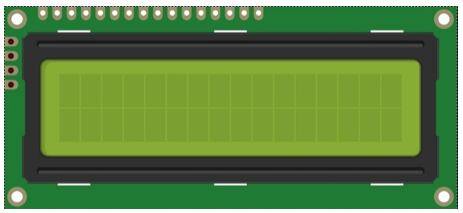
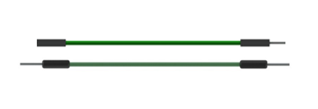

Circuit
=========================

.. list-table::
   :width: 100%
   :align: center
   
   * -  Schematic diagram
   * -  |Chapter25_09|
   * -  Hardware connection. 
       
        :red:`If you need any support, please contact us via:` support@freenove.com
   * -  |Chapter25_10| 

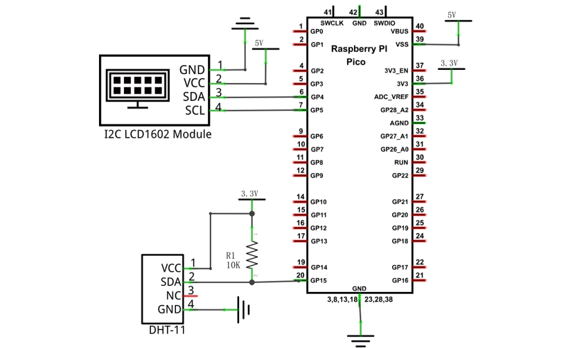
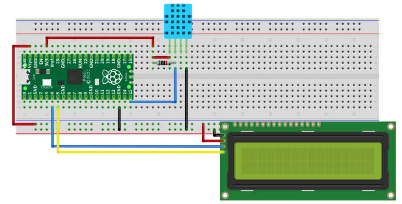

Obtain data of Hygrothermograph every second and display them on LCD1602. The first line displays 

Sketch
===========================

This code uses the DHT and LiquidCrystal_I2C libraries, so make sure the relevant library files are added before writing the program.

Sketch_25.2_Temperature_and_Humidity_Sensor
--------------------------------------------------

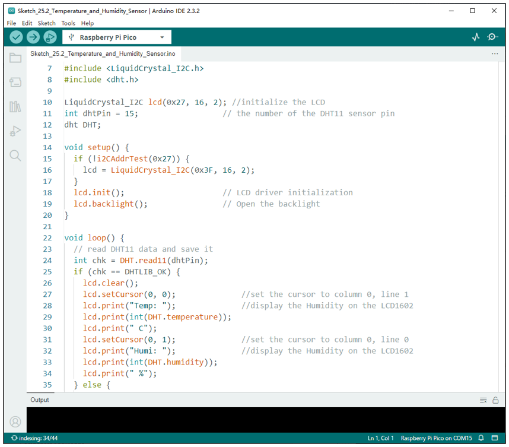

Download the code to Pico. The first line of LCD1602 shows the temperature value, and the second line shows the humidity value. Try to "pinch" the DHT11(without touching the leads) with your index finger and thumb for a brief time to observe the change in the LCD display value.

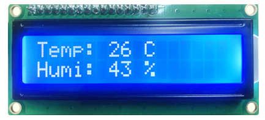

The following is the program code:

.. literalinclude:: ../../../freenove_Kit/C/Sketches/Sketch_25.2_Temperature_and_Humidity_Sensor/Sketch_25.2_Temperature_and_Humidity_Sensor.ino    
    :linenos: 
    :language: c
    :lines: 1-50
    :dedent:

First, include the library function header file.

.. literalinclude:: ../../../freenove_Kit/C/Sketches/Sketch_25.2_Temperature_and_Humidity_Sensor/Sketch_25.2_Temperature_and_Humidity_Sensor.ino    
    :linenos: 
    :language: c
    :lines: 7-8
    :dedent:

Initialize IIC-LCD1602 and turn ON the backlight.

.. literalinclude:: ../../../freenove_Kit/C/Sketches/Sketch_25.2_Temperature_and_Humidity_Sensor/Sketch_25.2_Temperature_and_Humidity_Sensor.ino    
    :linenos: 
    :language: c
    :lines: 15-19
    :dedent:

Obtain the temperature and humidity data of the DHT11. If the data is obtained successfully, print it to the LCD1602 screen.

.. literalinclude:: ../../../freenove_Kit/C/Sketches/Sketch_25.2_Temperature_and_Humidity_Sensor/Sketch_25.2_Temperature_and_Humidity_Sensor.ino    
    :linenos: 
    :language: c
    :lines: 25-35
    :dedent: