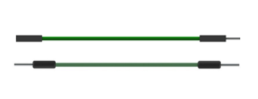

##############################################################################
Chapter RFID
##############################################################################

Now, we will learn to use the RFID (Radio Frequency Identification) wireless communication technology.

Project RFID read UID
*************************************

In this project, we will read the unique ID number (UID) of the RFID card, recognize the type of the RFID card and display the information through serial port.

Component List
====================================

+-----------------------------------------+------------------------------------------+
| Raspberry Pi Pico x1                    | USB Cable x1                             |
|                                         |                                          |
| |Chapter01_08|                          | |Chapter01_09|                           |
+-----------------------------------------+------------------------------------------+
| Breadboard x1                                                                      |
|                                                                                    |
| |Chapter01_10|                                                                     |
+-----------------------------------------+------------------------------------------+
| Jumper                                  | RFID Module(RC522) x1                    |
|                                         |                                          |
|  |Chapter28_00|                         | |Chapter28_01|                           |
+-----------------------------------------+------------------------------------------+
| Mifare1 S50 Standard card x1            | Mifare1 S50 Standard card x1             |
|                                         |                                          |
|  |Chapter28_02|                         | |Chapter28_03|                           |
+-----------------------------------------+------------------------------------------+

.. |Chapter01_08| image:: ../_static/imgs/1_LED/Chapter01_08.png
.. |Chapter01_09| image:: ../_static/imgs/1_LED/Chapter01_09.png
.. |Chapter01_10| image:: ../_static/imgs/1_LED/Chapter01_10.png
.. |Chapter26_03| image:: ../_static/imgs/26_Infrared_Motion_Sensor/Chapter26_03.png

.. |Chapter28_01| image:: ../_static/imgs/28_RFID/Chapter28_01.png
.. |Chapter28_02| image:: ../_static/imgs/28_RFID/Chapter28_02.png

Component Knowledge
=========================

RFID
----------------------------

RFID (Radio Frequency Identification) is a wireless communication technology. A complete RFID system is generally composed of the responder and reader. Generally, we use tags as responders, and each tag has a unique code, which is attached to the object to identify the target object. The reader is a device for reading (or writing) tag information.

Products derived from RFID technology can be divided into three categories: passive RFID products, active RFID products and semi active RFID products. Moreover, Passive RFID products are the earliest, the most mature and most widely used products in the market among others. It can be seen everywhere in our daily life such as, the bus card, dining card, bankcard, hotel access cards, etc., and all of these belong to close-range contact recognition. The main operating frequency of Passive RFID products are: 125KHZ (low frequency), 13.56MHZ (high frequency), 433MHZ (ultrahigh frequency), 915MHZ (ultrahigh frequency). Active and semi active RFID products work at higher frequencies.

The RFID module we use is a passive RFID product with the operating frequency of 13.56MHz.

MFRC522 RFID Module
----------------------------

The MFRC522 is a highly integrated reader/writer IC for contactless communication at 13.56MHz.

The MFRC522's internal transmitter is able to drive a reader/writer antenna designed to communicate with ISO/IEC 14443 A/MIFARE cards and transponders without additional active circuitry. The receiver module provides a robust and efficient implementation for demodulating and decoding signals from ISO/IEC 14443 A/MIFARE compatible cards and transponders. The digital module manages the complete ISO/IEC 14443A framing and error detection (parity and CRC) functionality.

This RFID Module uses MFRC522 as the control chip and SPI (Peripheral Interface Serial) as the reserved interface.

.. image:: ../_static/imgs/28_RFID/Chapter28_04.png
    :align: center

Mifare1 S50 Card
---------------------------

Mifare1 S50 is often called Mifare Standard with the capacity of 1K bytes. Each card has a 4-bytes global unique identifier number (USN/UID), which can be rewritten 100 thousand times and read infinite times. Its storage period can last for 10 years. The ordinary Mifare1 S50 Card and non-standard Mifare1 S50 Card equipped for this kit are shown below.

.. image:: ../_static/imgs/28_RFID/Chapter28_05.png
    :align: center

The Mifare1 S50 capacity (1K byte) is divided into 16 sectors (Sector0-Sector15). Each sector contains four data block (Block0-Block3. 64 blocks of 16 sectors will be numbered according to absolute address, from 0 to 63). Each block contains 16 bytes (Byte0-Byte15), 64*16=1024. As is shown in the following table:

+------------+-----------+--------------------------------------+---------------+--------------------+
| Sector No. | Block No. |             Storage area             |  Block type   | Absolute block No. |
+============+===========+======================================+===============+====================+
|            | block 0   | vendor code                          | vendor block  | 0                  |
|            +-----------+--------------------------------------+---------------+--------------------+
| sector 0   | block 1   |                                      | data block    | 1                  |
|            +-----------+--------------------------------------+---------------+--------------------+
|            | block 2   |                                      | data block    | 2                  |
|            +-----------+--------------------------------------+---------------+--------------------+
|            | block 3   | Password A-access control-password B | control block | 3                  |
+------------+-----------+--------------------------------------+---------------+--------------------+
|            | block 0   |                                      | data block    | 4                  |
|            +-----------+--------------------------------------+---------------+--------------------+
| sector 1   | block 1   |                                      | data block    | 5                  |
|            +-----------+--------------------------------------+---------------+--------------------+
|            | block 2   |                                      | data block    | 6                  |
|            +-----------+--------------------------------------+---------------+--------------------+
|            | block 3   | Password A-access control-password B | control block | 7                  |
+------------+-----------+--------------------------------------+---------------+--------------------+
| ...        | ...       | ...                                  | ...           |                    |
+------------+-----------+--------------------------------------+---------------+--------------------+
|            | block 0   |                                      | data block    | 60                 |
|            +-----------+--------------------------------------+---------------+--------------------+
| sector 15  | block 1   |                                      | data block    | 61                 |
|            +-----------+--------------------------------------+---------------+--------------------+
|            | block 2   |                                      | data block    | 62                 |
|            +-----------+--------------------------------------+---------------+--------------------+
|            | block 3   | Password A-access control-password B | control block | 63                 |
+------------+-----------+--------------------------------------+---------------+--------------------+

Each sector has a set of independent password and access control that are put in the last block of each sector, and the block is also known as sector trailer, that is Block 3 in each sector. Sector 0, block 0 (namely absolute address 0) of S50 is used to store the vendor code, which has been solidified and cannot be changed, and the card serial number is stored here. In addition to the manufacturer and the control block, the rest of the cards are data blocks, which can be used to store data. Data block can be used for two kinds of applications:

(1) used as general data storage and can be operated for reading and writing.

(2) used as data value, and can be operated for initializing the value, adding value, subtracting and reading the value.

The sector trailer block in each sector is the control block, including a 6-byte password A, 4-byte access control and 6-byte password B. For example, the control block of a brand new card is as follows:

.. list-table::
   :width: 100%
   :align: center
   
   * -  A0 A1 A2 A3 A4 A5
     -  FF 07 80 69
     -  FF 07 80 69
   * -  password A
     -  access control
     -  password B 

The default password of a brand new card is generally A0A1A2A3A4A5 for password A, B0B1B2B3B4B5 for password B, or both the password A and password B are 6 FF. Access control is used to set the access conditions for each block (including the control block itself) in a sector.

Blocks of S50 are divided into data blocks and control blocks. There are four operations, "read", "write", "add value", "subtract value (including transmission and storage)" for data blocks, and there are two operations, "read" and "write" for control blocks.

For more details about how to set data blocks and control blocks, please refer to Datasheet.

By default, after verifying password A or password B, we can do reading or writing operation to data blocks. In addition, after verifying password A, we can do reading or writing operation to control blocks. However, password A can never be read. If you choose to verify password A and then you forget the password A, the block will never be able to read again. **It is highly recommended that beginners should not try to change the contents of control blocks.**

Circuit
===========================

The connection of control board and RFID module is shown below.

.. list-table::
   :width: 100%
   :align: center
   
   * -  Schematic diagram
   * -  |Chapter28_06|
   * -  Hardware connection. 
       
        :red:`If you need any support, please contact us via:` support@freenove.com
   * -  |Chapter28_07| 

.. |Chapter28_06| image:: ../_static/imgs/28_RFID/Chapter28_06.png
.. |Chapter28_07| image:: ../_static/imgs/28_RFID/Chapter28_07.png

Sketch
===============================

Sketch_RFID_Read_UID
------------------------------

In this project, we use a third-party library named Freenove RFID Lib for Pico. Here are two ways to install the library for your reference.

The first one: Open Arduino IDE, click Library Manage on the left, search "Freenove RFID Lib for Pico" to install.

The second way, open Arduino IDE, click Sketch -> Include Library -> Add .ZIP Library. In the pop-up window, find the file named "./Libraries/ Freenove_RFID_Lib_for_Pico-V1.0.0.Zip" which locates in this directory, and click OPEN.

This sketch will read the unique ID number (UID) of the card, recognize the type of the card and display the information through serial port.

.. literalinclude:: ../../../freenove_Kit/C/Sketches/Sketch_28.1_RFID_Read_UID/Sketch_28.1_RFID_Read_UID.ino    
    :linenos: 
    :language: c
    :lines: 1-75
    :dedent:

After verifying and uploading the code, open the serial monitor and make a card approach the sensing area of RFID module. Then serial monitor will display the displacement ID number and the type of the card. If the induction time is too short, it may lead to incomplete-information display.

After including the RFID library, we need to construct a RFID class object before using the function in RFID library. Its constructor needs to be written to two pins, respectively to the SDA pin and the RST pin.

.. literalinclude:: ../../../freenove_Kit/C/Sketches/Sketch_28.1_RFID_Read_UID/Sketch_28.1_RFID_Read_UID.ino    
    :linenos: 
    :language: c
    :lines: 21-21
    :dedent:

In setup, initialize the serial port, SPI and RFID.

.. literalinclude:: ../../../freenove_Kit/C/Sketches/Sketch_28.1_RFID_Read_UID/Sketch_28.1_RFID_Read_UID.ino    
    :linenos: 
    :language: c
    :lines: 27-33
    :dedent:

In loop(), use findCard() waiting for the card approaching. Once it detects card contact, this function will return MI_OK and save the card type data in parameter str, and then enter the "if" statement.

.. literalinclude:: ../../../freenove_Kit/C/Sketches/Sketch_28.1_RFID_Read_UID/Sketch_28.1_RFID_Read_UID.ino    
    :linenos: 
    :language: c
    :lines: 41-41
    :dedent:

After entering if statement, call the sub function ShowCardType(). Then determine the type of the card according to the content of STR and print the type out through the serial port.

.. literalinclude:: ../../../freenove_Kit/C/Sketches/Sketch_28.1_RFID_Read_UID/Sketch_28.1_RFID_Read_UID.ino    
    :linenos: 
    :language: c
    :lines: 44-44
    :dedent:

Then use the.anticoll() to read UID of the card and use serial port to print it out.

.. literalinclude:: ../../../freenove_Kit/C/Sketches/Sketch_28.1_RFID_Read_UID/Sketch_28.1_RFID_Read_UID.ino    
    :linenos: 
    :language: c
    :lines: 46-54
    :dedent:

Project Read and write
***********************************

In this project, we will do reading and writing operations to the card.

Component list
=======================

Same with last section.

Circuit
=======================

Same with last section.

Sketch
=========================

Sketch_28.2_RFID_Read_And_Write
---------------------------------------

In this sketch, first read the data in particular location of the S50 M1 Card, then write data in that position and read it out. Display these data through the serial port.

.. literalinclude:: ../../../freenove_Kit/C/Sketches/Sketch_28.2_RFID_Read_And_Write/Sketch_28.2_RFID_Read_And_Write.ino    
    :linenos: 
    :language: c
    :lines: 1-114
    :dedent:

In the sub function of writeCard() and readCard(), we must first verify the password A, and then use the corresponding sub function to read and write. Here we do reading and writing operations to data block 0 (absolute NO.4) of the first sector.

.. literalinclude:: ../../../freenove_Kit/C/Sketches/Sketch_28.2_RFID_Read_And_Write/Sketch_28.2_RFID_Read_And_Write.ino    
    :linenos: 
    :language: c
    :lines: 98-98
    :dedent:

In loop(), compare the contents of the data block NO.4 after written to the original contents.

.. literalinclude:: ../../../freenove_Kit/C/Sketches/Sketch_28.2_RFID_Read_And_Write/Sketch_28.2_RFID_Read_And_Write.ino    
    :linenos: 
    :language: c
    :lines: 71-76
    :dedent:

After verifying and uploading the code, open the serial port monitor and make a card approach the sensing area of RFID module, then the serial port monitoring window will display displacement ID numbers of the card, the type of this card and the contents (before and after writing operation) of data block. If the induction time is too short, it may lead to incomplete information display.

