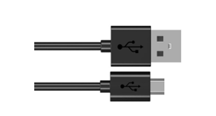
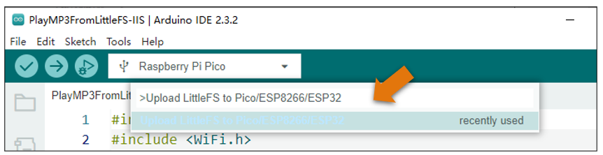
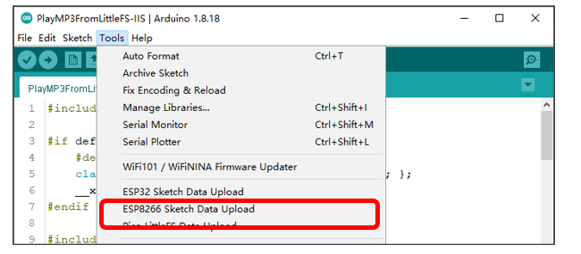
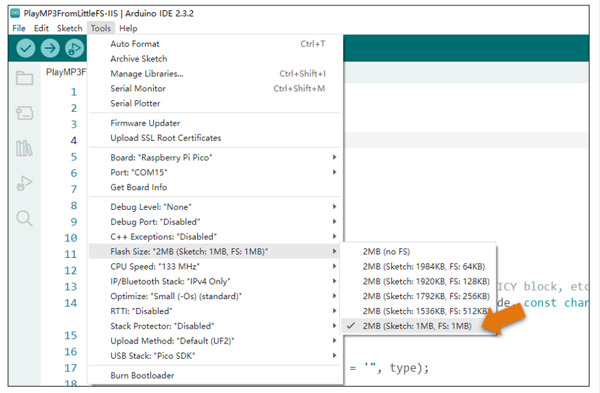

##############################################################################
Chapter Play Music
##############################################################################

In this chapter, we use Raspberry Pi Pico and an IIS audio decoding module to play music.

This chapter is not applicable to FNK0058A/B. If your kit is one of these two models, please skip this chapter.

Project Play Music by Audio Converter & Amplifier
***************************************************************

Component List
============================

+-----------------------------------------+------------------------------------------+
| Raspberry Pi Pico x1                    | Micro USB Wire x1                        |
|                                         |                                          |
| |Chapter01_08|                          | |Chapter01_09|                           |
+-----------------------------------------+------------------------------------------+
| Audio Converter & Amplifier             | Speaker*1                                |
|                                         |                                          |
|  |Chapter29_01|                         | |Chapter29_02|                           |
+-----------------------------------------+------------------------------------------+
| Jumper wire F/M*5                                                                  |
|                                                                                    |
|  |Chapter29_00|                                                                    |
+------------------------------------------------------------------------------------+

.. |Chapter01_08| image:: ../_static/imgs/1_LED/Chapter01_08.png

.. |Chapter26_03| image:: ../_static/imgs/26_Infrared_Motion_Sensor/Chapter26_03.png
.. |Chapter29_00| image:: ../_static/imgs/29_Play_Music/Chapter29_00.png
.. |Chapter29_01| image:: ../_static/imgs/29_Play_Music/Chapter29_01.png

Component knowledge
===========================

Audio Converter & Amplifier module
--------------------------------------------

.. list-table::
   :width: 100%
   :align: center
   
   * -  front view
     -  schematic diagram
   * -  |Chapter29_03|
     -  |Chapter29_04|
    
.. |Chapter29_03| image:: ../_static/imgs/29_Play_Music/Chapter29_03.png
.. |Chapter29_04| image:: ../_static/imgs/29_Play_Music/Chapter29_04.png

Interface description for Audio Converter & Amplifier module

+-----+------+-------------------------------------+
| Pin | Name |            Introductions            |
+=====+======+=====================================+
| 1   | SCK  | System clock input                  |
+-----+------+-------------------------------------+
| 2   | BCK  | Audio data bit clock input          |
+-----+------+-------------------------------------+
| 3   | DIN  | Audio data input                    |
+-----+------+-------------------------------------+
| 4   | LCK  | Audio data word clock input         |
+-----+------+-------------------------------------+
| 5   | VCC  | Power input, 3.3V~5.0V              |
+-----+------+-------------------------------------+
| 6   | GND  | Power Ground                        |
+-----+------+-------------------------------------+
| 7   | L    | External audio left channel input   |
+-----+------+-------------------------------------+
| 8   | G    | Power Ground                        |
+-----+------+-------------------------------------+
| 9   | R    | External audio right channel input  |
+-----+------+-------------------------------------+
| 10  | G    | Power Ground                        |
+-----+------+-------------------------------------+
| 11  | R+   | Positive pole of right channel horn |
+-----+------+-------------------------------------+
| 12  | R-   | Negative pole of right channel horn |
+-----+------+-------------------------------------+
| 13  | L+   | Positive pole of left channel horn  |
+-----+------+-------------------------------------+
| 14  | L-   | Negative pole of left channel horn  |
+-----+------+-------------------------------------+

Speaker interface: Connect left channel speaker and right channel speaker. Group L: L+ & L-; Group R: R+& R-. The two interfaces of the speaker can be connected to the interfaces of group L or group R. However, when one interface is connected to group L, the other cannot be connected to group R. Doing so may cause the module to malfunction.

Headphone interface: the interface to connect the headphones.

I2S input interface: connect to the device with I2S. Used to transcode audio data into DAC audio signals.

External audio input interface: connect to external audio equipment. Used to amplify externally input audio signals.

Power interface: connect to external power supply. External power supply selection range: 3.3V-5.0V.

Circuit
==============================

The connection between the control board and the audio module is shown in the figure below.

.. list-table::
   :width: 100%
   :align: center
   
   * -  Schematic diagram
   * -  |Chapter29_06|
   * -  Hardware connection. 
       
        :red:`If you need any support, please contact us via:` support@freenove.com
   * -  |Chapter29_07| 

Sketch
============================

How to install the library
----------------------------

In this project, we use a third-party library named **ESP8266Audio** . Please install it first.

Open Arduino IDE, click **Library Manage** on the left, and search " **ESP8266Audio** " to install.

The second way, open Arduino IDE, click Sketch -> Include Library -> Add .ZIP Library. In the pop-up window, find the file named "./Libraries/ESP8266Audio-V1.9.9.Zip" which locates in this directory, and click OPEN.

Install the PicoLittleFS tool
----------------------------------

The latest Arduino IDE has supported LittleFS plugins.

The steps to install PicoLittleFS is as follows:

**Copy** the file **arduino-littlefs-upload-1.2.0.vsix** under the directory " **Freenove_Ultimate_Starter_Kit_for_Raspberry_Pi_Pico\\C\\Sketches\\Sketch_29.1_Play_Music\\tools** " to the computer's directory **~/.arduinoIDE/plugins/**

If there is no a folder name plugins in your computer, please create the folder before copying the file.

After copying the file, restart Arduino IDE.

The sketch opened with the start of the Arduino IDE may be corrupted, which can lead to code uploading failure. To address this issue, you can change the board selection (switching to any board), and then select back the pico board. Alternatively, you can close the opened sketch and reopen it.

Here is how to use the PicoLittleFS tool, press [Ctrl]+[Shift]+[P] simultaneously, enter Upload LittleFS to Pico/ESP8266 on the input field. 

If your Arduino IDE is an old version one, like Arduino 1.x.x, please refer to the following steps to install the PicoLittelFS tool.

First, open the Arduino IDE, and then click File in Menus and select Preferences.

Find the Arduino IDE environment directory location.

Copy the tools folder in the code folder to your Sketchbook location.

Finally, restart the Arduino IED. After restarting, you can see that the plug-in already exists in the interface.

Upload music
------------------------------

Pico of Raspberry Pie has 2M Flash space. Generally, Arduino mode allocates it to the code area. Therefore, before starting, we need to modify the configuration of Flash Size.

Open Arduino, select Tools from the menu bar, select Flash Size, and allocate 1MB of Flash space to store codes and 1MB to store audio files.

Make sure the CPU Speed of Raspberry Pie is 133 MHz. If the frequency is too low, the audio decoding speed may be too slow and the audio playback may not be continuous.

.. image:: ../_static/imgs/29_Play_Music/Chapter29_19.png
    :align: center

If your board is Raspberry Pi Pico 2, please select the Flash Size 4MB (Sketch: 2MB, FS: 2MB). As Pico 2 has 4M Flash space, so we assign 2M to store sketch and 2M to store audio files.

.. image:: ../_static/imgs/29_Play_Music/Chapter29_20.png
    :align: center

The CPU of Raspberry Pi Pico 2 can run up to 150MHz, so it is more appropriate to set the CPU speed to 150MHz.

Check the code file and audio file. We create a folder named data under the same level directory of the code file, and place the audio file directly in this folder.

Note: 

1. The name of the data folder cannot be changed; otherwise, the plug-in cannot be used to upload audio files to Pico.

2. The number of audio files in the data folder is unlimited, but the total size cannot exceed 1MB. If the file upload fails, please check whether the data folder size exceeds the range.

Click the upload button to upload the code to Pico:

After uploading the code, click Arduino IDE Tools and click following content:

After the music upload is completed, the speaker will play the audio file you uploaded.

Sketch_29.1_Play_Music
-----------------------------------

.. literalinclude:: ../../../freenove_Kit/C/Sketches/Sketch_29.1_Play_Music/PlayMP3FromLittleFS-IIS/PlayMP3FromLittleFS-IIS.ino    
    :linenos: 
    :language: c
    :lines: 1-60
    :dedent:

Check whether the file has finished playing in the main loop function.

.. literalinclude:: ../../../freenove_Kit/C/Sketches/Sketch_29.1_Play_Music/PlayMP3FromLittleFS-IIS/PlayMP3FromLittleFS-IIS.ino    
    :linenos: 
    :language: c
    :lines: 52-60
    :dedent:

Associate the callback information output of the decoding library to the serial port. Initialize the IIS interface, and set the IIS pin interfaces to GP6, GP7, and GP8. Set the volume to 0.5.

.. literalinclude:: ../../../freenove_Kit/C/Sketches/Sketch_29.1_Play_Music/PlayMP3FromLittleFS-IIS/PlayMP3FromLittleFS-IIS.ino    
    :linenos: 
    :language: c
    :lines: 41-44
    :dedent:

Note that the name of the audio file in the data folder must be consistent with the name in the code; otherwise, music cannot be played because music cannot be retrieved.

.. literalinclude:: ../../../freenove_Kit/C/Sketches/Sketch_29.1_Play_Music/PlayMP3FromLittleFS-IIS/PlayMP3FromLittleFS-IIS.ino    
    :linenos: 
    :language: c
    :lines: 45-49
    :dedent: