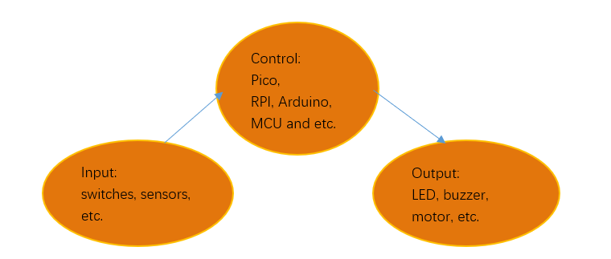
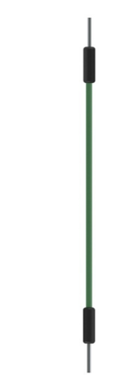
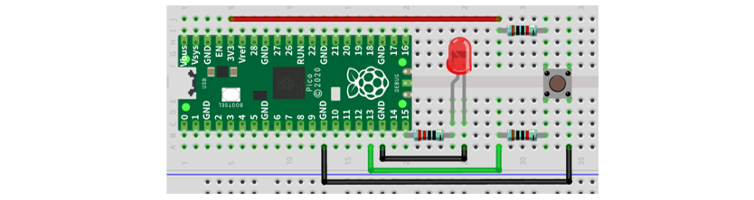

.. _button:

##############################################################################
Chapter Button & LED
##############################################################################

Usually, there are three essential parts in a complete automatic control device: INPUT, OUTPUT, and CONTROL. In last section, the LED module was the output part and Raspberry Pi Pico was the control part. In practical applications, we not only make LEDs blink, but also make a device sense the surrounding environment, receive instructions and then take the appropriate action such as lighting up LEDs, turning ON a buzzer and so on.

Next, we make a simple project: build a control system with button, LED and Raspberry Pi Pico. 

Input: Button

Control: Raspberry Pi Pico

Output: LED

Project Button & LED
*********************************

.. note::
    
    Raspberry Pi Pico, Raspberry Pi Pico W and Raspberry Pi Pico 2 only differ by wireless function, and are almost identical in other aspects. In this tutorial, except for the wireless function, other parts use Raspberry Pi Pico's map for tutorial demonstration.

In the project, we will control the LED state through a Push Button Switch. When the button is pressed, our LED will turn ON, and when it is released, the LED will turn OFF.

Component List
================================

+-----------------------------------------+-------------------------------------------------------+
| Raspberry Pi Pico x1                    | USB Cable x1                                          |
|                                         |                                                       |
| |Chapter01_08|                          | |Chapter01_09|                                        |
+-----------------------------------------+-------------------------------------------------------+
| Breadboard x1                                                                                   |
|                                                                                                 |
| |Chapter01_10|                                                                                  |
+----------------------+------------------+----------------+-----------------+--------------------+
| LED x1               | Resistor         | Jumper         |Resistor         | Push               |
|                      |                  |                |                 |                    |
|                      | 220Ω x1          |                |10kΩ x2          | button x1          |
|                      |                  |                |                 |                    |
| |Chapter01_11|       | |Chapter01_12|   | |Chapter02_12| | |Chapter02_01|  |  |Chapter02_11|    |
+----------------------+------------------+----------------+-----------------+--------------------+

.. |Chapter01_08| image:: ../_static/imgs/1_LED/Chapter01_08.png
.. |Chapter01_09| image:: ../_static/imgs/1_LED/Chapter01_09.png
.. |Chapter01_10| image:: ../_static/imgs/1_LED/Chapter01_10.png
.. |Chapter01_11| image:: ../_static/imgs/1_LED/Chapter01_11.png
.. |Chapter01_12| image:: ../_static/imgs/1_LED/Chapter01_12.png

.. |Chapter02_01| image:: ../_static/imgs/2_Button_&_LED/Chapter02_01.png
.. |Chapter02_11| image:: ../_static/imgs/2_Button_&_LED/Chapter02_11.png

Component Knowledge
================================

Push button
-------------------------------

This type of Push Button Switch has four pins (2 Pole Switch). Two pins on the left are connected, and both left and right sides are the same per the illustration:

.. image:: ../_static/imgs/2_Button_&_LED/Chapter02_02.png
    :align: center

When the button on the switch is pressed, the circuit is completed (your project is Powered ON).

Circuit
===============================

.. list-table::
   :width: 100%
   :align: center
   
   * -  Schematic diagram
   * -  |Chapter02_03|
   * -  Hardware connection. 
       
        :red:`If you need any support, please contact us via:` support@freenove.com
   * -  |Chapter02_04|
    
.. |Chapter02_03| image:: ../_static/imgs/2_Button_&_LED/Chapter02_03.png

.. note::
    
    :red:`To help users have a better experience when doing the projects, we have made some modifications to Pico's simulation diagram. Please note that there are certain differences between the simulation diagram and the actual board to avoid misunderstanding.`

Sketch
=================================

.. raw:: html

    <iframe style="display: block; margin: 0 auto;" height="421.875" width="750" src="https://www.youtube.com/embed/8DObp2mcwgw" frameborder="0" allowfullscreen></iframe>

This project is designed for learning how to use push button switch to control an LED. We first need to read the state of switch, and then determine whether to turn the LED ON in accordance to the state of the switch.

Upload following sketch:

Freenove_Ultimate_Starter_Kit_for_Raspberry_Pi_Pico\\C\\Sketches\\Sketch_02.1_ButtonAndLed.

Sketch_ButtonAndLed
---------------------------------

Upload the sketch to Pico. When pressing the button, LED lights up; when releasing the button, LED lights OFF.

The following is the program code:

.. literalinclude:: ../../../freenove_Kit/C/Sketches/Sketch_02.1_ButtonAndLed/Sketch_02.1_ButtonAndLed.ino
    :linenos: 
    :language: c
    :dedent:

In the circuit connection, LED and button are connected with GP15 and GP13 respectively, so define ledPin and buttonPin as 15 and 13 respectively.

.. literalinclude:: ../../../freenove_Kit/C/Sketches/Sketch_02.1_ButtonAndLed/Sketch_02.1_ButtonAndLed.ino
    :linenos: 
    :language: c
    :lines: 7-8
    :dedent:

In the while cycle of main function, use digitalRead(buttonPin) to determine the state of button. When the button is pressed, the function returns low level and the result of "if" is true, so LED lights up. Otherwise, LED lights OFF.

.. literalinclude:: ../../../freenove_Kit/C/Sketches/Sketch_02.1_ButtonAndLed/Sketch_02.1_ButtonAndLed.ino
    :linenos: 
    :language: c
    :lines: 17-23
    :dedent:

Reference
-----------------------

.. py:function:: int digitalRead (int pin);	

    This function returns the value read at the given pin. It will be "HIGH" or "LOW" (1 or 0) depending on the logic level at the pin.

Project MINI table lamp
************************************

We will also use a Push Button Switch, LED and Raspberry Pi Pico to make a MINI Table Lamp but this will function differently: Press the button, the LED will turn ON, and pressing the button again, the LED turns OFF. The ON switch action is no longer momentary (like a door bell) but remains ON without needing to continually press on the Button Switch.

First, let us learn something about the push button switch.

Debounce for Push Button 
====================================

When a Momentary Push Button Switch is pressed, it will not change from one state to another state immediately. Due to tiny mechanical vibrations, there will be a short period of continuous buffeting before it completely reaches another state too fast for Humans to detect but not for computer microcontrollers. The same is true when the push button switch is released. This unwanted phenomenon is known as "bounce".

Therefore, if we can directly detect the state of the Push Button Switch, there are multiple pressing and releasing actions in one pressing cycle. This buffeting will mislead the high-speed operation of the microcontroller to cause many false decisions. Therefore, we need to eliminate the impact of buffeting. Our solution: to judge the state of the button multiple times. Only when the button state is stable (consistent) over a period of time, can it indicate that the button is actually in the ON state (being pressed). 

This project needs the same components and circuits as we used in the previous section.

Sketch
============================

Upload following sketch:

**Freenove_Ultimate_Starter_Kit_for_Raspberry_Pi_Pico\\C\\Sketches\\Sketch_02.2_TableLamp.**

Sketch_TableLamp
----------------------------

Upload the sketch to Pico. When the button is pressed, LED lights up; when the button is released, LED is still ON.

When the button is pressed again, LED turns OFF; when released, LED keeps OFF.

The following is the program code:

.. literalinclude:: ../../../freenove_Kit/C/Sketches/Sketch_02.2_TableLamp/Sketch_02.2_TableLamp.ino
    :linenos: 
    :language: c
    :dedent: 

In the circuit connection, LED and button are connected with GP15 and GP13 respectively, so define ledPin and buttonPin as 15 and 13 respectively.

.. literalinclude:: ../../../freenove_Kit/C/Sketches/Sketch_02.2_TableLamp/Sketch_02.2_TableLamp.ino
    :linenos: 
    :language: c
    :lines: 7-8
    :dedent: 

Define a variable to store the status of LED.

.. literalinclude:: ../../../freenove_Kit/C/Sketches/Sketch_02.2_TableLamp/Sketch_02.2_TableLamp.ino
    :linenos: 
    :language: c
    :lines: 9-9
    :dedent: 

When judging the push button state, if it is detected as "pressed down", wait for a certain time to detect again to eliminate the effect of bounce. When confirmed, flip the LED on and off. Then it starts to wait for the pressed button to be released, and waits for a certain time to eliminate the effect of bounce after it is released.

.. literalinclude:: ../../../freenove_Kit/C/Sketches/Sketch_02.2_TableLamp/Sketch_02.2_TableLamp.ino
    :linenos: 
    :language: c
    :lines: 19-25
    :dedent:

When the button is pressed, reverseGPIO function is called to change the variable that controls LED's statue, and write it to Pico to reverse the pin's output state. 

.. literalinclude:: ../../../freenove_Kit/C/Sketches/Sketch_02.2_TableLamp/Sketch_02.2_TableLamp.ino
    :linenos: 
    :language: c
    :lines: 28-31
    :dedent: