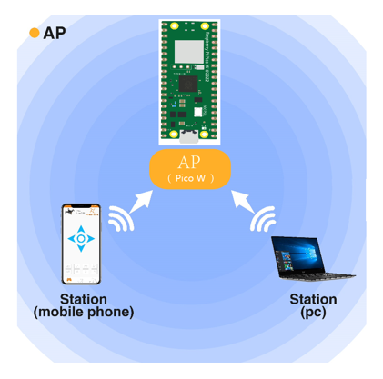

##############################################################################
Chapter WiFi Working Modes (Only for Pico W)
##############################################################################

The biggest difference between the raspberry pi pico and the raspberry pi Pico W is that the raspberry pi pico W is equipped with a WiFi function module. At the beginning of this chapter, we will learn about the WiFi function of Pico W of Raspberry Pi. 

If you have Pico in your hand, please change it to Pico W before continuing to learn.

Project Station mode
**********************************

Component List
==================================

+-----------------------------------------+------------------------------------------+
| Raspberry Pi Pico x1                    | Micro USB Wire x1                        |
|                                         |                                          |
| |Chapter01_08|                          | |Chapter01_09|                           |
+-----------------------------------------+------------------------------------------+

.. |Chapter01_08| image:: ../_static/imgs/1_LED/Chapter01_08.png
.. |Chapter01_09| image:: ../_static/imgs/1_LED/Chapter01_09.png

Component knowledge
============================

Wireless
------------------------------

Pico W has an on-board 2.4GHz wireless interface using an Infineon CYW43439. The antenna is an onboard antenna licensed from ABRACON (formerly ProAnt). The wireless interface is connected via SPI to the RP2040.

Station mode
-----------------------------

When Pico W selects Station mode, it acts as a WiFi client. It can connect to the router network and communicate with other devices on the router via WiFi connection. As shown below, the PC is connected to the router, and if Pico W wants to communicate with the PC, it needs to be connected to the router.

.. image:: ../_static/imgs/30_WiFi_Working_Modes_(Only_for_Pico_W)/Chapter30_00.png
    :align: center

Circuit
===========================

Connect Pico W to the computer using the USB cable.

.. image:: ../_static/imgs/30_WiFi_Working_Modes_(Only_for_Pico_W)/Chapter30_01.png
    :align: center

Sketch
===========================

Sketch_30.1_Station_mode
-----------------------------

Because the names and passwords of routers are different, before the Sketch runs, users need to enter the correct router's name and password in the box as shown in the illustration above.

After making sure the router name and password are entered correctly, compile and upload codes to Pico W, open serial monitor and set baud rate to 115200. Then it will display as follows:  

When PICO W successfully connects to "ssid_Router", serial monitor will print out the IP address assigned to PICO W by the router.

The following is the program code:

.. literalinclude:: ../../../freenove_Kit/C/Sketches/Sketch_30.1_WiFi_Station/Sketch_30.1_WiFi_Station.ino    
    :linenos: 
    :language: c
    :lines: 1-60
    :dedent:

Include the WiFi Library header file of Pico W.

.. literalinclude:: ../../../freenove_Kit/C/Sketches/Sketch_30.1_WiFi_Station/Sketch_30.1_WiFi_Station.ino    
    :linenos: 
    :language: c
    :lines: 7-7
    :dedent:

Enter correct router name and password.

.. literalinclude:: ../../../freenove_Kit/C/Sketches/Sketch_30.1_WiFi_Station/Sketch_30.1_WiFi_Station.ino    
    :linenos: 
    :language: c
    :lines: 9-10
    :dedent:

Set Pico W in Station mode and connect it to your router.

.. literalinclude:: ../../../freenove_Kit/C/Sketches/Sketch_30.1_WiFi_Station/Sketch_30.1_WiFi_Station.ino    
    :linenos: 
    :language: c
    :lines: 16-16
    :dedent:

Check whether Pico W has connected to router successfully every 0.5s.

.. literalinclude:: ../../../freenove_Kit/C/Sketches/Sketch_30.1_WiFi_Station/Sketch_30.1_WiFi_Station.ino    
    :linenos: 
    :language: c
    :lines: 18-21
    :dedent:

Serial monitor prints out the IP address assigned to Pico W.

.. literalinclude:: ../../../freenove_Kit/C/Sketches/Sketch_30.1_WiFi_Station/Sketch_30.1_WiFi_Station.ino    
    :linenos: 
    :language: c
    :lines: 24-24
    :dedent:

Reference

.. py:function:: Class Station	
    
    Every time when using WiFi, you need to include header file "WiFi.h".
    
    **begin(ssid, password,channel, bssid, connect):** PICO W is used as Station to connect hotspot.
    
    **ssid:** WiFi hotspot name
    
    **password:** WiFi hotspot password
    
    **channel:** WiFi hotspot channel number; communicating through specified channel; optional parameter 
    
    **bssid:** mac address of WiFi hotspot, optional parameter
    
    **connect:** blloean optional parameter, defaulting to true. If set as false, then PICO W won't connect WiFi.
    
    **config(local_ip, gateway, subnet, dns1, dns2):** set static local IP address.
    
        **local_ip:** station fixed IP address.
    
        **subnet:** subnet mask
    
        **dns1,dns2:** optional parameter. define IP address of domain name server
    
    **status:** obtain the connection status of WiFI
    
    **local IP():** obtain IP address in Station mode 
    
    **disconnect():** disconnect wifi

Project AP mode
***********************************

Component List & Circuit
===============================

Component List & Circuit are the same as in Section 30.1.

Component knowledge
===========================

AP mode
-------------------------

When PICO W selects AP mode, it creates a hotspot network that is separate from the Internet and waits for other WiFi devices to connect. As shown in the figure below, PICO W is used as a hotspot. If a mobile phone or PC wants to communicate with PICO W, it must be connected to the hotspot of PICO W. Only after a connection is established with PICO W can they communicate.

Circuit
=============================

Connect Pico W to the computer using the USB cable.

.. image:: ../_static/imgs/30_WiFi_Working_Modes_(Only_for_Pico_W)/Chapter30_01.png
    :align: center

Sketch
==============================

Sketch_AP_mode
-----------------------------------

Before the Sketch runs, you can make any changes to the AP name and password for PICO W in the box as shown in the illustration above. Of course, you can leave it alone by default.

Compile and upload codes to PICO W, open the serial monitor and set the baud rate to 115200. Then it will display as follows. 

When observing the print information of the serial monitor, turn on the WiFi scanning function of your phone, and you can see the ssid_AP on PICO W, which is called "WiFi_Name" in this Sketch. You can enter the password "12345678" to connect it or change its AP name and password by modifying Sketch.

.. note::

    1. Every time you change the WiFi name and password in the code, please power off and then on again, and then upload the code.It is possible that the WiFi name and password have not actually changed due to the direct uploading of code without power. This is because Pico W WiFi module and RP2040 chip are separated. Only when the power is cut off can the WiFi name and password be flashed to the WiFi module again.

    2. Pico W executes this code only to open a WiFi hotspot, and does not configure the code related to online data transmission, so the mobile phone will display no data after connection.

The following is the program code:

.. literalinclude:: ../../../freenove_Kit/C/Sketches/Sketch_30.2_WiFi_AP/Sketch_30.2_WiFi_AP.ino    
    :linenos: 
    :language: c
    :lines: 1-36
    :dedent:

Include WiFi Library header file of PICO W. 

.. literalinclude:: ../../../freenove_Kit/C/Sketches/Sketch_30.2_WiFi_AP/Sketch_30.2_WiFi_AP.ino    
    :linenos: 
    :language: c
    :lines: 7-7
    :dedent:

Enter correct AP name and password.

.. literalinclude:: ../../../freenove_Kit/C/Sketches/Sketch_30.2_WiFi_AP/Sketch_30.2_WiFi_AP.ino    
    :linenos: 
    :language: c
    :lines: 9-10
    :dedent:

Set PICO W in AP mode.

.. literalinclude:: ../../../freenove_Kit/C/Sketches/Sketch_30.2_WiFi_AP/Sketch_30.2_WiFi_AP.ino    
    :linenos: 
    :language: c
    :lines: 21-21
    :dedent:

Configure IP address, gateway and subnet mask for PICO W.

.. code-block:: C

    WiFi.softAPConfig(local_IP, gateway, subnet)

Turn on an AP in PICO W, whose name is set by ssid_AP and password is set by password_AP.

.. code-block:: C

    WiFi.softAP(ssid_AP, password_AP);

Check whether the AP is turned on successfully. If yes, print out IP and MAC address of AP established by PICO W. If no, print out the failure prompt. 

.. literalinclude:: ../../../freenove_Kit/C/Sketches/Sketch_30.2_WiFi_AP/Sketch_30.2_WiFi_AP.ino    
    :linenos: 
    :language: c
    :lines: 25-32
    :dedent:

Reference

.. py:function:: Class AP	
    
    Every time when using WiFi, you need to include header file "WiFi.h".
    
    **softAP(ssid, password, channel, ssid_hidden, max_connection):**
    
    **ssid:** WiFi hotspot name
    
    **password:** WiFi hotspot password
    
    **channel:** Number of WiFi connection channels, range 1-13. The default is 1.
    
    **ssid_hidden:** Whether to hide WiFi name from scanning by other devices. The default is not hide.
    
    **max_connection:** Maximum number of WiFi connected devices. The range is 1-4. The default is 4.
    
    **softAPConfig(local_ip, gateway, subnet):** set static local IP address. 
    
        **local_ip:** station fixed IP address.
    
        **Gateway:** gateway IP address
    
        **subnet:** subnet mask
    
    **softAP():** obtain IP address in AP mode 
    
    **softAPdisconnect ():** disconnect AP mode.

Project AP+Station mode
***********************************

Component List & Circuit
==============================

Component List & Circuit are the same as in Section 30.1.

Component knowledge
==============================

AP+Station mode
--------------------------------

:red:`PICO W currently does not support simultaneous use of AP mode and Station mode, so this section can be skipped. In the actual mode configuration, the last configured mode shall prevail.`

Circuit
=================================

Connect Pico W to the computer using the USB cable.

.. image:: ../_static/imgs/30_WiFi_Working_Modes_(Only_for_Pico_W)/Chapter30_01.png
    :align: center

Sketch
=============================

Sketch_AP_Station_mode
----------------------------

It is analogous to project 30.1 and project 30.2. Before running the Sketch, you need to modify ssid_Router, password_Router, ssid_AP and password_AP shown in the box of the illustration above.

After making sure that Sketch is modified correctly, compile and upload codes to PICO W, open serial monitor and set baud rate to 115200. Then it will display as follows: 

When observing the print information of the serial monitor, turn on the WiFi scanning function of your phone, and you can see the ssid_AP on PICO W.

The following is the program code:

.. literalinclude:: ../../../freenove_Kit/C/Sketches/Sketch_30.3_AP_Station/Sketch_30.3_AP_Station.ino    
    :linenos: 
    :language: c
    :lines: 1-45
    :dedent: