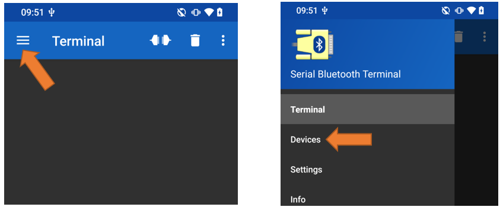
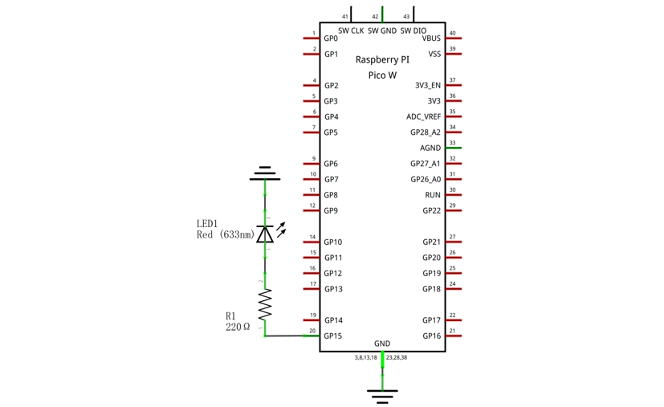

##############################################################################
Chapter Bluetooth (Only for Pico W)
##############################################################################

In June 2023, Raspberry Pi Official has updated to add Bluetooth support to the Pico W.

Pico W's Bluetooth 5.2 supports Bluetooth Classic and Bluetooth Low Energy (BLE) functionality. At the beginning of this chapter, we will learn the Pico W's Bluetooth function.

If you have Pico in your hand, please change it to Pico W before continuing to learn.

Project Bluetooth Passthrough
*******************************************

Component List
=============================

+-----------------------------------------+------------------------------------------+
| Raspberry Pi Pico x1                    | Micro USB Wire x1                        |
|                                         |                                          |
| |Chapter01_08|                          | |Chapter01_09|                           |
+-----------------------------------------+------------------------------------------+

.. |Chapter01_08| image:: ../_static/imgs/1_LED/Chapter01_08.png
.. |Chapter01_09| image:: ../_static/imgs/1_LED/Chapter01_09.png

Component knowledge
==============================

Pico W's wireless functionality is provided by the Infineon CYW43439 device, which contains a 2.4 GHz radio providing both 802.11n Wi-Fi and Bluetooth 5.2, supporting Bluetooth Classic and Bluetooth Low Energy (BLE) functionality.

For simple data transfer, there are two modes:

Master mode
-----------------------------

A device works in master mode can connect to one or more slave devices.

We can search and select the slave devices nearby to connect.

When a device initiates a connection request in master mode, it requires information about other Bluetooth devices, including their addresses and pairing keys.

Once the devices are paired, a direct connection can be established.

Slave mode
-----------------------------

A Bluetooth module operating in slave mode can only receive connection requests from a master device and cannot actively initiate connections.

After establishing a connection with a master device, it can either send or receive data.

Bluetooth devices can interact with each other, with one in master mode and the other in slave mode.

During data communication, the master device searches for and selects nearby devices to connect with.

Once a connection is made, data can be exchanged between the devices.

In the case of data exchange between a smartphone and a Raspberry Pi Pico W, the smartphone typically operates in master mode, while the Raspberry Pi Pico W functions in slave mode.

.. image:: ../_static/imgs/33_Bluetooth_(Only_for_Pico_W)/Chapter33_00.png
    :align: center

Circuit
===========================

Connect Pico W to the computer using the USB cable.

.. image:: ../_static/imgs/30_WiFi_Working_Modes_(Only_for_Pico_W)/Chapter30_01.png
    :align: center

Sketch
===========================

How to enable Pico W's Bluetooth

In default setting, Pico W only enables the ipv4 function of its WiFi. To enable Bluetooth, please refer to the following steps:

Sketch_Serial_BT
---------------------------

Upload the sketch to Pico W and open the serial monitor, set the baud rate to 115200. When you see the message as shown below, it indicates that, the Bluetooth of Pico W is ready.

Please make sure the Bluetooth of your phone is turn ON and the App Serial Bluetooth Terminal has installed on your phone.

Click Pair new device and select "PicoW_BT" to connect.

Open the App "Serial Bluetooth Terminal", expand the menu and select "Devices". 

In Bluetooth Classic mode, select PicoW_BT, and you will see "Connected", which indicates a successful connection.

Now, the data can be transfer between your phone and computer (Pico W).

Input Hello at the sending bar on the phone app and tap the send icon to send message to pico W.

When the computer receives it, input "Hi" at the Message bar and hit Enter key to send message to your phone.

The following is the program code:

.. literalinclude:: ../../../freenove_Kit/C/Sketches/Sketch_33.1_Serial_BT/Sketch_33.1_Serial_BT.ino    
    :linenos: 
    :language: c
    :lines: 1-21
    :dedent:

Reference
--------------------------

.. py:function:: Class SerialBT	
    
    This is a class library used to operate SerialBT, which can directly read and set SerialBT. Here are some member functions:
    
    **SetName(const char *name):** Sets the Bluetooth module name.
    
    **begin():** Initializes the Bluetooth functionality.
    
    **available():** Retrieves data sent from the buffer; if none, returns 0.
    
    **read():** Reads data from Bluetooth, returns data as an int type.
    
    **readString():** Reads data from Bluetooth, returns data as a String type.
    
    **write(uint8_t c):** Sends a single uint8_t type of data to Bluetooth.
    
    **write(const uint8_t *p, size_t len):** Sends the first len bytes of data stored at pointer address p to Bluetooth.
    
    **print():** Sends all types of data to Bluetooth for printing.
    
    **end():** Disconnects all Bluetooth devices and turns off Bluetooth, freeing up all occupied space.

Project Bluetooth Low Energy Data Passthrough
*********************************************************

Component List
=============================

+-----------------------------------------+------------------------------------------+
| Raspberry Pi Pico x1                    | Micro USB Wire x1                        |
|                                         |                                          |
| |Chapter01_08|                          | |Chapter01_09|                           |
+-----------------------------------------+------------------------------------------+

Circuit
===========================

Connect Pico W to the computer using the USB cable.

.. image:: ../_static/imgs/30_WiFi_Working_Modes_(Only_for_Pico_W)/Chapter30_01.png
    :align: center

In this tutorial we need to use a Bluetooth APP called Serial Bluetooth Terminal to assist in the experiment. If 

you've not installed it yet, please do so by clicking: https://www.appsapk.com/serial-bluetooth-terminal/.The following is its logo.

Sketch
==============================

Sketch_Serial_BT
-----------------------------

Before uploading the sketch, please make sure the Bluetooth of Pico W is enabled.

Serial Bluetooth
---------------------------

Compile and upload sketch th Pico W. The opration is similar to that in the previous section.

First, make sure Bluetooth on your phone is turned ON, and open Serial Bluetooth Terminal.

Click Pair new device, select "PicoW_BT" to connect.

Expand the menu at the left of the app, and select "Devices".

SelectBLUETOOTH LE and click scan to search for BLE devices nearby.

Select "PicoW_BLE".

LightBlue
------------------------

If Serial Bluetooth cannot be installed on your phone, try LightBlue. If you do not have this software installed on your phone, you can refer to this link： 

iPhone:https://apps.apple.com/us/app/lightblue/id557428110?platform=iphone

.. image:: ../_static/imgs/33_Bluetooth_(Only_for_Pico_W)/Chapter33_16.png
    :align: center

Step 1. Upload sketch 33.1 to Pico W.

Step 2. Open Serial Monitor.

Step 3. Set the baud rate to 115200.

Turn ON Bluetooth on your phone and open LightBlue App.

At the device scan page, scroll down to refresh the devices nearby. Select PicoW_BLE to connect.

Click "Read and Write". Click on "Read and Write". Select the corresponding data format in the box on the right side of the data format, such as HEX hexadecimal, utf-string string, Binary binary, etc. Then click SUBSCRIBE.

Return to the serial monitor on Arduino IDE, you can input any message and hit the Enter key to send.

Then you can see LightBlue on your phone receive the data.

Similarly, you can send data from your phone to computer. Input any content and click WRITE to send the data.

You can see the data received.

Now the data can be transfer between your phone and pico W.

The following is the program code:

.. literalinclude:: ../../../freenove_Kit/C/Sketches/Sketch_33.2_Serial_BLE/Sketch_33.2_Serial_BLE.ino    
    :linenos: 
    :language: c
    :lines: 1-129
    :dedent:

Define the specified UUID number for BLE vendor.

.. literalinclude:: ../../../freenove_Kit/C/Sketches/Sketch_33.2_Serial_BLE/Sketch_33.2_Serial_BLE.ino    
    :linenos: 
    :language: c
    :lines: 27-33
    :dedent:

Write a Callback function for the BLE server to manage BLE connections.

.. literalinclude:: ../../../freenove_Kit/C/Sketches/Sketch_33.2_Serial_BLE/Sketch_33.2_Serial_BLE.ino    
    :linenos: 
    :language: c
    :lines: 72-77
    :dedent:

Write a Callback function for the BLE server to handle BLE disconnections.

.. literalinclude:: ../../../freenove_Kit/C/Sketches/Sketch_33.2_Serial_BLE/Sketch_33.2_Serial_BLE.ino    
    :linenos: 
    :language: c
    :lines: 79-84
    :dedent:

Write a Callback function to read data. When BLE needs to read data, print the read data on the phone.

.. literalinclude:: ../../../freenove_Kit/C/Sketches/Sketch_33.2_Serial_BLE/Sketch_33.2_Serial_BLE.ino    
    :linenos: 
    :language: c
    :lines: 86-102
    :dedent:

Create a Callback function for writing data. When data is written to BLE, check if it is the CCCD characteristic handle or a write characteristic handle. If it is the CCCD, it indicates a subscription state; otherwise, print the written data to the serial console.

.. literalinclude:: ../../../freenove_Kit/C/Sketches/Sketch_33.2_Serial_BLE/Sketch_33.2_Serial_BLE.ino    
    :linenos: 
    :language: c
    :lines: 104-121
    :dedent:

Write a function to send subscription notifications. When data is received through the serial port, send a notification to let BLE receive the data.

.. literalinclude:: ../../../freenove_Kit/C/Sketches/Sketch_33.2_Serial_BLE/Sketch_33.2_Serial_BLE.ino    
    :linenos: 
    :language: c
    :lines: 123-129
    :dedent:

Process serial port data: Upon receiving data from the serial port, remove any leading and trailing whitespace, append a newline character to the end of the string, and then use the notification function to transmit the data to the mobile device via BLE.

.. literalinclude:: ../../../freenove_Kit/C/Sketches/Sketch_33.2_Serial_BLE/Sketch_33.2_Serial_BLE.ino    
    :linenos: 
    :language: c
    :lines: 52-67
    :dedent:

The design for creating the BLE server is: 

1. Set up a connection Callback function.

2. Set up a Callback function for disconnection.

3. Set up GATT read characteristic.

4. Set up GATT write characteristic.

5. Add GATT service.

6. Add GATT dynamic characteristic (read, write, notify).

7. Initialize BLE.

8. Start advertising.

.. literalinclude:: ../../../freenove_Kit/C/Sketches/Sketch_33.2_Serial_BLE/Sketch_33.2_Serial_BLE.ino    
    :linenos: 
    :language: c
    :lines: 20-40
    :dedent:

Project Bluetooth Control LED
********************************************

In this project, we will control an LED via Pico W's Bluetooth function.

Component List
=================================

+-----------------------------------------+------------------------------------------+
| Raspberry Pi Pico x1                    | USB Cable x1                             |
|                                         |                                          |
| |Chapter01_08|                          | |Chapter01_09|                           |
+-----------------------------------------+------------------------------------------+
| Breadboard x1                                                                      |
|                                                                                    |
| |Chapter01_10|                                                                     |
+-------------------------+-------------------------------+--------------------------+
| LED x1                  | Jumper                        | Resistor 220Ω x1         |
|                         |                               |                          |
| |Chapter33_26|          |  |Chapter23_08|               |  |Chapter33_27|          |
+-------------------------+-------------------------------+--------------------------+

.. |Chapter01_10| image:: ../_static/imgs/1_LED/Chapter01_10.png
.. |Chapter23_08| image:: ../_static/imgs/23_Matrix_Keypad/Chapter23_08.png
.. |Chapter33_26| image:: ../_static/imgs/33_Bluetooth_(Only_for_Pico_W)/Chapter33_26.png
.. |Chapter33_27| image:: ../_static/imgs/33_Bluetooth_(Only_for_Pico_W)/Chapter33_27.png

Circuit
=======================

.. list-table::
   :width: 100%
   :align: center
   
   * -  Schematic diagram
   * -  |Chapter33_28|
   * -  Hardware connection. 
       
        :red:`If you need any support, please contact us via:` support@freenove.com
   * -  |Chapter33_29| 

.. |Chapter33_29| image:: ../_static/imgs/33_Bluetooth_(Only_for_Pico_W)/Chapter33_29.png

.. note::
    
    :red:`To help users have a better experience when doing the projects, we have made some modifications to Pico's simulation diagram. Please note that there are certain differences between the simulation diagram and the actual board to avoid misunderstanding.`

Sketch
=======================

Sketch_LEDControl_BT
------------------------------

Upload the sketch to Pico W.

The operation on the phone app is similar to that in Project 33.1. You just need to change the sending messages to "led_on", "led_off" and "led_toggle" to control the status of the LED.

Displays on the serial monitor.

LED status.

.. note::
    
    :red:`If the messages you send are not "led_on", "led_off", or "led toggle", the status of the LED won't change.`

    :red:`For example, when the LED is already ON, it will remain ON unless the message "led_off", or "led toggle" is received.`

The following is the program code:

.. literalinclude:: ../../../freenove_Kit/C/Sketches/Sketch_33.3_LEDControl_BT/Sketch_33.3_LEDControl_BT.ino    
    :linenos: 
    :language: c
    :lines: 1-35
    :dedent:

Define the pin of LED and set its default status as false.

.. literalinclude:: ../../../freenove_Kit/C/Sketches/Sketch_33.3_LEDControl_BT/Sketch_33.3_LEDControl_BT.ino    
    :linenos: 
    :language: c
    :lines: 3-4
    :dedent:

Set the LED pin to output mode.

.. literalinclude:: ../../../freenove_Kit/C/Sketches/Sketch_33.3_LEDControl_BT/Sketch_33.3_LEDControl_BT.ino    
    :linenos: 
    :language: c
    :lines: 7-7
    :dedent:

Process the received Bluetooth data, determine the status of the LED light. If it is "led_on", the LED light is on; if it is "led_off", the LED light is off; if it is "led_toggle", the LED status is opposite to the current status.

.. literalinclude:: ../../../freenove_Kit/C/Sketches/Sketch_33.3_LEDControl_BT/Sketch_33.3_LEDControl_BT.ino    
    :linenos: 
    :language: c
    :lines: 18-34
    :dedent:

Reference
--------------------------------

The 'trim()' function is used to remove whitespace from both sides of a string, converting "led_on\n" to "led_on" for easier subsequent judgment.

.. py:function:: void String: :trim(void)	

    removes whitespace from both sides of a string.

The 'equals()' function is used to compare if two strings are identical, providing a simple and fast way to compare strings.

.. py:function:: unsigned char String: :equals(const String &s2)	

    s2: The other string to be compared.

    Return value: 
    
    If s2 is not equal to the current string, the return value is 0.

    If s2 is equal to the current string, the return value is 1.

    .. note::
        
        Both data being compared must be of string type.
    
Project Bluetooth Low Energy Control LED
****************************************************

This project is basically the same as the previous one. You do not need to change the circuit wiring. Just upload the corresponding sketch.

Component List
=================================

+-----------------------------------------+------------------------------------------+
| Raspberry Pi Pico x1                    | USB Cable x1                             |
|                                         |                                          |
| |Chapter01_08|                          | |Chapter01_09|                           |
+-----------------------------------------+------------------------------------------+
| Breadboard x1                                                                      |
|                                                                                    |
| |Chapter01_10|                                                                     |
+-------------------------+-------------------------------+--------------------------+
| LED x1                  | Jumper                        | Resistor 220Ω x1         |
|                         |                               |                          |
| |Chapter33_26|          |  |Chapter23_08|               |  |Chapter33_27|          |
+-------------------------+-------------------------------+--------------------------+

Circuit
=======================

.. list-table::
   :width: 100%
   :align: center
   
   * -  Schematic diagram
   * -  |Chapter33_28|
   * -  Hardware connection. 
       
        :red:`If you need any support, please contact us via:` support@freenove.com
   * -  |Chapter33_29| 

Sketch
=========================

Sketch_LEDControl_BLE
--------------------------

Upload the sketch to Pico W. As previously mentioned, you can input "led_on", "led_off", or "led_toggle" to change the status of the LED.

Displays on the serial monitor.

LED Status.

.. note::
    
    :red:`If the messages you send are not "led_on", "led_off", or "led toggle", the status of the LED will not change.`

:red:`For example, when the LED is already ON, it will remain ON unless the message "led_off", or "led toggle" is received.`

The following is the program code:

.. literalinclude:: ../../../freenove_Kit/C/Sketches/Sketch_33.4_LEDContron_BLE/Sketch_33.4_LEDContron_BLE.ino    
    :linenos: 
    :language: c
    :lines: 1-149
    :dedent: