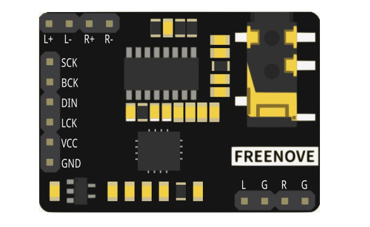
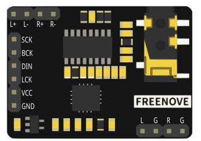
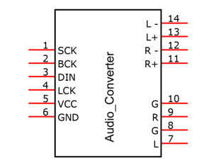
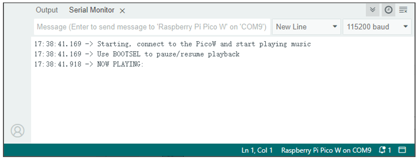

##############################################################################
Chapter Bluetooth Audio (Only for Pico W)
##############################################################################

Raspberry Pi Pico W integrates both Classic Bluetooth and Bluetooth Low Energy (BLE), enabling it to transmit not only simple data and commands but also files including text and audio. In this section, we will use the Bluetooth reception function to receive music from a smartphone and play it.

Project Bluetooth Passthrough
**************************************

Utilizing the Bluetooth audio reception capability of the Raspberry Pi Pico W, we can decode audio data from a smartphone using the A2DP protocol, allowing the Raspberry Pi Pico W to receive high-quality audio. In this project, we will employ an audio converter and amplifier to transform the audio data into stereo and output it.

Component List
============================

+-----------------------------------------+------------------------------------------+
| Raspberry Pi Pico x1                    | Micro USB Wire x1                        |
|                                         |                                          |
| |Chapter01_08|                          | |Chapter01_09|                           |
+-----------------------------------------+------------------------------------------+
| Audio Converter & Amplifier             | Speaker*1                                |
|                                         |                                          |
|  |Chapter29_01|                         | |Chapter29_02|                           |
+-----------------------------------------+------------------------------------------+
| Jumper wire F/M*4                                                                  |
|                                                                                    |
|  |Chapter29_00|                                                                    |
+------------------------------------------------------------------------------------+

.. |Chapter01_08| image:: ../_static/imgs/1_LED/Chapter01_08.png
.. |Chapter01_09| image:: ../_static/imgs/1_LED/Chapter01_09.png
.. |Chapter26_03| image:: ../_static/imgs/26_Infrared_Motion_Sensor/Chapter26_03.png

.. |Chapter29_02| image:: ../_static/imgs/29_Play_Music/Chapter29_02.png

Component knowledge
===========================

Audio Converter & Amplifier module
--------------------------------------------

.. list-table::
   :width: 100%
   :align: center
   
   * -  front view
     -  schematic diagram
   * -  |Chapter29_03|
     -  |Chapter29_04|
    

Interface description for Audio Converter & Amplifier module

+-----+------+-------------------------------------+
| Pin | Name |            Introductions            |
+=====+======+=====================================+
| 1   | SCK  | System clock input                  |
+-----+------+-------------------------------------+
| 2   | BCK  | Audio data bit clock input          |
+-----+------+-------------------------------------+
| 3   | DIN  | Audio data input                    |
+-----+------+-------------------------------------+
| 4   | LCK  | Audio data word clock input         |
+-----+------+-------------------------------------+
| 5   | VCC  | Power input, 3.3V~5.0V              |
+-----+------+-------------------------------------+
| 6   | GND  | Power Ground                        |
+-----+------+-------------------------------------+
| 7   | L    | External audio left channel input   |
+-----+------+-------------------------------------+
| 8   | G    | Power Ground                        |
+-----+------+-------------------------------------+
| 9   | R    | External audio right channel input  |
+-----+------+-------------------------------------+
| 10  | G    | Power Ground                        |
+-----+------+-------------------------------------+
| 11  | R+   | Positive pole of right channel horn |
+-----+------+-------------------------------------+
| 12  | R-   | Negative pole of right channel horn |
+-----+------+-------------------------------------+
| 13  | L+   | Positive pole of left channel horn  |
+-----+------+-------------------------------------+
| 14  | L-   | Negative pole of left channel horn  |
+-----+------+-------------------------------------+

.. image:: ../_static/imgs/29_Play_Music/Chapter29_05.png
    :align: center

Speaker interface: Connect left channel speaker and right channel speaker. Group L: L+ & L-; Group R: R+& R-. The two interfaces of the speaker can be connected to the interfaces of group L or group R. However, when one interface is connected to group L, the other cannot be connected to group R. Doing so may cause the module to malfunction.

Headphone interface: the interface to connect the headphones.

I2S input interface: connect to the device with I2S. Used to transcode audio data into DAC audio signals.

External audio input interface: connect to external audio equipment. Used to amplify externally input audio signals.

Power interface: connect to external power supply. External power supply selection range: 3.3V-5.0V.

Circuit
=============================

The connection between the control board and the audio module is shown in the figure below.

.. list-table::
   :width: 100%
   :align: center
   
   * -  Schematic diagram
   * -  |Chapter34_00|
   * -  Hardware connection. 
       
        :red:`If you need any support, please contact us via:` support@freenove.com
   * -  |Chapter34_01| 

Sketch
============================

Sketch_33.4_Bluetooth_By_PCM5102A
-------------------------------------------

When you see the messages as shown below, it indicates that the Pico W's Bluetooth is ready for connection and playing music.

Search "Pico W Boom" on your phone to connect. Upon successful connection, you can display audio via Pico W.

.. image:: ../_static/imgs/34_Bluetooth_Audio_(Only_for_Pico_W)/Chapter34_04.png
    :align: center

The following is the program code:

.. literalinclude:: ../../../freenove_Kit/C/Sketches/Sketch_34.1_Bluetooth_By_PCM5102A/Sketch_34.1_Bluetooth_By_PCM5102A.ino    
    :linenos: 
    :language: c
    :lines: 1-67
    :dedent:

Include two libraries: "BluetoothAudio.h" and "PWMAudio.h".

.. literalinclude:: ../../../freenove_Kit/C/Sketches/Sketch_34.1_Bluetooth_By_PCM5102A/Sketch_34.1_Bluetooth_By_PCM5102A.ino    
    :linenos: 
    :language: c
    :lines: 1-2
    :dedent:

Before using the functions in these two libraries, it is necessary to construct objects of the PWMAudio class and the A2DPSink class.

.. literalinclude:: ../../../freenove_Kit/C/Sketches/Sketch_34.1_Bluetooth_By_PCM5102A/Sketch_34.1_Bluetooth_By_PCM5102A.ino    
    :linenos: 
    :language: c
    :lines: 4-5
    :dedent:

Define the playback status of Bluetooth audio, the default is stop status.

.. literalinclude:: ../../../freenove_Kit/C/Sketches/Sketch_34.1_Bluetooth_By_PCM5102A/Sketch_34.1_Bluetooth_By_PCM5102A.ino    
    :linenos: 
    :language: c
    :lines: 8-8
    :dedent:

Write a volume callback function that is called when the volume changes and prints the volume percentage.

.. literalinclude:: ../../../freenove_Kit/C/Sketches/Sketch_34.1_Bluetooth_By_PCM5102A/Sketch_34.1_Bluetooth_By_PCM5102A.ino    
    :linenos: 
    :language: c
    :lines: 11-14
    :dedent:

Write a connection callback function to print the Bluetooth device address when connected to Pico W Bluetooth.

.. literalinclude:: ../../../freenove_Kit/C/Sketches/Sketch_34.1_Bluetooth_By_PCM5102A/Sketch_34.1_Bluetooth_By_PCM5102A.ino    
    :linenos: 
    :language: c
    :lines: 17-25
    :dedent:

Write a playback status Callback function to control the playback status of Bluetooth audio.

.. literalinclude:: ../../../freenove_Kit/C/Sketches/Sketch_34.1_Bluetooth_By_PCM5102A/Sketch_34.1_Bluetooth_By_PCM5102A.ino    
    :linenos: 
    :language: c
    :lines: 28-31
    :dedent:

The steps for creating A2DP Bluetooth audio are:

1. Set the Bluetooth name and MAC address.

2. Set the audio consumer to PWM audio output.

3. Enable callbacks for volume, connection, and playback status.

4. Initialize A2DP.

.. literalinclude:: ../../../freenove_Kit/C/Sketches/Sketch_34.1_Bluetooth_By_PCM5102A/Sketch_34.1_Bluetooth_By_PCM5102A.ino    
    :linenos: 
    :language: c
    :lines: 40-46
    :dedent:

Reference
-----------------------

.. py:function:: Class A2DPSink	
    
    **SetName(const char *name):** Sets the Bluetooth module name and MAC address.
    
    **SetConsumer(BluetoothAudioConsumer_ *c):** Sets the audio consumer as an A2DP receiver.
    
    **onVolume(void ( *cb)(void *, int), void *cbData = nullptr):** Enables the Bluetooth audio volume Callback.
    
    **onConnect(void ( *cb)(void *, bool), void *cbData = nullptr):** Enables the Bluetooth audio connection Callback.
    
    **onPlaybackStatus(void ( *cb)(void *, PlaybackStatus), void *cbData = nullptr):** Enables the Bluetooth audio playback status Callback.
    
    **begin():** Initializes A2DP.
    
    **play():** Changes the Bluetooth audio playback status to playing.
    
    **pause():** Changes the Bluetooth audio playback status to paused.
    
    **trackTitle():** Obtains the title of the current Bluetooth audio track.