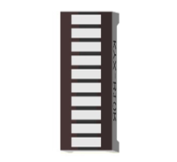
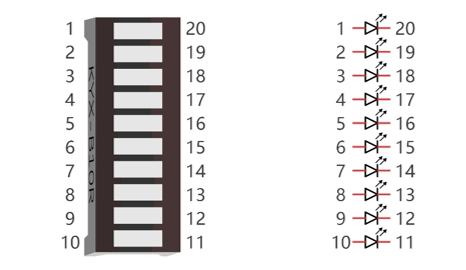
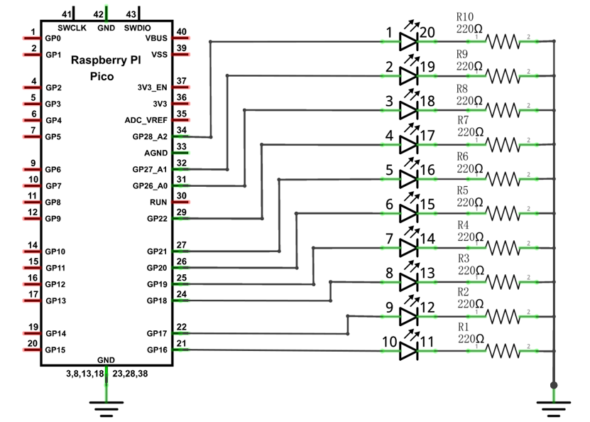
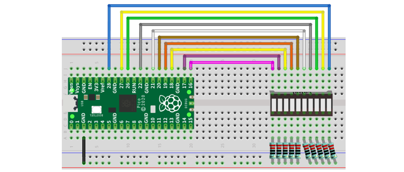
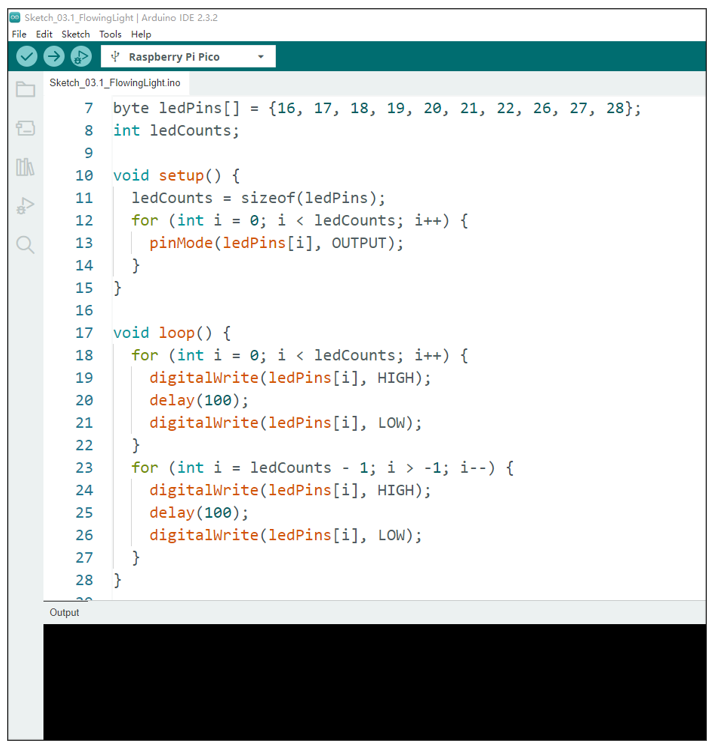
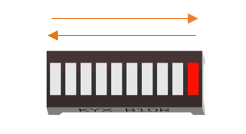

##############################################################################
Chapter LED Bar
##############################################################################

We have learned how to control an LED blinking, next we will learn how to control a number of LEDs.

Project Flowing Light
************************************

.. note::
    
    Raspberry Pi Pico, Raspberry Pi Pico W and Raspberry Pi Pico 2 only differ by wireless function, and are almost identical in other aspects. In this tutorial, except for the wireless function, other parts use Raspberry Pi Pico's map for tutorial demonstration.

In this project, we use a number of LEDs to make a flowing light.

Component List
===============================

+-----------------------------------------+----------------+
| Raspberry Pi Pico x1                    | USB Cable x1   |
|                                         |                |
| |Chapter01_08|                          | |Chapter01_09| |
+-----------------------------------------+----------------+
| Breadboard x1                                            |
|                                                          |
| |Chapter01_10|                                           |
+----------------------+------------------+----------------+
| LED bar graph x1     | Resistor 220Ω x10| Jumper         |
|                      |                  |                |
| |Chapter03_00|       | |Chapter01_12|   | |Chapter01_13| |
+----------------------+------------------+----------------+

.. |Chapter01_08| image:: ../_static/imgs/1_LED/Chapter01_08.png
.. |Chapter01_09| image:: ../_static/imgs/1_LED/Chapter01_09.png
.. |Chapter01_10| image:: ../_static/imgs/1_LED/Chapter01_10.png
.. |Chapter01_12| image:: ../_static/imgs/1_LED/Chapter01_12.png
.. |Chapter01_13| image:: ../_static/imgs/1_LED/Chapter01_13.png

Component Knowledge
===============================

Let us learn about the basic features of these components to use and understand them better.

LED bar
---------------------------------

A Bar Graph LED has 10 LEDs integrated into one compact component. The two rows of pins at its bottom are paired to identify each LED like the single LED used earlier. 

Circuit
===============================

.. list-table::
   :width: 100%
   :align: center
   
   * -  Schematic diagram
   * -  |Chapter03_02|
   * -  Hardware connection. 
       
        :red:`If you need any support, please contact us via:` support@freenove.com
   * -  |Chapter03_03|
    

.. note::
    
    :red:`To help users have a better experience when doing the projects, we have made some modifications to Pico's simulation diagram. Please note that there are certain differences between the simulation diagram and the actual board to avoid misunderstanding.`

:red:`If LEDbar does not work, try to rotate LEDbar for 180°. The label is random.`

Sketch
================================

.. raw:: html

    <iframe style="display: block; margin: 0 auto;" height="421.875" width="750" src="https://www.youtube.com/embed/udyRujuLwA4" frameborder="0" allowfullscreen></iframe>

This project is designed to make a flowing water lamp, which are these actions: First turn LED #1 ON, and then turn it OFF. Then turn LED #2 ON, and then turn it OFF... and repeat the same to all 10 LEDs until the last LED is turns OFF. This process is repeated to achieve the "movements" of flowing water.

Upload following sketch:

Freenove_Ultimate_Starter_Kit_for_Raspberry_Pi_Pico\\C\\Sketches\\Sketch_03.1_FlowingLight.

Sketch_FlowingLight
----------------------------------

Click Upload to upload the sketch to Pico. LEDs of LED bar graph lights up one by one from left to right and then back from right to left.

:red:`If you have any concerns, please contact us via:` support@freenove.com

The following is the program code:

.. literalinclude:: ../../../freenove_Kit/C/Sketches/Sketch_03.1_FlowingLight/Sketch_03.1_FlowingLight.ino
    :linenos: 
    :language: c
    :dedent:

Use an array to define 10 GPIO ports connected to LED bar graph for easier operation.

.. literalinclude:: ../../../freenove_Kit/C/Sketches/Sketch_03.1_FlowingLight/Sketch_03.1_FlowingLight.ino
    :linenos: 
    :language: c
    :lines: 7-7
    :dedent:

In setup(), use sizeof() to get the number of array, which is the number of LEDs, then configure the GPIO port to output mode. 

.. literalinclude:: ../../../freenove_Kit/C/Sketches/Sketch_03.1_FlowingLight/Sketch_03.1_FlowingLight.ino
    :linenos: 
    :language: c
    :lines: 12-14
    :dedent:

Then, in loop(), use two "for" loop to realize flowing water light from left to right and from right to left.

.. literalinclude:: ../../../freenove_Kit/C/Sketches/Sketch_03.1_FlowingLight/Sketch_03.1_FlowingLight.ino
    :linenos: 
    :language: c
    :lines: 18-27
    :dedent: