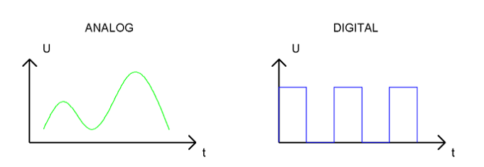
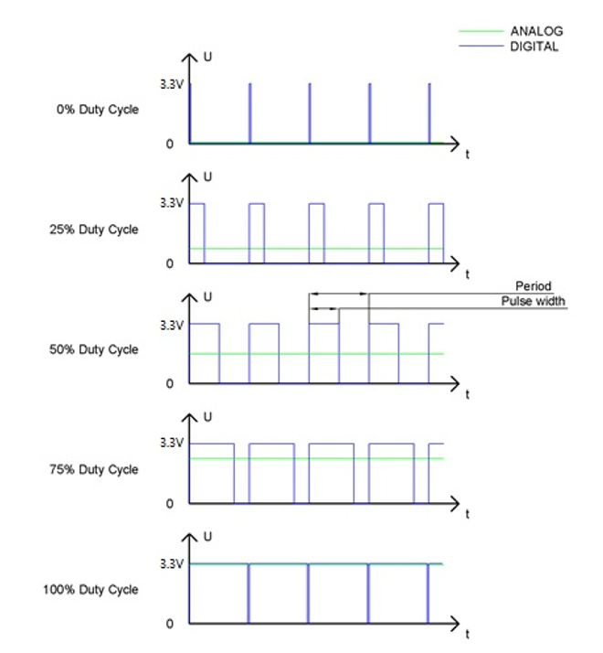
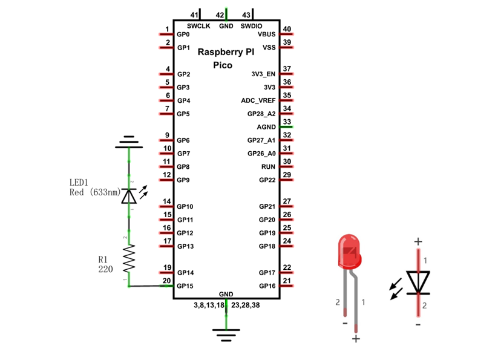
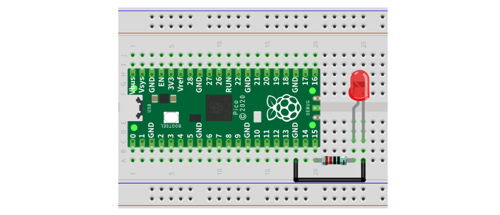
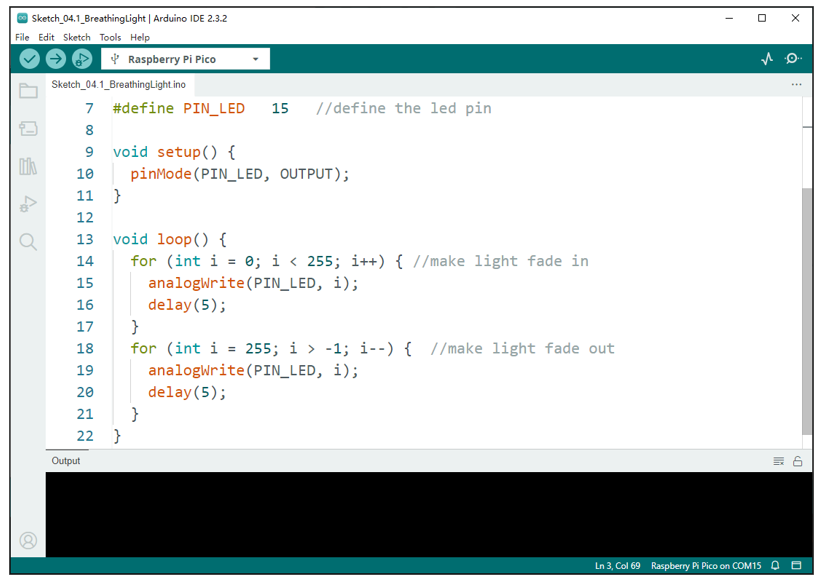
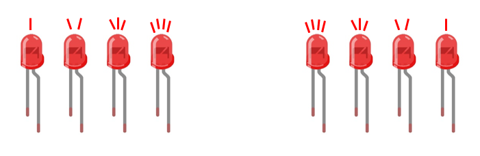
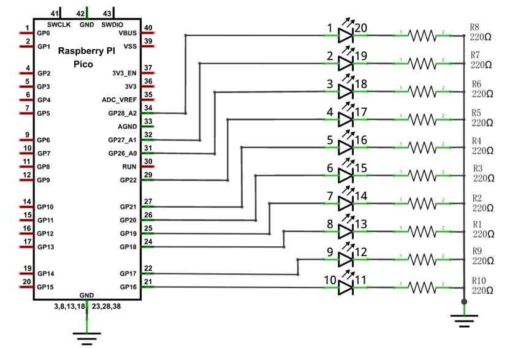
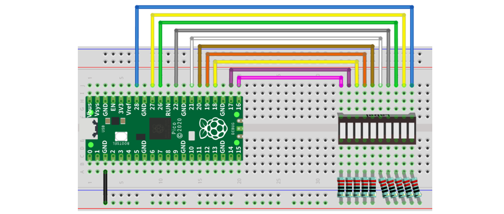
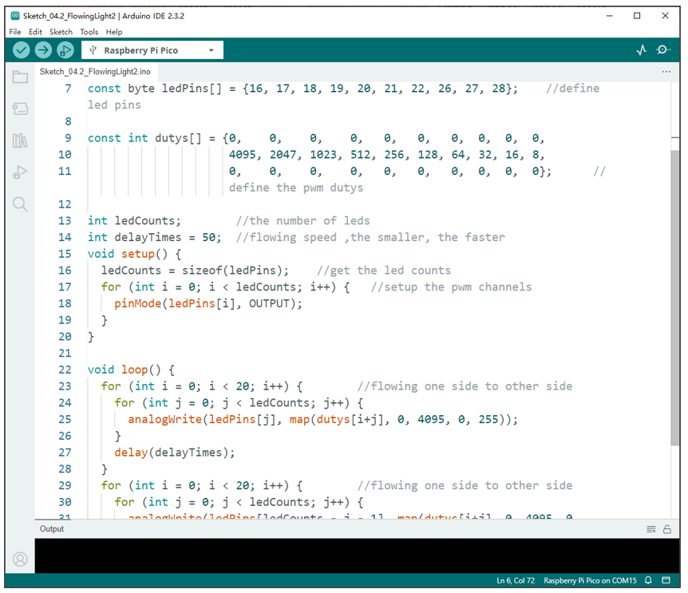
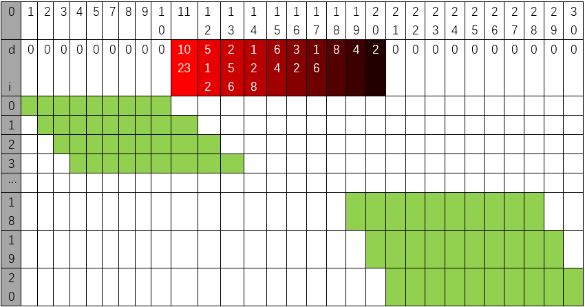

##############################################################################
Chapter Analog & PWM
##############################################################################

In previous study, we have known that one button has two states: pressed and released, and LED has light-on/off state, then how to enter a middle state? How to output an intermediate state to let LED "semi bright"?  That is what we are going to learn.

First, let us learn how to control the brightness of an LED.

Project Breathing LED
***************************************

Breathing light, that is, LED is turned from off to on gradually and gradually from on to off, just like "breathing". So, how to control the brightness of an LED? We will use PWM to achieve this target.

Component List
=======================================

+-----------------------------------------+----------------+
| Raspberry Pi Pico x1                    | USB Cable x1   |
|                                         |                |
| |Chapter01_08|                          | |Chapter01_09| |
+-----------------------------------------+----------------+
| Breadboard x1                                            |
|                                                          |
| |Chapter01_10|                                           |
+----------------------+------------------+----------------+
| LED x1               | Resistor 220Ω x1 | Jumper         |
|                      |                  |                |
| |Chapter01_11|       | |Chapter01_12|   | |Chapter01_13| |
+----------------------+------------------+----------------+

.. |Chapter01_08| image:: ../_static/imgs/1_LED/Chapter01_08.png
.. |Chapter01_09| image:: ../_static/imgs/1_LED/Chapter01_09.png
.. |Chapter01_10| image:: ../_static/imgs/1_LED/Chapter01_10.png
.. |Chapter01_11| image:: ../_static/imgs/1_LED/Chapter01_11.png
.. |Chapter01_12| image:: ../_static/imgs/1_LED/Chapter01_12.png
.. |Chapter01_13| image:: ../_static/imgs/1_LED/Chapter01_13.png

Related Knowledge
===================================

Analog & Digital
------------------------------------

An Analog Signal is a continuous signal in both time and value. On the contrary, a Digital Signal or discrete-time signal is a time series consisting of a sequence of quantities. Most signals in life are analog signals. A familiar example of an Analog Signal would be how the temperature throughout the day is continuously changing and could not suddenly change instantaneously from 0℃ to 10℃. However, Digital Signals can instantaneously change in value. This change is expressed in numbers as 1 and 0 (the basis of binary code). 

Their differences can more easily be seen when compared when graphed as below.

In practical application, we often use binary as the digital signal, that is a series of 0's and 1's. Since a binary signal only has two values (0 or 1), it has great stability and reliability. Lastly, both analog and digital signals can be converted into the other.

PWM
-----------------------------------

PWM, Pulse-Width Modulation, is a very effective method for using digital signals to control analog circuits. Common processors cannot directly output analog signals. PWM technology makes it very convenient to achieve this conversion (translation of digital to analog signals)

PWM technology uses digital pins to send certain frequencies of square waves, that is, the output of high levels and low levels, which alternately last for a while. The total time for each set of high levels and low levels is generally fixed, which is called the period (Note: the reciprocal of the period is frequency). The time of high level outputs are generally called "pulse width", and the duty cycle is the percentage of the ratio of pulse duration, or pulse width (PW) to the total period (T) of the waveform.

The longer the output of high levels last, the longer the duty cycle and the higher the corresponding voltage in the analog signal will be. The following figures show how the analog signal voltages vary between 0V-5V (high level is 5V) corresponding to the pulse width 0%-100%:

The longer the PWM duty cycle is, the higher the output power will be. Now that we understand this relationship, we can use PWM to control the brightness of an LED or the speed of DC motor and so on. 

It is evident from the above that PWM is not real analog, and the effective value of the voltage is equivalent to the corresponding analog. Therefore, we can control the output power of the LED and other output modules to achieve different effects.

Raspberry Pi Pico and PWM 
----------------------------------

Raspberry Pi Pico has 16 PWM channels, each of which can control frequency and duty cycle independently. Every pin on Raspberry Pi Pico can be configured as PWM output. In Arduino, PWM frequency is set to 500Hz. You can change the PWM output by changing duty cycle. 

Circuit
==================================

This circuit is the same as the one in project Blink.

.. list-table::
   :width: 100%
   :align: center
   
   * -  Schematic diagram
   * -  |Chapter04_02|
   * -  Hardware connection. 
       
        :red:`If you need any support, please contact us via:` support@freenove.com
   * -  |Chapter04_03|
    

.. note::
    
    :red:`To help users have a better experience when doing the projects, we have made some modifications to Pico's simulation diagram. Please note that there are certain differences between the simulation diagram and the actual board to avoid misunderstanding.`

Sketch
================================

This project is designed to make PWM output GP15 with pulse width increasing from 0% to 100%, and then reducing from 100% to 0% gradually.

Sketch_BreathingLight
---------------------------------

Download the code to Pico, and you will see that LED is turned from on to off and then from off to on gradually like breathing.

The following is the program code:

.. literalinclude:: ../../../freenove_Kit/C/Sketches/Sketch_04.1_BreathingLight/Sketch_04.1_BreathingLight.ino
    :linenos: 
    :language: c
    :dedent:

Set the pin controlling LED to output mode.

.. literalinclude:: ../../../freenove_Kit/C/Sketches/Sketch_04.1_BreathingLight/Sketch_04.1_BreathingLight.ino
    :linenos: 
    :language: c
    :lines: 10-10
    :dedent:

In the loop(), there are two "for" loops. The first makes the LED Pin output PWM from 0% to 100% and the second makes the LED Pin output PWM from 100% to 0%. This allows the LED to gradually light and extinguish.

.. literalinclude:: ../../../freenove_Kit/C/Sketches/Sketch_04.1_BreathingLight/Sketch_04.1_BreathingLight.ino
    :linenos: 
    :language: c
    :lines: 14-21
    :dedent:

You can also adjust the rate of the state change of LED by changing the parameters of the delay() function in the "for" loop.

.. py:function:: analogWrite(pin, value)
    
    Arduino IDE provides the function, analogWrite(pin, value), which can make ports directly output PWM waves. Every pin on Pico board can be configured to output PWM. In the function called analogWrite(pin, value), the parameter "pin" specifies the port used to output PWM wave. The range of value is 0-255, which represents the duty cycle of 0%-100%.
    
    In order to use this function, we need to set the port to output mode.

Project Meteor Flowing Light
****************************************

After learning about PWM, we can use it to control LED bar graph and realize a cooler flowing light.

The component list, circuit, and hardware are exactly consistent with the project Flowing Light.

Component List
===============================

+-----------------------------------------+----------------+
| Raspberry Pi Pico x1                    | USB Cable x1   |
|                                         |                |
| |Chapter01_08|                          | |Chapter01_09| |
+-----------------------------------------+----------------+
| Breadboard x1                                            |
|                                                          |
| |Chapter01_10|                                           |
+----------------------+------------------+----------------+
| LED bar graph x1     | Resistor 220Ω x10| Jumper         |
|                      |                  |                |
| |Chapter03_00|       | |Chapter01_12|   | |Chapter01_13| |
+----------------------+------------------+----------------+

.. |Chapter03_00| image:: ../_static/imgs/3_LED_Bar/Chapter03_00.png

Circuit
===============================

.. list-table::
   :width: 100%
   :align: center
   
   * -  Schematic diagram
   * -  |Chapter04_06|
   * -  Hardware connection. 
       
        :red:`If you need any support, please contact us via:` support@freenove.com
   * -  |Chapter04_07|
    

.. note::
    
    :red:`To help users have a better experience when doing the projects, we have made some modifications to Pico's simulation diagram. Please note that there are certain differences between the simulation diagram and the actual board to avoid misunderstanding.`

:red:`If LEDbar does not work, try to rotate LEDbar for 180°. The label is random.`

Sketch
=============================

Meteor flowing light will be implemented with PWM.

Sketch_FlowingLight2
-----------------------------

Download the code to Pico, and LED bar graph will gradually light up and out from left to right, then back from right to left.

The following is the program code: 

.. literalinclude:: ../../../freenove_Kit/C/Sketches/Sketch_04.2_FlowingLight2/Sketch_04.2_FlowingLight2.ino
    :linenos: 
    :language: c
    :dedent:

First, we defined 10 GPIO, 10 PWM channels, and 30 pulse width values.

.. literalinclude:: ../../../freenove_Kit/C/Sketches/Sketch_04.2_FlowingLight2/Sketch_04.2_FlowingLight2.ino
    :linenos: 
    :language: c
    :lines: 7-11
    :dedent:

Define a variable to store the number of LEDs and another to control the flashing speed of the LED bar.

.. literalinclude:: ../../../freenove_Kit/C/Sketches/Sketch_04.2_FlowingLight2/Sketch_04.2_FlowingLight2.ino
    :linenos: 
    :language: c
    :lines: 13-14
    :dedent:

Sizeof() function is used to obtain the number of members of the array ledPins and assign it to ledCount. Use the ‘for' loop to set all pins to output mode.

.. literalinclude:: ../../../freenove_Kit/C/Sketches/Sketch_04.2_FlowingLight2/Sketch_04.2_FlowingLight2.ino
    :linenos: 
    :language: c
    :lines: 16-19
    :dedent:

In loop(), a nested for loop is used to control the pulse width of the PWM, and LED bar graph moves one grid after each 1 is added in the first for loop, gradually changing according to the values in the array duties. As shown in the table below, the value of the second row is the value in the array duties, and the 10 green squares in each row below represent the 10 LEDs on the LED bar graph. Every 1 is added to I, the value of the LED bar graph will move to the right by one grid, and when it reaches the end, it will move from the end to the starting point, achieving the desired effect.

In the code, two nested for loops are used to achieve this effect.

.. literalinclude:: ../../../freenove_Kit/C/Sketches/Sketch_04.2_FlowingLight2/Sketch_04.2_FlowingLight2.ino
    :linenos: 
    :language: c
    :lines: 23-34
    :dedent:

.. py:function:: map(value, fromLow, fromHigh, toLow, toHigh)

    This function is used to remap a value, which will return a new value whose percentage in the range of toLow-toHigh is equal to the percentage of "value" in the range of fromLow-fromHigh. For example, 1 is the maximum in the range of 0-1 and the maximum value in the scope of 0-2 is 2, that is, the result value of map (1, 0, 1, 0, 2) is 2.

