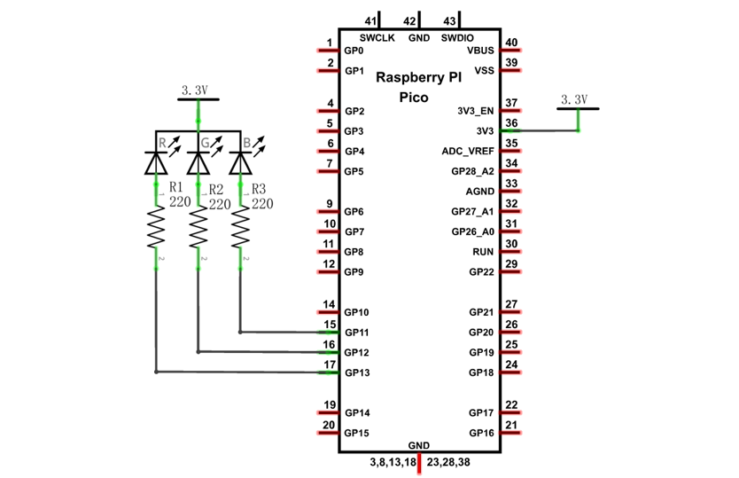
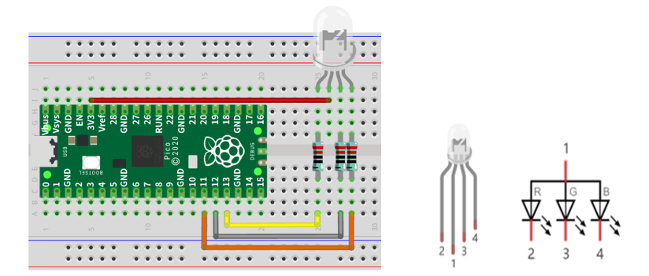
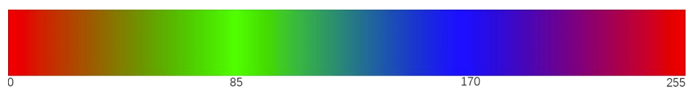

##############################################################################
Chapter RGBLED
##############################################################################

In this chapter, we will learn how to control an RGBLED. It can emit different colors of light. Next, we will use RGBLED to make a multicolored light.

Project Random Color Light
******************************************

In this project, we will make a multicolored LED. And we can control RGBLED to switch different colors automatically.

Component List
=======================================

+-----------------------------------------+----------------+
| Raspberry Pi Pico x1                    | USB Cable x1   |
|                                         |                |
| |Chapter01_08|                          | |Chapter01_09| |
+-----------------------------------------+----------------+
| Breadboard x1                                            |
|                                                          |
| |Chapter01_10|                                           |
+----------------------+------------------+----------------+
| RGBLED x1            | Resistor 220Ω x3 | Jumper         |
|                      |                  |                |
| |Chapter05_00|       | |Chapter01_12|   | |Chapter01_13| |
+----------------------+------------------+----------------+

.. |Chapter01_08| image:: ../_static/imgs/1_LED/Chapter01_08.png
.. |Chapter01_09| image:: ../_static/imgs/1_LED/Chapter01_09.png
.. |Chapter01_10| image:: ../_static/imgs/1_LED/Chapter01_10.png
.. |Chapter01_12| image:: ../_static/imgs/1_LED/Chapter01_12.png
.. |Chapter01_13| image:: ../_static/imgs/1_LED/Chapter01_13.png
.. |Chapter05_00| image:: ../_static/imgs/5_RGBLED/Chapter05_00.png

Related Knowledge
==================================

RGB LED has integrated three LEDs that can respectively emit red, green and blue light. It has four pins. The long pin (1) is the common port, that is, 3 LED's positive or negative port. The RGB LED with common positive port and its symbol is shown below. We can make RGB LED emit various colors of light by controlling these three LEDs to emit light with different brightness. 

.. image:: ../_static/imgs/5_RGBLED/Chapter05_01.png
    :align: center

Red, green, and blue light are known as three primary colors. When you combine these three primary-color lights with different brightness, it can produce almost all kinds of visible lights. Computer screens, single pixel of cell phone screen, neon, etc. are working under this principle.

.. image:: ../_static/imgs/5_RGBLED/Chapter05_02.png
    :align: center

If we use three 8-bit PWMs to control the RGB LED, in theory, we can create 28*28*28=16777216 (16 million) colors through different combinations.

Circuit
==================================

.. list-table::
   :width: 100%
   :align: center
   
   * -  Schematic diagram
   * -  |Chapter05_03|
   * -  Hardware connection. 
       
        :red:`If you need any support, please contact us via:` support@freenove.com
   * -  |Chapter05_04|
    

.. note::
    
    :red:`To help users have a better experience when doing the projects, we have made some modifications to Pico's simulation diagram. Please note that there are certain differences between the simulation diagram and the actual board to avoid misunderstanding.`

:red:`If LEDbar does not work, try to rotate LEDbar for 180°. The label is random.`

Sketch
==============================

.. raw:: html

    <iframe style="display: block; margin: 0 auto;" height="421.875" width="750" src="https://www.youtube.com/embed/8Xtbtbn3ajo" frameborder="0" allowfullscreen></iframe>

We need to create three PWM channels and use random duty cycle to make random RGB LED color.

Sketch_ColorfulLight
------------------------------

With the code downloaded to Pico, RGB LED begins to display random colors.

The following is the program code:

.. literalinclude:: ../../../freenove_Kit/C/Sketches/Sketch_05.1_RandomColorLight/Sketch_05.1_RandomColorLight.ino
    :linenos: 
    :language: c
    :dedent:

Define pins to control RGB LED, and configure them as output mode.

.. literalinclude:: ../../../freenove_Kit/C/Sketches/Sketch_05.1_RandomColorLight/Sketch_05.1_RandomColorLight.ino
    :linenos: 
    :language: c
    :lines: 7-13
    :dedent:

In setColor(), this function controls the output color of RGB LED by the given color value. Because the circuit uses a common anode, the LED lights up when the GPIO outputs low power. Therefore, in PWM, low level is the active level, so 255 minus the given value is necessary.

.. literalinclude:: ../../../freenove_Kit/C/Sketches/Sketch_05.1_RandomColorLight/Sketch_05.1_RandomColorLight.ino
    :linenos: 
    :language: c
    :lines: 23-27
    :dedent:

In loop(), get three random Numbers and set them as color values.

.. literalinclude:: ../../../freenove_Kit/C/Sketches/Sketch_05.1_RandomColorLight/Sketch_05.1_RandomColorLight.ino
    :linenos: 
    :language: c
    :lines: 16-20
    :dedent:

The related function of software PWM can be described as follows:

.. py:function:: long random(min, max);	

    This function will return a random number(min --- max-1).

Project Gradient Color Light
******************************************

In the previous project, we have mastered the usage of RGBLED, but the random color display is rather stiff. This project will realize a fashionable Light with soft color changes.

Component list, the circuit is the same as the project random color light.

Using a color model, the color changes from 0 to 255 as shown below. 

Sketch
==================================

.. raw:: html

    <iframe style="display: block; margin: 0 auto;" height="421.875" width="750" src="https://www.youtube.com/embed/8Xtbtbn3ajo" frameborder="0" allowfullscreen></iframe>

In this code, the color model will be implemented and RGBLED will change colors along the model.

Sketch_SoftColorfulLight
-----------------------------------

The following is the program code:

.. literalinclude:: ../../../freenove_Kit/C/Sketches/Sketch_05.2_GradientColorLight/Sketch_05.2_GradientColorLight.ino
    :linenos: 
    :language: c
    :dedent:

In setColor(), a variable represents the value of RGB, and a hexadecimal representation of color is a common representation, such as 0xAABBCC, where AA represents the red value, BB represents the green value, and CC represents the blue value. The use of a variable can make the transmission of parameters more convenient, in the split, only a simple operation can take out the value of each color channel

.. literalinclude:: ../../../freenove_Kit/C/Sketches/Sketch_05.2_GradientColorLight/Sketch_05.2_GradientColorLight.ino
    :linenos: 
    :language: c
    :lines: 21-25
    :dedent:

The wheel() function is the color selection method for the color model introduced earlier. The pos parameter ranges from 0 to 255 and outputs a color value in hexadecimal.

.. literalinclude:: ../../../freenove_Kit/C/Sketches/Sketch_05.2_GradientColorLight/Sketch_05.2_GradientColorLight.ino
    :linenos: 
    :language: c
    :lines: 27-38
    :dedent: