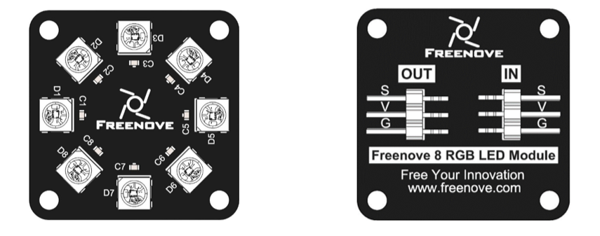
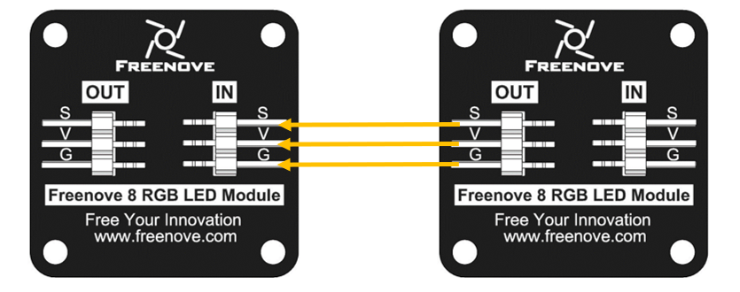
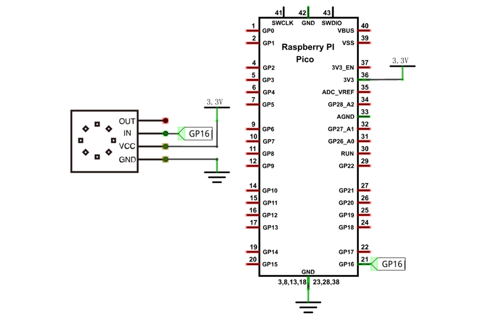
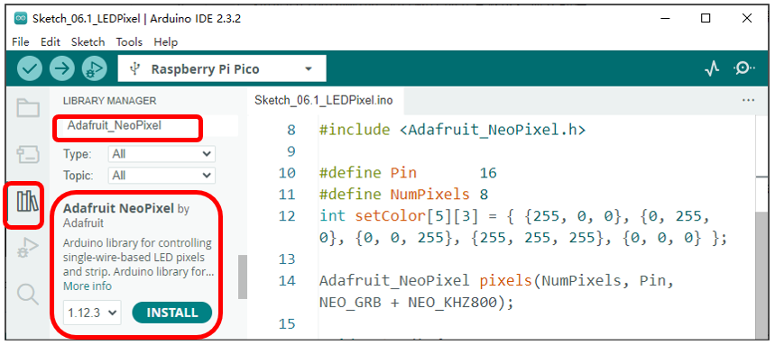

##############################################################################
Chapter NeoPixel
##############################################################################

This chapter will help you learn to use a more convenient RGBLED lamp, which requires only one GPIO control and can be connected in infinite series in theory. Each LED can be controlled independently.

Project NeoPixel
*************************************
Learn the basic usage of NeoPixel and use it to blink red, green, blue and white.

Component List
=======================================

+-----------------------------------------+----------------+
| Raspberry Pi Pico x1                    | USB Cable x1   |
|                                         |                |
| |Chapter01_08|                          | |Chapter01_09| |
+-----------------------------------------+----------------+
| Breadboard x1                                            |
|                                                          |
| |Chapter01_10|                                           |
+-----------------------------------------+----------------+
| Freenove 8 RGB LED Module x1            | Jumper         |
|                                         |                |
| |Chapter06_00|                          | |Chapter06_01| |
+-----------------------------------------+----------------+

.. |Chapter01_08| image:: ../_static/imgs/1_LED/Chapter01_08.png
.. |Chapter01_09| image:: ../_static/imgs/1_LED/Chapter01_09.png
.. |Chapter01_10| image:: ../_static/imgs/1_LED/Chapter01_10.png
.. |Chapter01_12| image:: ../_static/imgs/1_LED/Chapter01_12.png
.. |Chapter01_13| image:: ../_static/imgs/1_LED/Chapter01_13.png
.. |Chapter06_00| image:: ../_static/imgs/6_NeoPixel/Chapter06_00.png
.. |Chapter06_01| image:: ../_static/imgs/6_NeoPixel/Chapter06_01.png

Related Knowledge
======================================

Freenove 8 RGB LED Module  
----------------------------------------

The Freenove 8 RGB LED Module is as below. You can use only one data pin to control eight LEDs on the module. As shown below:

And you can also control many modules at the same time. Just connect OUT pin of one module to IN pin of another module. In this way, you can use one data pin to control 8, 16, 32 … LEDs.

:orange:`Pin description:`

+---------------------------------------+---------------------------------------+
| (IN)                                  | (OUT)                                 |
+--------+------------------------------+--------+------------------------------+
| symbol | Function                     | symbol | Function                     |
+--------+------------------------------+--------+------------------------------+
| S      | Input control signal         | S      | Output control signal        |
+--------+------------------------------+--------+------------------------------+
| V      | Power supply pin, +3.3V~5.5V | V      | Power supply pin, +3.3V~5.5V |
+--------+------------------------------+--------+------------------------------+
| G      | GND                          | G      | GND                          |
+--------+------------------------------+--------+------------------------------+

Circuit
===============================

.. list-table::
   :width: 100%
   :align: center
   
   * -  Schematic diagram
   * -  |Chapter06_04|
   * -  Hardware connection. 
       
        :red:`If you need any support, please contact us via:` support@freenove.com
   * -  |Chapter06_05|
    

.. |Chapter06_05| image:: ../_static/imgs/6_NeoPixel/Chapter06_05.png

Sketch
==============================

.. raw:: html

    <iframe style="display: block; margin: 0 auto;" height="421.875" width="750" src="https://www.youtube.com/embed/1L9SKbERWTg" frameborder="0" allowfullscreen></iframe>

This code uses a library named " **Adafruit_NeoPixel** ". If you have not installed it, please do so first.

Library is an important feature of the open source world, and we know that Arduino is an open source platform that everyone can contribute to. Libraries are generally licensed under the LGPL, which means you can use them for free to apply to your creations.

How to install the library
-------------------------------

There are two ways to add libraries.

The first way, open Arduino IDE, click **Library Manager** on the left, input " **Adafruit_NeoPixel** " in the search bar and select " **Adafruit_NeoPixel** " to install, as shown below.

The second way, open Arduino IDE, click Sketch->Include Library->Add .ZIP Library. In the pop-up window, find the file named "./Libraries/ Adafruit_NeoPixel-V1.12.3.Zip" which locates in this directory, and click OPEN.

Sketch_LEDPixel
-----------------------------

Download the code to Pico and RGB LED begins to light up in red, green, blue, white and black.

The following is the program code:

.. literalinclude:: ../../../freenove_Kit/C/Sketches/Sketch_06.1_LEDPixel/Sketch_06.1_LEDPixel.ino
    :linenos: 
    :language: c
    :dedent:

To use some libraries, first you need to include the library's header file.

.. literalinclude:: ../../../freenove_Kit/C/Sketches/Sketch_06.1_LEDPixel/Sketch_06.1_LEDPixel.ino
    :linenos: 
    :language: c
    :lines: 8-8
    :dedent:

Define the pins connected to the ring, the number of LEDs on the ring.

.. literalinclude:: ../../../freenove_Kit/C/Sketches/Sketch_06.1_LEDPixel/Sketch_06.1_LEDPixel.ino
    :linenos: 
    :language: c
    :lines: 10-11
    :dedent:

Apply for an object that controls the RGB LED ring, and assign the number of LEDs, the number of pins that control the LEDs, and the control mode of the LEDs to the object.

.. literalinclude:: ../../../freenove_Kit/C/Sketches/Sketch_06.1_LEDPixel/Sketch_06.1_LEDPixel.ino
    :linenos: 
    :language: c
    :lines: 14-14
    :dedent:

Define the color values to be used, as red, green, blue, white, and black.

.. literalinclude:: ../../../freenove_Kit/C/Sketches/Sketch_06.1_LEDPixel/Sketch_06.1_LEDPixel.ino
    :linenos: 
    :language: c
    :lines: 12-12
    :dedent:

Initialize pixels() in setup() and set the brightness.

.. literalinclude:: ../../../freenove_Kit/C/Sketches/Sketch_06.1_LEDPixel/Sketch_06.1_LEDPixel.ino
    :linenos: 
    :language: c
    :lines: 17-18
    :dedent:

In the loop(), there are two "for" loops, the internal for loop is to light the LED one by one, and the external for loop to switch colors. setPixelColor() is used to set the color, but it does not change immediately. Only when show() is called will the color data be sent to the LED to change the color.

.. literalinclude:: ../../../freenove_Kit/C/Sketches/Sketch_06.1_LEDPixel/Sketch_06.1_LEDPixel.ino
    :linenos: 
    :language: c
    :lines: 22-29
    :dedent:

Reference
------------------------------

.. py:function:: Adafruit_NeoPixel(uint16_t n, int16_t pin = 6,neoPixelType type = NEO_GRB + NEO_KHZ800)	
    
    Constructor to create a NeoPixel object.
    
    Before each use of the constructor, please add "Adafruit_NeoPixel.h"
    
    **Parameters**
    
    **n:** The number of led.
    
    **pin_gpio:** A pin connected to an LED.
    
    **type:** Types of LED.
    
        :red:`NEO_RGB:` The sequence of NeoPixel module loading color is red, green and blue.
        
        :red:`NEO_RBG:` The sequence of NeoPixel module loading color is red, blue and green.
        
        :red:`NEO_GRB:` The sequence of NeoPixel module loading color is green, red and blue.
        
        :red:`TYPE_GBR:` The sequence of NeoPixel module loading color is green, blue and red.
        
        :red:`NEO_BRG:` The sequence of NeoPixel module loading color is blue, red and green. 
        
        :red:`NEO_BGR:` The sequence of NeoPixel module loading color is blue, green and red. 

.. py:function:: void begin(void);	
    
    Initialize the NeoPixel object

.. py:function:: void setPixelColor (u8 index, u8 r, u8 g, u8 b);
.. py:function:: void setPixelColor (u8 index, u32 rgb);
.. py:function:: void setPixelColor (u8 index, u8 r, u8 g, u8 b, u8 w);	
    
    Set the color of LED with order number n.

.. py:function:: void show(void);	

    Send the color data to the led and display the set color immediately.

.. py:function:: void setBrightness(uint8_t);	
    
    Set the brightness of the LED.

If you want to learn more about this library, you can visit the following website: https://github.com/adafruit/Adafruit_NeoPixel

Project Rainbow Light
**************************************

In the previous project, we have mastered the usage of NeoPixel. This project will realize a slightly complicated Rainbow Light. The component list and the circuit are exactly the same as the project NeoPixel.

Sketch
===============================

.. raw:: html

    <iframe style="display: block; margin: 0 auto;" height="421.875" width="750" src="https://www.youtube.com/embed/1L9SKbERWTg" frameborder="0" allowfullscreen></iframe>

Continue to use the following color model to equalize the color distribution of the eight LEDs and gradually change.

.. image:: ../_static/imgs/6_NeoPixel/Chapter06_10.png
    :align: center

Sketch_RainbowLight
--------------------------------

Download the code to Pico, and the Freenove 8 RGB LED Strip displays different colors and the color changes gradually.

The following is the program code:

.. literalinclude:: ../../../freenove_Kit/C/Sketches/Sketch_06.2_RainbowLight/Sketch_06.2_RainbowLight.ino
    :linenos: 
    :language: c
    :dedent:

In the loop(), two "for" loops are used, the internal "for" loop(for-j) is used to set the color of each LED, and the external "for" loop(for-i) is used to change the color, in which the self-increment value in i+=1 can be changed to change the color step distance. Changing the delay parameter changes the speed of the color change. Wheel(((i * 256 / 8) + j)%255) will take color from the color model at equal intervals starting from i.

.. literalinclude:: ../../../freenove_Kit/C/Sketches/Sketch_06.2_RainbowLight/Sketch_06.2_RainbowLight.ino
    :linenos: 
    :language: c
    :lines: 22-29
    :dedent: