##############################################################################
Chapter Buzzer
##############################################################################

In this chapter, we will learn about buzzers and the sounds they make.

Project Doorbell
*******************************

We will make this kind of doorbell: when the button is pressed, the buzzer sounds; and when the button is released, the buzzer stops sounding.

Component List
=======================================

+-----------------------------------------+------------------+
| Raspberry Pi Pico x1                    |   USB Cable x1   |
|                                         |                  |
| |Chapter01_08|                          |   |Chapter01_09| |
+-----------------------------------------+------------------+
| Breadboard x1                                              |
|                                                            |
| |Chapter01_10|                                             |
+----------------------+------------------+------------------+
| Active buzzer x1     | Resistor 10kΩ x2 |   Jumper         |
|                      |                  |                  |
| |Chapter07_00|       | |Chapter02_01|   |   |Chapter01_13| |
+----------------------+------------------+------------------+
| Push button x1       | Resistor 1kΩ x1  | NPN transistor x1|
|                      |                  |                  |
| |Chapter02_11|       | |Chapter02_01|   |   |Chapter07_01| |
+----------------------+------------------+------------------+

.. |Chapter01_08| image:: ../_static/imgs/1_LED/Chapter01_08.png
.. |Chapter01_09| image:: ../_static/imgs/1_LED/Chapter01_09.png
.. |Chapter01_10| image:: ../_static/imgs/1_LED/Chapter01_10.png
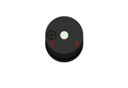
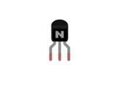
.. |Chapter01_12| image:: ../_static/imgs/1_LED/Chapter01_12.png
.. |Chapter01_13| image:: ../_static/imgs/1_LED/Chapter01_13.png
.. |Chapter02_01| image:: ../_static/imgs/2_Button_&_LED/Chapter02_01.png
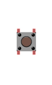

Component Knowledge
=====================================

Buzzer
-----------------------------------

Buzzer is a sounding component, which is widely used in electronic devices such as calculator, electronic warning clock and alarm. Buzzer has two types: active and passive. Active buzzer has oscillator inside, which will sound as long as it is supplied with power. Passive buzzer requires external oscillator signal (generally use PWM with different frequency) to make a sound.

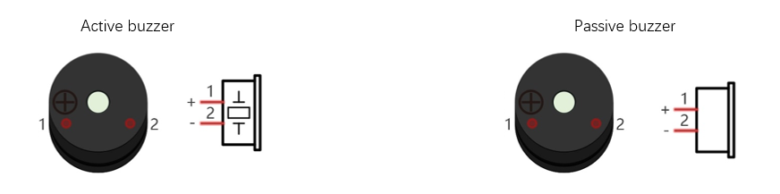

Active buzzer is easy to use. Generally, it can only make a specific frequency of sound. Passive buzzer requires an external circuit to make a sound, but it can be controlled to make a sound with different frequency. The resonant frequency of the passive buzzer is 2 kHz, which means the passive buzzer is loudest when its resonant frequency is 2 kHz.

Next, we will use an active buzzer to make a doorbell and a passive buzzer to make an alarm.

:red:`How to identify active and passive buzzer?`

1.	Usually, there is a label on the surface of active buzzer covering the vocal hole, but this is not an absolute judgment method.

2.	Active buzzers are more complex than passive buzzers in their manufacture. There are many circuits and crystal oscillator elements inside active buzzers; all of this is usually protected with a waterproof coating (and a housing) exposing only its pins from the underside. On the other hand, passive buzzers do not have protective coatings on their underside. From the pin holes viewing of a passive buzzer, you can see the circuit board, coils, and a permanent magnet (all or any combination of these components depending on the model.

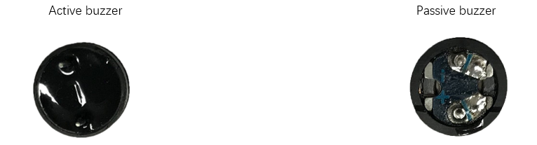

Transistor
-------------------------------

Because the buzzer requires such large current that GP of Raspberry Pi Pico output capability cannot meet the requirement, a transistor of NPN type is needed here to amplify the current.

Transistor, the full name: semiconductor transistor, is a semiconductor device that controls current. Transistor can be used to amplify weak signal, or works as a switch. It has three electrodes(PINs): base (b), collector (c) and emitter (e). When there is current passing between "be", "ce" will allow several-fold current (transistor magnification) pass, at this point, transistor works in the amplifying area. When current between "be" exceeds a certain value, "ce" will not allow current to increase any longer, at this point, transistor works in the saturation area. Transistor has two types as shown below: PNP and NPN.

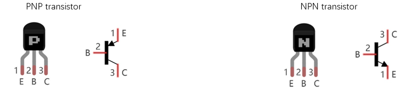

:red:`In our kit, the PNP transistor is marked with 8550, and the NPN transistor is marked with 8050.`

Based on the transistor's characteristics, it is often used as a switch in digital circuits. As micro-controller's capacity to output current is very weak, we will use transistor to amplify current and drive large-current components.

When using NPN transistor to drive buzzer, we often adopt the following method. If GP outputs high level, current will flow through R1, the transistor will be conducted, and the buzzer will sound. If GP outputs low level, no current flows through R1, the transistor will not be conducted, and buzzer will not sound.

When using PNP transistor to drive buzzer, we often adopt the following method. If GP outputs low level, current will flow through R1, the transistor will be conducted, and the buzzer will sound. If GP outputs high level, no current flows through R1, the transistor will not be conducted, and buzzer will not sound.

.. list-table::
   :width: 100%
   :align: center
   
   * -  NPN transistor to drive buzzer
     -  PNP transistor to drive buzzer
   
   * -  |Chapter07_05|
     -  |Chapter07_06| 
    
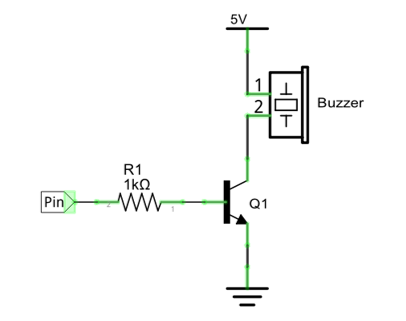
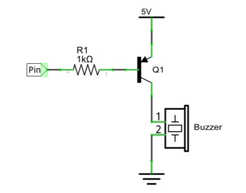

Circuit
===============================

.. list-table::
   :width: 100%
   :align: center
   
   * -  Schematic diagram
   * -  |Chapter07_07|
   * -  Hardware connection. 
       
        :red:`If you need any support, please contact us via:` support@freenove.com
   * -  |Chapter07_08|
    
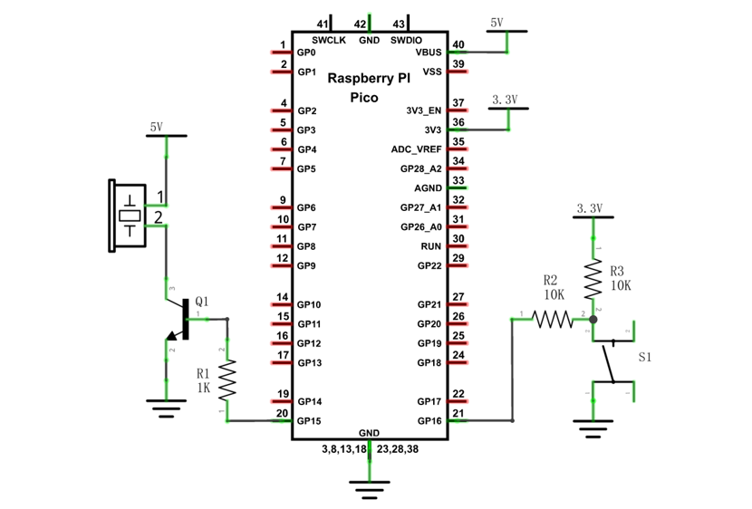
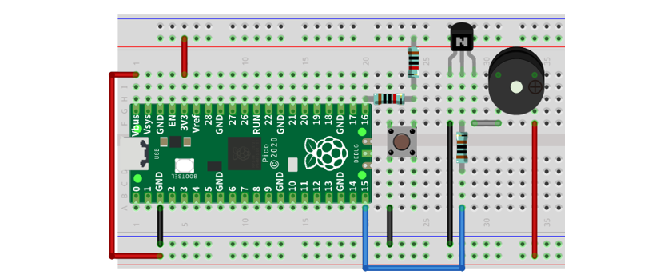

.. note:: 

    1.	In this circuit, the power supply for buzzer is 5V, and pull-up resistor of the button connected to the power 3.3V. The buzzer can work when connected to power 3.3V, but it will reduce the loudness.
    
    2.	VBUS should be connect to the positive end of USB cable. If it connects to GND, it may burn the computer or Raspberry Pi Pico. Similarly, please be careful when wiring pins 36-40 of Pico to avoid short circuit. 

Sketch
=============================

In this project, a buzzer will be controlled by a push button switch. When the button switch is pressed, the buzzer sounds and when the button is released, the buzzer stops. It is analogous to our earlier project that controlled an LED ON and OFF.

Sketch_Doorbell
------------------------------

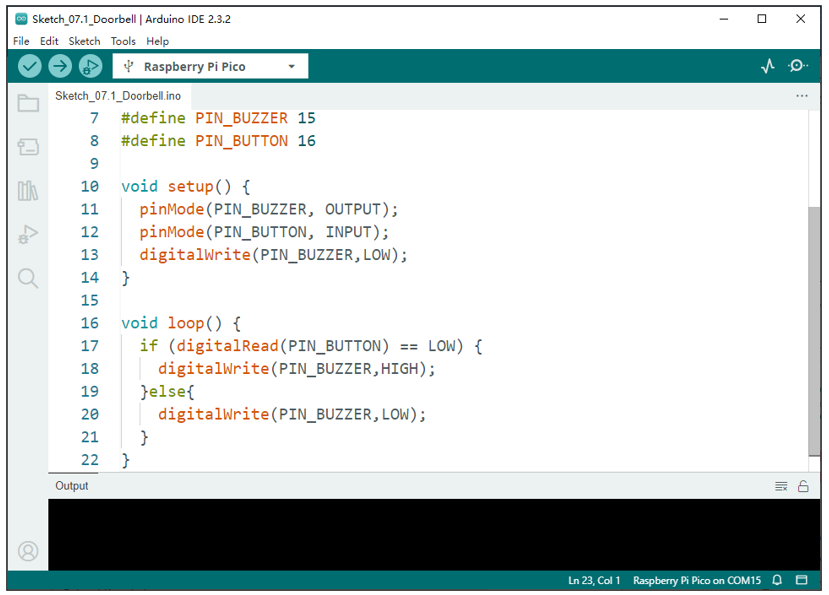

Download the code to Pico, press the push button switch and the buzzer will sound. Release the push button switch and the buzzer will stop.

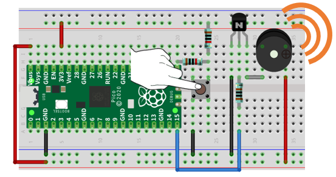

The following is the program code:

.. literalinclude:: ../../../freenove_Kit/C/Sketches/Sketch_07.1_Doorbell/Sketch_07.1_Doorbell.ino
    :linenos: 
    :language: c
    :dedent:

The code is logically the same as using button to control LED. 

Project Alertor
*****************************

Next, we will use a passive buzzer to make an alarm.

Component list and the circuit part is similar to last section, only the active buzzer needs to be replaced with a passive buzzer for this project.

Component List
============================

+-----------------------------------------+------------------+
| Raspberry Pi Pico x1                    |   USB Cable x1   |
|                                         |                  |
| |Chapter01_08|                          |   |Chapter01_09| |
+-----------------------------------------+------------------+
| Breadboard x1                                              |
|                                                            |
| |Chapter01_10|                                             |
+----------------------+------------------+------------------+
| Active buzzer x1     | Resistor 10kΩ x2 |   Jumper         |
|                      |                  |                  |
| |Chapter07_00|       | |Chapter02_01|   |   |Chapter01_13| |
+----------------------+------------------+------------------+
| Push button x1       | Resistor 1kΩ x1  | NPN transistor x1|
|                      |                  |                  |
| |Chapter02_11|       | |Chapter02_01|   |   |Chapter07_01| |
+----------------------+------------------+------------------+

Circuit
===============================

.. list-table::
   :width: 100%
   :align: center
   
   * -  Schematic diagram
   * -  |Chapter07_11|
   * -  Hardware connection. 
       
        :red:`If you need any support, please contact us via:` support@freenove.com
   * -  |Chapter07_12|
    
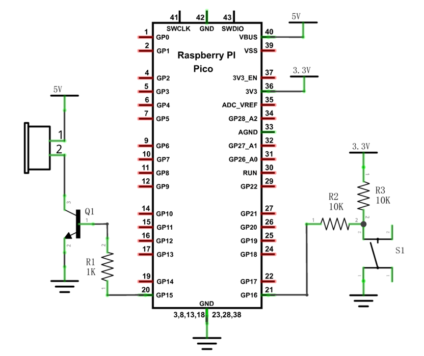
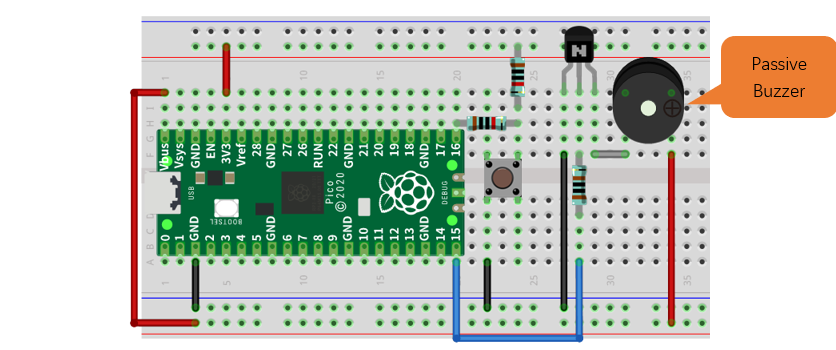

Sketch
===============================

In this project, the buzzer alarm is controlled by the button. Press the button, then buzzer sounds. If you release the button, the buzzer will stop sounding. It is logically the same as using button to control LED, but in the control method, passive buzzer requires PWM of certain frequency to sound.

Sketch_Alertor
-------------------------------

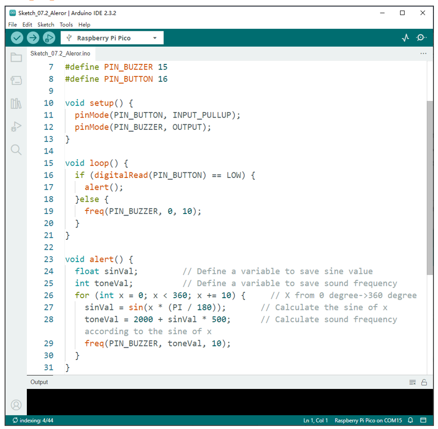

Download the code to Pico, press the button, and then alarm sounds; when the button is released, the alarm will stop sounding.

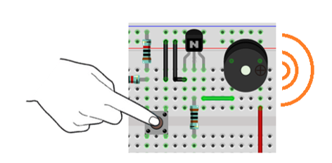

The following is the program code:

.. literalinclude:: ../../../freenove_Kit/C/Sketches/Sketch_07.2_Aleror/Sketch_07.2_Aleror.ino
    :linenos: 
    :language: c
    :dedent:

Define the button and pin to control the passive buzzer.

.. literalinclude:: ../../../freenove_Kit/C/Sketches/Sketch_07.2_Aleror/Sketch_07.2_Aleror.ino
    :linenos: 
    :language: c
    :lines: 7-8
    :dedent:

Write a function to drive the passive buzzer with a duty cycle of 50%. The delayMicroseconds() function is in 1us. 1 s = 1000000 us. By the formula T=1/f, when the frequency is fixed, the PWM period T is also fixed.

.. literalinclude:: ../../../freenove_Kit/C/Sketches/Sketch_07.2_Aleror/Sketch_07.2_Aleror.ino
    :linenos: 
    :language: c
    :lines: 33-45
    :dedent:

The frequency curve of the alarm is based on the sine curve. We need to calculate the sine value from 0 to 360 degree and multiply a certain value (here it is 500) and plus the resonant frequency of buzzer. 

.. literalinclude:: ../../../freenove_Kit/C/Sketches/Sketch_07.2_Aleror/Sketch_07.2_Aleror.ino
    :linenos: 
    :language: c
    :lines: 23-31
    :dedent:

In the loop() function, when the button is pressed, subfunction alert() will be called and the alertor will issue a warning sound; otherwise, it stops the buzzer. 

.. literalinclude:: ../../../freenove_Kit/C/Sketches/Sketch_07.2_Aleror/Sketch_07.2_Aleror.ino
    :linenos: 
    :language: c
    :lines: 16-20
    :dedent: