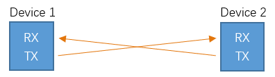
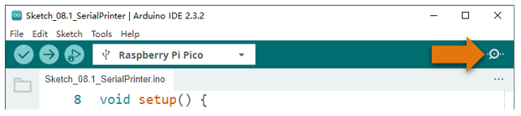
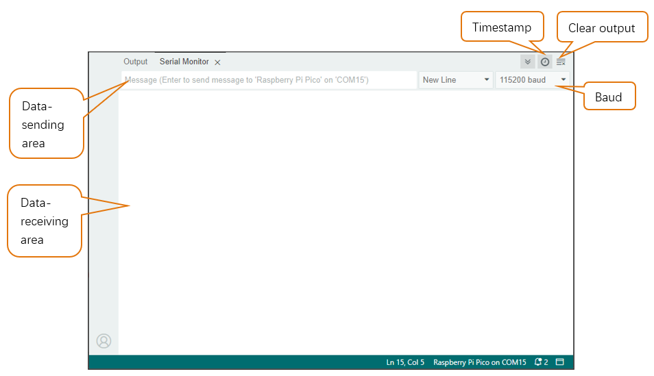
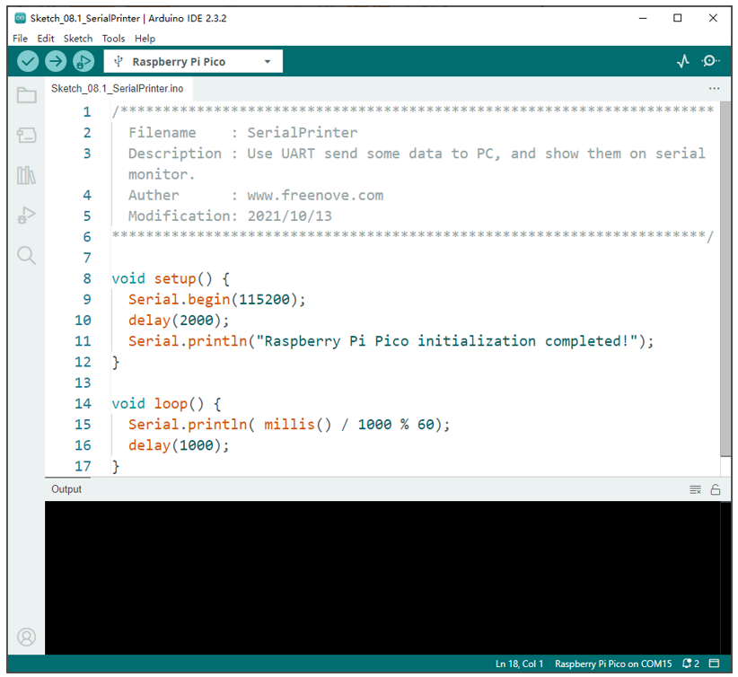
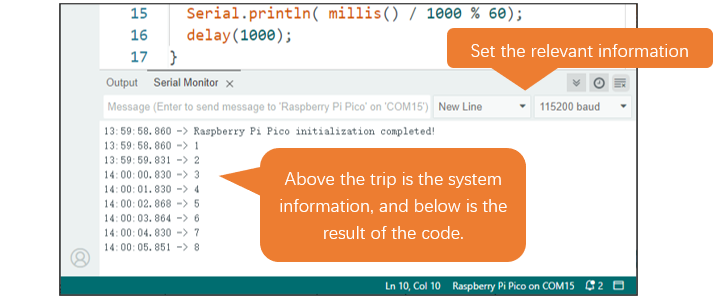
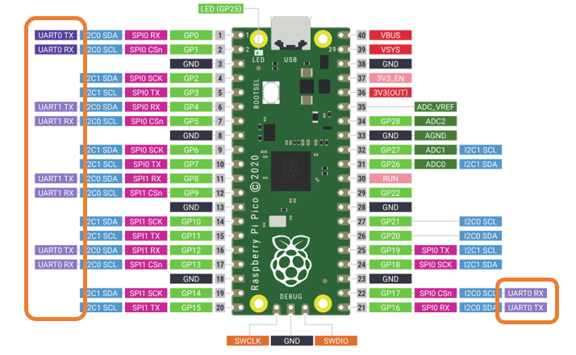
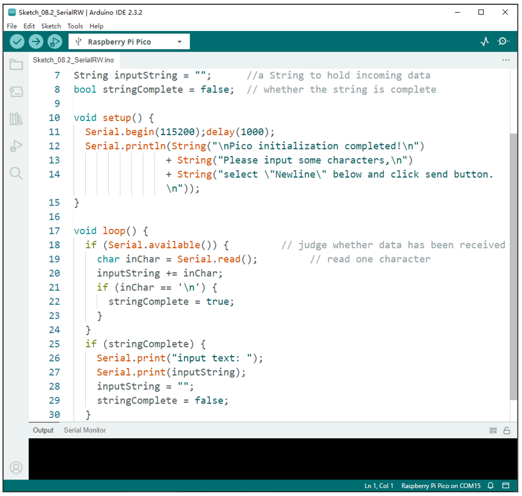
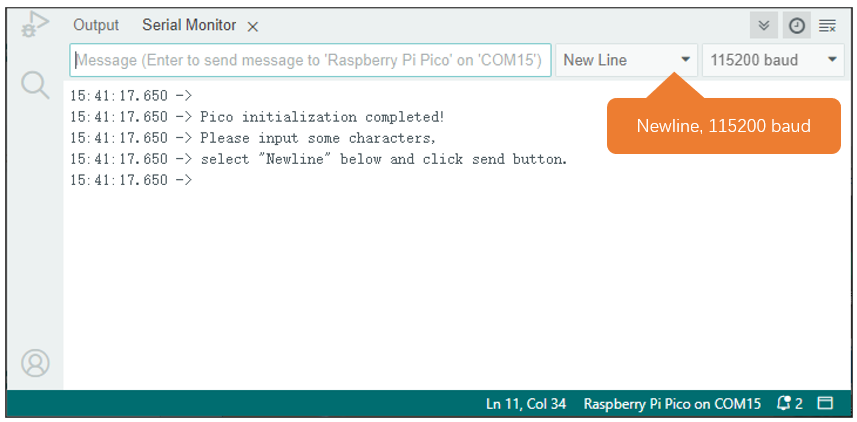
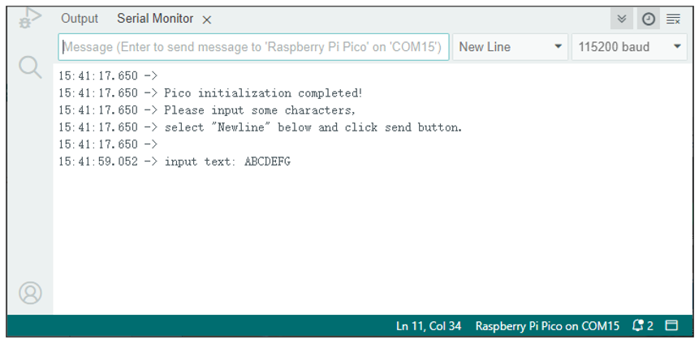

##############################################################################
Chapter Serial Communication
##############################################################################

Serial Communication is a means of Communication between different devices. This section describes Raspberry Pi Pico Serial Communication.

Project Serial Print
*****************************************

This project uses Raspberry Pi Pico serial communicator to send data to the computer and print it on the serial monitor.

Component List
====================================

.. list-table::
   :width: 100%
   :header-rows: 1 
   :align: center
   
   * -  Raspberry Pi Pico x1
     -  USB cable x1
   
   * -  |Chapter01_08|
     -  |Chapter01_09|

.. |Chapter01_08| image:: ../_static/imgs/1_LED/Chapter01_08.png
.. |Chapter01_09| image:: ../_static/imgs/1_LED/Chapter01_09.png

Related Knowledge
===================================

Serial communication
------------------------------------

Serial communication generally refers to the Universal Asynchronous Receiver/Transmitter (UART), which is commonly used in electronic circuit communication. It has two communication lines; one is responsible for sending data (TX line) and the other for receiving data (RX line). The serial communication connections two devices use is as follows:

Before serial communication starts, the baud rate of both sides must be the same. Communication between devices can work only if the same baud rate is used. The baud rates commonly used is 9600 and 115200.

Serial port on Raspberry Pi Pico
--------------------------------------

Raspberry Pi Pico has integrated USB to serial transfer, so it could communicate with computer connecting to USB cable.

.. image:: ../_static/imgs/8_Serial_Communication/Chapter08_01.png
    :align: center

Arduino Software also uploads code to Pico through the serial connection.

Your computer identifies serial devices connecting to it as COMx. We can use the Serial Monitor window of Arduino Software to communicate with Pico, connect Pico to computer through the USB cable, choose the correct device, and then click the Serial Monitor icon to open the Serial Monitor window.

Interface of serial monitor window is as follows. If you cannot open it, make sure Pico has been connected to the computer, and choose the right serial port in the menu bar "Tools".

Circuit
============================

Connect Raspberry Pi Pico to the computer with USB cable.

.. image:: ../_static/imgs/8_Serial_Communication/Chapter08_04.png
    :align: center

Sketch
============================

Sketch_SerialPrinter
------------------------------

Download the code to Pico, open the serial port monitor, set the baud rate to 115200. As shown in the following picture:

As shown above, when the code runs, the data is printed every one second.

Reference
----------------------------

.. py:function:: void begin(unsigned long baud, uint32_t config=SERIAL_8N1, int8_t rxPin=-1, int8_t txPin=-1, bool invert=false, unsigned long timeout_ms = 20000UL);	

    Initializes the serial port. Parameter baud is baud rate; other parameters generally use the default value.

.. py:function:: size_t println( arg );	

    Print to the serial port and wrap. The parameter arg can be a number, a character, a string, an array of characters, etc.

.. py:function:: size_t printf(const char * format, ...)  __attribute__ ((format (printf, 2, 3)));	

    Print formatted content to the serial port in the same way as print in standard C.

.. py:function:: unsigned long millis();	

    Returns the number of milliseconds since the current system was booted.

For details, please refer to :ref:`UART, I2C, SPI default pin<defaultPin>` .

You can change settings according to the distribution of pins.

Project Serial Read and Write
********************************************

From last section, we use serial port on Pico to send data to a computer, now we will use that to receive data from computer.  Component and circuit are the same as in the previous project.

Sketch
====================================

Sketch_SerialRW
-------------------------------------

Download the code to Pico, open the serial monitor, and set the bottom to Newline, 115200, as shown in the following picture:

Input texts like "ABCDEFG" in the Message Bar and press Enter to print the data received by Pico.

The following is the program code:

.. literalinclude:: ../../../freenove_Kit/C/Sketches/Sketch_08.2_SerialRW/Sketch_08.2_SerialRW.ino
    :linenos: 
    :language: c
    :dedent:

In loop(), determine whether the serial port has data, if so, read and save the data, and if the newline character is read, print out all the data that has been read.

Reference
------------------------------------------------

.. py:function:: String();	

    Constructs an instance of the String class.

    For more information, please visit

    https://www.arduino.cc/reference/en/language/variables/data-types/stringobject/

.. py:function:: int available(void);	

    Get the number of bytes (characters) available for reading from the serial port. This is data that has already arrived and stored in the serial receive buffer.

.. py:function:: Serial.read();	

    Reads incoming serial data.