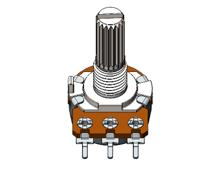
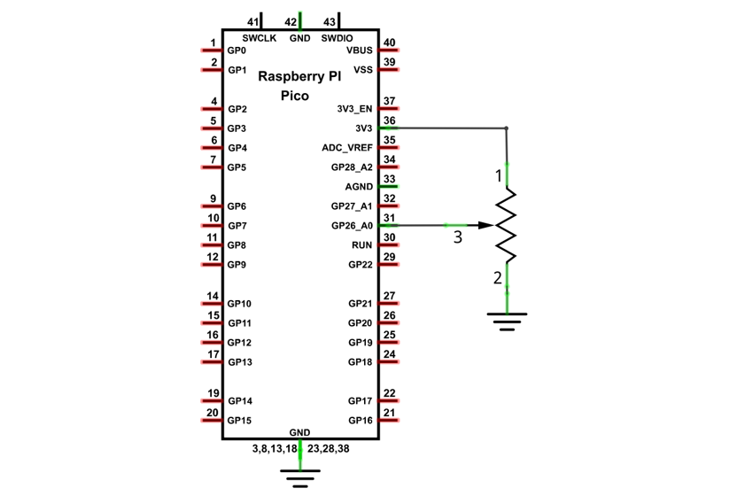
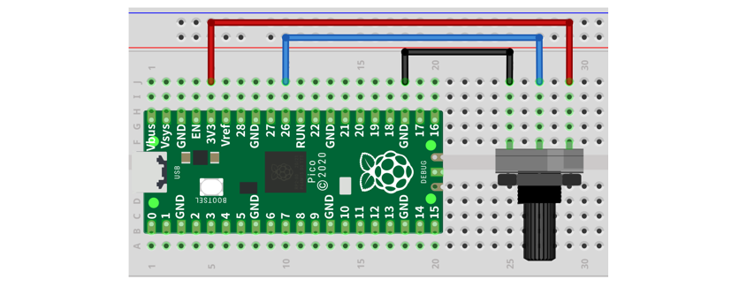
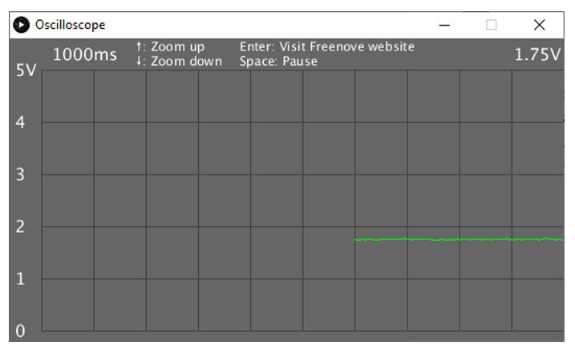
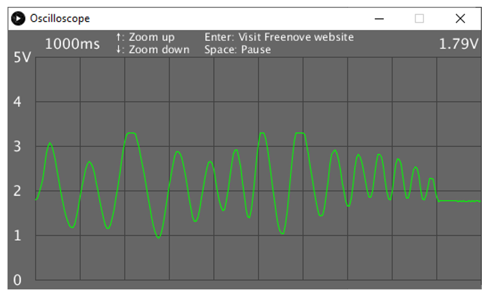

##############################################################################
Chapter Oscilloscope
##############################################################################

In this chapter, we will make a complex virtual instrument, oscilloscope. Oscilloscope is a widely used electronic test instrument. It can get the electrical signals not directly observed into visible image to facilitate the analysis and study of various electrical signals change process.

Project 1.1 Oscilloscope
***********************************

Now, let's use Processing and Raspberry Pi Pico board to create an oscilloscope.

Component List
=================================

+-----------------------------------------+------------------+
| Raspberry Pi Pico x1                    |   USB Cable x1   |
|                                         |                  |
| |Chapter01_08|                          |   |Chapter01_09| |
+-----------------------------------------+------------------+
| Breadboard x1                                              |
|                                                            |
| |Chapter01_10|                                             |
+-----------------------------------------+------------------+
| Rotary potentiometer x1                 |   Jumper         |
|                                         |                  |
|  |Chapter09_00|                         |   |Chapter01_13| |
+-----------------------------------------+------------------+

.. |Chapter01_08| image:: ../_static/imgs/1_LED/Chapter01_08.png
.. |Chapter01_09| image:: ../_static/imgs/1_LED/Chapter01_09.png
.. |Chapter01_10| image:: ../_static/imgs/1_LED/Chapter01_10.png
.. |Chapter01_13| image:: ../_static/imgs/1_LED/Chapter01_13.png

Circuit
========================

Circuit
===============================

.. list-table::
   :width: 100%
   :align: center
   
   * -  Schematic diagram
   * -  |Chapter01_00|
   * -  Hardware connection. 
       
        :red:`If you need any support, please contact us via:` support@freenove.com
   * -  |Chapter01_01|
    

.. note:: 
    
    :red:`To help users have a better experience when doing the projects, we have made some modifications to Pico's simulation diagram. Please note that there are certain differences between the simulation diagram and the actual board to avoid misunderstanding. Thanks for your support to our product.`

Sketch
==============================

Sketch Oscilloscope
-------------------------------

Use Processing to open Freenove_Ultimate_Starter_Kit_for_Raspberry_Pi_Pico\\Processing\\

Processing\\Oscilloscope\\Oscilloscope.pde and click Run. 

If the connection succeeds, it will show as follows:

The green line is the waveform acquisited. Rotate the potentiometer, then you can see changes of the waveform:

The left side of the software interface is a voltage scale, which is used to indicate the voltage of the waveform. The "1000ms" on top left corner is the time of a square, and you can press “↑” and “↓” key on keyboard to adjust it.

The "1.79V" on top right corner is the voltage value of current signal.

You can press the space bar on keyboard to pause the display waveform, which is easy to view and analysis.

We believe that with the help of this oscilloscope, you can obtain more intuitive understanding of the actual work of some electronic circuits. It will help you complete the project and eliminate the trouble. You can export this sketch to an application used as a tool.