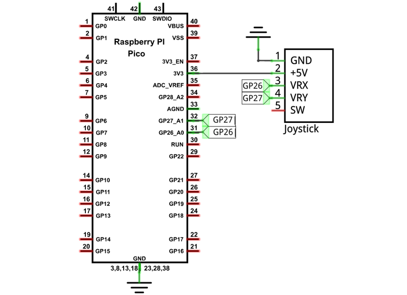
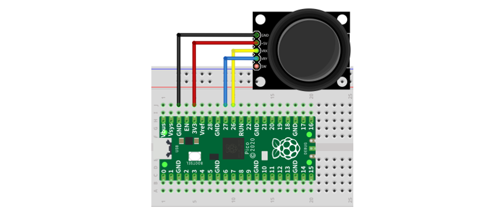
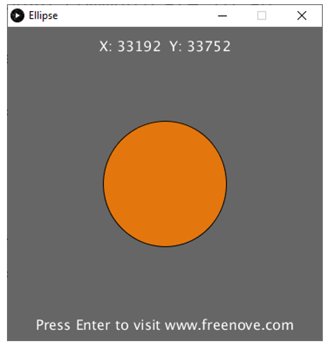
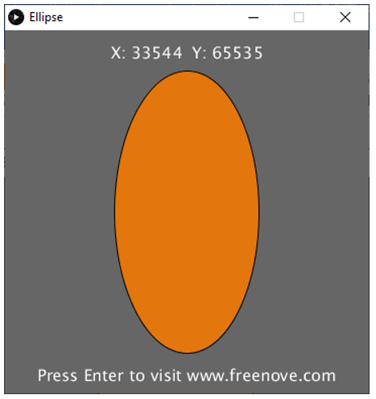
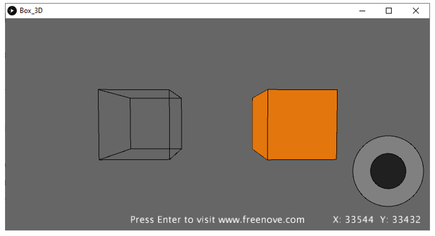
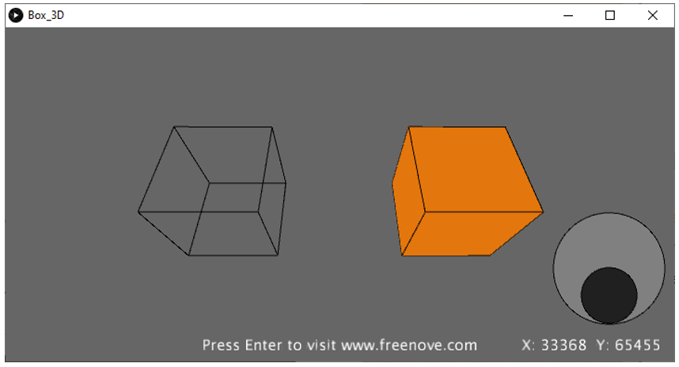

##############################################################################
Chapter Control 2D and 3D Figures
##############################################################################

In this chapter, we will use Raspberry Pi Pico board to make Processing program control figures to change. And we will control 2D and 3D figures, respectively.

Project Ellipse
********************************

First, Control a 2D figures.

Component List
=================================

+-----------------------------------------+----------------+
| Raspberry Pi Pico x1                    | USB Cable x1   |
|                                         |                |
| |Chapter01_08|                          | |Chapter01_09| |
+-----------------------------------------+----------------+
| Breadboard x1                                            |
|                                                          |
| |Chapter01_10|                                           |
+-----------------------------------------+----------------+
| Joystick x1                             | Jumper         |
|                                         |                |
|  |Chapter13_00|                         | |Chapter01_13| |
+-----------------------------------------+----------------+

.. |Chapter01_08| image:: ../_static/imgs/1_LED/Chapter01_08.png
.. |Chapter01_09| image:: ../_static/imgs/1_LED/Chapter01_09.png
.. |Chapter01_10| image:: ../_static/imgs/1_LED/Chapter01_10.png
.. |Chapter01_13| image:: ../_static/imgs/1_LED/Chapter01_13.png
.. |Chapter13_00| image:: ../_static/imgs/13_Joystick/Chapter13_00.png

Circuit
=============================

.. list-table::
   :width: 100%
   :align: center
   
   * -  Schematic diagram
   * -  |Chapter02_00|
        
        :red:`Note: The ADC of Pico can only collect voltage between 0-3.3V. The joystick here uses 3.3V.`
   * -  Hardware connection. 
       
        :red:`If you need any support, please contact us via:` support@freenove.com
   * -  |Chapter02_01|
    

.. note:: 
    
    :red:`The ADC of Pico can only collect voltage between 0-3.3V. The joystick here uses 3.3V.`

Sketch
===============================

Sketch Ellipse
-------------------------------

Use Processing to open **Freenove_Ultimate_Starter_Kit_for_Raspberry_Pi_Pico\\Processing\\**

**Processing\\Ellipse\\Ellipse.pde** and click Run. 

If the connection succeeds, it will show as follows:

Then you can change the ellipse shape by shifting the joystick:

Project Box 3D
************************************

Now control a 3D figure.

Component list
==========================================

The same as last section.

Circuit
=======================================

The same as last section.

Sketch
=======================================

Sketch Box_3D

Use Processing to open **Freenove_Ultimate_Starter_Kit_for_Raspberry_Pi_Pico\\Processing\\**

**Processing\\Box_3D\\Box_3D.pde** and click Run. 

If the connection succeeds, it will show as follows. The left is a 3D box presented by line and the right is a 3D box entity.

Then you can change the space angle of two 3D boxes by shifting the joystick:

