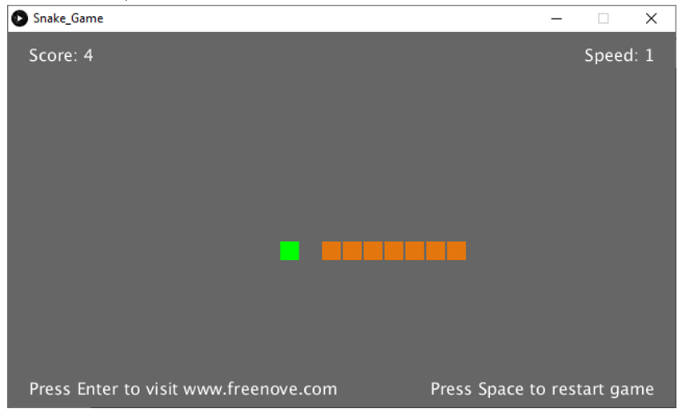

##############################################################################
Chapter Snake Game
##############################################################################

We have learned how to control 2D and 3D figures. Now, we will use Raspberry Pi Pico to play the classic snake game. There are both 2D and 3D versions.

Project Snake Game
***********************************

First, let's play a 2D snake game.

Component List
=================================

+-----------------------------------------+----------------+
| Raspberry Pi Pico x1                    | USB Cable x1   |
|                                         |                |
| |Chapter01_08|                          | |Chapter01_09| |
+-----------------------------------------+----------------+
| Breadboard x1                                            |
|                                                          |
| |Chapter01_10|                                           |
+-----------------------------------------+----------------+
| Joystick x1                             | Jumper         |
|                                         |                |
|  |Chapter13_00|                         | |Chapter01_13| |
+-----------------------------------------+----------------+

.. |Chapter01_08| image:: ../_static/imgs/1_LED/Chapter01_08.png
.. |Chapter01_09| image:: ../_static/imgs/1_LED/Chapter01_09.png
.. |Chapter01_10| image:: ../_static/imgs/1_LED/Chapter01_10.png
.. |Chapter01_13| image:: ../_static/imgs/1_LED/Chapter01_13.png
.. |Chapter13_00| image:: ../_static/imgs/13_Joystick/Chapter13_00.png

Circuit
==========================

.. list-table::
   :width: 100%
   :align: center
   
   * -  Schematic diagram
   * -  |Chapter03_00|
        
        :red:`Note: The ADC of Pico can only collect voltage between 0-3.3V. The joystick here uses 3.3V.`
   * -  Hardware connection. 
       
        :red:`If you need any support, please contact us via:` support@freenove.com
   * -  |Chapter03_01|
    

.. note::
    
    :red:`To help users have a better experience when doing the projects, we have made some modifications to Pico’s simulation diagram. Please note that there are certain differences between the simulation diagram and the actual board to avoid misunderstanding. Thanks for your support to our product.`

Sketch
==========================

Sketch Snake_Game
---------------------------

Use Processing to open Freenove_Ultimate_Starter_Kit_for_Raspberry_Pi_Pico\\Processing\\

Processing\\Snake_Game\\Snake_Game.pde and click Run. 

If the connection succeeds, it will show as follows:

Press the space bar on keyboard to start the game:

Shift the joystick to control the snake's action. The game rules are the same as the classic snake game:

When the game fails, press space bar to restart the game:

Additionally, you can restart the game by pressing the space bar at any time.

Project Snake Game 3D
*************************************

Now, let's experience the 3D version game.

Component List
===============================

The same as last section.

Circuit
==================================

The same as last section.

Sketch
===================================

Sketch Snake_Game_3D
---------------------------------------

Use Processing to open **Freenove_Ultimate_Starter_Kit_for_Raspberry_Pi_Pico\\Processing\\**

**Processing\\Snake_Game_3D\\Snake_Game_3D.pde** and click Run. 

If the connection succeeds, it will show as follows:

Press the space bar on keyboard to start the game:

Shift the joystick to control the snake's action. The game rules are the same as the classic snake game:

The rest operation is the same as the 2D version.