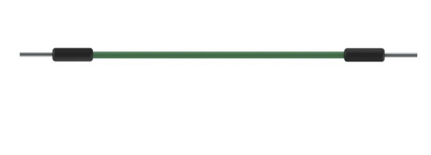
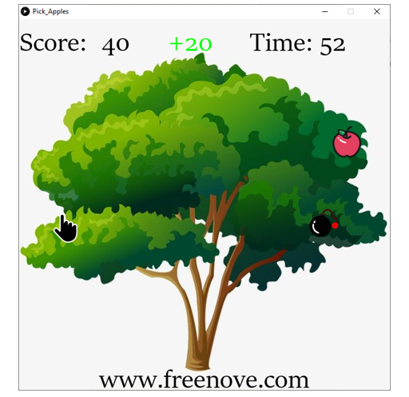

##############################################################################
Chapter Pick Apples
##############################################################################

In this chapter, we prepare pick apples game. You can use the joystick to pick apples.

Project 4.1 Pick Apples
**********************************

Now, let's use Processing and Raspberry Pi Pico to achieve the game.

Component List
===============================

+-----------------------------------------+----------------+
| Raspberry Pi Pico x1                    | USB Cable x1   |
|                                         |                |
| |Chapter01_08|                          | |Chapter01_09| |
+-----------------------------------------+----------------+
| Breadboard x1                                            |
|                                                          |
| |Chapter01_10|                                           |
+-----------------------------------------+----------------+
| Joystick x1                             | Jumper         |
|                                         |                |
|  |Chapter13_00|                         | |Chapter01_13| |
+-----------------------------------------+----------------+

.. |Chapter01_08| image:: ../_static/imgs/1_LED/Chapter01_08.png
.. |Chapter01_09| image:: ../_static/imgs/1_LED/Chapter01_09.png
.. |Chapter01_10| image:: ../_static/imgs/1_LED/Chapter01_10.png

Circuit
==========================

.. list-table::
   :width: 100%
   :align: center
   
   * -  Schematic diagram
   * -  |Chapter04_00|
        
        :red:`Note: The ADC of Pico can only collect voltage between 0-3.3V. The joystick here uses 3.3V.`
   * -  Hardware connection. 
       
        :red:`If you need any support, please contact us via:` support@freenove.com
   * -  |Chapter04_01|
    

.. note::
    
    :red:`To help users have a better experience when doing the projects, we have made some modifications to Pico’s simulation diagram. Please note that there are certain differences between the simulation diagram and the actual board to avoid misunderstanding. Thanks for your support to our product.`

Sketch
=============================

Sketch Pick Apples
-------------------------------

Use Processing to open Freenove_Ultimate_Starter_Kit_for_Raspberry_Pi_Pico\\Processing\\

Processing\\Pick_Apples\\Pick_Apples.pde and click Run. 

If the connection succeeds, it will show as follows: 

You can use the joystick to control the game. When the palm picks the apple, the score increases by 20.

If the palm touches the bomb, the score decreases by 20.

At the same time, you need to pick as many apples as possible before the countdown is over.

When the game fails, press space bar to restart the game:

