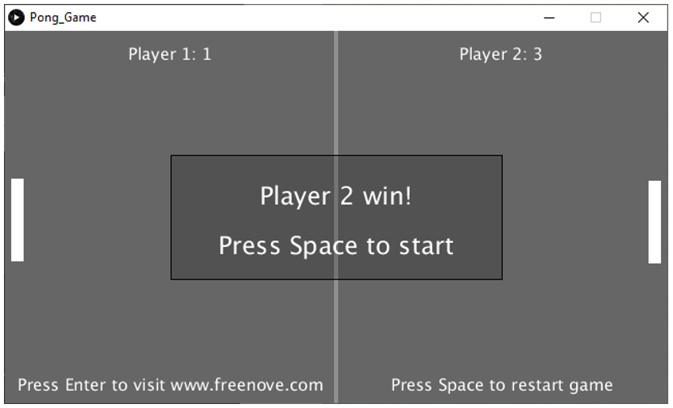

##############################################################################
Chapter Pong Game
##############################################################################

We have experienced single-player game snake before. Now, let's use Raspberry Pi Pico to play classic two-player pong game. You will experience both 2D and 3D version.

Project 5.1 Pong Game
********************************

First, let's experience the 2D version game.

+-----------------------------------------+------------------+
| Raspberry Pi Pico x1                    |   USB Cable x1   |
|                                         |                  |
| |Chapter01_08|                          |   |Chapter01_09| |
+-----------------------------------------+------------------+
| Breadboard x1                                              |
|                                                            |
| |Chapter01_10|                                             |
+-----------------------------------------+------------------+
| Rotary potentiometer x2                 |   Jumper         |
|                                         |                  |
|  |Chapter09_00|                         |   |Chapter01_13| |
+-----------------------------------------+------------------+

.. |Chapter01_08| image:: ../_static/imgs/1_LED/Chapter01_08.png
.. |Chapter01_09| image:: ../_static/imgs/1_LED/Chapter01_09.png
.. |Chapter01_10| image:: ../_static/imgs/1_LED/Chapter01_10.png
.. |Chapter01_13| image:: ../_static/imgs/1_LED/Chapter01_13.png
.. |Chapter09_00| image:: ../_static/imgs/9_AD_Converter/Chapter09_00.png

Circuit
==========================

.. list-table::
   :width: 100%
   :align: center
   
   * -  Schematic diagram
   * -  |Chapter05_00|
        
        :red:`Note: The ADC of Pico can only collect voltage between 0-3.3V. The joystick here uses 3.3V.`
   * -  Hardware connection. 
       
        :red:`If you need any support, please contact us via:` support@freenove.com
   * -  |Chapter05_01|
    

.. note::
    
    :red:`To help users have a better experience when doing the projects, we have made some modifications to Pico’s simulation diagram. Please note that there are certain differences between the simulation diagram and the actual board to avoid misunderstanding. Thanks for your support to our product.`

Sketch
=============================

Sketch Pong_Game
-------------------------------

Use Processing to open Pong_Game and click Run. If the connection succeeds, it will show as follows:

Now you can try to rotate the potentiometer to control the movement of paddle without ball. Press space bar

to start the game:

Use potentiometer to control the movement of paddle to block the ball back. The game rules are the same

as classic pong game:

The game will be over when one side reaches three points. Pressing the space bar can restart the game:

Additionally, you can restart the game by pressing the space bar at any time.

Project 5.2 Pong Game 3D
***************************

Now, let's experience the 3D version game.

Component List
============================

The same as last section.

Circuit
============================

The same as last section.

Sketch
=============================

Sketch Pong_Game_3D
==============================

Use Processing to open Freenove_Ultimate_Starter_Kit_for_Raspberry_Pi_Pico\\Processing\\

Processing\\Pong_Game_3D\\Pong_Game_3D.pde and click Run. 

If the connection succeeds, it will show as follows:

Now you can try to rotate the potentiometer to control the movement of paddle without ball. Press space bar

to start the game:

.. image:: ../_static/imgs/5_Pong_Game/Chapter05_07.png
    :align: center

Use potentiometer to control the movement of paddle to block the ball back. The game rules are the same

as classic pong game:

The rest operation is the same as the 2D version.