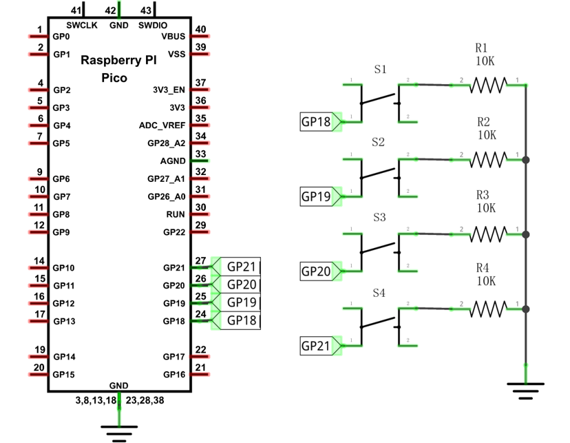
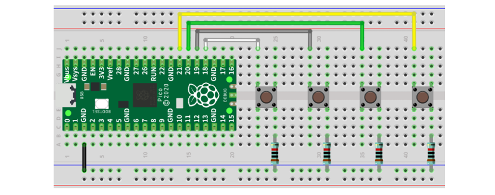
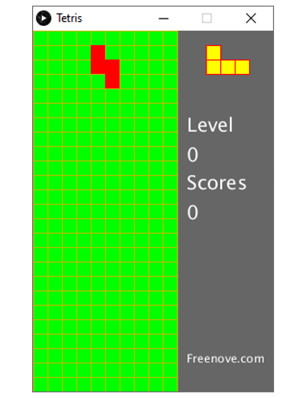
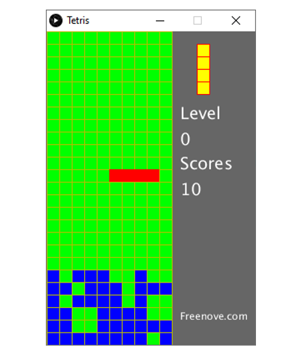
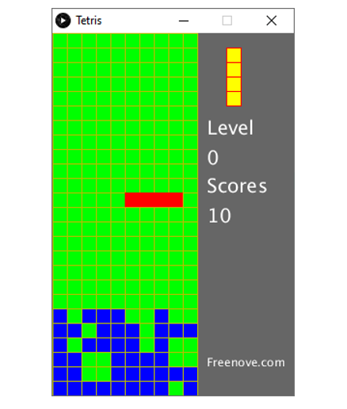

##############################################################################
Chapter Tetris
##############################################################################

In this chapter, we prepare a tetris game for you. You can play the game by pressing the buttons.

Project Tetris
*******************************

Now, let's use Processing and Raspberry Pi Pico to achieve the tetris game.

Component List
=======================================

+-----------------------------------------+------------------+
| Raspberry Pi Pico x1                    |   USB Cable x1   |
|                                         |                  |
| |Chapter01_08|                          |   |Chapter01_09| |
+-----------------------------------------+------------------+
| Breadboard x1                                              |
|                                                            |
| |Chapter01_10|                                             |
+----------------------+------------------+------------------+
| Push button x4       | Resistor 10kΩ x4 |   Jumper         |
|                      |                  |                  |
| |Chapter02_11|       | |Chapter02_01|   |   |Chapter01_13| |
+----------------------+------------------+------------------+

.. |Chapter02_11| image:: ../_static/imgs/2_Button_&_LED/Chapter02_11.png
.. |Chapter01_08| image:: ../_static/imgs/1_LED/Chapter01_08.png
.. |Chapter01_09| image:: ../_static/imgs/1_LED/Chapter01_09.png
.. |Chapter01_10| image:: ../_static/imgs/1_LED/Chapter01_10.png
.. |Chapter01_13| image:: ../_static/imgs/1_LED/Chapter01_13.png
.. |Chapter02_01| image:: ../_static/imgs/2_Button_&_LED/Chapter02_01.png

Circuit
==========================

.. list-table::
   :width: 100%
   :align: center
   
   * -  Schematic diagram
   * -  |Chapter06_00|
        
   * -  Hardware connection. 
       
        :red:`If you need any support, please contact us via:` support@freenove.com
   * -  |Chapter06_01|
    

.. note::
    
    :red:`To help users have a better experience when doing the projects, we have made some modifications to Pico’s simulation diagram. Please note that there are certain differences between the simulation diagram and the actual board to avoid misunderstanding.`

Sketch
===========================

Sketch Tetris
--------------------------

Use Processing to open Tetris.pde and click Run. If the connection succeeds, it will show as follows:

Now you can try using the buttons to control the falling block. Press the space bar to pause the game.

When the game is over, you can press the space bar to restart the game. Press ESC to exit the game.

