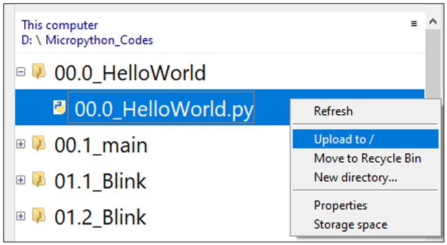

##############################################################################
0. Chapter Getting Ready (Important)
##############################################################################

Before starting building the projects, you need to make some preparation first, which is so crucial that you must not skip.

0.1 Installing Thonny (Important)
*********************************************

Thonny is a free, open-source software platform with compact size, simple interface, simple operation and rich functions, making it a Python IDE for beginners. In this tutorial, we use this IDE to develop Raspberry Pi Pico during the whole process.

Thonny supports various operating system, including Windows、Mac OS、Linux.

Downloading Thonny
====================================

Official website of Thonny: https://thonny.org 

Open-source code repositories of Thonny: https://github.com/thonny/thonny

Follow the instruction of official website to install Thonny or click the links below to download and install. (Select the appropriate one based on your operating system.)

+------------------+----------------------------------------------------------------------------+
| Operating System | Download links/methods                                                     |
+------------------+----------------------------------------------------------------------------+
| Windows          | https://github.com/thonny/thonny/releases/download/v4.1.3/thonny-4.1.3.exe |
+------------------+----------------------------------------------------------------------------+
| Mac OS           | https://github.com/thonny/thonny/releases/download/v4.1.3/thonny-4.1.3.pkg |
+------------------+----------------------------------------------------------------------------+
|                  | **The latest version:**                                                    |
|                  |                                                                            |
|                  | **Binary bundle for PC (Thonny+Python):**                                  |
|                  |                                                                            |
|                  | bash <(wget -O - https://thonny.org/installer-for-linux)                   |
|                  |                                                                            |
|                  | **With pip:**                                                              |
|                  |                                                                            |
| Linux            | pip3 install thonny                                                        |
|                  |                                                                            |
|                  | **Distro packages (may not be the latest version):**                       |
|                  |                                                                            |
|                  | **Debian, Rasbian, Ubuntu, Mint and others:**                              |
|                  |                                                                            |
|                  | sudo apt install thonny                                                    |
|                  |                                                                            |
|                  | **Fedora:**                                                                |
|                  |                                                                            |
|                  | sudo dnf install thonny                                                    |
+------------------+----------------------------------------------------------------------------+

:red:`You can also open "Freenove_Ultimate_Starter_Kit_for_Raspberry_Pi_Pico/Python_Software", we have prepared it in advance.`

Installing on Windows
==============================

The icon of Thonny after downloading is as below. Double click "thonny-4.1.3.exe". 

If you are not familiar with computer software installation, you can simply keep clicking "Next" until the installation completes.

If you want to change Thonny's installation path, you can click "Browse" to modify it. After selecting installation path, click "OK".

If you do not want to change it, just click "Next".

Check "Create desktop icon" and then it will generate a shortcut on your desktop to facilitate you to open Thonny later.

Click "install" to install the software.

During the installation process, you only need to wait for the installation to complete, and you msut not click "Cancel", otherwise Thonny will fail to be installed.

Once you see the interface as below, Thonny has been installed successfully.

If you've check "Create desktop icon" during the installation process, you can see the below icon on your desktop.

0.2 Basic Configuration of Thonny
*******************************************

Click the desktop icon of Thonny and you can see the interface of it as follows:

Select "View" -> "Files" and "Shell".

0.3 Burning Micropython Firmware (Important)
********************************************************

To run Python programs on Raspberry Pi Pico, we need to burn a firmware to Raspberry Pi Pico first.

Downloading Micropython Firmware
==========================================

Option 1
----------------------------------

Raspberry Pi Pico official website: https://www.raspberrypi.com/documentation/microcontrollers/

1.	Click Micropython.

.. image:: ../_static/imgs/0_Ready/Chapter00_35.png
    :align: center

2. In the new interface, find the following content and download the corresponding UF2 according to your Pico version.

If your board is a standard Pico board, please click Raspberry Pi Pico to download it.

If it is a Pico W board, click Raspberry Pi Pico W.

If it is Pico 2, click the MicroPython download page, or click the following link:

https://micropython.org/download/RPI_PICO2/

As Raspberry Pi Foundation has specially added two Cortex-M33 and two RISC-V cores in RP2350, both of the above two uf2 files can work.

Option 2
-------------------------------

If you cannot download it due to network issue or other reasons, you can use the one we have prepared, which locates at the following file path: 

:red:`Freenove_Ultimate_Starter_Kit_for_Raspberry_Pi_Pico/Python_Firmware`

Burning a Micropython Firmware
===========================================

.. note::
    
    :red:`Pico, Pico W and Pico 2 burn firmware in the same way. Pico's map is used here as an introduction.`

1.	Connect a USB cable to your computer. 

2.	Long press BOOTSEL button on Raspberry Pi Pico and connect it to your computer with the USB cable. 

3.	When the connection succeeds, the following information will pop up on your computer.

4.	Copy the file(rp2-pico-20210618-v1.16.uf2) to RPI-RP2 and wait for it to finish, just like copy file to a U disk.

5.	When the firmware finishes programming, Raspberry Pi Pico will reboot automatically. After that, you can run Micropython.

0.4 Thonny Connected to Raspberry Pi Pico
****************************************************

1. Open Thonny, click "run" and select "Select interpreter..."

2. Select "Micropython (Raspberry Pi Pico)".

3.	Select "USB-SERIAL (COMx)", The number x of COMx may vary among different computers. You only need to make sure selecting USB-SERIAL (COMx). 

How to determine the port on which your Raspberry Pi Pico communicates with your computer?

Step 1: When Pico **doesn't** connect to computer, open Thonny, click "Run", select "Select interpreter" and then a dialog box will pop up, click "Port" and you can check the ports currently connected to your computer, as shown below:

.. image:: ../_static/imgs/0_Ready/Chapter00_44.png
    :align: center

Step 2: Close the dialog box. Connect Pico to your computer, click "Run" again and select "Select interpreter". Click "Port" on the pop-up window and check the current ports. Now there is a newly added port, with which Pico communicates with the computer.

4.	After selecting "Micropython (Raspberry Pi Pico)" and port, click "OK" 

5.	When the following message displays on Thonny, it indicates Thonny has successfully connected to Pico. 

So far, all the preparations have been made.

0.5 Testing codes (Important)
****************************************

Testing Shell Command

Enter "print("hello world!")" in "Shell" and press Enter.

.. _online:

Running Online
========================================

To run Raspberry Pi Pico online, you need to connect it to computer. Users can use Thonny to compile or debug programs.

Advantages:

1. Users can use Thonny to compile or debug programs. 

2. Through the "Shell" window, users can read the error information and output results generated during the running of the program and query related function information online to help improve the program.

Disadvantages:

1. To run Raspberry Pi Pico online, you have to be connected to a computer and run with Thonny.

2. If Raspberry Pi Pico disconnects from computer, the program will not run again when they reconnect to each other. 

Operation
-------------------------------------------

1.	Open Thonny and click "Open…".

.. image:: ../_static/imgs/0_Ready/Chapter00_49.png
    :align: center

2.	On the newly pop-up window, click "This computer".

In the new dialog box, select "00.0_HelloWorld.py" in " :red:`reenove_Ultimate_Starter_Kit_for_Raspberry_Pi_Pico/00.0_HelloWorld` " folder. 

Click "Run current script" to execute the program and "Hello World!", "Welcome Freenove" will be printed in "Shell". 

Exiting Running Online
-----------------------------------

When running online, click "Stop /Restart backend" on Thonny or press Ctrl+C to exit the program.

Running Offline
===============================

When running offline, Raspberry Pi Pico does not need to connect to computer and Thonny. It can run the programs stored in main.py on the device once powered up. 

Advantage: It can run programs when powered up without connected to computer and Thonny.

Disadvantage: The program will stop automatically when error occurs or Raspberry Pi Pico is out of power. Code cannot be changed easily.

Operation
-------------------------------

Once powered up, Raspberry Pi Pico will automatically check whether there is main.py existing on the device. If there is, it runs the programs in main.py and then enter shell command system. (If you want the code to run offline, you can save it as main.py); if main.py does not exist, it will enter shell command system directly.

1.	Click "File" -> "New" to create and write codes.

2.	Enter codes in the newly opened file. Here we use codes of "01.1_Blink.py" as an example.

3.	Click "Save" on the menu bar. You can save the codes either to your computer or to Raspberry Pi Pico. 

4.	Select "MicroPython device", enter "main.py" in the newly pop-up window and click "OK".

5.	You can see that codes have been uploaded to Raspberry Pi Pico.

6.	Disconnect Raspberry Pi Pico USB cable and then reconnect it, the LED on Raspberry Pi Pico will blink repeatedly.

Exiting Offline Running
-------------------------------------------

Connect Raspberry Pi Pico to computer, click "stop/restart backend" on Thonny to end running offline.

If it does not work, please click on "stop/restart backend" for more times or reconnect Pico. 

We provide a main.py file for running offline. The code added to main.py is a bootstrap that executes the user's code file. All you need to do is upload the offline project's code file (.py) to the Raspberry Pi Pico device.

1.	Move the program folder " **Freenove_Ultimate_Starter_Kit_for_Raspberry_Pi_Pico/Python_Codes** " to disk(D) in advance with the path of " **D:/Micropython_Codes** ". Open "Thonny"。

2.	Expand "00.1_main" in the "Micropython_Codes" in the directory of disk(D), and double-click main.py, which is provided by us to enable programs in "MicroPython device" to run offline.

Here we use 00.1 and 01.1 cases as demonstration. The LED on Raspberry Pi Pico is used to show the result, which uses GP25 pin. If you have modified 01.1_Blick.py file, you need to change it accordingly.

As shown in the following illustration, right-click the file 01.1_Blink.py and select "Upload to /" to upload code to Raspberry Pi Pico.

Upload main.py in the same way.

Disconnect Raspberry Pi Pico USB cable and reconnect it, the LED on pico will blink repeatedly.

.. note::

    Codes here are run offline. If you want to stop running offline and enter Shell, just click "Stop" in Thonny.

0.6 Thonny Common Operation
**************************************

Uploading Code to Raspberry Pi Pico
=========================================

Select "00.0_HelloWorld.py" in "00.0_HelloWorld", right-click your mouse and select "Upload to /" to upload code to Raspberry Pi Pico's root directory.

Downloading Code to Computer
===================================

Select "00.0_HelloWorld.py" in "MicroPython device", right-click to select "Download to ..." to download the code to your computer.

Deleting Files from Raspberry Pi Pico's Root Directory 

Select "00.0_HelloWorld.py" in "MicroPython device", right-click it and select "Delete" to delete "00.0_HelloWorld.py" from Raspberry Pi Pico's root directory.

.. image:: ../_static/imgs/0_Ready/Chapter00_70.png
    :align: center

Deleting Files from your Computer Directory
===================================================

Select "00.0_HelloWorld.py" in "00.0_HelloWorld", right-click it and select "Move to Recycle Bin" to delete it from "00.0_HelloWorld".

Creating and Saving the code 
==============================================

Click "File" -> "New" to create and write codes.

Enter codes in the newly opened file. Here we use codes of "01.1_Blink.py" as an example.

Click "Save" on the menu bar. You can save the codes either to your computer or to Raspberry Pi Pico. 

Select "MicroPython device", enter "main.py" in the newly pop-up window and click "OK".

You can see that codes have been uploaded to Raspberry Pi Pico.

Click "Run" and the LED on Raspberry Pi Pico will blink periodically. 

0.7 Paste the Sticker on the Breadboard
***********************************************

It is not difficult to use the Pico. However, officially, the pin functions are printed on the back of the board, which makes it inconvenient to use. To help users finish each project in the tutorial faster and easier, we provide stickers of the pin functions as follows:

You can paste the sticker on the blank area of the breadboard as above.

.. note::
    
    :red:`The functional pin sequence of Pico, Pico W and Pico 2 is the same. Therefore, even if your kit is Pico W, it is also applicable to the sticker above.`

To make the tutorial more intuitive, we have made some changes to the simulation diagram as below. The left one is the actual Pico and the right one is its simulation diagram. Please note that to avoid misunderstanding.

