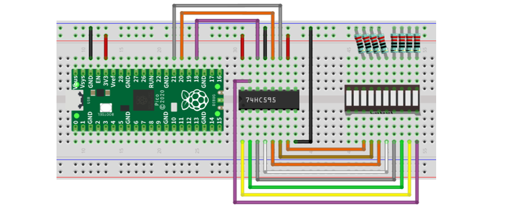

##############################################################################
Chapter 74HC595 & LED Bar Graph
##############################################################################

We have used LED Bar Graph to make a flowing water light, in which 10 GPIO ports of Raspberry Pi Pico is occupied. More GPIO ports mean that more peripherals can be connected to Raspberry Pi Pico, so GPIO resource is very precious. Can we make flowing water light with less GPIO? In this chapter, we will learn a component, 74HC595, which can achieve the target.

Project Flowing Water Light
*************************************

Now let us learn how to use the 74HC595 IC Chip to make a flowing water light using less GPIO.

Component List
============================

+-----------------------------------------+---------------------------------+
| Raspberry Pi Pico x1                    | USB Cable x1                    |
|                                         |                                 |
| |Chapter01_08|                          | |Chapter01_09|                  |
+-----------------------------------------+---------------------------------+
| Breadboard x1                                                             |
|                                                                           |
| |Chapter01_10|                                                            |
+----------------------+------------------+----------------+----------------+
| 74HC595 x1           | Resistor         | Jumper         |LED Bar         |
|                      |                  |                |                |
|                      | 220Ω x8          |                |Graph x1        |
|                      |                  |                |                |
| |Chapter14_00|       | |Chapter01_12|   | |Chapter01_13| | |Chapter03_00| |
+----------------------+------------------+----------------+----------------+

.. |Chapter01_08| image:: ../_static/imgs/1_LED/Chapter01_08.png
.. |Chapter01_09| image:: ../_static/imgs/1_LED/Chapter01_09.png
.. |Chapter01_10| image:: ../_static/imgs/1_LED/Chapter01_10.png
.. |Chapter01_12| image:: ../_static/imgs/1_LED/Chapter01_12.png
.. |Chapter01_13| image:: ../_static/imgs/1_LED/Chapter01_13.png
.. |Chapter14_00| image:: ../_static/imgs/14_74HC595_&_LED_Bar_Graph/Chapter14_00.png
.. |Chapter03_00| image:: ../_static/imgs/3_LED_Bar/Chapter03_00.png

Related Knowledge
======================================

74HC595
---------------------------------

A 74HC595 chip is used to convert serial data into parallel data. A 74HC595 chip can convert the serial data of one byte into 8 bits, and send its corresponding level to each of the eight ports correspondingly. With this characteristic, the 74HC595 chip can be used to expand the IO ports of Raspberry Pi Pico. At least three ports are required to control the eight ports of the 74HC595 chip.

The ports of the 74HC595 chip are described as follows:

+----------+-------------+-----------------------------------------------------------------------------+
| Pin name | GPIO number | Description                                                                 |
+----------+-------------+-----------------------------------------------------------------------------+
| Q0-Q7    | 15,         | 1-7	Parallel data output                                                   |
+----------+-------------+-----------------------------------------------------------------------------+
| VCC      | 16          | The positive electrode of power supply, the voltage is 2~6V                 |
+----------+-------------+-----------------------------------------------------------------------------+
| GND      | 8           | The negative electrode of power supply                                      |
+----------+-------------+-----------------------------------------------------------------------------+
| DS       | 14          | Serial data Input                                                           |
+----------+-------------+-----------------------------------------------------------------------------+
| OE       | 13          | Enable output,                                                              |
|          |             |                                                                             |
|          |             | When this pin is in high level, Q0-Q7 is in high resistance state           |
|          |             |                                                                             |
|          |             | When this pin is in low level, Q0-Q7 is in output mode                      |
+----------+-------------+-----------------------------------------------------------------------------+
| ST_CP    | 12          | Parallel Update Output: when its electrical level is rising, it will update |
|          |             |                                                                             |
|          |             | the parallel data output.                                                   |
+----------+-------------+-----------------------------------------------------------------------------+
| SH_CP    | 11          | Serial shift clock: When its electrical level is rising, serial data input, |
|          |             |                                                                             |
|          |             | register would do a shift.                                                  |
+----------+-------------+-----------------------------------------------------------------------------+
| MR       | 10          | Remove shift register: When this pin is in low level, the content in shift  |
|          |             |                                                                             |
|          |             | register will be cleared.                                                   |
+----------+-------------+-----------------------------------------------------------------------------+
| Q7'      | 9           | Serial data output: it can be connected to more 74HC595 in series.          |
+----------+-------------+-----------------------------------------------------------------------------+

For more detail, please refer to the datasheet on the 74HC595 chip.

Circuit
=======================

.. list-table::
   :width: 100%
   :align: center
   
   * -  Schematic diagram
   * -  |Chapter14_02|
   * -  Hardware connection. 
       
        :red:`If you need any support, please contact us via:` support@freenove.com
   * -  |Chapter14_03|
    

Code
========================

In this project, we will make a flowing water light with a 74HC595 chip to learn about its functions.

Open "Thonny", click "This computer" -> "D:" -> "Micropython_Codes" -> "14.1_Flowing_Water_Light". Select "my74HC595.py", right click your mouse to select "Upload to /", wait for "my74HC595.py"to be uploaded to Raspberry Pi Pico and then double click "14.1_Flowing_Water_Light.py". 

Flowing_Water_Light
-----------------------------------

Click"Run current script" and you will see that Bar Graph LED starts with the flowing water pattern blinking from left to right and then back from right to left. If it displays nothing, maybe the LED Bar is connected upside down, please unplug it and then re-plug it reversely. Press Ctrl+C or click "Stop/Restart backend" to exit the program.

:red:`If you have any concerns, please contact us via:` support@freenove.com

The following is the program code:

.. literalinclude:: ../../../freenove_Kit/Python/Python_Codes/14.1_Flowing_Water_Light/14.1_Flowing_Water_Light.py
    :linenos: 
    :language: python
    :dedent:

Import time and my74HC595 modules.

.. literalinclude:: ../../../freenove_Kit/Python/Python_Codes/14.1_Flowing_Water_Light/14.1_Flowing_Water_Light.py
    :linenos: 
    :language: python
    :lines: 1-2
    :dedent:

Create a Chip74HC595 object and configure pins, among which, the default Raspberry Pi Pico and 74HC595 bound pins are DS(GP18), STCP(GP20), SHCP(GP21), OE(GP19). If you want to use other pins, you can change the pins by changing the arguments passed to the Chip74HC595 object.

.. literalinclude:: ../../../freenove_Kit/Python/Python_Codes/14.1_Flowing_Water_Light/14.1_Flowing_Water_Light.py
    :linenos: 
    :language: python
    :lines: 4-5
    :dedent:

The first for loop makes LED Bar display separately from left to right while the second for loop make it display separately from right to left.

.. literalinclude:: ../../../freenove_Kit/Python/Python_Codes/14.1_Flowing_Water_Light/14.1_Flowing_Water_Light.py
    :linenos: 
    :language: python
    :lines: 8-17
    :dedent:

Reference
---------------------------

.. py:function:: Class Chip74HC595	
    
    Before each use of the object **Chip74HC595** , make sure my74HC595.py has been uploaded to "/" of Raspberry Pi Pico, and then add the statement "from my74HC595 import Chip74HC595" to the top of the python file. 
    
    **Chip74HC595():** An object. By default, 74HC595's DS pin is connected to GP18 of Raspberry Pi Pico, ST_CP pin is connected to Raspberry Pi Pico GP20, SH_CP pin is connected to Raspberry Pi Pico GP21, OE pin is connected to Raspberry Pi Pico GP19. If you need to modify the pins, just do the following operations.
    
    **chip=Chip74HC595()** or **chip=Chip74HC595(18, 20, 21, 19).**
    
    **shiftOut(direction, data):** Write data to 74HC595. 
    
        **direction:** When direction=1, it indicates data is sent from the highest byte to the lowest byte (left to right) in turn; direction=0 indicates data is sent from the lowest byte to the highest byte (right to left) in turn.
    
        **data:** The content that is sent, which is one-byte data.
    
    **clear():** Clear the latch data of 74HC595.