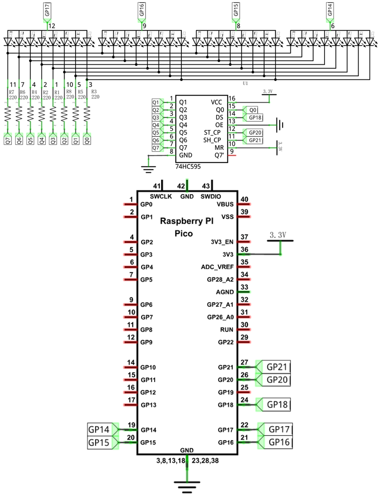

Project 4-Digit 7-Segment Display
***********************************************

Now, let us try to control a more-digit 7-segment display.

Component List
=====================================

+-----------------------------------------+---------------------------------+
| Raspberry Pi Pico x1                    | USB Cable x1                    |
|                                         |                                 |
| |Chapter01_08|                          | |Chapter01_09|                  |
+-----------------------------------------+---------------------------------+
| Breadboard x1                                                             |
|                                                                           |
| |Chapter01_10|                                                            |
+----------------------+------------------+----------------+----------------+
| 74HC595 x1           | Resistor         | Jumper         |7-segment       |
|                      |                  |                |                |
|                      | 220Ω x8          |                |display x1      |
|                      |                  |                |                |
| |Chapter14_00|       | |Chapter01_12|   | |Chapter01_13| | |Chapter15_07| |
+----------------------+------------------+----------------+----------------+

.. |Chapter01_08| image:: ../_static/imgs/1_LED/Chapter01_08.png
.. |Chapter01_09| image:: ../_static/imgs/1_LED/Chapter01_09.png
.. |Chapter01_10| image:: ../_static/imgs/1_LED/Chapter01_10.png
.. |Chapter01_12| image:: ../_static/imgs/1_LED/Chapter01_12.png
.. |Chapter01_13| image:: ../_static/imgs/1_LED/Chapter01_13.png

Component Knowledge
================================

4 Digit 7-Segment Display
--------------------------------

A 4-Digit 7-segment display integrates four 7-Segment Displays into one module. Therefore, it can display more characters. All the LEDs contained have a Common Anode and individual Cathodes. Its internal structure and pin designation diagram is shown below:

.. image:: ../_static/imgs/15_74HC595_&_7-Segment_Display/Chapter15_08.png
    :align: center

The internal electronic circuit is shown below, and all 8 LED cathode pins of each 7-Segment Display are connected together.

.. image:: ../_static/imgs/15_74HC595_&_7-Segment_Display/Chapter15_09.png
    :align: center

Display method of 4-Digit 7-segment display is similar to 1-Digit 7-segment display. The difference between them is that the 4-Digit displays each Digit visibly in turn, one by one and not together. We need to first send high level to the common end of the first Digit Display, and send low level to the remaining three common ends, and then send content to eight LED cathode pins of the first Digit Display. At this time, the first 7-Segment Display will show visible content and the remaining three will be OFF.

Similarly, the second, third and fourth 7-Segment Displays will show visible content in turn by scanning the display. Although the four number characters are displayed in turn separately, this process is so fast that it is imperceptible to the naked eye. This is due to the principle of optical afterglow effect and the vision persistence effect in human sight. This is how we can see all four number characters at the same time. However, if each number character is displayed for a longer period, you will be able to see that the number characters are displayed separately. 

Circuit
=======================

.. list-table::
   :width: 100%
   :align: center
   
   * -  Schematic diagram
   * -  |Chapter15_10|
   * -  Hardware connection. 
       
        :red:`If you need any support, please contact us via:` support@freenove.com
   * -  |Chapter15_11|
    

Code
=======================

In this code, we use the 74HC595 IC Chip to control the 4-Digit 7-Segment Display, and use the dynamic scanning method to show the changing number characters.

Open "Thonny", click "This computer" -> "D:" -> "Micropython_Codes" -> "15.2_4_Digit_7_Segment_Display". Select "my74HC595.py", right click your mouse to select "Upload to /", wait for "my74HC595.py" to be uploaded to Raspberry Pi Pico and double click "15.2_4_Digit_7_Segment_Display.py". 

4_Digit_7_Segment_Display
------------------------------------

Click "Run current script", and the Nixie tube display as shown in the image below. Press Ctrl+C or click "Stop/Restart backend" to exit the program.

The following is the program code:

.. literalinclude:: ../../../freenove_Kit/Python/Python_Codes/15.2_4_Digit_7_Segment_Display/15.2_4_Digit_7_Segment_Display.py
    :linenos: 
    :language: python
    :lines: 1-26
    :dedent:

Import time, my74HC595 and Pin modules.

.. literalinclude:: ../../../freenove_Kit/Python/Python_Codes/15.2_4_Digit_7_Segment_Display/15.2_4_Digit_7_Segment_Display.py
    :linenos: 
    :language: python
    :lines: 1-3
    :dedent:

Define common anode pins for digital tubes and request a list to put character encodings in it.

.. literalinclude:: ../../../freenove_Kit/Python/Python_Codes/15.2_4_Digit_7_Segment_Display/15.2_4_Digit_7_Segment_Display.py
    :linenos: 
    :language: python
    :lines: 5-7
    :dedent:

Request an object to drive 74HC595 and associate pins with it.

.. literalinclude:: ../../../freenove_Kit/Python/Python_Codes/15.2_4_Digit_7_Segment_Display/15.2_4_Digit_7_Segment_Display.py
    :linenos: 
    :language: python
    :lines: 17-20
    :dedent:

Make the digital tube display "0 1 2 3".

.. literalinclude:: ../../../freenove_Kit/Python/Python_Codes/15.2_4_Digit_7_Segment_Display/15.2_4_Digit_7_Segment_Display.py
    :linenos: 
    :language: python
    :lines: 9-15
    :dedent: