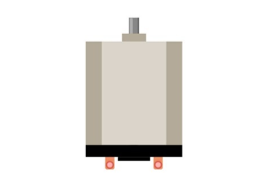
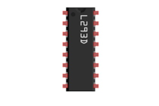
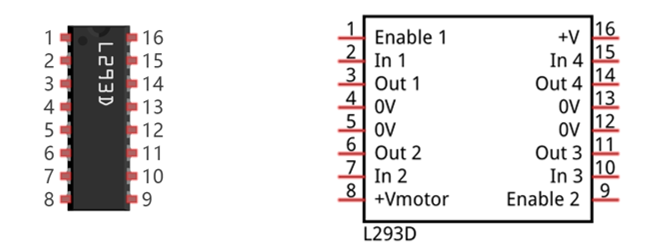
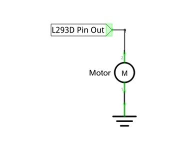
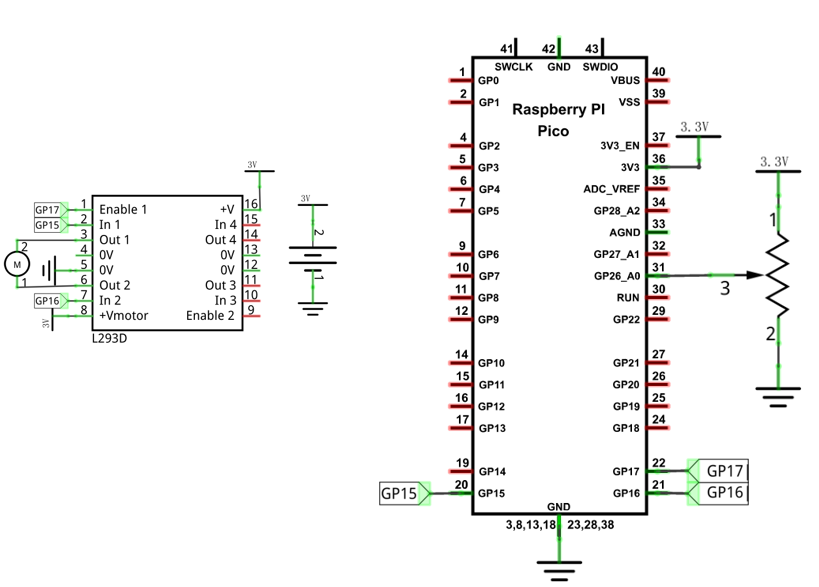
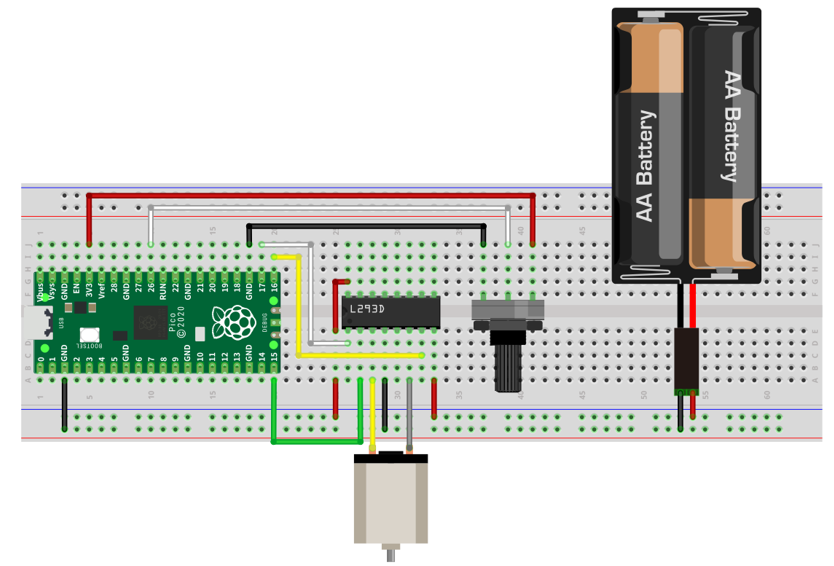
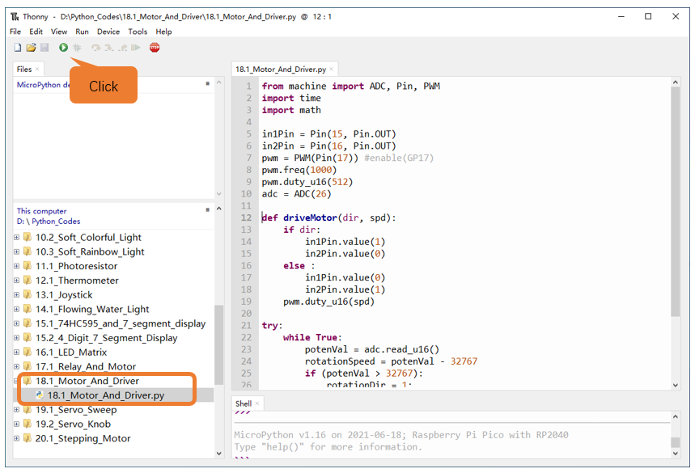
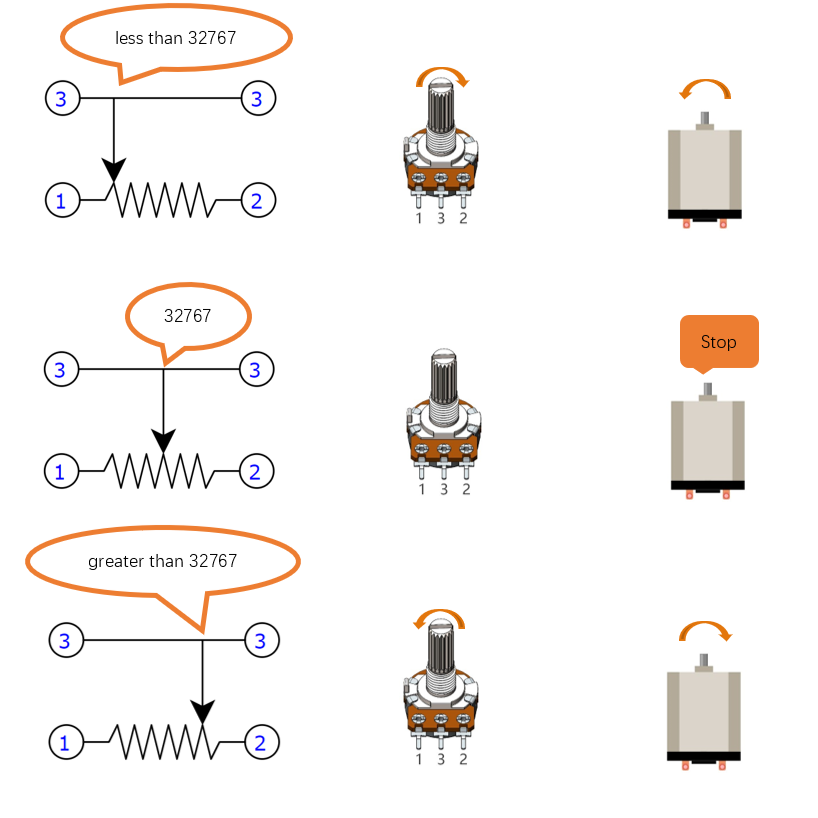

##############################################################################
Chapter L293D & Motor
##############################################################################

Project Control Motor with Potentiometer
******************************************************

Control the direction and speed of the motor with a potentiometer.

Component List
============================

+-----------------------------------------+------------------------------------------+
| Raspberry Pi Pico x1                    | USB Cable x1                             |
|                                         |                                          |
| |Chapter01_08|                          | |Chapter01_09|                           |
+-----------------------------------------+------------------------------------------+
| Breadboard x1                                                                      |
|                                                                                    |
| |Chapter01_10|                                                                     |
+-------------------------+-------------------------------+--------------------------+
| Rotary                  | Motor x1                      |  L293D x1                |
|                         |                               |                          |
| potentiometer x1        |                               |                          |
|                         |                               |                          |
| |Chapter18_00|          |  |Chapter18_01|               |  |Chapter18_02|          |
+-------------------------+---------------+---------------+--------------------------+
| Jumper                                  | Battery box x1                           |
|                                         |                                          |
|  |Chapter18_03|                         | |Chapter18_04|                           |
+-----------------------------------------+------------------------------------------+

.. |Chapter01_08| image:: ../_static/imgs/1_LED/Chapter01_08.png
.. |Chapter01_09| image:: ../_static/imgs/1_LED/Chapter01_09.png
.. |Chapter01_10| image:: ../_static/imgs/1_LED/Chapter01_10.png
.. |Chapter18_00| image:: ../_static/imgs/18_L293D_&_Motor/Chapter18_00.png

Component Knowledge
========================

L293D
------------------------

L293D is an IC Chip (Integrated Circuit Chip) with a 4-channel motor drive. You can drive a Unidirectional DC Motor with 4 ports or a Bi-Directional DC Motor with 2 ports or a Stepper Motor (Stepper Motors are covered later in this Tutorial).

Port description of L293D module is as follows:

+----------+--------------+----------------------------------------------------------------------------------------------------------------+
| Pin name |  Pin number  |                                                  Description                                                   |
+==========+==============+================================================================================================================+
| In x     | 2, 7, 10, 15 | Channel x digital signal input pin                                                                             |
+----------+--------------+----------------------------------------------------------------------------------------------------------------+
| Out x    | 3, 6, 11, 14 | Channel x output pin, input high or low level according to In x pin, get connected to +Vmotor or 0V            |
+----------+--------------+----------------------------------------------------------------------------------------------------------------+
| Enable1  | 1            | Channel 1 and channel 2 enable pin, high level enable                                                          |
+----------+--------------+----------------------------------------------------------------------------------------------------------------+
| Enable2  | 9            | Channel 3 and channel 4 enable pin, high level enable                                                          |
+----------+--------------+----------------------------------------------------------------------------------------------------------------+
| 0V       | 4, 5, 12, 13 | Power cathode (GND)                                                                                            |
+----------+--------------+----------------------------------------------------------------------------------------------------------------+
| +V       | 16           | Positive electrode (VCC) of power supply, supply voltage 3.0~36V                                               |
+----------+--------------+----------------------------------------------------------------------------------------------------------------+
| +Vmotor  | 8            | Positive electrode of load power supply, provide power supply for the Out pin x, the supply voltage is +3V~36V |
+----------+--------------+----------------------------------------------------------------------------------------------------------------+

For more details, please refer to the datasheet for this IC Chip.

When using L293D to drive DC motor, there are usually two connection options.

The following connection option uses one channel of the L239D, which can control motor speed through the PWM. However, the motor then can only rotate in one direction.

The following connection uses two channels of the L239D: one channel outputs the PWM wave, and the other channel connects to GND, therefore you can control the speed of the motor. When these two channel signals are exchanged, not only can they control the speed of motor, but also control the direction of the motor.

.. image:: ../_static/imgs/18_L293D_&_Motor/Chapter18_07.png
    :align: center

In practical use, the motor is usually connected to channels 1 and 2 by outputting different levels to in1 and in2 to control the rotational direction of the motor, and output to the PWM wave to Enable1 port to control the motor's rotational speed. If the motor is connected to channel 3 and 4 by outputting different levels to in3 and in4 to control the motor's rotation direction, and output to the PWM wave to Enable2 pin to control the motor's rotational speed.

Circuit
=============================

.. list-table::
   :width: 100%
   :align: center
   
   * -  Schematic diagram
   * -  |Chapter18_08|
   * -  Hardware connection. 
       
        :red:`If you need any support, please contact us via:` support@freenove.com
   * -  |Chapter18_09|
    

Code
==============================

Open "Thonny", click "This computer" -> "D:" -> "Micropython_Codes" -> "18.1_Motor_And_Driver" and double click "18.1_Motor_And_Driver.py".

Motor_And_Driver
-------------------------------

Click "Run current script", rotate the potentiometer in one direction and the motor speeds up slowly in one direction. Rotate the potentiometer in the other direction and the motor will slow down to stop. Then rotate it in the original direction to accelerate the motor. Press Ctrl+C or click "Stop/Restart backend" to exit the program.

The following is the Code:

.. literalinclude:: ../../../freenove_Kit/Python/Python_Codes/18.1_Motor_And_Driver/18.1_Motor_And_Driver.py
    :linenos: 
    :language: python
    :lines: 1-33
    :dedent:

In the program, we will define 32767 as the intermediate point to adjust the potentiometer. When the ADC value is less than 32767, the motor rotates in one direction; when the ADC value is greater than 32767, the motor rotates in the opposite direction. The speed of the motor will change with the adjustment of the potentiometer. When the potentiometer is adjusted, the closer the ADC value is to the middle point, the slower the motor speed; the closer the ADC value is to 0 or 65535, the faster the motor speed.

.. literalinclude:: ../../../freenove_Kit/Python/Python_Codes/18.1_Motor_And_Driver/18.1_Motor_And_Driver.py
    :linenos: 
    :language: python
    :lines: 22-31
    :dedent:

Initialize pins of L293D chip.

.. literalinclude:: ../../../freenove_Kit/Python/Python_Codes/18.1_Motor_And_Driver/18.1_Motor_And_Driver.py
    :linenos: 
    :language: python
    :lines: 5-9
    :dedent:

Function driveMotor is used to control the rotation direction and speed of the motor. The dir represents direction while **spd** refers to speed.

.. literalinclude:: ../../../freenove_Kit/Python/Python_Codes/18.1_Motor_And_Driver/18.1_Motor_And_Driver.py
    :linenos: 
    :language: python
    :lines: 12-19
    :dedent: