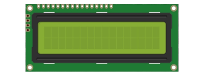
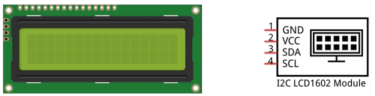
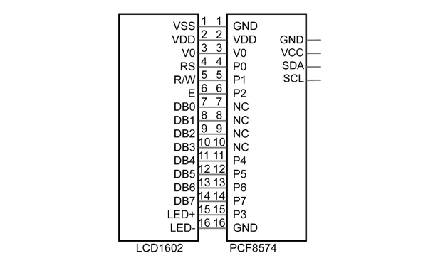
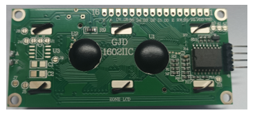

##############################################################################
Chapter LCD1602
##############################################################################

In this chapter, we will learn about the LCD1602 Display Screen.

Project LCD1602
******************************

In this section, we learn how to use LCD1602 to display something.

Component List
==========================

+-----------------------------------------+------------------------------------------+
| Raspberry Pi Pico x1                    | USB Cable x1                             |
|                                         |                                          |
| |Chapter01_08|                          | |Chapter01_09|                           |
+-----------------------------------------+------------------------------------------+
| Breadboard x1                                                                      |
|                                                                                    |
| |Chapter01_10|                                                                     |
+-----------------------------------------+------------------------------------------+
| LCD1602 Module x1                       | Jumper                                   |
|                                         |                                          |
|  |Chapter21_00|                         | |Chapter21_01|                           |
+-----------------------------------------+------------------------------------------+

.. |Chapter01_08| image:: ../_static/imgs/1_LED/Chapter01_08.png
.. |Chapter01_09| image:: ../_static/imgs/1_LED/Chapter01_09.png
.. |Chapter01_10| image:: ../_static/imgs/1_LED/Chapter01_10.png

.. |Chapter21_01| image:: ../_static/imgs/21_LCD1602/Chapter21_01.png

Component Knowledge
========================

I2C communication
-------------------------

I2C (Inter-Integrated Circuit) is a two-wire serial communication mode, which can be used for the connection of micro controllers and their peripheral equipment. Devices using I2C communication must be connected to the serial data (SDA) line, and serial clock (SCL) line (called I2C bus). Each device has a unique address and can be used as a transmitter or receiver to communicate with devices connected to the bus.

LCD1602 communication
----------------------------

The LCD1602 Display Screen can display two lines of characters in 16 columns. It is capable of displaying numbers, letters, symbols, ASCII code and so on. As shown below is a monochrome LCD1602 Display Screen along with its circuit pin diagram.

.. image:: ../_static/imgs/21_LCD1602/Chapter21_02.png
    :align: center

I2C LCD1602 Display Screen integrates an I2C interface, which connects the serial-input & parallel-output module to the LCD1602 Display Screen. This allows us to use only four lines to operate the LCD1602.

The serial-to-parallel IC chip used in this module is PCF8574T (PCF8574AT), and its default I2C address is 0x27(0x3F).

Below is the PCF8574 pin schematic diagram and the block pin diagram:

.. list-table::
   :width: 100%
   :align: center
   
   * -  PCF8574 chip pin diagram
     -  PCF8574 module pin diagram 
   
   * -  |Chapter21_04|
     -  |Chapter21_05| 

.. |Chapter21_04| image:: ../_static/imgs/21_LCD1602/Chapter21_04.png
.. |Chapter21_05| image:: ../_static/imgs/21_LCD1602/Chapter21_05.png

Therefore, we only need four pins to control the 16 pins of the LCD1602 Display Screen through the I2C interface.

In this project, we will use the I2C LCD1602 to display some static characters and dynamic variables.

Circuit
==========================

.. list-table::
   :width: 100%
   :align: center
   
   * -  Schematic diagram
   * -  |Chapter21_07|
   * -  Hardware connection. 
       
        :red:`If you need any support, please contact us via:` support@freenove.com
   * -  |Chapter21_08| 

.. |Chapter21_07| image:: ../_static/imgs/21_LCD1602/Chapter21_07.png
.. |Chapter21_08| image:: ../_static/imgs/21_LCD1602/Chapter21_08.png

Code
=========================

Open "Thonny", click "This computer" -> "D:" -> "Micropython_Codes" -> "21.1_I2C_LCD1602". Select "I2C_LCD.py"and "LCD_API.py", right click your mouse to select "Upload to /", wait for "I2C_LCD.py" and"LCD_API.py" to be uploaded to Raspberry Pi Pico and then double click "21.1_I2C_LCD1602.py". 

I2C_LCD1602
-------------------------

Click "Run current script" and LCD1602 displays some characters.Press Ctrl+C or click "Stop/Restart backend" to exit the program.

So far, at this writing, we have two types of LCD1602 on sale. One needs to adjust the backlight, and the other does not.

The LCD1602 that does not need to adjust the backlight is shown in the figure below.

If the LCD1602 you received is the following one, and you cannot see anything on the display or the display is not clear, try rotating the white knob on back of LCD1602 slowly, which adjusts the contrast, until the screen can display clearly.

The following is the program code:

.. literalinclude:: ../../../freenove_Kit/Python/Python_Codes/21.1_IIC_LCD1602/21.1_IIC_LCD1602.py
    :linenos: 
    :language: python
    :lines: 1-22
    :dedent:

Import time, I2C and I2C_LCD modules.

.. literalinclude:: ../../../freenove_Kit/Python/Python_Codes/21.1_IIC_LCD1602/21.1_IIC_LCD1602.py
    :linenos: 
    :language: python
    :lines: 1-3
    :dedent:

Create an I2C object, initialize the I2C parameter configuration, and associate it with the LCD1602 pin. Call the scan() function to query the LCD1602 device address.

.. literalinclude:: ../../../freenove_Kit/Python/Python_Codes/21.1_IIC_LCD1602/21.1_IIC_LCD1602.py
    :linenos: 
    :language: python
    :lines: 5-6
    :dedent:

Use the if statement to determine whether the queried I2C device address is empty. If it is not empty, create an I2CLcd object and set the created I2C object, I2C device address, and the number of rows and columns of LCD1602; if it is empty, print out "No address" found" and the program exits.

.. code-block:: C

    if devices != []:
        lcd = I2CLcd(i2c, devices[0], 2, 16)
        ......
    else:
        print("No address found")

Move the cursor of LCD1602 to the first row, first column, and print out "Hello, world!"

.. literalinclude:: ../../../freenove_Kit/Python/Python_Codes/21.1_IIC_LCD1602/21.1_IIC_LCD1602.py
    :linenos: 
    :language: python
    :lines: 11-12
    :dedent:

The second line of LCD1602 continuously prints the number of seconds after the Raspberry Pi Pico program runs.

.. literalinclude:: ../../../freenove_Kit/Python/Python_Codes/21.1_IIC_LCD1602/21.1_IIC_LCD1602.py
    :linenos: 
    :language: python
    :lines: 14-18
    :dedent:

Reference
-----------------------------

.. py::function:: Class I2CLcd
    
    Before each use of the object **I2CLcd** , please make sure that **I2C_LCD.py** and **LCD_API.py** have been uploaded to "/" of Raspberry Pi Pico, and then add the statement " **from I2C_LCD import I2CLcd** " to the top of the python file. 
    
    **clear():** Clear the LCD1602 screen display.
    
    **show_cursor():** Show the cursor of LCD1602. 
    
    **hide_cursor():** Hide the cursor of LCD1602. 
    
    **blink_cursor_on():** Turn on cursor blinking.
    
    **blink_cursor_off():** Turn off cursor blinking. 
    
    **display_on():** Turn on the display function of LCD1602. 
    
    **display_off():** Turn on the display function of LCD1602. 
    
    **backlight_on():** Turn on the backlight of LCD1602.
    
    **backlight_off():** Turn on the backlight of LCD1602. 
    
    **move_to(cursor_x, cursor_y):** Move the cursor to a specified position. 
    
    **cursor_x:** Column cursor_x.
    
    **cursor_y:** Row cursor_y.
    
    **putchar(char):** Print the character in the bracket on LCD1602.
    
    **putstr(string):** Print the string in the bracket on LCD1602.