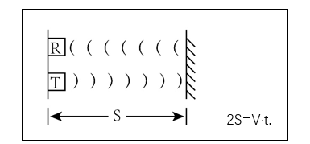
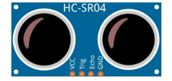
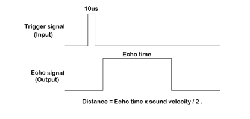
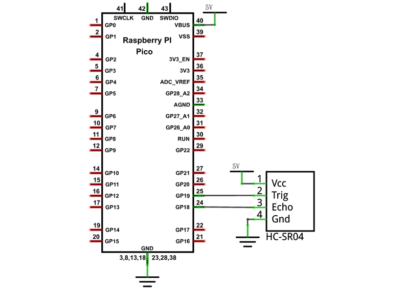

##############################################################################
Chapter Ultrasonic Ranging
##############################################################################

In this chapter, we learn a module, which use ultrasonic to measure distance, HC SR04.

Project Ultrasonic Ranging
***************************************

In this project, we use ultrasonic ranging module to measure distance, and print out the data in the terminal.

Component List
==========================

+-----------------------------------------+------------------------------------------+
| Raspberry Pi Pico x1                    | USB Cable x1                             |
|                                         |                                          |
| |Chapter01_08|                          | |Chapter01_09|                           |
+-----------------------------------------+------------------------------------------+
| Breadboard x1                                                                      |
|                                                                                    |
| |Chapter01_10|                                                                     |
+-----------------------------------------+------------------------------------------+
| HC SR04 x1                              | Jumper                                   |
|                                         |                                          |
|  |Chapter22_00|                         | |Chapter21_01|                           |
+-----------------------------------------+------------------------------------------+

.. |Chapter01_08| image:: ../_static/imgs/1_LED/Chapter01_08.png
.. |Chapter01_09| image:: ../_static/imgs/1_LED/Chapter01_09.png
.. |Chapter01_10| image:: ../_static/imgs/1_LED/Chapter01_10.png

.. |Chapter21_01| image:: ../_static/imgs/21_LCD1602/Chapter21_01.png

Component Knowledge
============================

The Ultrasonic Ranging Module uses the principle that ultrasonic waves will reflect when they encounter any obstacles. This is possible by counting the time interval between when the ultrasonic wave is transmitted to when the ultrasonic wave reflects back after encountering an obstacle. Time interval counting will end after an ultrasonic wave is received, and the time difference (delta) is the total time of the ultrasonic wave's journey from being transmitted to being received. Because the speed of sound in air is a constant, and is about v=340m/s, we can calculate the distance between the Ultrasonic Ranging Module and the obstacle: s=vt/2.

The HC-SR04 Ultrasonic Ranging Module integrates both an ultrasonic transmitter and a receiver. The transmitter is used to convert electrical signals (electrical energy) into high frequency (beyond human hearing) sound waves (mechanical energy) and the function of the receiver is opposite of this. The picture and the diagram of the HC SR04 Ultrasonic Ranging Module are shown below:

.. list-table::
   :width: 100%
   :align: center
   
   * -  |Chapter22_02|
     -  |Chapter22_03| 

.. |Chapter22_03| image:: ../_static/imgs/22_Ultrasonic_Ranging/Chapter22_03.png

Pin description:

+------+------------------+
| Pin  | Description      |
+------+------------------+
| VCC  | power supply pin |
+------+------------------+
| Trig | trigger pin      |
+------+------------------+
| Echo | Echo pin         |
+------+------------------+
| GND  | GND              |
+------+------------------+

**Technical specs:**

Working voltage: 5V                      

Working current: 12mA

Minimum measured distance: 2cm          

Maximum measured distance: 200cm

Instructions for Use: output a high-level pulse in Trig pin lasting for least 10us, the module begins to transmit ultrasonic waves. At the same time, the Echo pin is pulled up. When the module receives the returned ultrasonic waves from encountering an obstacle, the Echo pin will be pulled down. The duration of high level in the Echo pin is the total time of the ultrasonic wave from transmitting to receiving, s=vt/2. 

Circuit
=================================

Note that the voltage of ultrasonic module is 5V in the circuit.

.. list-table::
   :width: 100%
   :align: center
   
   * -  Schematic diagram
   * -  |Chapter22_05|
   * -  Hardware connection. 
       
        :red:`If you need any support, please contact us via:` support@freenove.com
   * -  |Chapter22_06| 

.. |Chapter22_06| image:: ../_static/imgs/22_Ultrasonic_Ranging/Chapter22_06.png

Code
=====================

Open "Thonny", click "This computer" -> "D:" -> "Micropython_Codes" -> "22.1_Ultrasonic_Ranging" and double click "22.1_Ultrasonic_Ranging.py". 

Ultrasonic_Ranging
------------------------------

Click "Run current script", you can use it to measure the distance between the ultrasonic module and the object. As shown in the following figure. Press Ctrl+C or click "Stop/Restart backend" to exit the program.

The following is the program code:

.. literalinclude:: ../../../freenove_Kit/Python/Python_Codes/22.1_Ultrasonic_Ranging/22.1_Ultrasonic_Ranging.py
    :linenos: 
    :language: python
    :lines: 11-12
    :dedent:

Define the control pins of the ultrasonic ranging module.

.. literalinclude:: ../../../freenove_Kit/Python/Python_Codes/22.1_Ultrasonic_Ranging/22.1_Ultrasonic_Ranging.py
    :linenos: 
    :language: python
    :lines: 4-5
    :dedent:

Set the speed of sound.

.. literalinclude:: ../../../freenove_Kit/Python/Python_Codes/22.1_Ultrasonic_Ranging/22.1_Ultrasonic_Ranging.py
    :linenos: 
    :language: python
    :lines: 8-8
    :dedent:

The getDistance() function is used to drive the ultrasonic module to measure distance. In the function, after the Trig pin keeps at high level for 10us to start the ultrasonic module, Echo.value() is used to read the status of ultrasonic module's Echo pin, and then use timestamp function of the time module to calculate the duration of Echo pin's high level. Finally, calculate the measured distance based on time and return the value.

.. literalinclude:: ../../../freenove_Kit/Python/Python_Codes/22.1_Ultrasonic_Ranging/22.1_Ultrasonic_Ranging.py
    :linenos: 
    :language: python
    :lines: 10-22
    :dedent:

Delay for 2 seconds and wait for the ultrasonic module to stabilize. Print data obtained from ultrasonic module every 500 milliseconds.

.. literalinclude:: ../../../freenove_Kit/Python/Python_Codes/22.1_Ultrasonic_Ranging/22.1_Ultrasonic_Ranging.py
    :linenos: 
    :language: python
    :lines: 24-28
    :dedent:

Project Ultrasonic Ranging
****************************************

Component List and Circuit
====================================

Component List and Circuit are the same as the previous section.

Code
============================

Open "Thonny", click "This computer" -> "D:" -> "Micropython_Codes" -> "22.2_Ultrasonic_Ranging". Select "hcsr04.py", right click your mouse to select "Upload to /", wait for "hcsr04.py" to be uploaded to Raspberry Pi Pico and then double click "22.2_Ultrasonic_Ranging.py".

Ultrasonic_Ranging
-----------------------------

Click "Run current script". Use the ultrasonic module to measure distance. As shown in the following figure. Press Ctrl+C or click "Stop/Restart backend" to exit the program.

The following is the program code:

.. literalinclude:: ../../../freenove_Kit/Python/Python_Codes/22.2_Ultrasonic_Ranging/22.2_Ultrasonic_Ranging.py
    :linenos: 
    :language: python
    :lines: 1-13
    :dedent:

Import hcsr04 module.

.. literalinclude:: ../../../freenove_Kit/Python/Python_Codes/22.2_Ultrasonic_Ranging/22.2_Ultrasonic_Ranging.py
    :linenos: 
    :language: python
    :lines: 1-1
    :dedent:

Define an ultrasonic object and associate with the pins.

.. literalinclude:: ../../../freenove_Kit/Python/Python_Codes/22.2_Ultrasonic_Ranging/22.2_Ultrasonic_Ranging.py
    :linenos: 
    :language: python
    :lines: 4-4
    :dedent:

Obtain the distance data returned from the ultrasonic ranging module. 

.. code-block:: python

    SR.distanceCM()

Obtain the ultrasonic data every 500 milliseconds and print them out in "Shell".

.. literalinclude:: ../../../freenove_Kit/Python/Python_Codes/22.2_Ultrasonic_Ranging/22.2_Ultrasonic_Ranging.py
    :linenos: 
    :language: python
    :lines: 8-11
    :dedent:

Reference
---------------------------

.. py:function:: Class hcsr04 	

    Before each use of object **HCSR04** , please add the statement " **from hcsr04 import HCSR04** " to the top of python file. 

    **SRHC04():** Object of ultrasonic module. By default, trig pin is GP19 and echo pin is GP18.

    **distanceCM():** Obtain the distance from the ultrasonic to the measured object with the data type being int type, and the unit being cm.

    **distanceMM():** Obtain the distance from the ultrasonic to the measured object with the data type being int type, and the unit being mm.

    **distanceM():** Obtain the distance from the ultrasonic to the measured object with the data type being   float type, and the unit being m.