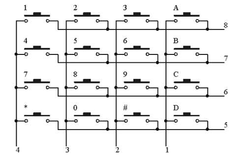
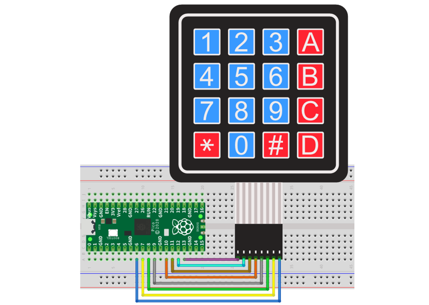
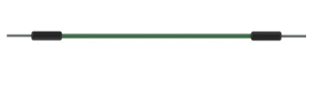
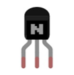
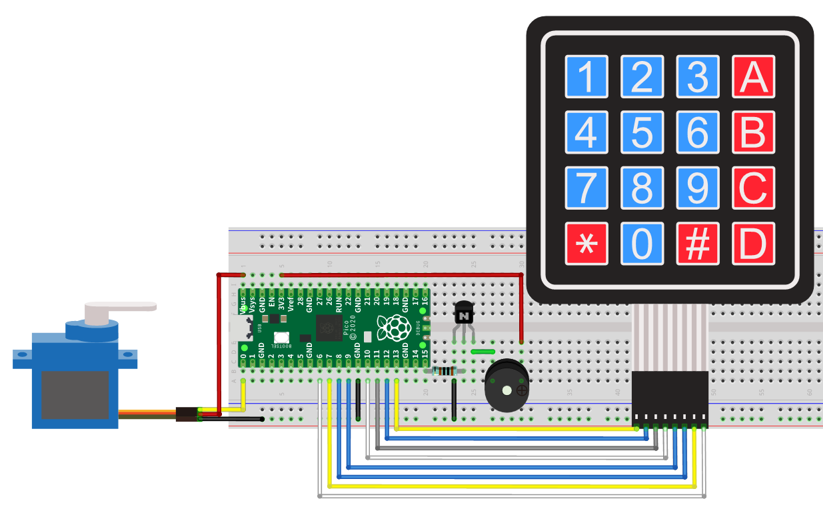

##############################################################################
Chapter Matrix Keypad
##############################################################################

Earlier we learned about a single Push Button Switch. In this chapter, we will learn about Matrix Keyboards, which integrates a number of Push Button Switches as Keys for the purposes of Input.

Project Matrix Keypad
**************************************

In this project, we will attempt to get every key code on the Matrix Keypad to work.

Component List
===============================

+-----------------------------------------+------------------------------------------+
| Raspberry Pi Pico x1                    | USB Cable x1                             |
|                                         |                                          |
| |Chapter01_08|                          | |Chapter01_09|                           |
+-----------------------------------------+------------------------------------------+
| Breadboard x1                                                                      |
|                                                                                    |
| |Chapter01_10|                                                                     |
+-----------------------------------------+------------------------------------------+
| 4x4 Matrix Keypad x1                    | Jumper                                   |
|                                         |                                          |
|  |Chapter23_01|                         | |Chapter23_00|                           |
+-----------------------------------------+------------------------------------------+

.. |Chapter01_08| image:: ../_static/imgs/1_LED/Chapter01_08.png
.. |Chapter01_09| image:: ../_static/imgs/1_LED/Chapter01_09.png
.. |Chapter01_10| image:: ../_static/imgs/1_LED/Chapter01_10.png
.. |Chapter23_00| image:: ../_static/imgs/23_Matrix_Keypad/Chapter23_00.png
.. |Chapter23_01| image:: ../_static/imgs/23_Matrix_Keypad/Chapter23_01.png

Component Knowledge
==========================

4x4 Matrix Keypad
----------------------------

A Keypad Matrix is a device that integrates a number of keys in one package. As is shown below, a 4x4 Keypad Matrix integrates 16 keys:

.. image:: ../_static/imgs/23_Matrix_Keypad/Chapter23_02.png
    :align: center

Similar to the integration of an LED Matrix, the 4x4 Keypad Matrix has each row of keys connected with one pin and this is the same for the columns. Such efficient connections reduce the number of processor ports required. The internal circuit of the Keypad Matrix is shown below.

The method of usage is similar to the Matrix LED, by using a row or column scanning method to detect the state of each key's position by column and row. Take column scanning method as an example, send low level to the first 1 column (Pin1), detect level state of row 5, 6, 7, 8 to determine whether the key A, B, C, D are pressed. Then send low level to column 2, 3, 4 in turn to detect whether other keys are pressed. By this means, you can get the state of all of the keys.

Circuit
==============================

.. list-table::
   :width: 100%
   :align: center
   
   * -  Schematic diagram
   * -  |Chapter23_04|
   * -  Hardware connection. 
       
        :red:`If you need any support, please contact us via:` support@freenove.com
   * -  |Chapter23_05| 

.. |Chapter23_04| image:: ../_static/imgs/23_Matrix_Keypad/Chapter23_04.png

Code
===========================

This code is used to obtain all key codes of the 4x4 Matrix Keypad, when one of the keys is pressed, the key code will be printed out via serial port.

Open "Thonny", click "This computer" -> "D:" -> "Micropython_Codes" ->  "23.1_Matrix_Keypad". Select"keypad.py", right click your mouse to select "Upload to /", wait for "keypad.py" to be uploaded to Raspberry Pi Pico and then double click "23.1_Matrix_Keypad.py". 

Matrix_Keypad
----------------------------

Click "Run current script", push the key board and the key value will be printed in "Shell", as shown in the illustration below. Press Ctrl+C or click "Stop/Restart backend" to exit the program.

The following is the program code:

.. literalinclude:: ../../../freenove_Kit/Python/Python_Codes/23.1_Matrix_Keypad/23.1_Matrix_Keypad.py
    :linenos: 
    :language: python
    :lines: 1-14
    :dedent:

Import keypad module.

.. literalinclude:: ../../../freenove_Kit/Python/Python_Codes/23.1_Matrix_Keypad/23.1_Matrix_Keypad.py
    :linenos: 
    :language: python
    :lines: 1-1
    :dedent:

Associate the keypad module to Raspberry Pi Pico pins. 

.. literalinclude:: ../../../freenove_Kit/Python/Python_Codes/23.1_Matrix_Keypad/23.1_Matrix_Keypad.py
    :linenos: 
    :language: python
    :lines: 4-4
    :dedent:

Call function keypad.scan() of the keypad module. When the keypad module detects that the key is pressed, it returns the value of the pressed key; when no key is pressed, the return value is None. 

.. literalinclude:: ../../../freenove_Kit/Python/Python_Codes/23.1_Matrix_Keypad/23.1_Matrix_Keypad.py
    :linenos: 
    :language: python
    :lines: 6-11
    :dedent:

Reference
-------------------------

.. py::function:: Class keypad	
    
    Before each use of the object **KeyPad** , please make sure **keypad.py** has been uploaded to "/" of Raspberry Pi Pico and then add the statement " **from keypad import KeyPad** " to the top of python file.
    
    **KeyPad(row1,row2,row3,row4,col1,col2,col3,col4):** Initialize keypad module and associate its pins with Raspberry Pi Pico. **KeyPad() == KeyPad(13, 12, 11, 10, 9, 8, 7, 6).**
    
    **scan():** Non-blocking keypad scan function. If no key is pressed, it returns None; Otherwise, it returns the valued of the pressed key.

Project Keypad Door
**********************************

In this project, we use keypad as a keyboard to control the action of the servo motor.

Component List
=============================

+-----------------------------------------+------------------------------------------+
| Raspberry Pi Pico x1                    | USB Cable x1                             |
|                                         |                                          |
| |Chapter01_08|                          | |Chapter01_09|                           |
+-----------------------------------------+------------------------------------------+
| Breadboard x1                                                                      |
|                                                                                    |
| |Chapter01_10|                                                                     |
+-------------------------+-------------------------------+--------------------------+
| Jumper                  | Servo x1                      |  4x4 Matrix              |
|                         |                               |                          |
|                         |                               |  Keypad x1               |
|                         |                               |                          |
| |Chapter23_08|          |  |Chapter23_09|               |  |Chapter23_10|          |
+-------------------------+-------------------------------+--------------------------+
| NPN transistorx1        | Active buzzer x1              |  Resistor 1kΩ x1         |
|                         |                               |                          |
| (S8050)                 |                               |                          |
|                         |                               |                          |
| |Chapter23_11|          |  |Chapter23_12|               |  |Chapter23_13|          |
+-------------------------+-------------------------------+--------------------------+

.. |Chapter23_09| image:: ../_static/imgs/23_Matrix_Keypad/Chapter23_09.png
.. |Chapter23_10| image:: ../_static/imgs/23_Matrix_Keypad/Chapter23_10.png

.. |Chapter23_12| image:: ../_static/imgs/23_Matrix_Keypad/Chapter23_12.png
.. |Chapter23_13| image:: ../_static/imgs/23_Matrix_Keypad/Chapter23_13.png

Circuit
===========================

.. list-table::
   :width: 100%
   :align: center
   
   * -  Schematic diagram
   * -  |Chapter23_14|
   * -  Hardware connection. 
       
        :red:`If you need any support, please contact us via:` support@freenove.com
   * -  |Chapter23_15| 

.. |Chapter23_14| image:: ../_static/imgs/23_Matrix_Keypad/Chapter23_14.png

Code
==========================

Open "Thonny", click "This computer" -> "D:" -> "Micropython_Codes" -> "23.2_Keypad_Door". Select "keypad.py" and "myservo.py", right click your mouse to select "Upload to /", wait for "keypad.py" and "myservo.py" to be uploaded to Raspberry Pi Pico and then double click "23.2_Keypad_Door.py". 

Keypad_Door
---------------------------

Click "Run current script", press the keypad to input password with 4 characters. If the input is correct, the servo will move to a certain degree, and then return to the original position. If the input is wrong, an input error will occur. Press Ctrl+C or click "Stop/Restart backend" to exit the program.

The following is the program code:

.. literalinclude:: ../../../freenove_Kit/Python/Python_Codes/23.2_Keypad_Door/23.2_Keypad_Door.py
    :linenos: 
    :language: python
    :lines: 1-39
    :dedent:

Set the passWord data to a string and assign the value to the passWord variable.

.. literalinclude:: ../../../freenove_Kit/Python/Python_Codes/23.2_Keypad_Door/23.2_Keypad_Door.py
    :linenos: 
    :language: python
    :lines: 11-11
    :dedent:

The buzzer makes a brief sound each time a key is pressed, and the key value is recorded in the keyIn string.

.. literalinclude:: ../../../freenove_Kit/Python/Python_Codes/23.2_Keypad_Door/23.2_Keypad_Door.py
    :linenos: 
    :language: python
    :lines: 21-26
    :dedent:

When pressed 4 times, keyIn records 4 key values and compares them with passWord. If they are the same, the motor rotates 90 degrees, and returns to its original position after one second. If they are inconsistent, the buzzer will sound a warning and clear the contents of the keyIn string and wait for the next input.

.. literalinclude:: ../../../freenove_Kit/Python/Python_Codes/23.2_Keypad_Door/23.2_Keypad_Door.py
    :linenos: 
    :language: python
    :lines: 28-39
    :dedent: