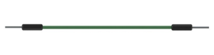

##############################################################################
Chapter Infrared Remote
##############################################################################

In this chapter, we will learn how to use an infrared remote control, and control an LED.

Project Infrared Remote Control
*****************************************

First, we need to understand how infrared remote control works, then get the command sent from infrared remote control.

Component List
===============================

+-----------------------------------------+------------------------------------------+
| Raspberry Pi Pico x1                    | USB Cable x1                             |
|                                         |                                          |
| |Chapter01_08|                          | |Chapter01_09|                           |
+-----------------------------------------+------------------------------------------+
| Breadboard x1                                                                      |
|                                                                                    |
| |Chapter01_10|                                                                     |
+-----------------------------------------+------------------------------------------+
| Infrared Remote x1                      | Jumper                                   |
|                                         |                                          |
|  |Chapter24_00|                         | |Chapter23_00|                           |
+-----------------------------------------+------------------------------------------+
| Resistor 10kΩ x1                        | Infrared Remote x1                       |
|                                         |                                          |
|                                         | (May need CR2025 battery x1,             |
|                                         |                                          |
|                                         | please check the holder)                 |
|                                         |                                          |
|  |Chapter24_01|                         | |Chapter24_02|                           |
+-----------------------------------------+------------------------------------------+

.. |Chapter01_08| image:: ../_static/imgs/1_LED/Chapter01_08.png
.. |Chapter01_09| image:: ../_static/imgs/1_LED/Chapter01_09.png
.. |Chapter01_10| image:: ../_static/imgs/1_LED/Chapter01_10.png

.. |Chapter24_00| image:: ../_static/imgs/24_Infrared_Remote/Chapter24_00.png

Component Knowledge
============================

Infrared Remote
---------------------------

An infrared (IR) remote control is a device with a certain number of buttons. Pressing down different buttons will make the infrared emission tube, which is located in the front of the remote control, send infrared ray with different command. Infrared remote control technology is widely used in electronic products such as TV, air conditioning, etc. Thus making it possible for you to switch TV programs and adjust the temperature of the air conditioning when away from them. The remote control we use is shown below:

.. image:: ../_static/imgs/24_Infrared_Remote/Chapter24_03.png
    :align: center

Infrared receiver
----------------------------

An infrared(IR) receiver is a component which can receive the infrared light, so we can use it to detect the signal emitted by the infrared remote control. DATA pin here outputs the received infrared signal.

.. image:: ../_static/imgs/24_Infrared_Remote/Chapter24_04.png
    :align: center

When you use the infrared remote control, it sends a key value to the receiving circuit according to the pressed key. We can program the Raspberry Pi Pico to do things like lighting, when a key value is received. 

The following is the key value that the receiving circuit will receive when each key of the infrared remote control is pressed.

.. image:: ../_static/imgs/24_Infrared_Remote/Chapter24_05.png
    :align: center

Circuit
===========================

.. list-table::
   :width: 100%
   :align: center
   
   * -  Schematic diagram
   * -  |Chapter24_06|
   * -  Hardware connection. 
       
        :red:`If you need any support, please contact us via:` support@freenove.com
   * -  |Chapter24_07| 

Code
=========================

Open "Thonny", click "This computer" -> "D:" -> "Micropython_Codes" -> "24.1_Infrared_Remote". Select "irrecvdata.py", right click your mouse to select "Upload to /", wait for "irrecvdata.py" to be uploaded to Raspberry Pi Pico and then double click "24.1_Infrared_Remote.py". 

Infrared_Remote
---------------------------

Click "Run current script". Press any key of the infrared remote and the key value will be printed in "Shell", as shown in the illustration below. Press Ctrl+C or click "Stop/Restart backend" to exit the program.

The following is the program code:

.. literalinclude:: ../../../freenove_Kit/Python/Python_Codes/23.2_Keypad_Door/23.2_Keypad_Door.py
    :linenos: 
    :language: python
    :lines: 1-10
    :dedent:

Import the infrared decoder. 

.. literalinclude:: ../../../freenove_Kit/Python/Python_Codes/23.2_Keypad_Door/23.2_Keypad_Door.py
    :linenos: 
    :language: python
    :lines: 1-1
    :dedent:

Associate the infrared decoder with GP15.

.. code-block:: python

    recvPin = irGetCMD(15)

Call ir_read() to read the value of the pressed key and assign it to IRValue.

.. code-block:: python

    irValue = recvPin.ir_read()

When infrared key value is obtained, print it out in "Shell".

.. literalinclude:: ../../../freenove_Kit/Python/Python_Codes/23.2_Keypad_Door/23.2_Keypad_Door.py
    :linenos: 
    :language: python
    :lines: 5-8
    :dedent:

Reference
-------------------------

.. py:function:: Class irrecvdata	

    Before each use of the object **irrecvdata** , please add the statement " **from irrecvdata import irGetCMD** " to the top of the python file.

    **irGetCMD():** Object of infrared encoder, which is associated with GP15 by default.

    **ir_read():** The function that reads the key value of infrared remote. When the value is read, it will be returned; when no value is obtained, character **None** will be returned. 

Project Control LED through Infrared Remote
********************************************************

In this project, we will control the brightness of LED lights through an infrared remote control.

Component List
==========================

+-----------------------------------------+------------------------------------------+
| Raspberry Pi Pico x1                    | USB Cable x1                             |
|                                         |                                          |
| |Chapter01_08|                          | |Chapter01_09|                           |
+-----------------------------------------+------------------------------------------+
| Breadboard x1                                                                      |
|                                                                                    |
| |Chapter01_10|                                                                     |
+-------------------------+-------------------------------+--------------------------+
| LED x1                  | Active buzzer x1              |  Resistor 1kΩ x2         |
|                         |                               |                          |
| |Chapter24_10|          |  |Chapter23_12|               |  |Chapter24_11|          |
+-------------------------+-------------------------------+--------------------------+
| Infrared receiver x1    | NPN transistorx1              |  Resistor 10kΩ x1        |
|                         |                               |                          |
|                         | (S8050)                       |                          |
|                         |                               |                          |
| |Chapter24_00|          |  |Chapter23_11|               |  |Chapter24_12|          |
+-------------------------+-------------------------------+--------------------------+

.. |Chapter24_00| image:: ../_static/imgs/24_Infrared_Remote/Chapter24_00.png
.. |Chapter24_10| image:: ../_static/imgs/24_Infrared_Remote/Chapter24_10.png

.. |Chapter23_11| image:: ../_static/imgs/23_Matrix_Keypad/Chapter23_11.png

Circuit
==========================

.. list-table::
   :width: 100%
   :align: center
   
   * -  Schematic diagram
   * -  |Chapter24_13|
   * -  Hardware connection. 
       
        :red:`If you need any support, please contact us via:` support@freenove.com
   * -  |Chapter24_14| 

.. |Chapter24_13| image:: ../_static/imgs/24_Infrared_Remote/Chapter24_13.png
.. |Chapter24_14| image:: ../_static/imgs/24_Infrared_Remote/Chapter24_14.png

Code
==========================

The Code controls the brightness of the LED by determining the key value of the infrared received.

Open "Thonny", click "This computer" -> "D:" -> "Micropython_Codes" -> "24.2_Control_LED_through_Infrared_Remote". Select "irrecvdata.py", right click your mouse to select "Upload to /", wait for "irrecvdata.py" to be uploaded to Raspberry Pi Pico and then double click "24.2_Control_LED_through_Infrared_Remote.py". 

Control_LED_through_Infrared_Remote
---------------------------------------

Click "Run current script". When pressing "0", "1", "2", "3" of the infrared remote control, the buzzer will sound once, and the brightness of the LED light will change correspondingly. Press Ctrl+C or click "Stop/Restart backend" to exit the program.

The following is the program code:

.. literalinclude:: ../../../freenove_Kit/Python/Python_Codes/24.2_Control_LED_through_Infrared_Remote/24.2_Control_LED_through_Infrared_Remote.py
    :linenos: 
    :language: python
    :lines: 1-35
    :dedent:

The handleControl() function is used to execute events corresponding to infrared code values. Every time when the function is called, the buzzer sounds once and determines the brightness of the LED based on the infrared key value. If the key value is not "0", "1", "2", "3", the buzzer sounds once, but the brightness of LED will not change.

.. literalinclude:: ../../../freenove_Kit/Python/Python_Codes/24.2_Control_LED_through_Infrared_Remote/24.2_Control_LED_through_Infrared_Remote.py
    :linenos: 
    :language: python
    :lines: 12-26
    :dedent:

Each time the key value of IR remote is received, function handleControl() will be called to process it.

.. literalinclude:: ../../../freenove_Kit/Python/Python_Codes/24.2_Control_LED_through_Infrared_Remote/24.2_Control_LED_through_Infrared_Remote.py
    :linenos: 
    :language: python
    :lines: 29-33
    :dedent: