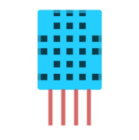
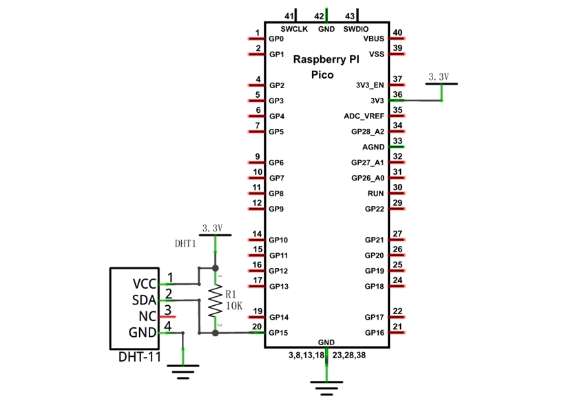
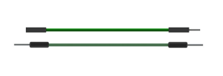
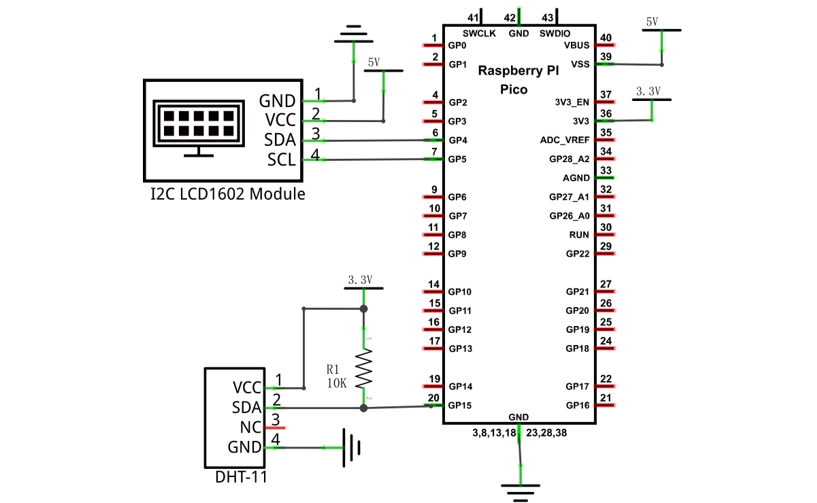

##############################################################################
Chapter Hygrothermograph DHT11
##############################################################################

In this chapter, we will learn about a commonly used sensor called a Hygrothermograph DHT11.

Project Hygrothermograph
************************************

Hygrothermograph is an important tool in our lives to give us data on the temperature and humidity in our environment. In this project, we will use the Raspberry Pi Pico to read Temperature and Humidity data of the DHT11 Module.

Component List
==================

+-----------------------------------------+------------------------------------------+
| Raspberry Pi Pico x1                    | USB Cable x1                             |
|                                         |                                          |
| |Chapter01_08|                          | |Chapter01_09|                           |
+-----------------------------------------+------------------------------------------+
| Breadboard x1                                                                      |
|                                                                                    |
| |Chapter01_10|                                                                     |
+-------------------------+-------------------------------+--------------------------+
| DHT11 x1                | Jumper                        |  Resistor 10kΩ x1        |
|                         |                               |                          |
| |Chapter25_00|          |  |Chapter23_08|               |  |Chapter02_01|          |
+-------------------------+-------------------------------+--------------------------+

.. |Chapter01_08| image:: ../_static/imgs/1_LED/Chapter01_08.png
.. |Chapter01_09| image:: ../_static/imgs/1_LED/Chapter01_09.png
.. |Chapter01_10| image:: ../_static/imgs/1_LED/Chapter01_10.png

.. |Chapter02_01| image:: ../_static/imgs/2_Button_&_LED/Chapter02_01.png
.. |Chapter23_08| image:: ../_static/imgs/23_Matrix_Keypad/Chapter23_08.png
    
Component Knowledge
=====================

The Temperature & Humidity Sensor DHT11 is a compound temperature & humidity sensor, and the output digital signal has been calibrated by its manufacturer.

.. image:: ../_static/imgs/25_Hygrothermograph_DHT11/Chapter25_01.png
    :align: center

DHT11 uses customized single-line communication protocol, so we can use the library to read data more conveniently.

After being powered up, it will initialize in 1S's time. Its operating voltage is within the range of 3.3V-5.5V.

The SDA pin is a data pin, which is used to communicate with other devices. 

The NC pin (Not Connected Pin) is a type of pin found on various integrated circuit packages. Those pins have no functional purpose to the outside circuit (but may have an unknown functionality during manufacture and test). Those pins should not be connected to any of the circuit connections.

Circuit
=========================

.. list-table::
   :width: 100%
   :align: center
   
   * -  Schematic diagram
   * -  |Chapter25_02|
   * -  Hardware connection. 
       
        :red:`If you need any support, please contact us via:` support@freenove.com
   * -  |Chapter25_03| 

.. |Chapter25_03| image:: ../_static/imgs/25_Hygrothermograph_DHT11/Chapter25_03.png

Code
==========================

Open "Thonny", click "This computer" -> "D:" -> "Micropython_Codes" -> "25.1_Hygrothermograph". Select "dht11.py", right click your mouse to select "Upload to /", wait for "dht11.py" to be uploaded to Raspberry Pi Pico and then double click "25.1_Hygrothermograph.py".

Hygrothermograph
--------------------------

Make sure your circuit is correctly connected and you will see the following messages printed in "Shell". Press Ctrl+C or click "Stop/Restart backend" to exit the program.

The following is the program code:

.. literalinclude:: ../../../freenove_Kit/Python/Python_Codes/25.1_Hygrothermograph/25.1_Hygrothermograph.py
    :linenos: 
    :language: python
    :lines: 1-16
    :dedent:

Import time and dht11 modules.

.. literalinclude:: ../../../freenove_Kit/Python/Python_Codes/25.1_Hygrothermograph/25.1_Hygrothermograph.py
    :linenos: 
    :language: python
    :lines: 1-3
    :dedent:

Create a DHT11 object and bind GP15 as the data transfer pin.

.. literalinclude:: ../../../freenove_Kit/Python/Python_Codes/25.1_Hygrothermograph/25.1_Hygrothermograph.py
    :linenos: 
    :language: python
    :lines: 5-6
    :dedent:

Call the temperature function and humidity function to read the temperature and humidity data of DHT module and print the data to "shell".

.. literalinclude:: ../../../freenove_Kit/Python/Python_Codes/25.1_Hygrothermograph/25.1_Hygrothermograph.py
    :linenos: 
    :language: python
    :lines: 11-13
    :dedent:

Obtain temperature and humidity data once per second and print them out.

.. literalinclude:: ../../../freenove_Kit/Python/Python_Codes/25.1_Hygrothermograph/25.1_Hygrothermograph.py
    :linenos: 
    :language: python
    :lines: 9-14
    :dedent:

Reference
--------------------------

.. py:function:: Class dht11	
    
    Before each use of object **dht11** , please add the statement " **from dht11 import DHT11, InvalidChecksum** " to the top of python file.
    
    **DHT11(pin):** Object of DHT11, pin_name parameter is to set the data output pin connecting to DHT11.
    
    **DHT11.temperature:** Returns the temperature data measured by DHT11.
    
    **DHT11.humidity:** Returns the humidity data measured by DHT11.

Project Hygrothermograph
***********************************

In this project, we use I2C-LCD1602 to display data collected by DHT11.

Component List
=============================

+-----------------------------------------+------------------------------------------+
| Raspberry Pi Pico x1                    | USB Cable x1                             |
|                                         |                                          |
| |Chapter01_08|                          | |Chapter01_09|                           |
+-----------------------------------------+------------------------------------------+
| Breadboard x1                                                                      |
|                                                                                    |
| |Chapter01_10|                                                                     |
+-----------------------------------------+------------------------------------------+
| LCD1602 Module x1                       | Resistor 10kΩ x1                         |
|                                         |                                          |
|  |Chapter25_07|                         | |Chapter02_01|                           |
+-----------------------------------------+------------------------------------------+
| Jumper                                  | DHT11 x1                                 |
|                                         |                                          |
|  |Chapter25_08|                         | |Chapter25_00|                           |
+-----------------------------------------+------------------------------------------+

.. |Chapter25_07| image:: ../_static/imgs/25_Hygrothermograph_DHT11/Chapter25_07.png

Circuit
=========================

.. list-table::
   :width: 100%
   :align: center
   
   * -  Schematic diagram
   * -  |Chapter25_09|
   * -  Hardware connection. 
       
        :red:`If you need any support, please contact us via:` support@freenove.com
   * -  |Chapter25_10| 

.. |Chapter25_10| image:: ../_static/imgs/25_Hygrothermograph_DHT11/Chapter25_10.png

Obtain data of Hygrothermograph every second and display them on LCD1602. The first line displays 

Code
===========================

Open "Thonny", click "This computer" -> "D:" -> "Micropython_Codes" -> 25.2_Hygrothermograph". Select "dht11.py"、"I2C_LCD.py" and "LCD_API.py", right click your mouse to select "Upload to /", wait for "dht11.py"、"I2C_LCD.py" and "LCD_API.py" to be uploaded to Raspberry Pi Pico and then double click "25.2_Hygrothermograph.py".

Hygrothermograph
---------------------------

Click "Run current script". The first row of LCD1602 is temperature value and the second row is humidity. Try to "pinch" the DHT11 (without touching the leads) with your index finger and thumb for a brief time, you should see that the displayed value on LCD1602 changes. Press Ctrl+C or click "Stop/Restart backend" to exit the program.

The following is the program code:

.. literalinclude:: ../../../freenove_Kit/Python/Python_Codes/25.2_Hygrothermograph/25.2_Hygrothermograph.py
    :linenos: 
    :language: python
    :lines: 1-28
    :dedent:

Import dht11 and I2C LCD1602 modules.

.. literalinclude:: ../../../freenove_Kit/Python/Python_Codes/25.2_Hygrothermograph/25.2_Hygrothermograph.py
    :linenos: 
    :language: python
    :lines: 1-4
    :dedent:

Assign GP5 to DHT11, GP14 and GP15 to LCD1602.

.. literalinclude:: ../../../freenove_Kit/Python/Python_Codes/25.2_Hygrothermograph/25.2_Hygrothermograph.py
    :linenos: 
    :language: python
    :lines: 6-11
    :dedent:

Obtain data of Hygrothermograph every second and display them on LCD1602. The first line displays temperature and the second line displays humidity.

.. literalinclude:: ../../../freenove_Kit/Python/Python_Codes/25.2_Hygrothermograph/25.2_Hygrothermograph.py
    :linenos: 
    :language: python
    :lines: 14-28
    :dedent:

