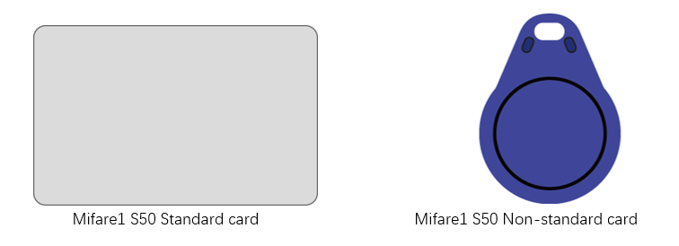

##############################################################################
Chapter RFID
##############################################################################

Now, we will learn to use the RFID (Radio Frequency Identification) wireless communication technology.

Project RFID read UID
*************************************

In this project, we will read the unique ID number (UID) of the RFID card, recognize the type of the RFID card and display the information through serial port.

Component List
====================================

+-----------------------------------------+------------------------------------------+
| Raspberry Pi Pico x1                    | USB Cable x1                             |
|                                         |                                          |
| |Chapter01_08|                          | |Chapter01_09|                           |
+-----------------------------------------+------------------------------------------+
| Breadboard x1                                                                      |
|                                                                                    |
| |Chapter01_10|                                                                     |
+-----------------------------------------+------------------------------------------+
| Jumper                                  | RFID Module(RC522) x1                    |
|                                         |                                          |
|  |Chapter28_00|                         | |Chapter28_01|                           |
+-----------------------------------------+------------------------------------------+
| Mifare1 S50 Standard card x1            | Mifare1 S50 Standard card x1             |
|                                         |                                          |
|  |Chapter28_02|                         | |Chapter28_03|                           |
+-----------------------------------------+------------------------------------------+

.. |Chapter01_08| image:: ../_static/imgs/1_LED/Chapter01_08.png
.. |Chapter01_09| image:: ../_static/imgs/1_LED/Chapter01_09.png
.. |Chapter01_10| image:: ../_static/imgs/1_LED/Chapter01_10.png
.. |Chapter26_03| image:: ../_static/imgs/26_Infrared_Motion_Sensor/Chapter26_03.png
.. |Chapter28_00| image:: ../_static/imgs/28_RFID/Chapter28_00.png

.. |Chapter28_02| image:: ../_static/imgs/28_RFID/Chapter28_02.png
.. |Chapter28_03| image:: ../_static/imgs/28_RFID/Chapter28_03.png

Component Knowledge
=========================

RFID
----------------------------

RFID (Radio Frequency Identification) is a wireless communication technology. A complete RFID system is generally composed of the responder and reader. Generally, we use tags as responders, and each tag has a unique code, which is attached to the object to identify the target object. The reader is a device for reading (or writing) tag information.

Products derived from RFID technology can be divided into three categories: passive RFID products, active RFID products and semi active RFID products. Moreover, Passive RFID products are the earliest, the most mature and most widely used products in the market among others. It can be seen everywhere in our daily life such as, the bus card, dining card, bankcard, hotel access cards, etc., and all of these belong to close-range contact recognition. The main operating frequency of Passive RFID products are: 125KHZ (low frequency), 13.56MHZ (high frequency), 433MHZ (ultrahigh frequency), 915MHZ (ultrahigh frequency). Active and semi active RFID products work at higher frequencies.

The RFID module we use is a passive RFID product with the operating frequency of 13.56MHz.

MFRC522 RFID Module
----------------------------

The MFRC522 is a highly integrated reader/writer IC for contactless communication at 13.56MHz.

The MFRC522's internal transmitter is able to drive a reader/writer antenna designed to communicate with ISO/IEC 14443 A/MIFARE cards and transponders without additional active circuitry. The receiver module provides a robust and efficient implementation for demodulating and decoding signals from ISO/IEC 14443 A/MIFARE compatible cards and transponders. The digital module manages the complete ISO/IEC 14443A framing and error detection (parity and CRC) functionality.

This RFID Module uses MFRC522 as the control chip and SPI (Peripheral Interface Serial) as the reserved interface.

Mifare1 S50 Card
---------------------------

Mifare1 S50 is often called Mifare Standard with the capacity of 1K bytes. Each card has a 4-bytes global unique identifier number (USN/UID), which can be rewritten 100 thousand times and read infinite times. Its storage period can last for 10 years. The ordinary Mifare1 S50 Card and non-standard Mifare1 S50 Card equipped for this kit are shown below.

The Mifare1 S50 capacity (1K byte) is divided into 16 sectors (Sector0-Sector15). Each sector contains four data block (Block0-Block3. 64 blocks of 16 sectors will be numbered according to absolute address, from 0 to 63). Each block contains 16 bytes (Byte0-Byte15), 64*16=1024. As is shown in the following table:

+------------+-----------+--------------------------------------+---------------+--------------------+
| Sector No. | Block No. |             Storage area             |  Block type   | Absolute block No. |
+============+===========+======================================+===============+====================+
|            | block 0   | vendor code                          | vendor block  | 0                  |
|            +-----------+--------------------------------------+---------------+--------------------+
| sector 0   | block 1   |                                      | data block    | 1                  |
|            +-----------+--------------------------------------+---------------+--------------------+
|            | block 2   |                                      | data block    | 2                  |
|            +-----------+--------------------------------------+---------------+--------------------+
|            | block 3   | Password A-access control-password B | control block | 3                  |
+------------+-----------+--------------------------------------+---------------+--------------------+
|            | block 0   |                                      | data block    | 4                  |
|            +-----------+--------------------------------------+---------------+--------------------+
| sector 1   | block 1   |                                      | data block    | 5                  |
|            +-----------+--------------------------------------+---------------+--------------------+
|            | block 2   |                                      | data block    | 6                  |
|            +-----------+--------------------------------------+---------------+--------------------+
|            | block 3   | Password A-access control-password B | control block | 7                  |
+------------+-----------+--------------------------------------+---------------+--------------------+
| ...        | ...       | ...                                  | ...           |                    |
+------------+-----------+--------------------------------------+---------------+--------------------+
|            | block 0   |                                      | data block    | 60                 |
|            +-----------+--------------------------------------+---------------+--------------------+
| sector 15  | block 1   |                                      | data block    | 61                 |
|            +-----------+--------------------------------------+---------------+--------------------+
|            | block 2   |                                      | data block    | 62                 |
|            +-----------+--------------------------------------+---------------+--------------------+
|            | block 3   | Password A-access control-password B | control block | 63                 |
+------------+-----------+--------------------------------------+---------------+--------------------+

Each sector has a set of independent password and access control that are put in the last block of each sector, and the block is also known as sector trailer, that is Block 3 in each sector. Sector 0, block 0 (namely absolute address 0) of S50 is used to store the vendor code, which has been solidified and cannot be changed, and the card serial number is stored here. In addition to the manufacturer and the control block, the rest of the cards are data blocks, which can be used to store data. Data block can be used for two kinds of applications:

(1) used as general data storage and can be operated for reading and writing.

(2) used as data value, and can be operated for initializing the value, adding value, subtracting and reading the value.

The sector trailer block in each sector is the control block, including a 6-byte password A, 4-byte access control and 6-byte password B. For example, the control block of a brand new card is as follows:

.. list-table::
   :width: 100%
   :align: center
   
   * -  A0 A1 A2 A3 A4 A5
     -  FF 07 80 69
     -  FF 07 80 69
   * -  password A
     -  access control
     -  password B 

The default password of a brand new card is generally A0A1A2A3A4A5 for password A, B0B1B2B3B4B5 for password B, or both the password A and password B are 6 FF. Access control is used to set the access conditions for each block (including the control block itself) in a sector.

Blocks of S50 are divided into data blocks and control blocks. There are four operations, "read", "write", "add value", "subtract value (including transmission and storage)" for data blocks, and there are two operations, "read" and "write" for control blocks.

For more details about how to set data blocks and control blocks, please refer to Datasheet.

By default, after verifying password A or password B, we can do reading or writing operation to data blocks. In addition, after verifying password A, we can do reading or writing operation to control blocks. However, password A can never be read. If you choose to verify password A and then you forget the password A, the block will never be able to read again. **It is highly recommended that beginners should not try to change the contents of control blocks.**

Circuit
===========================

The connection of control board and RFID module is shown below.

.. list-table::
   :width: 100%
   :align: center
   
   * -  Schematic diagram
   * -  |Chapter28_06|
   * -  Hardware connection. 
       
        :red:`If you need any support, please contact us via:` support@freenove.com
   * -  |Chapter28_07| 

.. |Chapter28_07| image:: ../_static/imgs/28_RFID/Chapter28_07.png

Code
===============================

Open "Thonny", click "This computer" -> "D:" -> "Micropython_Codes" -> "28.1_RFID_Read_UID". Select"mfrc522.py", right click to select "Upload to /", wait for "mfrc522.py" to be uploaded to Raspberry Pi Pico and then double click "28.1_RFID_Read_UID.py".

RFID_Read_UID
-------------------------------

Click "Run current script", put the white or blue magnetic card near the RFID module, and Pico will print out the read information such as card type, card UID and card address data to "Shell". Press Ctrl+C or click "Stop/Restart backend" to exit the program.

The following is the program code:

.. literalinclude:: ../../../freenove_Kit/Python/Python_Codes/28.1_RFID_Read_UID/28.1_RFID_Read_UID.py
    :linenos: 
    :language: python
    :lines: 1-32
    :dedent:

Import Pin, SoftSPI and MFRC522 modules.

.. literalinclude:: ../../../freenove_Kit/Python/Python_Codes/28.1_RFID_Read_UID/28.1_RFID_Read_UID.py
    :linenos: 
    :language: python
    :lines: 1-2
    :dedent:

Set SPI Pins and associate them with RFID-RC522 module, and then set MFRC522 module.

.. literalinclude:: ../../../freenove_Kit/Python/Python_Codes/28.1_RFID_Read_UID/28.1_RFID_Read_UID.py
    :linenos: 
    :language: python
    :lines: 4-9
    :dedent:

Call the request() function to determine whether the RFID module detects the card. If so, read the model information of the card.

.. literalinclude:: ../../../freenove_Kit/Python/Python_Codes/28.1_RFID_Read_UID/28.1_RFID_Read_UID.py
    :linenos: 
    :language: python
    :lines: 13-13
    :dedent:

Call anticol1() function to read serial number of the selected card and save the data to the raw_uid variable. 

.. literalinclude:: ../../../freenove_Kit/Python/Python_Codes/28.1_RFID_Read_UID/28.1_RFID_Read_UID.py
    :linenos: 
    :language: python
    :lines: 16-16
    :dedent:

Call select_tag() function to determine whether the memory information of the card can be read. 

.. literalinclude:: ../../../freenove_Kit/Python/Python_Codes/28.1_RFID_Read_UID/28.1_RFID_Read_UID.py
    :linenos: 
    :language: python
    :lines: 16-16
    :dedent:

Call the auth() function to verify whether the card's password information is correct.

.. code-block:: python

    reader.auth(reader.AUTH, 8, key, raw_uid)

Read the data of the card.

.. code-block:: python

    reader.read(8)

Stop reading the card.

.. code-block:: python

    reader.stop_crypto1()

The process of reading card information:

First determine whether the RFID module detects the card. If it does, read the model information and UID of the card, and then determine whether the memory information of the card is readable. If it is readable, first verify the password of the card. If the password is correct, read the address data of the card, and print out all the read information to the "Shell".

.. literalinclude:: ../../../freenove_Kit/Python/Python_Codes/28.1_RFID_Read_UID/28.1_RFID_Read_UID.py
    :linenos: 
    :language: python
    :lines: 12-30
    :dedent:

Reference
---------------------------------

.. py:function:: Class MFRC522()	
    
    Before each use of mfrcC522 module, please add the statement " **from mfrc522 import MFRC522** " to the top of the python file.
    
    **MFRC522(spi, cs):** Create an object MFRC522.
    
        **spi:** instance of the SoftSPI class.
    
        **cs:** Chip select.
    
    **Default variables in the MFRC522 class:**
    
        MFRC522.OK = 0

        MFRC522.NO_TAG_ERR = 1

        MFRC522.ERR = 2

        MFRC522.CARD_REQIDL = 0x26

        MFRC522.AUTH = 0x60

    **MFRC522.init():** Initialize MFRC522 module.

    **MFRC522.reset():** Reset MFRC522 module.

    **MFRC522.request(mode):** Request to read card data. The function returns a status code and an int. The status code is used to check whether a card is being read. The data of the int type is the model data of the card.
    
        mode: CARD_REQIDL = 0x26.
    
    **MFRC522.anticol1():** Read the serial number of the card. The function returns a list and a status code. The data in the list is the serial number of the card.
    
    **MFRC522.select_tag():** Check whether the memory information of the card can be read.
    
    **MFRC522.auth(mode, addr, sect, serial_number):** The function is used to verify the card password, and returns a boolean value. If it is correct, it returns True, if it is wrong, it returns False.
    
            **mode:** AUTH = 0x60.

            **addr:** data address.

            **sect:** password of the card.

            **serial_number:** serial number of the card.
    
    **MFRC522.read(addr):** read data in addr address.
    
    **MFRC522.write(addr, data):** Function to write card data. addr is the address of the data to be written and data is the data to be written. Returns a status code.
    
    **MFRC522.Read_Data(sect, serial_number):** Read all the data written to the card and print it out.
    
        **sect:** password of the card.
    
        **serial_number:** serial number of the card.
    
    **MFRC522.Write_Data(sect, serial_number, datas):** Write datas data into the card, the original data in the card will be overwritten.
    
    **MFRC522.Clear_Data(sect, serial_number):** Clear the data written to the card.
    
    **MFRC522.Write_Row_Data(sect, serial_number, addr, datas):** Write the datas data to the addr address.
    
    **MFRC522.Read_Row_Data(sect, serial_number, addr):** Read the data at the addr address and print it out.
    
    **MFRC522.Clear_Row_Data(sect, serial_number, addr):** Clear the data of the addr address.

.. py:function:: Class SoftSPI

    Before each use of SoftSPI module, please add the statement "from machine import SoftSPI" to the top of the python file.
    
    **Machine.SoftSPI(id, baudrate, polarity, phase, bits, sck, mosi, miso):** construct a new software SPI object. Additional parameters must be give, usually at least id, baudrate, sck, mosi, miso.
    
    **SoftSPI.init(baudrate, polarity, phase, bits, sck, mosi, miso):**
    
        **Baudrate:** the SCK clock rate.
    
        **Polarity:** It is set as 0 or 1, which represents the level of the clock line when it is idle.
    
        **Phase:** It is set as 0 or 1, to sample data on the first or second clock edge, respectively. 
    
        **sck, mosi, miso:** Corresponding pins of SPI bus in Raspberry Pi Pico.
    
    **SoftSPI.deinit():** Close the SoftSPI bus.
    
    **SoftSPI.read(nbytes, write=0):** Read a number of bytes specified by nbytes while continuously writing the single byte given by write. Returns a bytes object with the data that was read.
    
    **SoftSPI.readinto(buf, write=0):** Read into the buffer specified by buf while continuously writing the single byte given by write. Returns None.
    
    **SoftSPI.write(buf):** Write the bytes contained in buf. Returns None.
    
    **SoftSPI.write_readinto(write_buf, read_buf):** Write the bytes from write_buf while reading into read_buf. The buffers can be the same or different, but both buffers must have the same length. Returns None.

Project RFID Read and Write
****************************************

In this project, we will do reading and writing operations to the card.

Code
=====================================

Open "Thonny", click "This computer" -> "D:" -> "Micropython_Codes" -> "28.2_RFID_Read_And_Write". Select"mfrc522.py", right click to select "Upload to /", wait for "mfrc522.py" to be uploaded to Raspberry Pi Pico and then double click "28.2_RFID_Read_And_Write.py".

RFID_Read_And_Write
----------------------------------

Click "Run current script", put the white magnetic card or blue magnetic card close to the induction area of the RFID module, the "Shell" window prints the read information such as card UID, card type and other data. It also provides the option to perform regular read and write operations on the card. Press Ctrl+C or click "Stop/Restart backend" to exit the program.

For example, Option 1 is to read all the data of the card.

Option2 is to write data to the card.

Option3 is to clear data.

The following is the program code:

.. literalinclude:: ../../../freenove_Kit/Python/Python_Codes/28.2_RFID_Read_And_Write/28.2_RFID_Read_And_Write.py
    :linenos: 
    :language: python
    :lines: 1-61
    :dedent:

Print the function of each option; use the option variable to receive the options input by the user.

.. literalinclude:: ../../../freenove_Kit/Python/Python_Codes/28.2_RFID_Read_And_Write/28.2_RFID_Read_And_Write.py
    :linenos: 
    :language: python
    :lines: 26-34
    :dedent:

Read_Data() function reads data in the card (excluding the password). 

.. literalinclude:: ../../../freenove_Kit/Python/Python_Codes/28.2_RFID_Read_And_Write/28.2_RFID_Read_And_Write.py
    :linenos: 
    :language: python
    :lines: 37-37
    :dedent:

Call Write_Data() to continuously write data to the card. Call the function again will overwrite data previously input. 

.. literalinclude:: ../../../freenove_Kit/Python/Python_Codes/28.2_RFID_Read_And_Write/28.2_RFID_Read_And_Write.py
    :linenos: 
    :language: python
    :lines: 40-40
    :dedent:

Clear_Data() function is used to clear all input data in the card. 

.. literalinclude:: ../../../freenove_Kit/Python/Python_Codes/28.2_RFID_Read_And_Write/28.2_RFID_Read_And_Write.py
    :linenos: 
    :language: python
    :lines: 42-42
    :dedent:

Call Read_Row_Data() function to read data in designated address. 

.. literalinclude:: ../../../freenove_Kit/Python/Python_Codes/28.2_RFID_Read_And_Write/28.2_RFID_Read_And_Write.py
    :linenos: 
    :language: python
    :lines: 45-45
    :dedent:

Write_Row_Data() function writes data to designated address. 

.. literalinclude:: ../../../freenove_Kit/Python/Python_Codes/28.2_RFID_Read_And_Write/28.2_RFID_Read_And_Write.py
    :linenos: 
    :language: python
    :lines: 49-49
    :dedent:

Clear_Row_Data() clears data of designated address. 

.. literalinclude:: ../../../freenove_Kit/Python/Python_Codes/28.2_RFID_Read_And_Write/28.2_RFID_Read_And_Write.py
    :linenos: 
    :language: python
    :lines: 52-52
    :dedent:

Based on the prompt, users can input option in "Shell" to read, write, or erase data on the card, and output the result in the "Shell". You can exit the program by inputting 7 or pressing Ctrl + C.

.. literalinclude:: ../../../freenove_Kit/Python/Python_Codes/28.2_RFID_Read_And_Write/28.2_RFID_Read_And_Write.py
    :linenos: 
    :language: python
    :lines: 25-59
    :dedent: