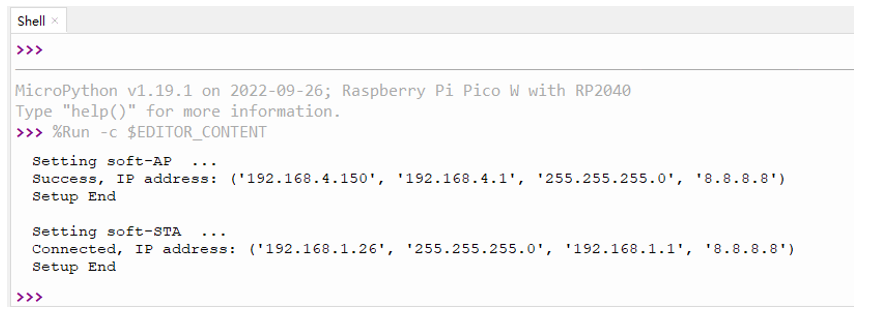

##############################################################################
Chapter WiFi Working Modes (Only for Pico W)
##############################################################################

The biggest difference between the raspberry pi pico and the raspberry pi Pico W is that the raspberry pi pico W is equipped with a WiFi function module. At the beginning of this chapter, we will learn about the WiFi function of Pico W of Raspberry Pi. 

If you have Pico in your hand, please change it to Pico W before continuing to learn.

Project 30.1 Station mode
**********************************

Component List
==================================

+-----------------------------------------+------------------------------------------+
| Raspberry Pi Pico x1                    | Micro USB Wire x1                        |
|                                         |                                          |
| |Chapter01_08|                          | |Chapter01_09|                           |
+-----------------------------------------+------------------------------------------+

.. |Chapter01_08| image:: ../_static/imgs/1_LED/Chapter01_08.png
.. |Chapter01_09| image:: ../_static/imgs/1_LED/Chapter01_09.png

Component knowledge
============================

Wireless
------------------------------

Pico W has an on-board 2.4GHz wireless interface using an Infineon CYW43439. The antenna is an onboard antenna licensed from ABRACON (formerly ProAnt). The wireless interface is connected via SPI to the RP2040.

Station mode
-----------------------------

When Pico W selects Station mode, it acts as a WiFi client. It can connect to the router network and communicate with other devices on the router via WiFi connection. As shown below, the PC is connected to the router, and if Pico W wants to communicate with the PC, it needs to be connected to the router.

Circuit
===========================

Connect Pico W to the computer using the USB cable.

.. image:: ../_static/imgs/30_WiFi_Working_Modes_(Only_for_Pico_W)/Chapter30_01.png
    :align: center

Code
============================

Move the program folder "Freenove_Ultimate_Starter_Kit_for_Raspberry_Pi_Pico/Python/Python_Codes" to disk(D) in advance with the path of "D:/Micropython_Codes".

Open "Thonny", click "This computer" -> "D:" -> "Micropython_Codes" -> "29.1_Station_mode" and double click "29.1_Station_mode.py". 

Station_mode
---------------------------

Because the names and passwords of routers in various places are different, before the Code runs, users need to enter the correct router's name and password in the box as shown in the illustration above.

After making sure the router name and password are entered correctly, compile and upload codes to PICO W, wait for PICO W to connect to your router and print the IP address assigned by the router to PICO W in "Shell". 

The following is the program code:

.. literalinclude:: ../../../freenove_Kit/Python/Python_Codes/29.1_Station_mode/29.1_Station_mode.py
    :linenos: 
    :language: python
    :lines: 1-22
    :dedent:

Import network module.

.. literalinclude:: ../../../freenove_Kit/Python/Python_Codes/29.1_Station_mode/29.1_Station_mode.py
    :linenos: 
    :language: python
    :lines: 2-2
    :dedent:

Enter correct router name and password.

.. literalinclude:: ../../../freenove_Kit/Python/Python_Codes/29.1_Station_mode/29.1_Station_mode.py
    :linenos: 
    :language: python
    :lines: 4-5
    :dedent:

Set PICO W in Station mode.

.. literalinclude:: ../../../freenove_Kit/Python/Python_Codes/29.1_Station_mode/29.1_Station_mode.py
    :linenos: 
    :language: python
    :lines: 9-9
    :dedent:

Activate Pico W's Station mode, initiate a connection request to the router and enter the password to connect.

.. literalinclude:: ../../../freenove_Kit/Python/Python_Codes/29.1_Station_mode/29.1_Station_mode.py
    :linenos: 
    :language: python
    :lines: 12-13
    :dedent:

Wait for PICO W to connect to router until they connect to each other successfully.

.. literalinclude:: ../../../freenove_Kit/Python/Python_Codes/29.1_Station_mode/29.1_Station_mode.py
    :linenos: 
    :language: python
    :lines: 14-15
    :dedent:

Print the IP address assigned to PICO W in "Shell".

.. literalinclude:: ../../../freenove_Kit/Python/Python_Codes/29.1_Station_mode/29.1_Station_mode.py
    :linenos: 
    :language: python
    :lines: 16-16
    :dedent:

Reference
------------------------------------

.. py:function:: Class network	
    
    Before each use of **network** , please add the statement " **import network** " to the top of the python file.
    
    **WLAN(interface_id):** Set to WiFi mode.
    
        **network.STA_IF:** Client, connecting to other WiFi access points. 
    
        **network.AP_IF:** Access points, allowing other WiFi clients to connect. 
    
    **active(is_active):** With parameters, it is to check whether to activate the network interface; Without parameters, it is to query the current state of the network interface.
    
    **scan(ssid, bssid, channel, RSSI, authmode, hidden):** Scan for wireless networks available nearby (only scan on STA interface), return a tuple list of information about the WiFi access point.
    
        **bssid:** The hardware address of the access point, returned in binary form as a byte object. You can use ubinascii.hexlify() to convert it to ASCII format. 
    
        **authmode:** Access type
    
            **AUTH_OPEN** = 0
    
            **AUTH_WEP** = 1
    
            **AUTH_WPA_PSK** = 2
    
            **AUTH_WPA2_PSK** = 3
    
            **AUTH_WPA_WPA2_PSK** = 4
    
            **AUTH_MAX** = 6
    
    **Hidden:** Whether to scan for hidden access points
    
        **False:** Only scanning for visible access points 
    
        **True:** Scanning for all access points including the hidden ones.
    
    **isconnected():** Check whether PICO W is connected to AP in Station mode. In STA mode, it returns True if it is connected to a WiFi access point and has a valid IP address; Otherwise, it returns False.
    
    **connect(ssid, password):** Connecting to wireless network.
    
        **ssid:** WiFiname
    
        **password:** WiFipassword
    
    **disconnect():** Disconnect from the currently connected wireless network.

Project AP mode
***********************************

Component List & Circuit
===============================

Component List & Circuit are the same as in Section 30.1.

Component knowledge
===========================

AP mode
-------------------------

When PICO W selects AP mode, it creates a hotspot network that is separate from the Internet and waits for other WiFi devices to connect. As shown in the figure below, PICO W is used as a hotspot. If a mobile phone or PC wants to communicate with PICO W, it must be connected to the hotspot of PICO W. Only after a connection is established with PICO W can they communicate.

.. image:: ../_static/imgs/30_WiFi_Working_Modes_(Only_for_Pico_W)/Chapter30_04.png
    :align: center

Circuit
=============================

Connect Pico W to the computer using the USB cable.

.. image:: ../_static/imgs/30_WiFi_Working_Modes_(Only_for_Pico_W)/Chapter30_01.png
    :align: center

Code
==============================

Move the program folder "Freenove_Ultimate_Starter_Kit_for_Raspberry_Pi_Pico/Python/Python_Codes" to disk(D) in advance with the path of "D:/Micropython_Codes".

Open "Thonny", click "This computer" -> "D:" -> "Micropython_Codes" -> "29.2_AP_mode". and double click "29.2_AP_mode.py". 

AP_mode
----------------------------

Before the Code runs, you can make any changes to the AP name and password for PICO W in the box as shown in the illustration above. Of course, you can leave it alone by default.

Click "Run current script", :blue:`open the AP function of PICO W and print the access point information. `

Turn on the WiFi scanning function of your phone, and you can see the ssid_AP on PICO W, which is called "WiFi_Name" in this Code. You can enter the password "12345678" to connect it or change its AP name and password by modifying Code.

The following is the program code:

.. literalinclude:: ../../../freenove_Kit/Python/Python_Codes/29.2_AP_mode/29.2_AP_mode.py
    :linenos: 
    :language: python
    :lines: 1-26
    :dedent:

Import network module.

.. literalinclude:: ../../../freenove_Kit/Python/Python_Codes/29.2_AP_mode/29.2_AP_mode.py
    :linenos: 
    :language: python
    :lines: 1-1
    :dedent:

Enter correct router name and password.

.. literalinclude:: ../../../freenove_Kit/Python/Python_Codes/29.2_AP_mode/29.2_AP_mode.py
    :linenos: 
    :language: python
    :lines: 3-4
    :dedent:

Set PICO W in AP mode.

.. literalinclude:: ../../../freenove_Kit/Python/Python_Codes/29.2_AP_mode/29.2_AP_mode.py
    :linenos: 
    :language: python
    :lines: 11-11
    :dedent:

Configure IP address, gateway and subnet mask for PICO W.

.. literalinclude:: ../../../freenove_Kit/Python/Python_Codes/29.2_AP_mode/29.2_AP_mode.py
    :linenos: 
    :language: python
    :lines: 15-15
    :dedent:

Turn on an AP in PICO W, whose name is set by ssid_AP and password is set by password_AP.

.. literalinclude:: ../../../freenove_Kit/Python/Python_Codes/29.2_AP_mode/29.2_AP_mode.py
    :linenos: 
    :language: python
    :lines: 17-18
    :dedent:

If the program is running abnormally, the AP disconnection function will be called. 

.. literalinclude:: ../../../freenove_Kit/Python/Python_Codes/29.2_AP_mode/29.2_AP_mode.py
    :linenos: 
    :language: python
    :lines: 14-14
    :dedent:

Reference
-----------------------------

.. py:function:: Class network	
    
    Before each use of **network** , please add the statement " **import network** " to the top of the python file.
    
    **WLAN(interface_id):** Set to WiFi mode.
    
        **network.STA_IF:** Client, connecting to other WiFi access points
    
    **network.AP_IF:** Access points, allowing other WiFi clients to connect 
    
    **active(is_active):** With parameters, it is to check whether to activate the network interface; Without parameters, it is to query the current state of the network interface
    
    **isconnected():** In AP mode, it returns True if it is connected to the station; otherwise it returns False.
    
    **connect(ssid, password):** Connecting to wireless network
    
        **ssid:** WiFiname
    
        **password:** WiFipassword
    
    **config(essid, channel):** To obtain the MAC address of the access point or to set the WiFi channel and the name of the WiFi access point.
    
        **ssid:** WiFi account name
    
        **channel:** WiFichannel
    
    **ifconfig([(ip, subnet, gateway, dns)]):** Without parameters, it returns a 4-tuple (ip, subnet_mask, gateway, DNS_server); With parameters, it configures static IP.
    
        **ip:** IPaddress
    
        **subnet_mask:** subnet mask
    
        **gateway:** gateway
    
        **DNS_server:** DNSserver
    
    **disconnect():** Disconnect from the currently connected wireless network
    
    **status():** Return the current status of the wireless connection

Project AP+Station mode
***********************************

Component List & Circuit
==============================

Component List & Circuit are the same as in Section 30.1.

Component knowledge
==============================

AP+Station mode
--------------------------------

:red:`PICO W currently does not support simultaneous use of AP mode and Station mode, so this section can be skipped. In the actual mode configuration, the last configured mode shall prevail.`

Circuit
=================================

Connect Pico W to the computer using the USB cable.

.. image:: ../_static/imgs/30_WiFi_Working_Modes_(Only_for_Pico_W)/Chapter30_01.png
    :align: center

Code
=============================

Move the program folder "Freenove_Ultimate_Starter_Kit_for_Raspberry_Pi_Pico/Python/Python_Codes" to disk(D) in advance with the path of "D:/Micropython_Codes".

Open "Thonny", click "This computer" -> "D:" -> "Micropython_Codes" -> "29.3_AP+STA_mode"and double click "29.3_AP+STA_mode.py". 

29.3_AP+STA_mode
------------------------------

.. image:: ../_static/imgs/30_WiFi_Working_Modes_(Only_for_Pico_W)/Chapter30_16.png
    :align: center

It is analogous to project 29.1 and project 29.2. Before running the Code, you need to modify ssidRouter, passwordRouter, ssidAP and passwordAP shown in the box of the illustration above.

After making sure that the code is modified correctly, click "Run current script" and the "Shell" will display as follows:

Turn on the WiFi scanning function of your phone, and you can see the ssidAP on PICO W.

The following is the program code:

.. literalinclude:: ../../../freenove_Kit/Python/Python_Codes/29.3_AP+STA_mode/29.3_AP+STA_mode.py
    :linenos: 
    :language: python
    :lines: 1-41
    :dedent: