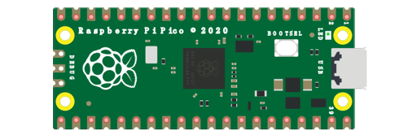
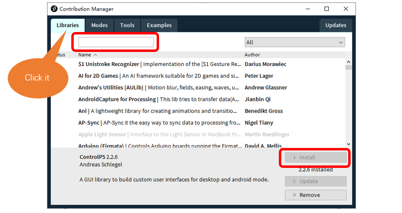
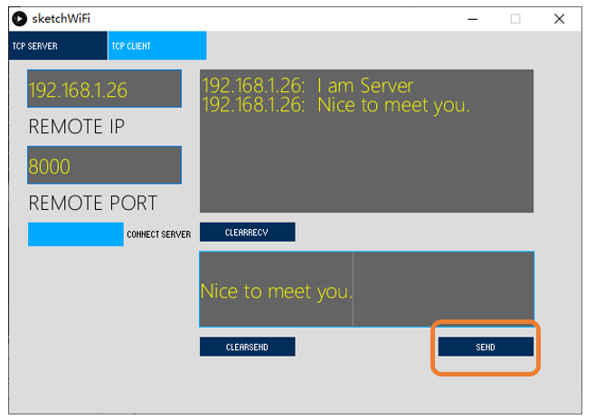

##############################################################################
Chapter TCP/IP (Only for Pico W)
##############################################################################

In this chapter, we will introduce how PICO W implements network communications based on TCP/IP protocol. There are two roles in TCP/IP communication, namely Server and Client, which will be implemented respectively with two projects in this chapter.

Project as Client
******************************

In this section, PICO W is used as Client to connect Server on the same LAN and communicate with it.

Component List
=============================

+-----------------------------------------+------------------------------------------+
| Raspberry Pi Pico x1                    | Micro USB Wire x1                        |
|                                         |                                          |
| |Chapter01_08|                          | |Chapter01_09|                           |
+-----------------------------------------+------------------------------------------+

.. |Chapter01_09| image:: ../_static/imgs/1_LED/Chapter01_09.png

Component knowledge
==============================

TCP connection
------------------------------

Before transmitting data, TCP needs to establish a logical connection between the sending end and the receiving end. It provides reliable and error-free data transmission between the two computers. In the TCP connection, the client and the server must be clarified. The client sends a connection request to the server, and each time such a request is proposed, a "three-time handshake" is required.

Three-time handshake: In the TCP protocol, during the preparation phase of sending data, the client and the server interact three times, to ensure the reliability of the connection, which is called "three-times handshake".

The first handshake, the client sends a connection request to the server and waits for the server to confirm.

The second handshake, the server sends a response back to the client informing that it has received the connection request.

The third handshake, the client sends a confirmation message to the server again to confirm the connection. 

TCP is a connection-oriented, low-level transmission control protocol. After TCP establishes a connection, the client and server can send and receive messages to each other, and the connection will always exist as long as the client or server does not initiate disconnection. Each time one party sends a message, the other party will reply with an ack signal.

Install Processing
------------------------------

In this tutorial, we use Processing to build a simple TCP/IP communication platform.

If you have not installed Processing, you can download it by clicking https://processing.org/download/. You can choose an appropriate version to download according to your PC system.

Unzip the downloaded file to your computer. Click "processing.exe" as the figure below to run this software.

Use Server mode for communication
--------------------------------------

Open the " **Freenove_Ultimate_Starter_Kit_for_Raspberry_Pi_Pico\\C\\Sketches\\Sketch_31.1_WiFiClient\\sketchWiFi\\sketchWiFi.pde** ", and click "Run".

The new pop-up interface is as follows. If PICO W is used as client, select TCP SERVER mode for sketchWiFi.

When sketchWiFi selects TCP SERVER mode, Pico W Sketch needs to be changed according to sketchWiFi's displaying of LOCAL IP or LOCAL PORT.

If PICO W serves as server, select TCP CLIENT mode for sketchWiFi.

When sketchWiFi selects TCP CLIENT mode, the LOCAL IP and LOCAL PORT of sketchWiFi need to be changed according to the IP address and port number printed by the serial monitor.

**Mode selection:** select **Server mode/Client mode.**

**IP address:** In server mode, this option does not need to be filled in, and the computer will automatically obtain the IP address.

    In client mode, fill in the remote IP address to be connected.

**Port number:** In server mode, fill in a port number for client devices to make an access connection. 

                 In client mode, fill in port number given by the Server devices to make an access connection.

**Start button:** In server mode, push the button, then the computer will serve as server and open a port number for client to make access connection. During this period, the computer will keep monitoring.

                  In client mode, before pushing the button, please make sure the server is on, remote IP address and remote port number is correct; push the button, and the computer will make access connection to the remote port number of the remote IP as a client. 

**clear receive:** clear out the content in the receiving text box

**clear send:** clear out the content in the sending text box

**Sending button:** push the sending button, the computer will send the content in the text box to others.

Circuit
============================

Connect Pico W to the computer using the USB cable.

.. image:: ../_static/imgs/30_WiFi_Working_Modes_(Only_for_Pico_W)/Chapter30_01.png
    :align: center

Code
====================

If you have not installed "ControlP5", please follow the following steps to continue the installation, if you have installed, please skip this section.

Open Processing.

Click Add Tool under Tools. 

Select Libraries in the pop-up window. 

Input "ControlP5" in the searching box, and then select the option as below. Click "Install" and wait for the installation to finish.

You can also click Add Library under 'Import Library' under 'Sketch'. 

Before running the Code, please open "sketchWiFi.pde." first, and click "Run".

The newly pop up window will use the computer's IP address by default and open a data monitor port. Click"Listening"。

Move the program folder " **Freenove_Ultimate_Starter_Kit_for_Raspberry_Pi_Pico/Python/Python_Codes** " to disk(D) in advance with the path of " **D:/Micropython_Codes** ".

Open "Thonny", click "This computer" -> "D:" -> "Micropython_Codes" -> "30.1_TCP_as_Client" and double click "30.1_TCP_as_Client.py". 

Before clicking "Run current script", please modify the name and password of your router and fill in the "host" and "port" according to the IP information in processing app shown in the box below:

TCP_as_Client
--------------------------

Click "Run current script" and in "Shell", you can see PICO W automatically connects to sketchWiFi.

If you do not click "Listening" for sketchWiFi, PICO W will fail to connect and will print information as follows:

PICO W connects with TCP SERVER, and TCP SERVER receives messages from PICO W, as shown in the figure below.

At this point, you can send data to Pico W through sketchWiFi. Pico W will send the received data back to sketchWiFi after receiving it.

The following is the program code:

.. literalinclude:: ../../../freenove_Kit/Python/Python_Codes/30.1_TCP_as_Client/30.1_TCP_as_Client.py
    :linenos: 
    :language: python
    :lines: 1-43
    :dedent:

Import network、socket、time modules.

.. literalinclude:: ../../../freenove_Kit/Python/Python_Codes/30.1_TCP_as_Client/30.1_TCP_as_Client.py
    :linenos: 
    :language: python
    :lines: 1-3
    :dedent:

Enter the actual router name, password, remote server IP address, and port number.

.. literalinclude:: ../../../freenove_Kit/Python/Python_Codes/30.1_TCP_as_Client/30.1_TCP_as_Client.py
    :linenos: 
    :language: python
    :lines: 5-8
    :dedent:

Connect specified Router until it is successful. 

.. literalinclude:: ../../../freenove_Kit/Python/Python_Codes/30.1_TCP_as_Client/30.1_TCP_as_Client.py
    :linenos: 
    :language: python
    :lines: 13-21
    :dedent:

Connect router and then connect it to remote server.

.. literalinclude:: ../../../freenove_Kit/Python/Python_Codes/30.1_TCP_as_Client/30.1_TCP_as_Client.py
    :linenos: 
    :language: python
    :lines: 23-27
    :dedent:

Send messages to the remote server, receive the messages from it and print them out, and then send the messages back to the server.

.. literalinclude:: ../../../freenove_Kit/Python/Python_Codes/30.1_TCP_as_Client/30.1_TCP_as_Client.py
    :linenos: 
    :language: python
    :lines: 28-37
    :dedent:

If an exception occurs in the program, for example, the remote server is shut down, execute the following program, turn off the socket function, and disconnect the WiFi.

.. literalinclude:: ../../../freenove_Kit/Python/Python_Codes/30.1_TCP_as_Client/30.1_TCP_as_Client.py
    :linenos: 
    :language: python
    :lines: 39-43
    :dedent:

Reference
----------------------------------

.. py:function:: Class socket	
    
    Before each use of **socket** , please add the statement " **import socket** " to the top of the python file.
    
    **socket([af, type, proto]):** Create a socket.
    
    **af:** address
    
        **socket.AF_INET:** IPv4
    
        **socket.AF_INET6:** IPv6
    
    **type:** type
    
        **socket.SOCK_STREAM :** TCP stream
    
        **socket.SOCK_DGRAM :** UDP datagram
    
        **socket.SOCK_RAW :** Original socket
    
        **socket.SO_REUSEADDR :** socket reusable
    
    **proto:** protocol number
    
    **socket.IPPROTO_TCP:** TCPmode
    
    **socket.IPPROTO_UDP:** UDPmode
    
    **socket.setsockopt(level, optname, value):** Set the socket according to the options.
    
    **Level:** Level of socket option
    
    **socket.SOL_SOCKET:** Level of socket option. By default, it is 4095.
    
    **optname:** Options of socket
    
    **socket.SO_REUSEADDR:** Allowing a socket interface to be tied to an address that is already in use.
    
    **value:** The value can be an integer or a bytes-like object representing a buffer.
    
    **socket.connect(address):** To connect to server.
    
    **Address:** Tuple or list of the server's address and port number 
    
    **send(bytes):** Send data and return the bytes sent. 
    
    **recv(bufsize):** Receive data and return a bytes object representing the data received. 
    
    **close():** Close socket.
    
To learn more please visit: http://docs.micropython.org/en/latest/

Project as Server 
*********************************

In this section, PICO W is used as a server to wait for the connection and communication of client on the same LAN.

Component List
===============================

+-----------------------------------------+------------------------------------------+
| Raspberry Pi Pico x1                    | Micro USB Wire x1                        |
|                                         |                                          |
| |Chapter01_08|                          | |Chapter01_09|                           |
+-----------------------------------------+------------------------------------------+

Circuit
============================

Connect Pico W to the computer using the USB cable.

.. image:: ../_static/imgs/30_WiFi_Working_Modes_(Only_for_Pico_W)/Chapter30_01.png
    :align: center

Code
============================

Project as Server 
*********************************

In this section, PICO W is used as a server to wait for the connection and communication of client on the same LAN.

Component List
===============================

+-----------------------------------------+------------------------------------------+
| Raspberry Pi Pico x1                    | Micro USB Wire x1                        |
|                                         |                                          |
| |Chapter01_08|                          | |Chapter01_09|                           |
+-----------------------------------------+------------------------------------------+

Circuit
============================

Connect Pico W to the computer using the USB cable.

.. image:: ../_static/imgs/30_WiFi_Working_Modes_(Only_for_Pico_W)/Chapter30_01.png
    :align: center

Sketch
============================

Move the program folder "Freenove_Ultimate_Starter_Kit_for_Raspberry_Pi_Pico/Python/Python_Codes" to disk(D) in advance with the path of "D:/Micropython_Codes".

Open "Thonny", click "This computer" -> "D:" -> "Micropython_Codes" -> "30.2_TCP_as_Server" and double click "30.2_TCP_as_Server.py". 

Before clicking "Run current script", please modify the name and password of your router shown in the box below.

30.2_TCP_as_Server
-------------------------------

After making sure that the router's name and password are correct, click "Run current script" and in "Shell", you can see a server opened by the PICO W waiting to connecting to other network devices.

Processing:

Open the "Freenove_Ultimate_Starter_Kit_for_Raspberry_Pi_Pico/Codes/MicroPython_Codes/30.2_TCP_as_Server/

sketchWiFi/sketchWiFi.pde".

Based on the message printed in "Shell", enter the correct IP address and port when processing, and click to establish a connection with PICO W to communicate. 

You can enter any information in the "Send Box" of sketchWiFi. Click "Send" and PICO W will print the received messages to "Shell" and send them back to sketchWiFi.

The following is the program code:

.. literalinclude:: ../../../freenove_Kit/Python/Python_Codes/30.2_TCP_as_Server/30.2_TCP_as_Server.py
    :linenos: 
    :language: python
    :lines: 1-53
    :dedent:

Call function connectWifi() to connect to router and obtain the dynamic IP that it assigns to PICO W.

.. literalinclude:: ../../../freenove_Kit/Python/Python_Codes/30.2_TCP_as_Server/30.2_TCP_as_Server.py
    :linenos: 
    :language: python
    :lines: 23-24
    :dedent:

Open the socket server, bind the server to the dynamic IP, and open a data monitoring port.

.. literalinclude:: ../../../freenove_Kit/Python/Python_Codes/30.2_TCP_as_Server/30.2_TCP_as_Server.py
    :linenos: 
    :language: python
    :lines: 30-35
    :dedent:

Print the server's IP address and port, monitor the port and wait for the connection of other network devices.

.. literalinclude:: ../../../freenove_Kit/Python/Python_Codes/30.2_TCP_as_Server/30.2_TCP_as_Server.py
    :linenos: 
    :language: python
    :lines: 30-34
    :dedent:

Each time receiving data, print them in "Shell" and send them back to the client.

.. literalinclude:: ../../../freenove_Kit/Python/Python_Codes/30.2_TCP_as_Server/30.2_TCP_as_Server.py
    :linenos: 
    :language: python
    :lines: 37-47
    :dedent:

If the client is disconnected, close the server and disconnect WiFi.

.. literalinclude:: ../../../freenove_Kit/Python/Python_Codes/30.2_TCP_as_Server/30.2_TCP_as_Server.py
    :linenos: 
    :language: python
    :lines: 48-53
    :dedent: