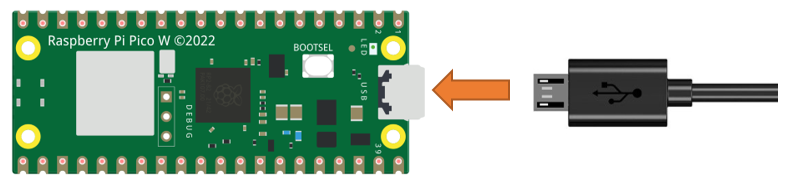

##############################################################################
Chapter Control LED with Web (Only for Pico W)
##############################################################################

In this chapter, we will use PICO W to make a simple smart home. We will learn how to control LED lights through web pages.

Project Control the LED with Web
************************************************

In this project, we need to build a Web Service and then use PICO W to control the LED through the Web browser of the phone or PC. Through this example, you can remotely control the appliances in your home to achieve smart home.

Component List
=============================

+-----------------------------------------+------------------------------------------+
| Raspberry Pi Pico x1                    | Micro USB Wire x1                        |
|                                         |                                          |
| |Chapter01_08|                          | |Chapter01_09|                           |
+-----------------------------------------+------------------------------------------+

.. |Chapter01_08| image:: ../_static/imgs/1_LED/Chapter01_08.png
.. |Chapter01_09| image:: ../_static/imgs/1_LED/Chapter01_09.png

Component knowledge
===============================

HTML
-------------------------------

Hypertext Markup Language (HTML) is a standard Markup Language for creating web pages. It includes a set of tags that unify documents on the network and connect disparate Internet resources into a logical whole.HTML text is descriptive text composed of HTML commands that describe text, graphics, animations, sounds, tables, links, etc. The extension of the HTML file is HTM or HTML. Hypertext is a way to organize information. It uses hyperlinks to associate words and charts in Text with other information media. These related information media may be in the same Text, other files, or files located on a remote computer. This way of organizing information connects the information resources distributed in different places, which is convenient for people to search and retrieve information.

The nature of the Web is hypertext Markup Language (HTML), which can be combined with other Web technologies (e.g., scripting languages, common gateway interfaces, components, etc.) to create powerful Web pages. Thus, Hypertext Markup Language (HTML) is the foundation of World Wide Web (Web) programming, that is, the World Wide Web is based on hypertext. Hypertext Markup Language is called hypertext Markup language because the text contains so-called "hyperlink" points.

You can build your own WEB site using HTML, which runs on the browser and is parsed by the browser.

Example analysis is shown in the figure below:

**<!DOCTYPE html>:** Declare it as an HTML5 document

**<html>:** Is the root element of an HTML page

**<head>:** Contains meta data for the document, such as &lt; meta charset="utf-8"&gt; Define the web page encoding format to UTF-8.

**<title>:** Notes the title of the document

**<body>:** Contains visible page content

**<h1>:** Define a big heading

**
:** Define a paragraph

For more information, please visit: https://developer.mozilla.org/en-US/docs/Web/HTML

Circuit
===========================

Connect Pico W to the computer using the USB cable.

Code
==============================

Move the program folder "Freenove_Ultimate_Starter_Kit_for_Raspberry_Pi_Pico/Python/Python_Codes" to disk(D) in advance with the path of "D:/Micropython_Codes".

Open "Thonny", click "This computer" -> "D:" -> "Micropython_Codes" -> "31.1_Control_LED_through_Web", and double click "31.1_Control_LED_through_Web.py".

Control_LED_through_Web
---------------------------

Because the names and passwords of routers in various places are different, before the Code runs, users need to enter the correct router’s name and password in the box as shown in the illustration above.

After making sure the router name and password are entered correctly, compile and upload codes to PICO W, wait for PICO W to connect to your router and print the IP address assigned by the router to PICO W in "Shell".

When PICO W successfully connects to "ssid", "Shell" displays the IP address assigned to PICO W by the router. Access http://192.168.1.26 in a computer browser on the LAN. As shown in the following figure:

You can click the corresponding button to control the LED on and off.

The following is the program code:

.. literalinclude:: ../../../freenove_Kit/Python/Python_Codes/29.3_AP+STA_mode/29.3_AP+STA_mode.py
    :linenos: 
    :language: python
    :lines: 1-87
    :dedent:

Import socket module and Import network module.

.. literalinclude:: ../../../freenove_Kit/Python/Python_Codes/29.3_AP+STA_mode/29.3_AP+STA_mode.py
    :linenos: 
    :language: python
    :lines: 3-4
    :dedent:

Enter correct AP name and password.

.. literalinclude:: ../../../freenove_Kit/Python/Python_Codes/29.3_AP+STA_mode/29.3_AP+STA_mode.py
    :linenos: 
    :language: python
    :lines: 9-10
    :dedent:

Set PICO W in Station mode and connect it to your router.

.. literalinclude:: ../../../freenove_Kit/Python/Python_Codes/29.3_AP+STA_mode/29.3_AP+STA_mode.py
    :linenos: 
    :language: python
    :lines: 12-15
    :dedent:

"Shell" displays the IP address assigned to PICO W.

.. literalinclude:: ../../../freenove_Kit/Python/Python_Codes/29.3_AP+STA_mode/29.3_AP+STA_mode.py
    :linenos: 
    :language: python
    :lines: 53-53
    :dedent:

Click the button on the web page to control the LED light on and off.

.. literalinclude:: ../../../freenove_Kit/Python/Python_Codes/29.3_AP+STA_mode/29.3_AP+STA_mode.py
    :linenos: 
    :language: python
    :lines: 68-77
    :dedent: