##############################################################################
Chapter Bluetooth (Only for Pico W)
##############################################################################

In June 2023, Raspberry Pi Official has updated to add Bluetooth support to the Pico W.

Pico W's Bluetooth 5.2 supports Bluetooth Classic and Bluetooth Low Energy (BLE) functionality. At the beginning of this chapter, we will learn the Pico W's Bluetooth function.

If you have Pico in your hand, please change it to Pico W before continuing to learn.

Project Bluetooth Passthrough
*******************************************

Component List
=============================

+-----------------------------------------+------------------------------------------+
| Raspberry Pi Pico x1                    | Micro USB Wire x1                        |
|                                         |                                          |
| |Chapter01_08|                          | |Chapter01_09|                           |
+-----------------------------------------+------------------------------------------+

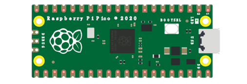
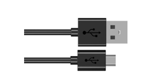

Component knowledge
==============================

Pico W's wireless functionality is provided by the Infineon CYW43439 device, which contains a 2.4 GHz radio providing both 802.11n Wi-Fi and Bluetooth 5.2, supporting Bluetooth Classic and Bluetooth Low Energy (BLE) functionality.

For simple data transfer, there are two modes:

Master mode
-----------------------------

A device works in master mode can connect to one or more slave devices.

We can search and select the slave devices nearby to connect.

When a device initiates a connection request in master mode, it requires information about other Bluetooth devices, including their addresses and pairing keys.

Once the devices are paired, a direct connection can be established.

Slave mode
-----------------------------

A Bluetooth module operating in slave mode can only receive connection requests from a master device and cannot actively initiate connections.

After establishing a connection with a master device, it can either send or receive data.

Bluetooth devices can interact with each other, with one in master mode and the other in slave mode.

During data communication, the master device searches for and selects nearby devices to connect with.

Once a connection is made, data can be exchanged between the devices.

In the case of data exchange between a smartphone and a Raspberry Pi Pico W, the smartphone typically operates in master mode, while the Raspberry Pi Pico W functions in slave mode.

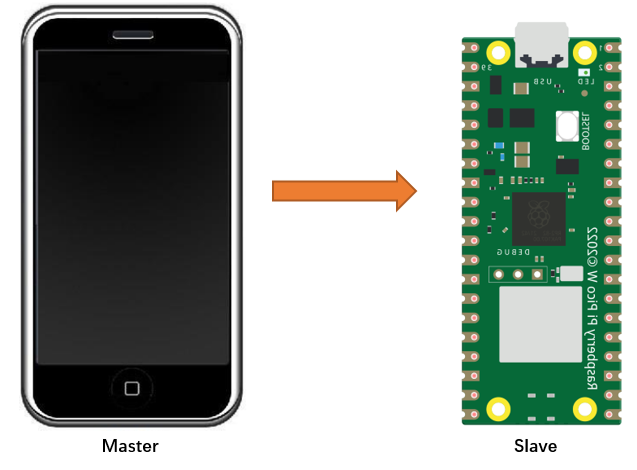

Circuit
===========================

Connect Pico W to the computer using the USB cable.

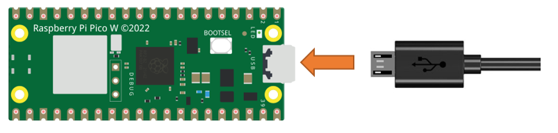

Code
===========================

Move the program folder " **Freenove_Ultimate_Starter_Kit_for_Raspberry_Pi_Pico/Python/Python_Codes** " to disk(D) in advance with the path of "D:/Micropython_Codes".

Open "Thonny", click "This computer" -> "D:" -> "Micropython_Codes" -> "32.1_BLE". Right click "ble_advertising.py" and select "Upload to /" to upload it to Pico W. Then, double click "ble.py" to open the file.

32.1_BLE
---------------------------

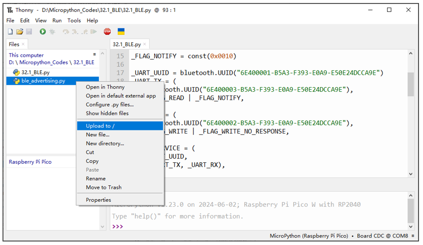

Click the Run button to run BLE.py.

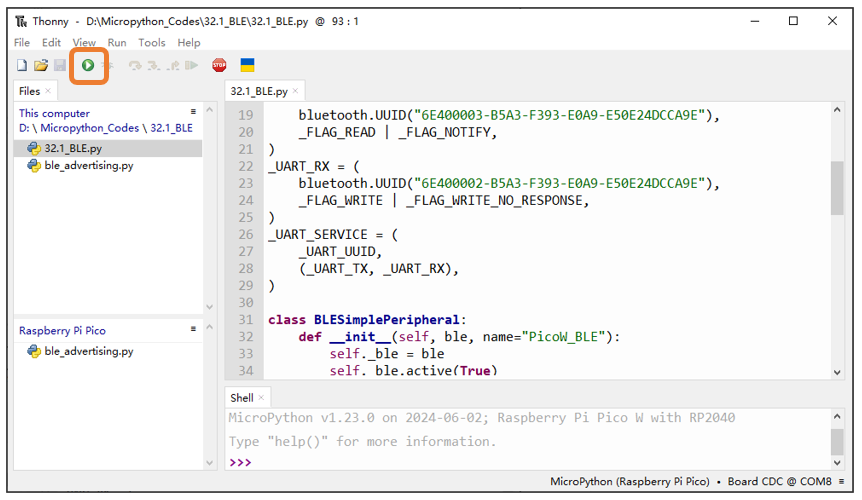

Turn ON Bluetooth on your phone and open LightBlue APP.

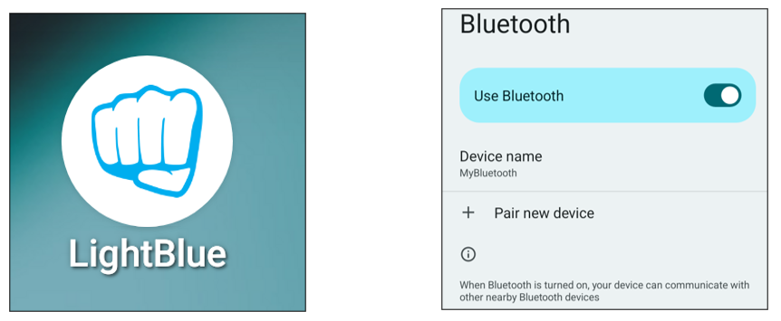

At the device scan page, scroll down to refresh the devices nearby. Select PicoW_BLE to connect.

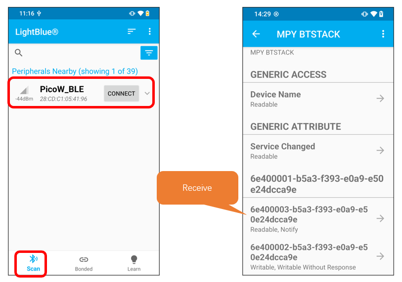

Once the Bluetooth connects successfully, it will print the messages as shown below.

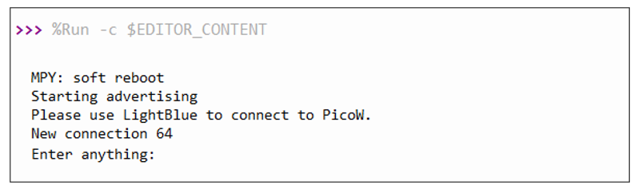

Click "Receive". Select the corresponding data format in the box on the right side of the data format, such as HEX hexadecimal, utf-string string, Binary, etc. Then click SUBSCRIBE.

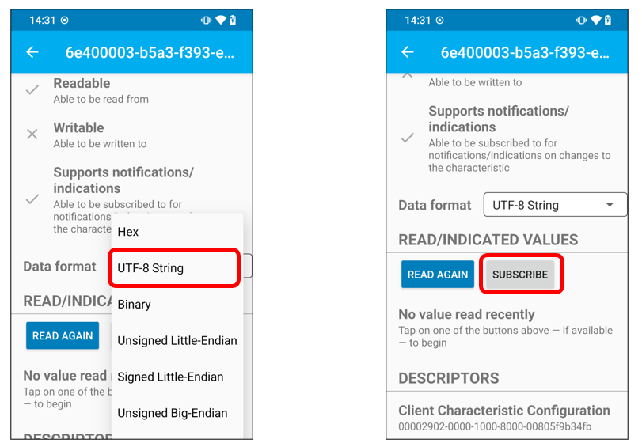

You can type "Hello" in Shell and press "Enter" to send. 

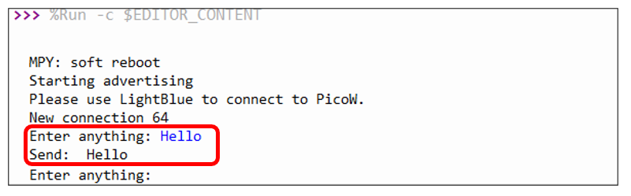

Then you can see the mobile Bluetooth has received the message.

Similarly, you can select "Send" on your phone. Set Data format, and then enter anything in the sending box and click Write to send.

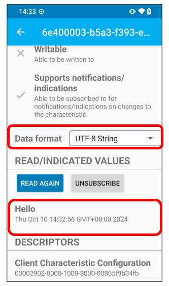

You can check the message from Bluetooth in "Shell". 

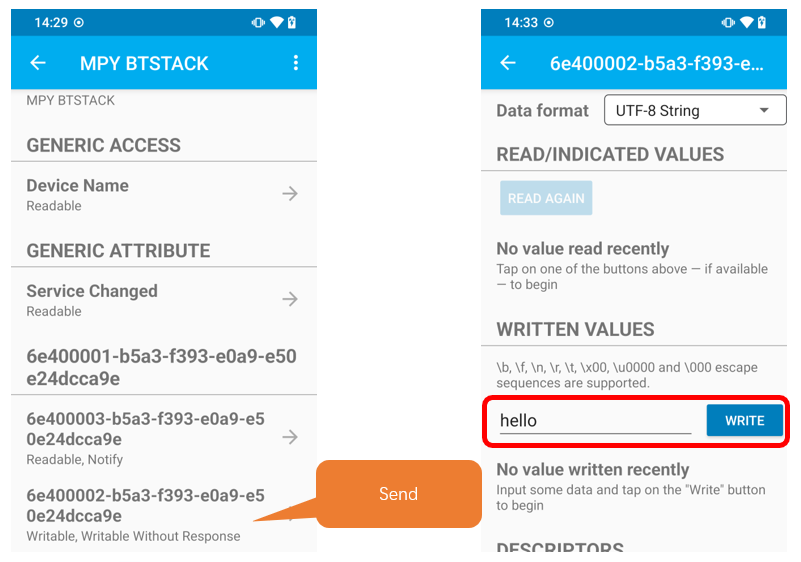

The following is the program code:

.. literalinclude:: ../../../freenove_Kit/Python/Python_Codes/32.1_BLE/32.1_BLE.py
    :linenos: 
    :language: python
    :lines: 1-92
    :dedent:

Define the specified UUID number for BLE vendor.

.. literalinclude:: ../../../freenove_Kit/Python/Python_Codes/32.1_BLE/32.1_BLE.py
    :linenos: 
    :language: python
    :lines: 1-92
    :dedent:

Write a '_irq' function to manage BLE interrupt events

.. literalinclude:: ../../../freenove_Kit/Python/Python_Codes/32.1_BLE/32.1_BLE.py
    :linenos: 
    :language: python
    :lines: 42-58
    :dedent:

Initialize the BLE function and name it.

.. literalinclude:: ../../../freenove_Kit/Python/Python_Codes/32.1_BLE/32.1_BLE.py
    :linenos: 
    :language: python
    :lines: 32-32
    :dedent:

When the smartphone sends data to the Pico W via BLE Bluetooth, convert the data to utf-8 format and remove the trailing '\r\n', then print it out via the serial port. When the Pico W receives data from the serial port, it sends the data back to the smartphone via BLE Bluetooth.

.. literalinclude:: ../../../freenove_Kit/Python/Python_Codes/32.1_BLE/32.1_BLE.py
    :linenos: 
    :language: python
    :lines: 75-90
    :dedent:

Project Bluetooth Control LED
*******************************************

In this project, we will control an LED via Pico W's Bluetooth function.

Component List
===================================

Project Bluetooth Control LED
********************************************

In this project, we will control an LED via Pico W's Bluetooth function.

Component List
=================================

+-----------------------------------------+------------------------------------------+
| Raspberry Pi Pico x1                    | USB Cable x1                             |
|                                         |                                          |
| |Chapter01_08|                          | |Chapter01_09|                           |
+-----------------------------------------+------------------------------------------+
| Breadboard x1                                                                      |
|                                                                                    |
| |Chapter01_10|                                                                     |
+-------------------------+-------------------------------+--------------------------+
| LED x1                  | Jumper                        | Resistor 220Ω x1         |
|                         |                               |                          |
| |Chapter33_26|          |  |Chapter23_08|               |  |Chapter33_27|          |
+-------------------------+-------------------------------+--------------------------+

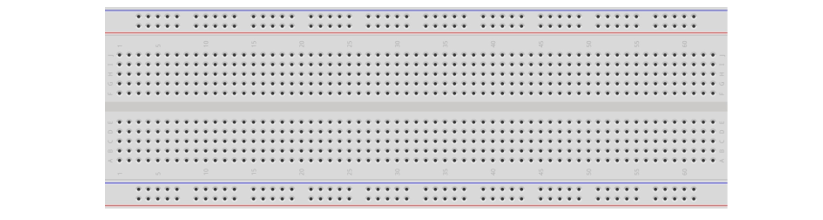
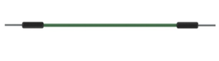
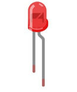
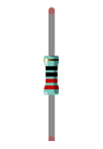

Circuit
=======================

.. list-table::
   :width: 100%
   :align: center
   
   * -  Schematic diagram
   * -  |Chapter33_28|
   * -  Hardware connection. 
       
        :red:`If you need any support, please contact us via:` support@freenove.com
   * -  |Chapter33_29| 

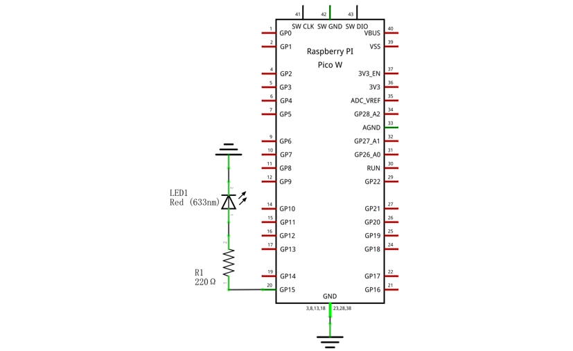
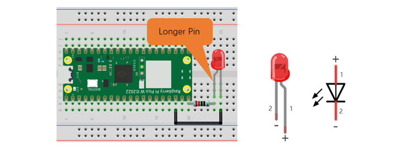

.. note::
    
    :red:`To help users have a better experience when doing the projects, we have made some modifications to Pico's simulation diagram. Please note that there are certain differences between the simulation diagram and the actual board to avoid misunderstanding.`

Code
=======================

Move the program folder "Freenove_Ultimate_Starter_Kit_for_Raspberry_Pi_Pico/Python/Python_Codes" to disk(D) in advance with the path of "D:/Micropython_Codes".

Open "Thonny", click "This computer" -> "D:" -> "Micropython_Codes" -> "32.2_BLE_LED". :red:`Right click "ble_advertising.py" and select "Upload to /" to upload it to Pico W`. Then, double click "ble_led.py" to open the file.

BLE_LED
------------------------

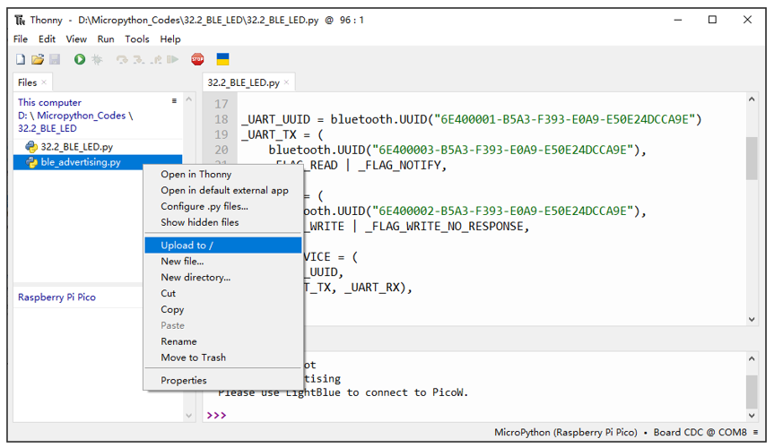

Click the Run button to run BLE_LED.py.

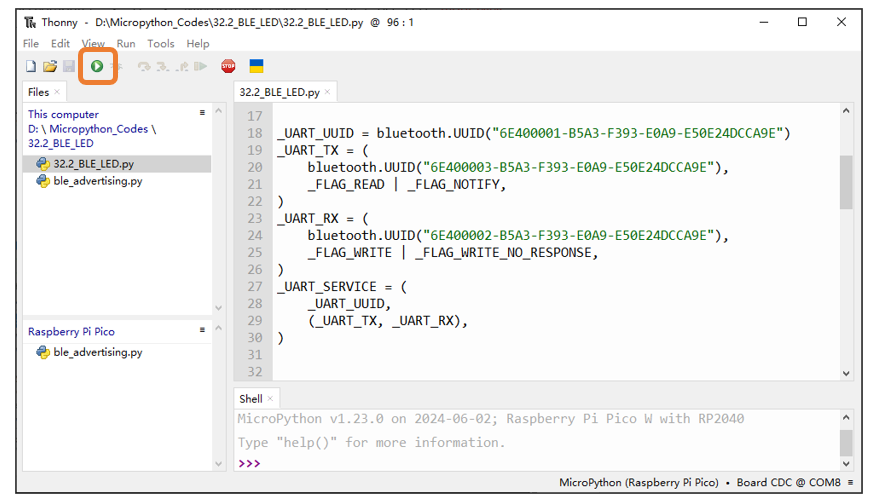

The operation on the phone app is similar to that in project 33.1. You just need to change the sending messages to "led_on", "led_off" and "led_toggle" to control the status of the LED.

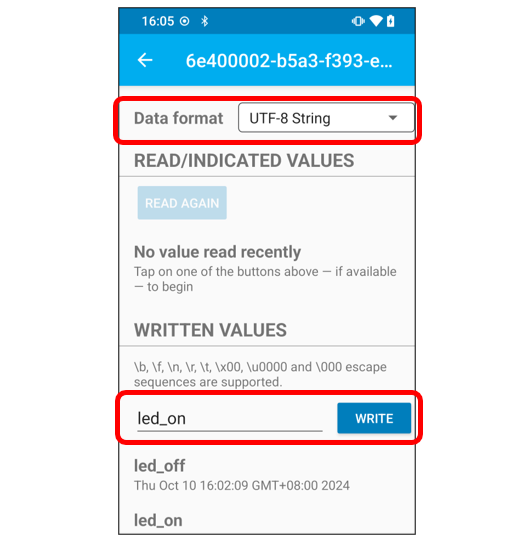

You can check the message sent by Bluetooth in "Shell".

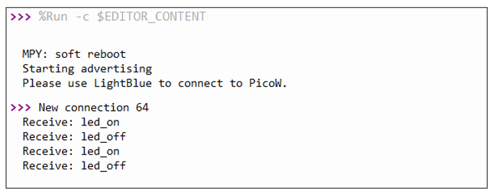

LED Status.

.. note::
    
    :red:`If the messages you send are not "led_on", "led_off", or "led toggle", the status of the LED will not change.`

:red:`For example, when the LED is already ON, it will remain ON unless the message "led_off", or "led toggle" is received.`

The following is the program code:

.. literalinclude:: ../../../freenove_Kit/Python/Python_Codes/32.2_BLE_LED/32.2_BLE_LED.py
    :linenos: 
    :language: python
    :lines: 1-87
    :dedent:

Compare received message with "led_on" and "led_off" and take action accordingly.

.. literalinclude:: ../../../freenove_Kit/Python/Python_Codes/32.2_BLE_LED/32.2_BLE_LED.py
    :linenos: 
    :language: python
    :lines: 85-90
    :dedent: