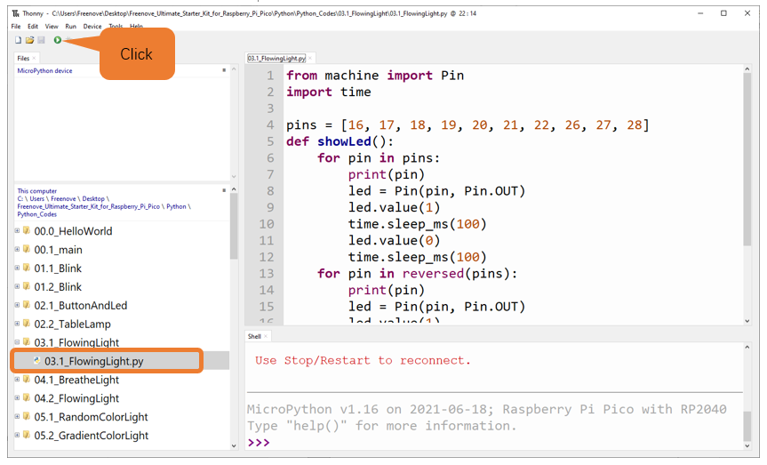
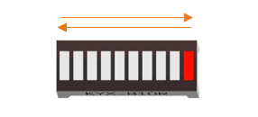

##############################################################################
Chapter LED Bar
##############################################################################

.. note::
    
    Raspberry Pi Pico, Raspberry Pi Pico W and Raspberry Pi Pico 2 only differ by one wireless function, and are almost identical in other aspects. In this tutorial, except for the wireless function, other parts use Raspberry Pi Pico's map for tutorial demonstration.

We have learned how to control an LED blinking; next, we will learn how to control a number of LEDs.

Project Flowing Light
*************************************

In this project, we use a number of LEDs to make a flowing light.

Component List
===============================

+-----------------------------------------+----------------+
| Raspberry Pi Pico x1                    | USB Cable x1   |
|                                         |                |
| |Chapter01_08|                          | |Chapter01_09| |
+-----------------------------------------+----------------+
| Breadboard x1                                            |
|                                                          |
| |Chapter01_10|                                           |
+----------------------+------------------+----------------+
| LED bar graph x1     | Resistor 220Ω x10| Jumper         |
|                      |                  |                |
| |Chapter03_00|       | |Chapter01_12|   | |Chapter01_13| |
+----------------------+------------------+----------------+

.. |Chapter01_08| image:: ../_static/imgs/1_LED/Chapter01_08.png
.. |Chapter01_09| image:: ../_static/imgs/1_LED/Chapter01_09.png
.. |Chapter01_10| image:: ../_static/imgs/1_LED/Chapter01_10.png
.. |Chapter01_12| image:: ../_static/imgs/1_LED/Chapter01_12.png
.. |Chapter01_13| image:: ../_static/imgs/1_LED/Chapter01_13.png
.. |Chapter03_00| image:: ../_static/imgs/3_LED_Bar/Chapter03_00.png

Component Knowledge
===============================

Let us learn about the basic features of these components to use and understand them better.

LED bar
---------------------------------

A Bar Graph LED has 10 LEDs integrated into one compact component. The two rows of pins at its bottom are paired to identify each LED like the single LED used earlier. 

.. image:: ../_static/imgs/3_LED_Bar/Chapter03_01.png
    :align: center

Circuit
===============================

.. list-table::
   :width: 100%
   :align: center
   
   * -  Schematic diagram
   * -  |Chapter03_02|
   * -  Hardware connection. 
       
        :red:`If you need any support, please contact us via:` support@freenove.com
   * -  |Chapter03_03|
    
.. |Chapter03_02| image:: ../_static/imgs/3_LED_Bar/Chapter03_02.png
.. |Chapter03_03| image:: ../_static/imgs/3_LED_Bar/Chapter03_03.png

.. note::
    
    :red:`To help users have a better experience when doing the projects, we have made some modifications to Pico's simulation diagram. Please note that there are certain differences between the simulation diagram and the actual board to avoid misunderstanding.`

:red:`If LEDbar does not work, try to rotate LEDbar for 180°. The label is random.`

Code
================================

This project is designed to make a flowing water lamp. Which are these actions: First turn LED #1 ON, and then turn it OFF. Then turn LED #2 ON, and then turn it OFF... and repeat the same to all 10 LEDs until the last LED is turns OFF. This process is repeated to achieve the "movements" of flowing water.

FlowingLight
-----------------------

Move the program folder "Freenove_Ultimate_Starter_Kit_for_Raspberry_Pi_Pico/Python_Codes" to disk(D) in advance with the path of "D:/Micropython_Codes".

Open "Thonny", click "This computer" -> "D:" -> "Micropython_Codes" -> "03.1_FlowingLight" and double click "03.1_FlowingLight.py".

Click "Run current script" shown in the box above, LED Bar Graph will light up from left to right and then back from right to left. Press Ctrl+C or click "Stop/Restart backend" to exit the program. 

:red:`If you have any concerns, please contact us via:` support@freenove.com

The following is the program code:

.. literalinclude:: ../../../freenove_Kit/Python/Python_Codes/03.1_FlowingLight/03.1_FlowingLight.py
    :linenos: 
    :language: python
    :dedent:

Use an array to define 10 GPIO ports connected to LED Bar Graph for easier operation.

.. literalinclude:: ../../../freenove_Kit/Python/Python_Codes/03.1_FlowingLight/03.1_FlowingLight.py
    :linenos: 
    :language: python
    :lines: 4-4
    :dedent:

Use two for loops to turn on LEDs separately from left to right and then back from right to left.

.. literalinclude:: ../../../freenove_Kit/Python/Python_Codes/03.1_FlowingLight/03.1_FlowingLight.py
    :linenos: 
    :language: python
    :lines: 5-19
    :dedent:

Reference
------------------------

.. py:function:: for
    
    For loop is used to execute a program endlessly and iterate in the order of items (a list or a string) in the sequence.
    
    Commonly used:
    
    "for pin in pins"
    
    Pins is a list of elements that are iterated over by a for loop and assigned to pin each time.
    
    "for i in range(start, end, num: 1)"
    
    start: initial value, from which the for loop starts counting. The default initial value is 0. For example, range(5) equals to range(0, 5).
    
    end: the value with which the function ends. For loop counts till it arrives at this value, but this value isn't included in the counting.
    
    num: Num is automatically added each time to the data. The default value is 1.
    
    range() function returns a sequence number which is assigned to I by for loop.