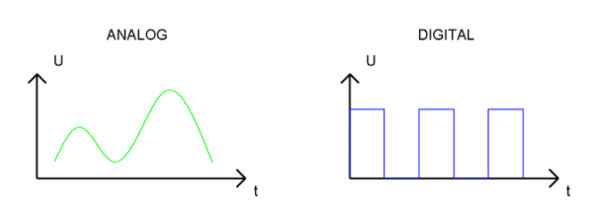
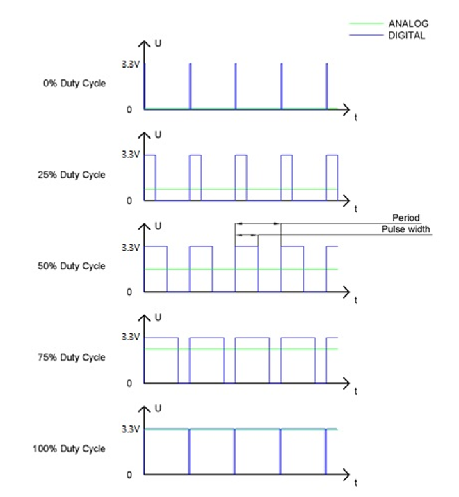
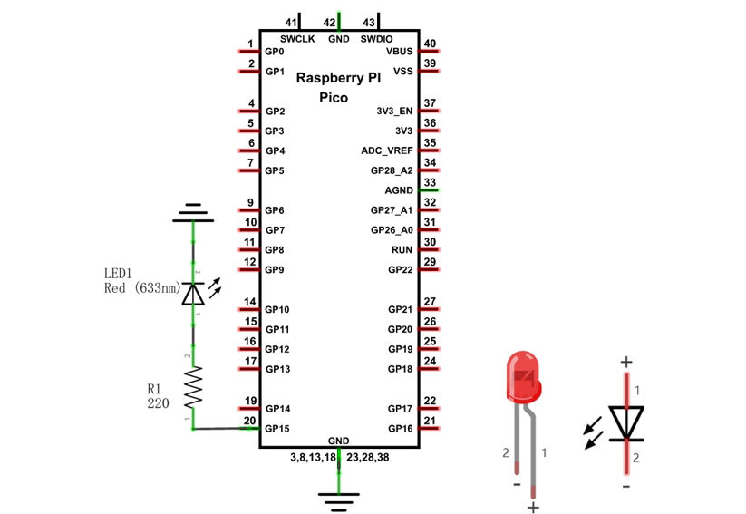
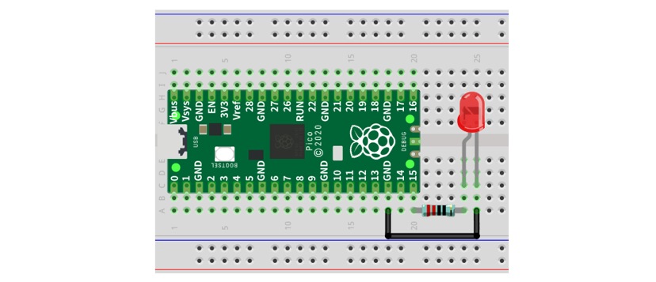
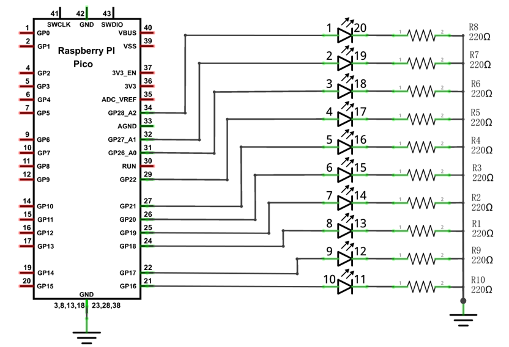

##############################################################################
Chapter Analog & PWM
##############################################################################

In previous study, we have known that one button has two states: pressed and released, and LED has light-on/off state, then how to enter a middle state? How to output an intermediate state to let LED "semi bright"?  That is what we are going to learn.

First, let us learn how to control the brightness of an LED.

Project Breathing LED
***************************************

Breathing light, that is, LED is turned from off to on gradually and gradually from on to off, just like "breathing". So, how to control the brightness of an LED? We will use PWM to achieve this target.

Component List
=======================================

+-----------------------------------------+----------------+
| Raspberry Pi Pico x1                    | USB Cable x1   |
|                                         |                |
| |Chapter01_08|                          | |Chapter01_09| |
+-----------------------------------------+----------------+
| Breadboard x1                                            |
|                                                          |
| |Chapter01_10|                                           |
+----------------------+------------------+----------------+
| LED x1               | Resistor 220Ω x1 | Jumper         |
|                      |                  |                |
| |Chapter01_11|       | |Chapter01_12|   | |Chapter01_13| |
+----------------------+------------------+----------------+

.. |Chapter01_08| image:: ../_static/imgs/1_LED/Chapter01_08.png
.. |Chapter01_09| image:: ../_static/imgs/1_LED/Chapter01_09.png
.. |Chapter01_10| image:: ../_static/imgs/1_LED/Chapter01_10.png
.. |Chapter01_11| image:: ../_static/imgs/1_LED/Chapter01_11.png
.. |Chapter01_12| image:: ../_static/imgs/1_LED/Chapter01_12.png
.. |Chapter01_13| image:: ../_static/imgs/1_LED/Chapter01_13.png

Related Knowledge
===================================

Analog & Digital
------------------------------------

An Analog Signal is a continuous signal in both time and value. On the contrary, a Digital Signal or discrete-time signal is a time series consisting of a sequence of quantities. Most signals in life are analog signals. A familiar example of an Analog Signal would be how the temperature throughout the day is continuously changing and could not suddenly change instantaneously from 0℃ to 10℃. However, Digital Signals can instantaneously change in value. This change is expressed in numbers as 1 and 0 (the basis of binary code). 

Their differences can more easily be seen when compared when graphed as below.

In practical application, we often use binary as the digital signal, that is a series of 0's and 1's. Since a binary signal only has two values (0 or 1), it has great stability and reliability. Lastly, both analog and digital signals can be converted into the other.

PWM
-----------------------------------

PWM, Pulse-Width Modulation, is a very effective method for using digital signals to control analog circuits. Common processors cannot directly output analog signals. PWM technology makes it very convenient to achieve this conversion (translation of digital to analog signals)

PWM technology uses digital pins to send certain frequencies of square waves, that is, the output of high levels and low levels, which alternately last for a while. The total time for each set of high levels and low levels is generally fixed, which is called the period (Note: the reciprocal of the period is frequency). The time of high level outputs are generally called "pulse width", and the duty cycle is the percentage of the ratio of pulse duration, or pulse width (PW) to the total period (T) of the waveform.

The longer the output of high levels last, the longer the duty cycle and the higher the corresponding voltage in the analog signal will be. The following figures show how the analog signal voltages vary between 0V-5V (high level is 5V) corresponding to the pulse width 0%-100%:

The longer the PWM duty cycle is, the higher the output power will be. Now that we understand this relationship, we can use PWM to control the brightness of an LED or the speed of DC motor and so on. 

It is evident from the above that PWM is not real analog, and the effective value of the voltage is equivalent to the corresponding analog. Therefore, we can control the output power of the LED and other output modules to achieve different effects.

Raspberry Pi Pico and PWM 
----------------------------------

Raspberry Pi Pico has 16 PWM channels, each of which can control frequency and duty cycle independently. Every pin on Raspberry Pi Pico can be configured as PWM output. In Arduino, PWM frequency is set to 500Hz. You can change the PWM output by changing duty cycle. 

Circuit
==================================

This circuit is the same as the one in project Blink.

.. list-table::
   :width: 100%
   :align: center
   
   * -  Schematic diagram
   * -  |Chapter04_02|
   * -  Hardware connection. 
       
        :red:`If you need any support, please contact us via:` support@freenove.com
   * -  |Chapter04_03|
    

.. note::
    
    :red:`To help users have a better experience when doing the projects, we have made some modifications to Pico's simulation diagram. Please note that there are certain differences between the simulation diagram and the actual board to avoid misunderstanding.`

Code
================================

This project is designed to make PWM output GP15 with pulse width increasing from 0% to 100%, and then reducing from 100% to 0% gradually.

Open "Thonny", click"This computer" -> "D:" -> "Micropython_Codes" -> "04.1_BreatheLight" and double click "04.1_BreatheLight.py". 

BreatheLight
------------------------------

Click "Run current script" and you will see that LED is turned from ON to OFF and then back from OFF to ON gradually like breathing. Press Ctrl+C or click "Stop/Restart backend" to exit program. 

The following is the program code:

.. literalinclude:: ../../../freenove_Kit/Python/Python_Codes/04.1_BreatheLight/04.1_BreatheLight.py
    :linenos: 
    :language: python
    :lines: 1-17
    :dedent:

Create a PWM object and configure GP15 as PWM output pin. Call freq() to set PWM output frequency of GP15 to 10000Hz.

.. literalinclude:: ../../../freenove_Kit/Python/Python_Codes/04.1_BreatheLight/04.1_BreatheLight.py
    :linenos: 
    :language: python
    :lines: 5-6
    :dedent:

The range of duty cycle is 0-65535, so we use the first for loop to control PWM to change the duty cycle value, making PWM output 0% -100%; Use the second for loop to make PWM output 100%-0%.

.. literalinclude:: ../../../freenove_Kit/Python/Python_Codes/04.1_BreatheLight/04.1_BreatheLight.py
    :linenos: 
    :language: python
    :lines: 10-15
    :dedent:

Each time PWM is used, the hardware Timer will be turned ON to cooperate it. Therefore, after each use of PWM, deinit() needs to be called to turned OFF the timer. Otherwise, the PWM may fail to work next time.

.. literalinclude:: ../../../freenove_Kit/Python/Python_Codes/04.1_BreatheLight/04.1_BreatheLight.py
    :linenos: 
    :language: python
    :lines: 17-17
    :dedent:

Reference
-------------------------

.. py:function:: Class PWM(pin)	
    
    Before each use of PWM module, please add the statement "from machine import PWM" to the top of the python file.
    
    **pin:** PWM pins are supported, such as GP(0~22), GP(25), GP(26~28).
    
    **PWM.freq(freq_val):** the function is used to set PWM frequency and returns nothing; when there is no parameter, the function obtains and returns PWM frequency.
    
    **PWM.duty_u16(duty_val):** the function is used to set PWM duty cycle, among which, duty_val ranges from 0 to 65535. If there is no parameter, the function returns to currently set duty cycle. If duty cycle has not yet been set, it returns 0.
    
    **PWM.deinit():** Turn OFF PWM.

Project Meteor Flowing Light
****************************************

Having learned about PWM, we can use it to control LED Bar Graph and realize a cooler Flowing Light.

Component List
===============================

+-----------------------------------------+----------------+
| Raspberry Pi Pico x1                    | USB Cable x1   |
|                                         |                |
| |Chapter01_08|                          | |Chapter01_09| |
+-----------------------------------------+----------------+
| Breadboard x1                                            |
|                                                          |
| |Chapter01_10|                                           |
+----------------------+------------------+----------------+
| LED bar graph x1     | Resistor 220Ω x10| Jumper         |
|                      |                  |                |
| |Chapter03_00|       | |Chapter01_12|   | |Chapter01_13| |
+----------------------+------------------+----------------+

.. |Chapter01_08| image:: ../_static/imgs/1_LED/Chapter01_08.png
.. |Chapter01_09| image:: ../_static/imgs/1_LED/Chapter01_09.png
.. |Chapter01_10| image:: ../_static/imgs/1_LED/Chapter01_10.png
.. |Chapter01_12| image:: ../_static/imgs/1_LED/Chapter01_12.png
.. |Chapter01_13| image:: ../_static/imgs/1_LED/Chapter01_13.png
.. |Chapter03_00| image:: ../_static/imgs/3_LED_Bar/Chapter03_00.png

Circuit
===============================

.. list-table::
   :width: 100%
   :align: center
   
   * -  Schematic diagram
   * -  |Chapter04_06|
   * -  Hardware connection. 
       
        :red:`If you need any support, please contact us via:` support@freenove.com
   * -  |Chapter04_07|
    

.. |Chapter04_07| image:: ../_static/imgs/4_Analog_&_PWM/Chapter04_07.png

.. note::
    
    :red:`To help users have a better experience when doing the projects, we have made some modifications to Pico's simulation diagram. Please note that there are certain differences between the simulation diagram and the actual board to avoid misunderstanding.`

:red:`If LEDbar does not work, try to rotate LEDbar for 180°. The label is random.`

Code
=============================

Flowing Light with tail was implemented with PWM.

Open "Thonny", click "This computer" -> "D:" -> "Micropython_Codes" -> "04.2_FlowingLight". Select"pwm.py", right click to select "Upload to /", wait for "pwm.py" to be uploaded to Raspberry Pi Pico and then double click "04.2_FlowingLight.py". 

04.2_FlowingLight
--------------------------------

Click "Run current script", and LED Bar Graph will gradually light up and out from left to right, then light up and out from right to left. Press Ctrl+C or click "Stop/Restart backend" to exit program.

The following is the program code:

.. literalinclude:: ../../../freenove_Kit/Python/Python_Codes/04.2_FlowingLight/04.2_FlowingLight.py
    :linenos: 
    :language: python
    :lines: 1-22
    :dedent:

Import the object myPWM from pwm.py and set corresponding pins for PWM channel.

.. code-block:: python
    :linenos:

    from pwm import myPWM
    ...
    mypwm = myPWM(16, 17, 18, 19, 20, 21, 22, 26, 27, 28)

Create an object for myPWM and configure 10 PWM output pins. Define 10 PWM channels and 30 pulse width values. 

.. literalinclude:: ../../../freenove_Kit/Python/Python_Codes/04.2_FlowingLight/04.2_FlowingLight.py
    :linenos: 
    :language: python
    :lines: 5-7
    :dedent:

Call ledcWrite() to set duty cycle dutys[i+j] for the chns[j] channel of PWM.

.. literalinclude:: ../../../freenove_Kit/Python/Python_Codes/04.2_FlowingLight/04.2_FlowingLight.py
    :linenos: 
    :language: python
    :lines: 14-14
    :dedent:

Turn OFF the PWM of the object myPWM.

.. literalinclude:: ../../../freenove_Kit/Python/Python_Codes/04.2_FlowingLight/04.2_FlowingLight.py
    :linenos: 
    :language: python
    :lines: 22-22
    :dedent:

In the code, a nesting of two for loops are used to achieve this effect. 

.. literalinclude:: ../../../freenove_Kit/Python/Python_Codes/04.2_FlowingLight/04.2_FlowingLight.py
    :linenos: 
    :language: python
    :lines: 12-20
    :dedent:

In the main function, a nested for loop is used to control the pulse width of the PWM. Every time i in the first for loop increases by 1, the LED Bar Graph will move one grid, and gradually change according to the value in the array dutys. As shown in the following table, the value in the second row is the value of the array dutys, and the 10 green grids in each row below represent the 10 LEDs on the LED Bar Graph. Each time i increases by 1, the value of the LED Bar Graph will move to the right by one grid, and when it reaches the end, it will move from the end to the starting point, achieving the desired effect.

How to import a custom python module
****************************************************
Each Python file, as long as it is stored on the file system of Raspberry Pi Pico, is a module. To import a custom module, the module file needs to be located in the MicroPython environment variable path or in the same path as the currently running program.

Code
=================================

First, customize a python module "myFunction.py". Create a new py file and name it "myFunction.py". Write code to it and save it to Raspberry Pi Pico.

rand() function randomly creates an integer ranging from 0 to 99. 

Second, import myFunction module "myFunction" to main.py.

The following is the program code:

1.	myFunction.py

.. code-block:: python
    :linenos:

    import random

    def rand():
        num = random.randint(0, 100)
        return num

Import random module.

.. code-block:: python
    :linenos:

    import random

Call randit() function in random module to randomly generate an integer at the range of 0-99 and assign it to num variable. 

.. code-block:: python
    :linenos:

    num = random.randint(0, 100)

2.	main.py

.. code-block:: python
    :linenos:

    import myFunction
    import time

    while True:
        print(myFunction.rand())
        time.sleep(1)

Import myFunction module "myFunction" to main.py.

.. code-block:: python
    :linenos:

    import myFunction

Call rand() in myFunction module.

.. code-block:: python
    :linenos:

    print(myFunction.rand())