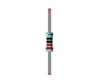
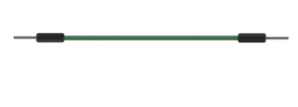
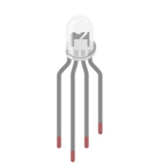
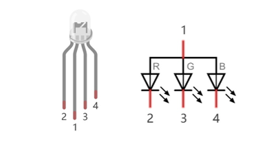
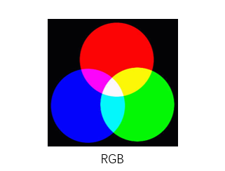
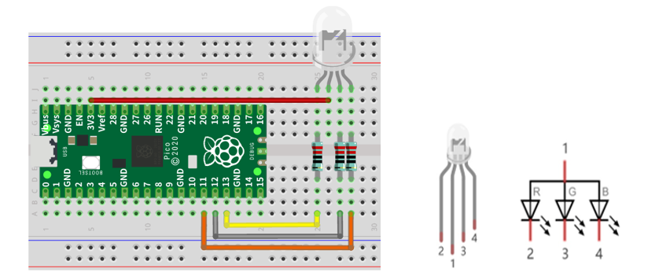
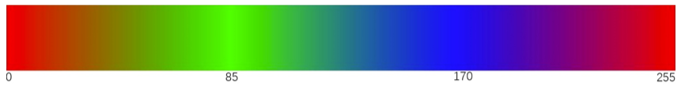
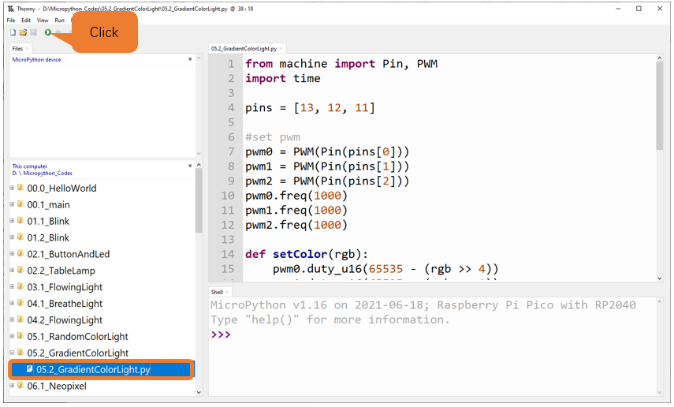

##############################################################################
Chapter RGBLED
##############################################################################

In this chapter, we will learn how to control an RGBLED. It can emit different colors of light. Next, we will use RGBLED to make a multicolored light.

Project Random Color Light
******************************************

In this project, we will make a multicolored LED. And we can control RGBLED to switch different colors automatically.

Component List
=======================================

+-----------------------------------------+----------------+
| Raspberry Pi Pico x1                    | USB Cable x1   |
|                                         |                |
| |Chapter01_08|                          | |Chapter01_09| |
+-----------------------------------------+----------------+
| Breadboard x1                                            |
|                                                          |
| |Chapter01_10|                                           |
+----------------------+------------------+----------------+
| RGBLED x1            | Resistor 220Ω x3 | Jumper         |
|                      |                  |                |
| |Chapter05_00|       | |Chapter01_12|   | |Chapter01_13| |
+----------------------+------------------+----------------+

.. |Chapter01_08| image:: ../_static/imgs/1_LED/Chapter01_08.png
.. |Chapter01_09| image:: ../_static/imgs/1_LED/Chapter01_09.png
.. |Chapter01_10| image:: ../_static/imgs/1_LED/Chapter01_10.png

Related Knowledge
==================================

RGB LED has integrated three LEDs that can respectively emit red, green and blue light. It has four pins. The long pin (1) is the common port, that is, 3 LED's positive or negative port. The RGB LED with common positive port and its symbol is shown below. We can make RGB LED emit various colors of light by controlling these three LEDs to emit light with different brightness. 

Red, green, and blue light are known as three primary colors. When you combine these three primary-color lights with different brightness, it can produce almost all kinds of visible lights. Computer screens, single pixel of cell phone screen, neon, etc. are working under this principle.

If we use three 8-bit PWMs to control the RGB LED, in theory, we can create 28*28*28=16777216 (16 million) colors through different combinations.

Circuit
==================================

.. list-table::
   :width: 100%
   :align: center
   
   * -  Schematic diagram
   * -  |Chapter05_03|
   * -  Hardware connection. 
       
        :red:`If you need any support, please contact us via:` support@freenove.com
   * -  |Chapter05_04|
    
.. |Chapter05_03| image:: ../_static/imgs/5_RGBLED/Chapter05_03.png

.. note::
    
    :red:`To help users have a better experience when doing the projects, we have made some modifications to Pico's simulation diagram. Please note that there are certain differences between the simulation diagram and the actual board to avoid misunderstanding.`

:red:`If LEDbar does not work, try to rotate LEDbar for 180°. The label is random.`

Sketch
==============================

We need to create three PWM channels and use random duty cycle to make random RGBLED color.

Open "Thonny", click "This computer" -> "D:" -> "Micropython_Codes" -> "05.1_RandomColorLight"and double click "05.1_RandomColorLight.py". 

RandomColorLight
------------------------------

Click ->Run current script->, RGBLED begins to display random colors. Press Ctrl+C or click ->Stop/Restart backend-> to exit program. 

:red:`If you have any concerns, please contact us via:` support@freenove.com

The following is the program code:

.. literalinclude:: ../../../freenove_Kit/Python/Python_Codes/05.1_RandomColorLight/05.1_RandomColorLight.py
    :linenos: 
    :language: python
    :dedent:

Import Pin, PWM and Random function modules. 

.. literalinclude:: ../../../freenove_Kit/Python/Python_Codes/05.1_RandomColorLight/05.1_RandomColorLight.py
    :linenos: 
    :language: python
    :lines: 1-3
    :dedent:

Configure ouput mode of GP11, GP12 and GP13 as PWM output and PWM frequency as 10000Hz. 

.. literalinclude:: ../../../freenove_Kit/Python/Python_Codes/05.1_RandomColorLight/05.1_RandomColorLight.py
    :linenos: 
    :language: python
    :lines: 5-13
    :dedent:

Define a function to set the color of RGBLED.

.. literalinclude:: ../../../freenove_Kit/Python/Python_Codes/05.1_RandomColorLight/05.1_RandomColorLight.py
    :linenos: 
    :language: python
    :lines: 15-18
    :dedent:

Call random function randint() to generate a random number in the range of 0-65535 and assign the value to red.

.. literalinclude:: ../../../freenove_Kit/Python/Python_Codes/05.1_RandomColorLight/05.1_RandomColorLight.py
    :linenos: 
    :language: python
    :lines: 22-22
    :dedent:

Obtain 3 random numbers every 200 milliseconds and call function setColor to make RGBLED display dazzling colors.

.. literalinclude:: ../../../freenove_Kit/Python/Python_Codes/05.1_RandomColorLight/05.1_RandomColorLight.py
    :linenos: 
    :language: python
    :lines: 21-26
    :dedent:

Reference
-----------------------------------

.. py:function:: Class random	

Before each use of the module **random** , please add the statement -> **import random** -> to the top of Python file.

**randint(start, end):** Randomly generates an integer between the value of start and end.

    **start:** Starting value in the specified range, which would be included in the range.

    **end:** Ending value in the specified range, which would be included in the range.

**random():** Randomly generates a floating point number between 0 and 1.

**random.uniform(start, end):** Randomly generates a floating point number between the value of start and end.

    **start:** Starting value in the specified range, which would be included in the range.

    **end:** Ending value in the specified range, which would be included in the range.

**random.getrandbits(size):** Generates an integer with size random bits.

For example: 

    size = 4, it generates an integer in the range of 0 to 0b1111.

    size = 8, it generates an integer in the range of 0 to 0b11111111.

**random.randrange(start, end, step):** Randomly generates a positive integer in the range from start to end and increment to step. 

    **start:** Starting value in the specified range, which would be included in the range.

    **end:** Ending value in the specified range, which would be included in the range. 

    **step:** An integer specifying the incrementation.

**random.seed(sed):** Specifies a random seed, usually being applied in conjunction with other random number generators.

    **sed:** Random seed, a starting point in generating random numbers.

**random.choice(obj):** Randomly generates an element from the object obj. 

    **obj:** list of elements.

Project Gradient Color Light
*******************************************

In the previous project, we have mastered the usage of RGBLED, but the random color display is rather stiff. This project will realize a fashionable Light with soft color changes.

Component list, the circuit is the same as the project random color light.

Using a color model, the color changes from 0 to 255 as shown below. 

Code
==================================

In this code, the color model will be implemented and RGBLED will change colors along the model.

Open ->Thonny->, click->This computer-> -> ->D:-> -> ->Micropython_Codes-> -> ->05.2_GradientColorLight-> and double click ->05.2_GradientColorLight.py->. 

05.2_GradientColorLight
----------------------------------

Click "Run current script", and the light emitted by RGBLED will change gradually. Press Ctrl+C or click "Stop/Restart backend" to exit program.

The following is the program code:

.. literalinclude:: ../../../freenove_Kit/Python/Python_Codes/05.2_GradientColorLight/05.2_GradientColorLight.py
    :linenos: 
    :language: python
    :dedent:

In the function **setColor()** , we use a variable to represent the value of RGB, making it more convenient for the passing of parameters. As the range of PWM's duty cycle is 0-65535, which is two to the sixteen power, when spilt, the value of each color channel can be obtained with a simple bitwise operation.  

.. literalinclude:: ../../../freenove_Kit/Python/Python_Codes/05.2_GradientColorLight/05.2_GradientColorLight.py
    :linenos: 
    :language: python
    :lines: 14-17
    :dedent:

The function wheel() is a color selection method of the color model introduced earlier. The value range of the parameter pos is 0-65535. The function will return a data containing the duty cycle values of three pins. 

.. literalinclude:: ../../../freenove_Kit/Python/Python_Codes/05.2_GradientColorLight/05.2_GradientColorLight.py
    :linenos: 
    :language: python
    :lines: 19-28
    :dedent: