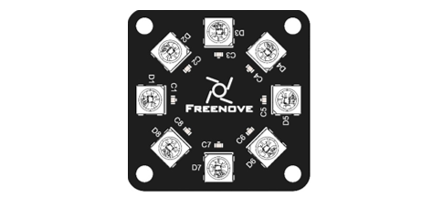
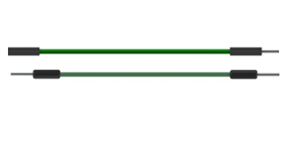
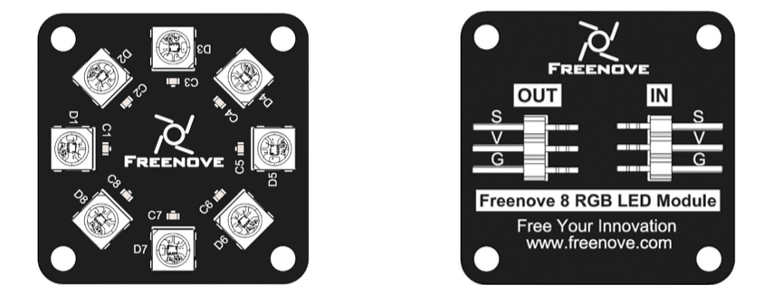
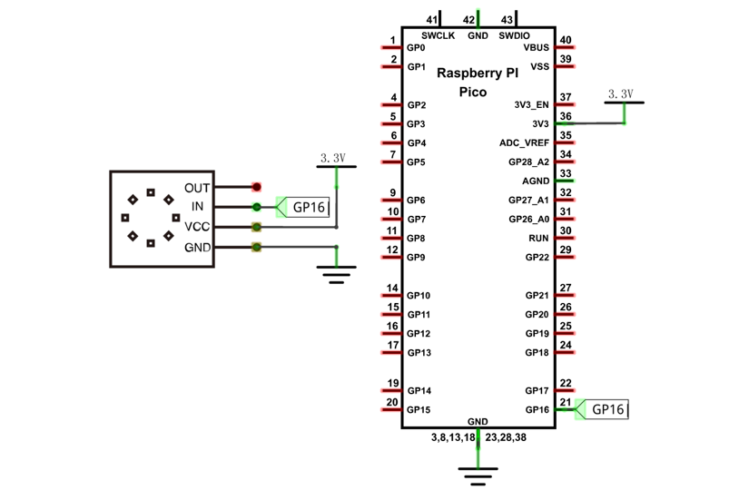
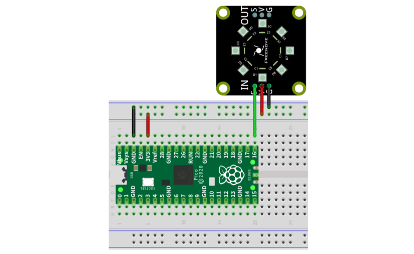
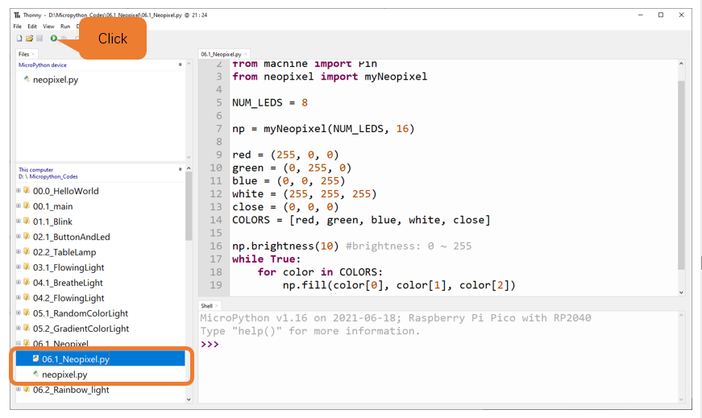
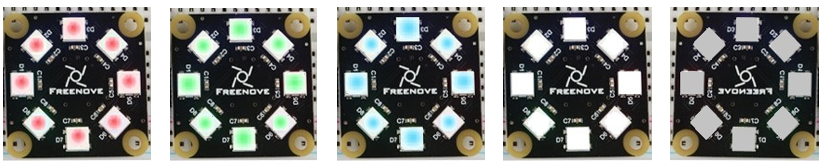
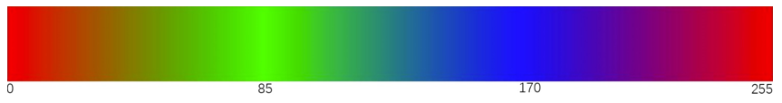
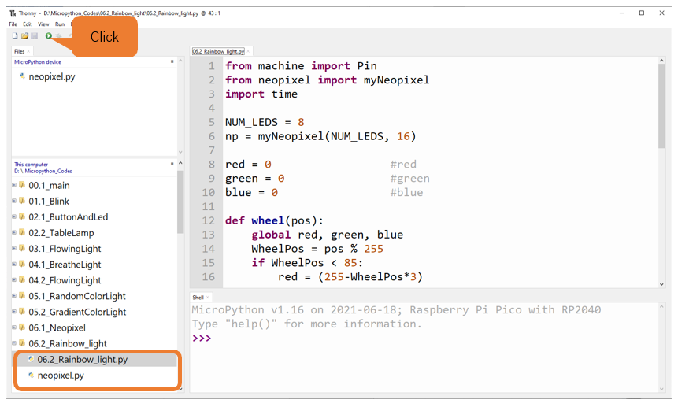
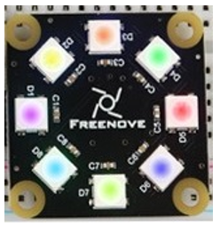

##############################################################################
Chapter NeoPixel
##############################################################################

This chapter will help you learn to use a more convenient RGBLED lamp, which requires only one GPIO control and can be connected in infinite series in theory. Each LED can be controlled independently.

Project 6.1 NeoPixel
*************************************

Learn the basic usage of NeoPixel and use it to blink red, green, blue and white.

Component List
=========================

+-----------------------------------------+----------------+
| Raspberry Pi Pico x1                    | USB Cable x1   |
|                                         |                |
| |Chapter01_08|                          | |Chapter01_09| |
+-----------------------------------------+----------------+
| Breadboard x1                                            |
|                                                          |
| |Chapter01_10|                                           |
+-----------------------------------------+----------------+
| Freenove 8 RGB LED Module x1            | Jumper         |
|                                         |                |
| |Chapter06_00|                          | |Chapter06_01| |
+-----------------------------------------+----------------+

.. |Chapter01_08| image:: ../_static/imgs/1_LED/Chapter01_08.png
.. |Chapter01_09| image:: ../_static/imgs/1_LED/Chapter01_09.png
.. |Chapter01_10| image:: ../_static/imgs/1_LED/Chapter01_10.png
.. |Chapter01_12| image:: ../_static/imgs/1_LED/Chapter01_12.png
.. |Chapter01_13| image:: ../_static/imgs/1_LED/Chapter01_13.png

Related Knowledge
======================================

Freenove 8 RGB LED Module  
----------------------------------------

The Freenove 8 RGB LED Module is as below. You can use only one data pin to control eight LEDs on the module. As shown below:

And you can also control many modules at the same time. Just connect OUT pin of one module to IN pin of another module. In this way, you can use one data pin to control 8, 16, 32 … LEDs.

:orange:`Pin description:`

+---------------------------------------+---------------------------------------+
| (IN)                                  | (OUT)                                 |
+--------+------------------------------+--------+------------------------------+
| symbol | Function                     | symbol | Function                     |
+--------+------------------------------+--------+------------------------------+
| S      | Input control signal         | S      | Output control signal        |
+--------+------------------------------+--------+------------------------------+
| V      | Power supply pin, +3.3V~5.5V | V      | Power supply pin, +3.3V~5.5V |
+--------+------------------------------+--------+------------------------------+
| G      | GND                          | G      | GND                          |
+--------+------------------------------+--------+------------------------------+

Circuit
===============================

.. list-table::
   :width: 100%
   :align: center
   
   * -  Schematic diagram
   * -  |Chapter06_04|
   * -  Hardware connection. 
       
        :red:`If you need any support, please contact us via:` support@freenove.com
   * -  |Chapter06_05|
    

Code
==============================

Open "Thonny", click "This computer" -> "D:" -> "Micropython_Codes" -> "06.1_Neopixel" .Select "neopixel.py", right click to select "Upload to /", wait for "neopixel.py" to be uploaded to Raspberry Pi Pico and double click "06.1_Neopixel.py". 

06.1_Neopixel
-------------------------

Click "Run current script" and Neopixel begins to light up in red, green, blue, white and close. Press Ctrl+C or click "Stop/Restart backend" to end program.

The following is the program code:

.. literalinclude:: ../../../freenove_Kit/Python/Python_Codes/06.1_Neopixel/06.1_Neopixel.py
    :linenos: 
    :language: python
    :dedent:

Import Pin, neopiexl and time modules.

.. literalinclude:: ../../../freenove_Kit/Python/Python_Codes/06.1_Neopixel/06.1_Neopixel.py
    :linenos: 
    :language: python
    :lines: 1-3
    :dedent:

Define the number of LEDs: NUM_LEDS = 8, create an object for myNeopixel and set GP16 pin to connect with neopixel.

.. literalinclude:: ../../../freenove_Kit/Python/Python_Codes/06.1_Neopixel/06.1_Neopixel.py
    :linenos: 
    :language: python
    :lines: 5-7
    :dedent:

Define five status for the LED, namely, red, green, blue, white and close and write them to COLORS list.

.. literalinclude:: ../../../freenove_Kit/Python/Python_Codes/06.1_Neopixel/06.1_Neopixel.py
    :linenos: 
    :language: python
    :lines: 9-14
    :dedent:

Call brightness () function to set the brightness of LED, ranging from 0-255.

.. literalinclude:: ../../../freenove_Kit/Python/Python_Codes/06.1_Neopixel/06.1_Neopixel.py
    :linenos: 
    :language: python
    :lines: 16-16
    :dedent:

Call fill () function to set color for all LEDs at once. Only when show() function is called will the LEDs be lighted up to show the previously setting color.

.. literalinclude:: ../../../freenove_Kit/Python/Python_Codes/06.1_Neopixel/06.1_Neopixel.py
    :linenos: 
    :language: python
    :lines: 19-20
    :dedent:

Define COLORS list through for loop to make neopixel module repeatedly emit red, green, blue, white and close, a total of five status.

.. literalinclude:: ../../../freenove_Kit/Python/Python_Codes/06.1_Neopixel/06.1_Neopixel.py
    :linenos: 
    :language: python
    :lines: 17-21
    :dedent:

Reference
-----------------------------

.. py:function:: Class neopixel	
    
    Before each use of **neopixel** module, please add the statement " **import neopixel** " to the top of Python file.
    
    **myNeopixel(num_leds, pin):** Define the number of output pins and LEDs of neopixel module 
    
        **num_leds:** The number of LEDs.
    
        **pin:** Output pins.
    
    **myNeopixel.brightness(brightness):** Set brightness for LEDs of neopixel module. Brightness range 0-255.
    
    **myNeopixel.set_pixel(pixel_num, r, g, b):** Specify the color data of a single LED in the neopixel module.
    
        pixel_num: neopixel: The sequence of LED in the module.

        r: data of red channel. 

        g: data of green channel. 

        b: data of blue channel. 
    
    **myNeopixel.fill (r, g, b):** Set color data for all LEDs at once. 
    
    **myNeopixel.show():** Make LED module show the setting color.

.. _Rainbow:

Project Rainbow Light
**************************************

In the previous project, we have mastered the usage of NeoPixel. This project will realize a slightly complicated Rainbow Light. The component list and the circuit are exactly the same as the project NeoPixel.

Code
===============================

Continue to use the following color model to equalize the color distribution of the eight LEDs and gradually change.

Open "Thonny", click "This computer" -> "D:" -> "Micropython_Codes" -> "06.2_Rainbow_light", Select "neopixel.py", right click to select "Upload to /", wait for "neopixel.py" to be uploaded to Raspberry Pi Pico and double click "06.2_Rainbow_light.py". 

Rainbow_light 
-------------------------------

Click ->Run current script->, and the Freenove 8 RGB LED Strip displays different colors and the color changes gradually. Press Ctrl+C or click ->Stop/Restart backend-> to exit program.

The following is the program code:

.. literalinclude:: ../../../freenove_Kit/Python/Python_Codes/06.2_Rainbow_light/06.2_Rainbow_light.py
    :linenos: 
    :language: python
    :dedent:

Define a wheel() function to process the color data of neopixel module.

.. literalinclude:: ../../../freenove_Kit/Python/Python_Codes/06.2_Rainbow_light/06.2_Rainbow_light.py
    :linenos: 
    :language: python
    :lines: 12-28
    :dedent:

We use np.set_pixel(pixel_num, r, g, b) function to set data for each LED of neopixel separately, among which, parameter pixel_num presents the sequence of LED, parameters r, g, b indicate data of different color channels. 

.. literalinclude:: ../../../freenove_Kit/Python/Python_Codes/06.2_Rainbow_light/06.2_Rainbow_light.py
    :linenos: 
    :language: python
    :lines: 35-35
    :dedent:

Use a nesting of two for loops. The first for loop makes the value of i increase from 0 to 255 automatically and the wheel() function processes the value of i into data of the module's three colors; the second for loop writes the color data to the module.

.. literalinclude:: ../../../freenove_Kit/Python/Python_Codes/06.2_Rainbow_light/06.2_Rainbow_light.py
    :linenos: 
    :language: python
    :lines: 31-37
    :dedent: