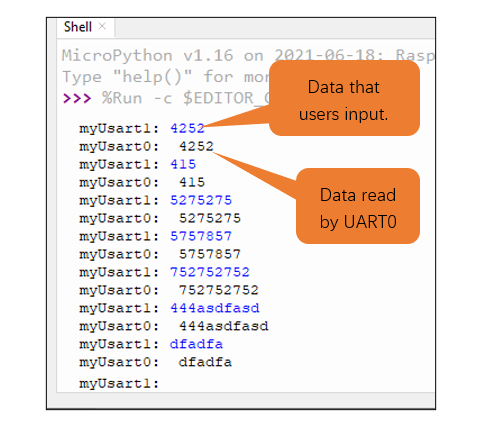

##############################################################################
Chapter Serial Communication
##############################################################################

Serial Communication is a means of Communication between different devices. This section describes Raspberry Pi Pico Serial Communication.

Project Serial Print
*******************************

This project uses Raspberry Pi Pico serial communicator to send data to the computer and print it on the serial monitor.

Serial Communication is a means of Communication between different devices. This section describes Raspberry Pi Pico Serial Communication.

Component List
====================================

.. list-table::
   :width: 100%
   :header-rows: 1 
   :align: center
   
   * -  Raspberry Pi Pico x1
     -  USB cable x1
   
   * -  |Chapter01_08|
     -  |Chapter01_09|

.. |Chapter01_08| image:: ../_static/imgs/1_LED/Chapter01_08.png
.. |Chapter01_09| image:: ../_static/imgs/1_LED/Chapter01_09.png

Related Knowledge
===================================

Serial communication
------------------------------------

Serial communication generally refers to the Universal Asynchronous Receiver/Transmitter (UART), which is commonly used in electronic circuit communication. It has two communication lines; one is responsible for sending data (TX line) and the other for receiving data (RX line). The serial communication connections two devices use is as follows:

.. image:: ../_static/imgs/8_Serial_Communication/Chapter08_00.png
    :align: center

Before serial communication starts, the baud rate of both sides must be the same. Communication between devices can work only if the same baud rate is used. The baud rates commonly used is 9600 and 115200.

Serial port on Raspberry Pi Pico
--------------------------------------

Raspberry Pi Pico has integrated USB to serial transfer, so it could communicate with computer connecting to USB cable.

Arduino Software also uploads code to Pico through the serial connection.

Your computer identifies serial devices connecting to it as COMx. We can use the Serial Monitor window of Arduino Software to communicate with Pico, connect Pico to computer through the USB cable, choose the correct device, and then click the Serial Monitor icon to open the Serial Monitor window.

.. image:: ../_static/imgs/8_Serial_Communication/Chapter08_02.png
    :align: center

Interface of serial monitor window is as follows. If you cannot open it, make sure Pico has been connected to the computer, and choose the right serial port in the menu bar "Tools".

.. image:: ../_static/imgs/8_Serial_Communication/Chapter08_03.png
    :align: center

Circuit
============================

Connect Raspberry Pi Pico to the computer with USB cable.

Code
============================

Open "Thonny", click "This computer" -> "D:" -> "Micropython_Codes" -> "08.1_Serial_Print" and double "08.1_Serial_Print.py". 

Serial_Print
-------------------------------------

Click "Run current script" and observe the changes of "Shell", which will display the time when Raspberry Pi Pico is powered on once per second. 

The following is the program code:

.. literalinclude:: ../../../freenove_Kit/Python/Python_Codes/08.1_Serial_Print/08.1_Serial_Print.py
    :linenos: 
    :language: python
    :lines: 1-3
    :dedent:

There are two serial communications on Raspberry Pi Pico: UART0 and UART1.

You can use them to communicate with serial devices.

Default pin for UART0

.. list-table:: 
   :width: 100%
   :align: center

   * -  UART0_TX
     -  Pin 0
   * -  UART0_RX
     -  Pin 1 

.. list-table:: 
   :width: 100%
   :align: center

   * -  UART1_TX
     -  Pin 4
   * -  UART1_RX
     -  Pin 5

For details, please refer to :ref:`UART, I2C, SPI default pin<defaultPin>`.

You can also change settings according to the distribution of pins.

Reference

.. py:function:: Class UART	

    Before each use of **UART** module, please add the statement "from machine import UART" to the top of python file.

    **UART(id, baudrate, bits, parity, rx, tx, stop, timeout):** Define serial ports and configure parameters for them.

        **id:** Serial Number. The available serial port number is 0 or 1.

        **baudrate:** Baud rate.

        **bits:** The number of each character.

        **parity:** Check even or odd, with 0 for even checking and 1 for odd checking.

        **rx, tx:** UAPT's reading and writing pins, GP0, GP1, GP4, GP5, GP8, GP9, GP12, GP13, GP16, GP17.

        **stop:** The number of stop bits, and the stop bit is 1 or 2.

        **timeout:** timeout period (Unit: millisecond).

                    0 < timeout ≤ 0x7FFF FFFF (decimal: 0 < timeout ≤ 2147483647).

    **UART.read(nbytes):** Read nbytes bytes.

    **UART.read():** Read data.

    **UART.write(buf):** Write byte buffer to UART bus.

    **UART.readline():** Read a line of data, ending with a newline character.

    **UART.readinto(buf):** Read and write data into buffer.

    **UART.readinto(buf, nbytes):** Read and write data into buffer.

    **UART.any():** Determine whether there is data in serial ports. If there is, return the number of bytes; Otherwise, return 0.

.. note::
    
    When usART0 or USART1 is used, it must be used with the serial port adapter board or serial port device. If not, you may not observe any symptoms.

Project Serial Read and Write
*******************************************

In the following example, we use Raspberry Pi Pico's UART1 to send data to UART0, and read the data received by UART0 and print it out through the "Shell".

Component List
===============================

+-----------------------------------------+------------------------------------------+
| Raspberry Pi Pico x1                    | USB Cable x1                             |
|                                         |                                          |
| |Chapter01_08|                          | |Chapter01_09|                           |
+-----------------------------------------+------------------------------------------+
| Breadboard x1                                                                      |
|                                                                                    |
| |Chapter01_10|                                                                     |
+------------------------------------------------------------------------------------+
| Jumper                                                                             |
|                                                                                    |
|  |Chapter08_15|                                                                    |
+------------------------------------------------------------------------------------+

.. |Chapter01_08| image:: ../_static/imgs/1_LED/Chapter01_08.png
.. |Chapter01_09| image:: ../_static/imgs/1_LED/Chapter01_09.png
.. |Chapter01_10| image:: ../_static/imgs/1_LED/Chapter01_10.png

Circuit
==========================

.. list-table::
   :width: 100%
   :align: center
   
   * -  Schematic diagram
   * -  |Chapter08_16|
   * -  Hardware connection. 
       
        :red:`If you need any support, please contact us via:` support@freenove.com
   * -  |Chapter08_17|
    

Code
==========================

Open "Thonny", click "This computer" -> "D:" -> "Micropython_Codes" -> "08.2_Serial_Read_and_Write" and double click "08.2_Serial_Read_and_Write_UART1_to_UART0.py". 

Serial_Read_and_Write_UART1_to_UART0
--------------------------------------------

Click "Run current script". Users can enter any data in "Shell" and press Enter. The input data will be written to UART1 and sent to UART0 to read, and printed out on "Shell". Press "Ctrl+C" or click "Stop/Restart backend" to exit the program.

The following is the program code:

.. literalinclude:: ../../../freenove_Kit/Python/Python_Codes/08.2_Serial_Read_and_Write/08.2_Serial_Read_and_Write_Usart0_to_Usart1.py
    :linenos: 
    :language: python
    :lines: 1-14
    :dedent:

Import UART、Pin and time modules.

.. literalinclude:: ../../../freenove_Kit/Python/Python_Codes/08.2_Serial_Read_and_Write/08.2_Serial_Read_and_Write_Usart0_to_Usart1.py
    :linenos: 
    :language: python
    :lines: 1-2
    :dedent:

Create two UART objects and configure them as the parameters of UART0 and UART1.

.. literalinclude:: ../../../freenove_Kit/Python/Python_Codes/08.2_Serial_Read_and_Write/08.2_Serial_Read_and_Write_Usart0_to_Usart1.py
    :linenos: 
    :language: python
    :lines: 4-5
    :dedent:

Define a bytes value and assign it to rxDate.

.. literalinclude:: ../../../freenove_Kit/Python/Python_Codes/08.2_Serial_Read_and_Write/08.2_Serial_Read_and_Write_Usart0_to_Usart1.py
    :linenos: 
    :language: python
    :lines: 8-8
    :dedent:

Define input_cnt to receive user input and convert it to a string format.

.. literalinclude:: ../../../freenove_Kit/Python/Python_Codes/08.2_Serial_Read_and_Write/08.2_Serial_Read_and_Write_Usart0_to_Usart1.py
    :linenos: 
    :language: python
    :lines: 9-9
    :dedent:

myUsart1 calls write() function and writes the user input to UART1. 

.. literalinclude:: ../../../freenove_Kit/Python/Python_Codes/08.2_Serial_Read_and_Write/08.2_Serial_Read_and_Write_Usart0_to_Usart1.py
    :linenos: 
    :language: python
    :lines: 10-10
    :dedent:

myUsart0 calls the read() function to read the data sent by UART1 bit by bit and save the rxData in the received variable. When myUsart0 calls any() to determine whether UART0 has read the data, when any() returns 0, UART0 has read the data sent by UART1.

.. literalinclude:: ../../../freenove_Kit/Python/Python_Codes/08.2_Serial_Read_and_Write/08.2_Serial_Read_and_Write_Usart0_to_Usart1.py
    :linenos: 
    :language: python
    :lines: 12-13
    :dedent:

The decode() function is called to decode the data and print it out to "Shell."

.. literalinclude:: ../../../freenove_Kit/Python/Python_Codes/08.2_Serial_Read_and_Write/08.2_Serial_Read_and_Write_Usart0_to_Usart1.py
    :linenos: 
    :language: python
    :lines: 14-14
    :dedent: