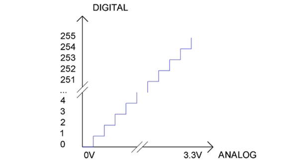
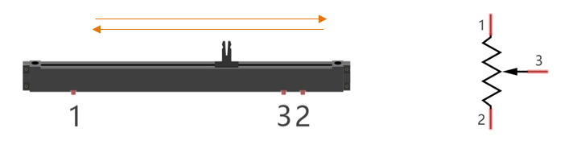
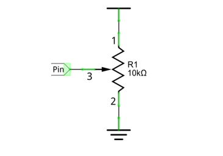
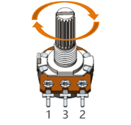
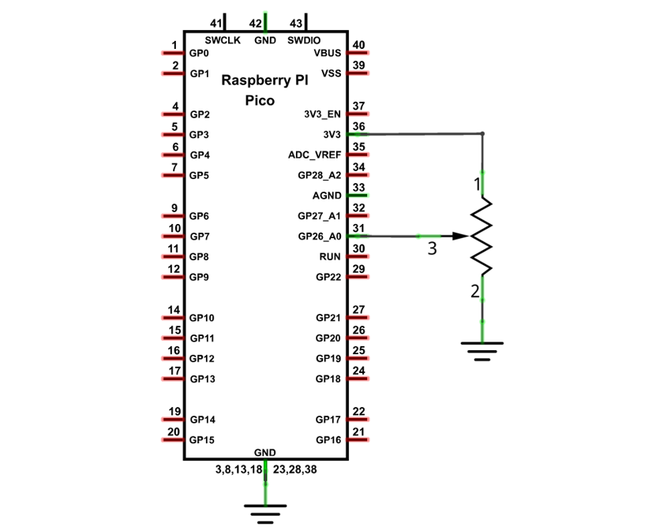
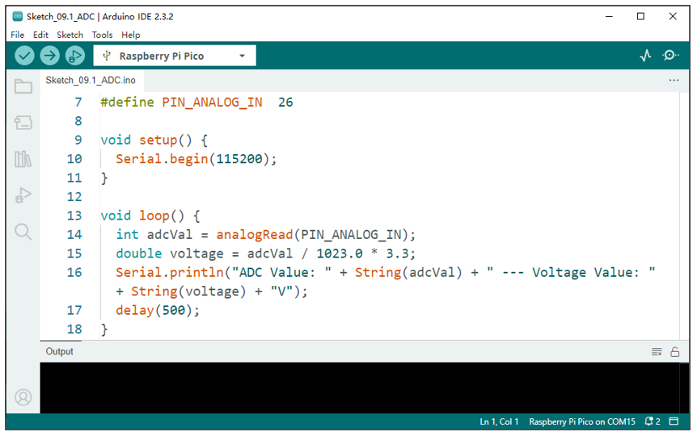
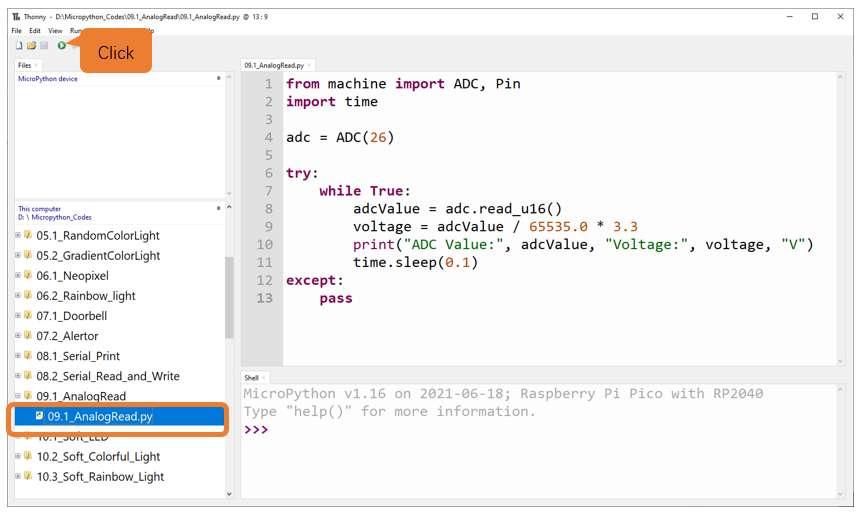
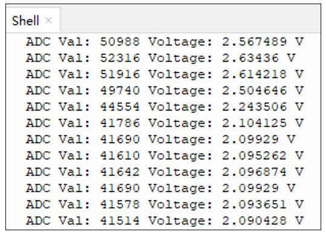

##############################################################################
Chapter AD Converter
##############################################################################

This chapter we learn to use the ADC function of Raspberry Pi Pico.

Project Read the Voltage of Potentiometer 
***********************************************************

In this chapter, we use ADC function of Pico to read the voltage output by potentiometer.

Component List
=================================

+-----------------------------------------+------------------+
| Raspberry Pi Pico x1                    |   USB Cable x1   |
|                                         |                  |
| |Chapter01_08|                          |   |Chapter01_09| |
+-----------------------------------------+------------------+
| Breadboard x1                                              |
|                                                            |
| |Chapter01_10|                                             |
+-----------------------------------------+------------------+
| Rotary potentiometer x1                 |   Jumper         |
|                                         |                  |
|  |Chapter09_00|                         |   |Chapter01_13| |
+-----------------------------------------+------------------+

.. |Chapter01_08| image:: ../_static/imgs/1_LED/Chapter01_08.png
.. |Chapter01_09| image:: ../_static/imgs/1_LED/Chapter01_09.png
.. |Chapter01_10| image:: ../_static/imgs/1_LED/Chapter01_10.png
.. |Chapter01_13| image:: ../_static/imgs/1_LED/Chapter01_13.png
.. |Chapter09_00| image:: ../_static/imgs/9_AD_Converter/Chapter09_00.png

Related Knowledge
=============================

ADC
---------------------------

An ADC is an electronic integrated circuit used to convert analog signals such as voltages to digital or binary form consisting of 1s and 0s. The range of our ADC on Pico is 10 bits, which means the resolution is 2^10=1024, and it represents a range (at 3.3V) will be divided equally to 1024 parts. The rage of analog values corresponds to ADC values. So the more bits the ADC has, the denser the partition of analog will be and the greater the precision of the resulting conversion.

Subsection 1: the analog in rang of 0V---3.3/1023 V corresponds to digital 0;

Subsection 2: the analog in rang of 3.3/1023V---2*3.3/1023V corresponds to digital 1;

......

The following analog will be divided accordingly.

The conversion formula is as follows:

.. image:: ../_static/imgs/9_AD_Converter/Chapter09_02.png
    :align: center

ADC ChannelsRaspberry Pi Pico 
-----------------------------------

Raspberry Pi Pico has four ADC channels, which are ADC0(GP26), ADC1(GP27), ADC2(GP28), ADC3(GP29). ADC3 used to measure VSYS on Pico board. Therefore, there are only three generic ADC channels that can be directly used, namely, ADC0, ADC1 and ADC2.

Component Knowledge
==============================

Potentiometer
----------------------------

Potentiometer is a resistive element with three Terminal parts. Unlike the resistors that we have used thus far in our project which have a fixed resistance value, the resistance value of a potentiometer can be adjusted. A potentiometer is often made up by a resistive substance (a wire or carbon element) and movable contact brush. When the brush moves along the resistor element, there will be a change in the resistance of the potentiometer's output side (3) (or change in the voltage of the circuit that is a part). The illustration below represents a linear sliding potentiometer and its electronic symbol on the right.

Between potentiometer pin 1 and pin 2 is the resistive element (a resistance wire or carbon) and pin 3 is connected to the brush that makes contact with the resistive element. In our illustration, when the brush moves from pin 1 to pin 2, the resistance value between pin 1 and pin 3 will increase linearly (until it reaches the highest value of the resistive element) and at the same time the resistance between pin 2 and pin 3 will decrease linearly and conversely down to zero. At the midpoint of the slider, the measured resistance values between pin 1 and 3 and between pin 2 and 3 will be the same.

In a circuit, both sides of resistive element are often connected to the positive and negative electrodes of power. When you slide the brush "pin 3", you can get variable voltage within the range of the power supply.

Rotary potentiometer 
-----------------------------

Rotary potentiometers and linear potentiometers have the same function; the only difference being the physical action being a rotational rather than a sliding movement.

Circuit
===============================

.. list-table::
   :width: 100%
   :align: center
   
   * -  Schematic diagram
   * -  |Chapter09_06|
   * -  Hardware connection. 
       
        :red:`If you need any support, please contact us via:` support@freenove.com
   * -  |Chapter09_07|
    

Code
===============================

Open "Thonny", click "This computer" -> "D:" -> "Micropython_Codes" -> "09.1_AnalogRead and then click "09.1_AnalogRead.py". 

09.1_AnalogRead 
--------------------------

Click "Run current script" and observe the message printed in "Shell". Press Ctrl+C or click "Stop/Restart backend" to exit the program.

The following is the code:

.. literalinclude:: ../../../freenove_Kit/Python/Python_Codes/09.1_AnalogRead/09.1_AnalogRead.py
    :linenos: 
    :language: python
    :dedent:

Import Pin, ADC and time modules.

.. literalinclude:: ../../../freenove_Kit/Python/Python_Codes/09.1_AnalogRead/09.1_AnalogRead.py
    :linenos: 
    :language: python
    :lines: 1-2
    :dedent:

Create an ADC object and connect GP26, which corresponds to ADC0 channel of Raspberry Pi Pico. 

.. literalinclude:: ../../../freenove_Kit/Python/Python_Codes/09.1_AnalogRead/09.1_AnalogRead.py
    :linenos: 
    :language: python
    :lines: 4-4
    :dedent:

Read ADC value every 0.1 second. Calculate the current voltage based on the formula ADCValue= (Analog Voltage)/3.3*65535 and print it to "Shell".

.. literalinclude:: ../../../freenove_Kit/Python/Python_Codes/09.1_AnalogRead/09.1_AnalogRead.py
    :linenos: 
    :language: python
    :lines: 7-11
    :dedent:

Reference
-----------------------------

.. py:function:: Class ADC	
    
    Before each use of ADC module, please add the statement "from machine import ADC" to the top of the python file.
    
    **machine.ADC(pin or channel_num):** Create an ADC object associated with the given pin.
    
        **pin:** Available pins are:GP26,GP27,GP28,GP29.
    
        **channel_num:** Available channel 0, 1, 2, 3, 4.
    
        For example: 
    
        machine.ADC(0) = machine.ADC(26)
        
            machine.ADC(1) = machine.ADC(27)
        
            machine.ADC(2) = machine.ADC(28)
        
            machine.ADC(3) = machine.ADC(29)
        
            machine.ADC(4) Connects to the internal temperature sensor.
    
    **ADC.read_16():** reads the current ADC value and returns it, with a range of 0-65535.